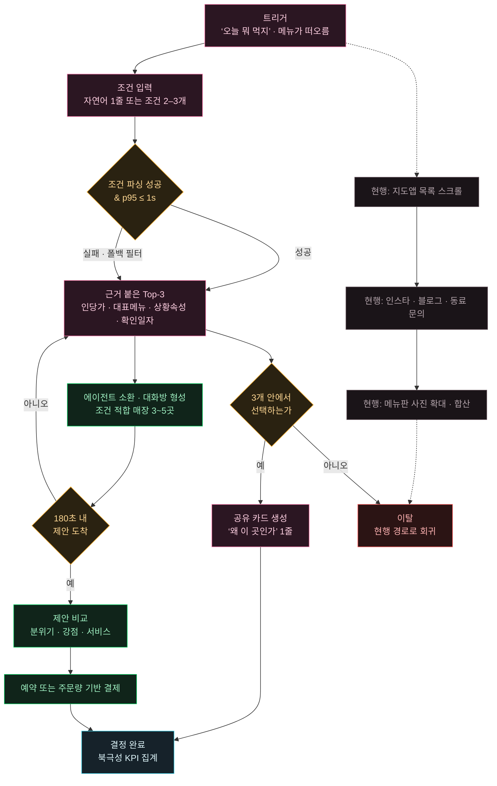
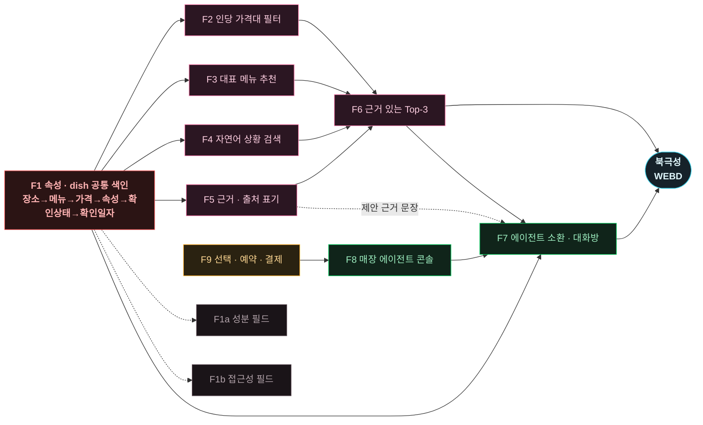
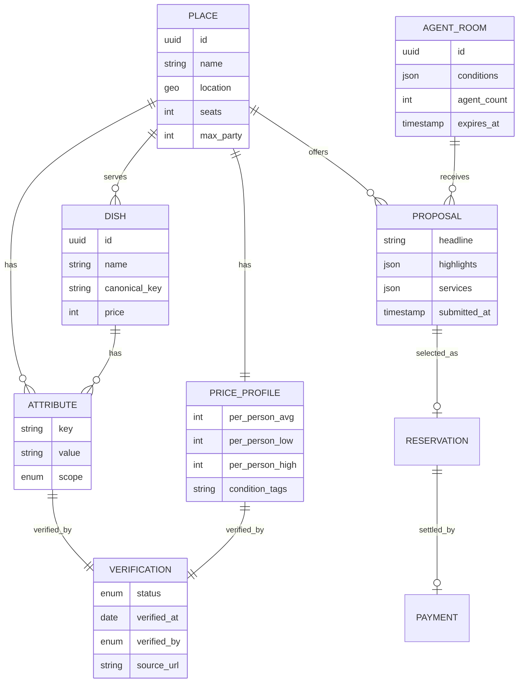
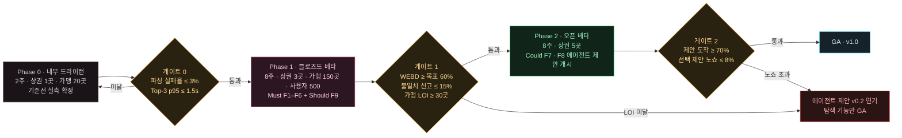

# AI 장소 큐레이션 PRD v1.0

> **문서 버전 v1.0 · 확정.** 대상 릴리스는 **제품 v0.1(MVP)** 입니다 — 문서 버전과 제품 버전은 별개입니다.
> `ai-place-prd-v0.1.md`(초안)를 기준으로 목표·지표, 스토리·AC, 기능 요구, 비기능, 리스크·ADR, 범위
> 여섯 항목의 완성도 기준을 적용해 개정했습니다. 개정 내역은 문서 끝 **부록 C**에 있습니다.

---

<!-- 슬라이드 01 / 15 -->

**PRODUCT REQUIREMENT DOCUMENT · v1.0**

# 조건을 말하면 근거가 붙은 세 곳이 온다

AI 장소 큐레이션 서비스의 제품 요구사항 문서입니다. Value Proposition에서 확정한 **MVP 아홉 기능(F1–F9)**을 사용자 스토리와 수용 기준, 비기능 요구사항, 실험 설계로 옮겼습니다.

모든 Pain에 **실패 KPI**를 붙이고, 모든 AC에 **측정 가능한 임계치**를 넣었습니다. 모든 지표에는 **그 값을 읽는 창구**를 함께 못 박았습니다 — 어느 로그·대시보드·설문에서 읽는지가 지표마다 지정되어 있습니다.

- **Owner 팀** — 5팀
- **최종 업데이트** — 2026-08-24
- **버전** — 문서 v1.0 · 확정 · 대상 릴리스 제품 v0.1(MVP)
- **MVP 범위** — F1–F9 · Must 6 / Should 1 / Could 2

**이 문서의 모든 결정은 측정으로 반박 가능합니다.** 목표값마다 판정 임계치와 측정 창구가 붙어 있어, 결정이 틀렸을 때 **어느 지표에서 먼저 드러나는지**가 정해져 있습니다. Phase 0 드라이런 2주에서 기준선을 실측으로 확정하며, **게이트 0을 통과하지 못하면 Phase 1을 시작하지 않습니다.**

---

<!-- 슬라이드 02 / 15 -->

**§1 OVERVIEW & GOALS**

## 문제 정의와 목표

### 1.1 문제 정의 — 실패 KPI를 붙인 Pain

*출처: 페르소나 스펙트럼 · 고객 여정 지도*

| Pain | 문제 | 실패 KPI (현행) | 기준선 | 측정 창구 | Needs |
| --- | --- | --- | --- | --- | --- |
| **C2-1** | 인당 가격이 어디에도 표기되지 않음 | 예상 지출과 실제 결제액의 **오차율** | 15% | JTBD 인터뷰 · 결제 영수증 대조 | 목록 단계에서 인당 예상가를 오차 범위와 함께 |
| **C2-2** | 무한리필류 운영 조건이 검색어로 없음 | 플랫폼 내 조건 검색 **성공률** | 0% | 경쟁 3사 화면 관찰 | 조건을 카테고리로 한정해 즉시 필터 |
| **C3-1** | 색인이 가게 단위라 메뉴명으로 진입 불가 | 메뉴명 질의의 **정답 반환률** | 0% | 경쟁 3사 화면 관찰 | 메뉴명 한 번으로 취급 매장 목록 |
| **C3-2** | 우회 탐색이 여러 채널로 분산 | 세션당 **외부 채널 수** / 소요 시간 | 4개 / 12분 | JTBD 인터뷰 · E7 화면 녹화 | 1분 안에 첫 결과, 채널 하나로 완결 |
| **C4-1** | 문장형 조건을 넣을 입력 칸이 없음 | 상황어 질의 **처리율** | 0% | 경쟁 3사 화면 관찰 | 머릿속 문장을 그대로 입력 |
| **C4-2** | 1인석·소음·체류 허용을 사전 확인 불가 | 방문 후 **조건 불일치 발생률** | 35% | JTBD 인터뷰 · 방문 후 설문 | 사진과 1인석 개수로 판단 재료 확보 |
| **C1-3** | 정한 곳을 정당화할 근거가 없음 | 후보 카드의 **선정 근거 표기율** | 0% | 경쟁 3사 화면 관찰 | 선정 이유 한 줄 + 공유 가능한 형태 |
| **A2-2** | 룸·주차·법인카드·단체 수용이 필터에 없음 | 단체 조건 확인에 드는 **전화 통화 수** | 3통 / 15분 | JTBD 인터뷰 · 통화 기록 | 단체 조건을 한 번에 필터 |
| **N1-1·2** | 추천에 선정 근거가 없어 광고로 읽음 | 추천 결과 **신뢰 응답률** | Phase 0 최초 측정 | 방문 후 5점 척도 설문 | 왜 이 집인지 문장으로 설명 |
| **P5-1** | 빈 시간대에 먼저 제안할 창구가 없음 | 빈 좌석 **공석률** / 고정 광고비 | 37% / 월 30만원 | 가맹 사전 인터뷰 · 매장 POS | 내가 조건과 폭을 정해 손님을 부르기 |
| **P5-3** | 노쇼로 좌석 회전과 준비가 이중 손실 | 단체 예약 **노쇼율** | 15% | 가맹 사전 인터뷰 · 예약 대장 | 예약이 보증되는 구조 |

### 1.2 목표 — 수치화한 Desired Outcome

*Phase 1 클로즈드 베타 12주 기준*

> **탐색 노동**
>
> 12분 → 60초
>
> 조건 입력에서 후보 확정까지. 외부 채널 **4개 → 1개**

> **결정 부담**
>
> −20% 결정 시간
>
> 순위 나열 대신 **비교 축과 근거를 미리 정리**

> **근거 표기**
>
> 0% → 100%
>
> 모든 후보에 **선정 이유 + 확인 일자**

> **공급 측 고정비**
>
> 30만 → 0원
>
> 고정 광고비를 **제안 성사 건당 수수료**로 전환

---

<!-- 슬라이드 03 / 15 -->

**§1.3 SUCCESS METRICS**

## 북극성 KPI와 보조 KPI

북극성은 **‘조건을 말하고 근거를 받아 결정까지 끝낸 세션’** 하나로 잡았습니다. 조건 말하기·근거 제시·압축·결정이 **한 지표 안에서 동시에 성립해야** 값이 올라갑니다.

| 구분 | KPI | 정의 · 측정 방법 | 기준선 | 12주 목표 | 측정 주기 | **측정 창구** | 연결 기능 |
| --- | --- | --- | --- | --- | --- | --- | --- |
| **북극성** | **주간 근거 기반 결정 완료 수** WEBD · Weekly Evidence-Backed Decisions | 조건 2개 이상 입력 → Top-3 수신 → 1곳 선택(예약 또는 저장)까지 완주한 세션 수 | 0 미출시 | 5,000건/주 | 주간 | 퍼널 대시보드 `session_completed` | F1–F7 전체 |
| 보조 1 | 조건 입력 완료율 | 입력 시작 → 조건 2개 이상 확정 비율 | 0% 미출시 | 70% | 주간 | 이벤트 로그 `query_started` / `query_committed` | F4 · F2 |
| 보조 2 | 첫 결과 p95 응답 시간 | 질의 수신 → Top-3 렌더 완료 | 게이트 0 기준 1,500ms | ≤ 1,000ms | 일간 | APM 트레이스 `/v1/query` p95 | F1 · F6 |
| 보조 3 | Top-3 내 선택률 | Top-3 수신 세션 중 1곳을 선택한 비율 | 0% 미출시 | 45% | 주간 | 이벤트 로그 `top3_rendered` / `place_selected` | F6 · F5 |
| 보조 4 | 근거 표기율 | 선정 이유 1줄 + 확인 일자를 모두 가진 후보 카드 비율 | 0% 경쟁 3사 관찰 | 100% | 일간 | 렌더 이벤트 검증기 `evidence_complete` | F5 |
| 보조 5 | 예상가 오차 ±10% 내 비율 | 표기 인당 예상가 대비 실제 결제액 편차 | 40% 결제 영수증 대조 | 80% | 월간 | 결제액 입력 로그 `price_feedback` | F2 |
| 보조 6 | 방문 후 조건 불일치 신고율 | 방문 후 '조건이 달랐다' 신고 / 방문 건수 | 35% JTBD 인터뷰 | ≤ 10% | 월간 | 방문 후 신고 폼 `mismatch_reported` | F1 · F5 |
| 보조 7 | 공유 카드 생성률 | 결정 세션 중 근거 카드를 외부로 공유한 비율 | 0% 미출시 | 60% | 주간 | 이벤트 로그 `share_card_created` | F5 |
| 보조 8 | 3분 내 제안 도착률 | 대화방 형성 → 180초 내 유효 제안 1건 이상 | 0% 미출시 | 85% | 일간 | 대화방·제안 로그 `proposal_received` | F7 · F8 |
| 보조 9 | 제안 이행률 | 현장에서 제안 내용이 그대로 적용된 비율 | 0% 미출시 | ≥ 95% | 월간 | 방문 후 이행 확인 `proposal_fulfilled` | F7 · F9 |
| 보조 10 | 선택 제안 노쇼율 | 선택된 제안의 예약 중 미방문 비율 | 15% 가맹 예약 대장 | ≤ 5% | 월간 | 예약·방문 확인 매칭 `noshow_flagged` | F9 |
| 보조 11 | 가맹점 월 제안 참여율 | 활성 가맹점 중 월 1회 이상 제안한 비율 | 0% 미출시 | 60% | 월간 | 가맹 콘솔 활동 로그 `agent_proposed` | F8 |

> 북극성을 이렇게 정한 이유
>
> DAU나 검색 수를 쓰면 **목록만 보고 나가는 세션**이 성공으로 집계됩니다. 경쟁사 일곱 곳이 이미 그 지표로 운영되고, 그 결과가 ‘스크롤 길이를 늘리는 제품’입니다. WEBD는 **결정까지 완주해야만** 올라가므로 후보를 늘리는 방향으로는 개선되지 않습니다.

> 게이트 조건
>
> 보조 8–11(에이전트 제안 4개)은 **Phase 2에서만 측정**합니다. 보조 10(노쇼율)이 **목표를 넘으면 F7·F8을 중단**하고 F9를 먼저 고칩니다. 가맹점은 노쇼 한 번으로 이탈하므로 이 순서를 뒤집을 수 없습니다.

---

<!-- 슬라이드 04 / 15 -->

**§2 USERS & PERSONAS**

## 핵심 페르소나와 여정 Pain

스펙트럼 열두 명 중 **MVP 아홉 기능이 실제로 건드리는 다섯 명**만 남겼습니다. 나머지는 v0.1 범위 밖이며, 스키마 자리만 확보한 두 명(E1·E2)은 별도로 표시했습니다.

| 페르소나 | 역할 | 여정에서 멈추는 지점 | 실패 KPI | v0.1 범위 | JTBD 선언 요지 |
| --- | --- | --- | --- | --- | --- |
| **C2 박세훈 · 26** 대학원생 · 주 3–5회 | 1차 타깃 | 고려 — 가격 역산 | 오차율 15% | Must | 가격 확인을 **남에게 보이지 않게** 끝내고 싶다 |
| **C3 김도연 · 29** 마케터 · 점심 매일 | 1차 타깃 | 고려 — 검색 시도 | 채널 4개 / 12분 | Must | **한 번의 검색**으로 그 메뉴를 하는 집을 |
| **C4 이하람 · 33** 프리랜서 · 주 3–4회 | 1차 타깃 | 온보딩 — 방문 후 실패 | 불일치 35% | Must | 혼자 앉아도 이상하지 않은 자리인지 **가기 전에** |
| **C1 정하윤 · 24** 동아리 총무 · 월 1–2회 | 근거 요구 | 결정 — 정당화 | 근거 표기 0% | Must 근거만 | 정한 이유를 **눈에 보이게** 제시하고 싶다 |
| **P5 로컬 사장** 20–40석 · 매일 | 공급 측 | 인지 — 제안 창구 부재 | 공석률 37% | Should Could | 내 가게를 **내 말로 소개해** 맞는 손님에게 닿고 싶다 |
| **A2 한지우 · 44** 회식 총무 · 분기 | 확장 | 결정 — 단체 확인 | 전화 3통 / 15분 | Could | 조건을 **그대로 넘겨** 후보를 받고 싶다 |
| **E1 서준호 · 52** 식이 제약 | 스키마 | 고려 — 성분 확인 | 후보 0개 | Won't 필드만 | 제약을 말하기 전에 **갈 수 있는 곳을** 찾아 두기 |
| **E2 오미래 · 24** 이동 제약 | 스키마 | 고려 — 경로 검증 | 참석 포기 | Won't 필드만 | 내가 말하지 않아도 **갈 수 있는 곳으로** 좁혀지기 |

> v0.1이 정면으로 노리는 사람
>
> **C2·C3·C4 세 명**입니다. 셋 다 **주 3회 이상** 같은 결정을 반복하고, 혼자 또는 두 명이라 **조율 비용이 없습니다.** 다지점 공정 지점 산출을 2년차로 넘긴 결정과 맞물립니다. 모임은 빈도가 낮아 v0.1의 학습 속도를 만들지 못합니다.

> C1과 P5를 다르게 쓰는 방식
>
> **C1은 근거 기능(F5)만** 받습니다. 지점 산출 없이도 “왜 여기냐”에 답할 수 있으면 Job의 절반이 해결됩니다. **P5는 Phase 2**에서 진입하며, **F9(예약·결제)를 먼저 받고 F8·F7을 나중에** 받습니다.

---

<!-- 슬라이드 05 / 15 -->

**§2.2 TARGET USER JOURNEY**

## v0.1이 만드는 흐름

회색 노드가 현행 경로, 분홍이 v0.1이 대체하는 구간, 초록이 Phase 2의 에이전트 제안입니다. **이탈 분기 두 개**가 이 제품의 생사입니다. 1초 응답과 3분 제안.

> 노란 분기 세 개가 측정 지점 — 조건 파싱 성공률, Top-3 내 선택률, 180초 제안 도착률

> **분기 01**
>
> #### 조건 파싱 실패 시 폴백
>
> 자연어 파싱이 실패하면 **빈 화면을 주지 않고** 구조화 필터 UI로 넘깁니다. 파싱 실패율 목표 **≤ 1.5%**, 폴백 후에도 Top-3는 반드시 반환합니다.

> **분기 02**
>
> #### Top-3 내 선택률 45%
>
> 세 개 안에서 안 고르면 현행 경로로 돌아갑니다. 후보를 늘리는 것이 아니라 **근거를 붙이는 것**으로 이 수치를 올립니다.

> **분기 03**
>
> #### 제안 미도착 시 회귀
>
> 180초 내 제안이 없으면 **제안 없는 Top-3**로 되돌립니다. 빈 제안 화면을 보여 주면 **참여 매장이 없는 서비스**로 읽힙니다.

---

<!-- 슬라이드 06 / 15 -->

**§3 USER STORIES & *ACCEPTANCE CRITERIA***

## 수요 측 스토리 — US-1 ∼ US-3

`AC 각 3개 이상 · 임계치 포함 · 스토리마다 실패 케이스 2건 이상`

#### US-1 · F1 · F2 · F4 · Must

As a **인당 예산이 먼저 정해진 이용자(C2)**, I want **가격과 조건을 한 화면에서 걸러 내기**, so that **남 앞에서 메뉴판을 확대하지 않고 예산을 지킬 수 있다**.

- **AC1** — **Given** 이용자가 인당 예산 상한을 입력한 상태에서, **When** 후보 목록을 요청하면, **Then** 모든 후보 카드에 **인당 예상가와 오차 범위**가 표시된다. `표기율 100%` `범위 폭 ≤ ±20%`
- **AC2** — **Given** 예산 상한이 2만원이고, **When** 인당 예상가 상한이 2만원을 넘는 매장이 존재하면, **Then** 해당 매장은 기본 결과에서 제외되고 ‘예산 초과 N곳’으로만 요약된다. `오탐률 ≤ 3%`
- **AC3** — **Given** 이용자가 ‘야채 무한리필’ 같은 운영 조건을 입력하고, **When** 조건 카테고리 사전에 해당 항목이 등록되어 있으면, **Then** 그 조건을 만족하는 매장만 반환한다. `카테고리 적중률 ≥ 90%` `응답 p95 ≤ 1,000ms`
- **AC4** — **Given** 방문 후 결제가 완료되고, **When** 이용자가 실제 결제액을 입력하면, **Then** 표기 예상가와의 편차를 기록하고 다음 표기에 반영한다. `±10% 내 비율 ≥ 80%`
- **AC5** `실패` — **Given** 이용자가 조건 사전에 없는 표현을 입력하고, **When** 시스템이 그 표현을 조건으로 해석하지 못하면, **Then** 빈 화면 대신 **구조화 필터 UI로 전환**하고 해석하지 못한 표현을 그대로 표기한다. `파싱 실패율 ≤ 1.5%` `빈 화면 노출 0건`
- **AC6** `실패` — **Given** 매장의 가격 데이터가 90일 이상 갱신되지 않았거나 결제 표본이 5건 미만이고, **When** 그 매장이 후보에 포함되면, **Then** 인당 예상가 대신 **'가격 확인 필요'**로 표기하고 **예산 필터의 판정 대상에서 제외**한다. `예상가 오표기 0건` `제외 사유 표기율 100%`

#### US-2 · F3 · F6 · Must

As a **메뉴가 먼저 떠오르는 직장인(C3)**, I want **메뉴명 한 번으로 그 메뉴를 하는 집을 받기**, so that **점심 오십 분 안에 내가 고른 것을 먹을 수 있다**.

- **AC1** — **Given** 이용자가 반경 1km 안에 있고, **When** 검색창에 메뉴명 하나만 입력하면, **Then** **업종 목록이 아니라** 해당 메뉴를 취급하는 매장 Top-3가 반환된다. `정답 반환률 ≥ 92%` `첫 결과 p95 ≤ 1,000ms`
- **AC2** `실패` — **Given** 메뉴 색인에 해당 메뉴가 없고, **When** 유사 메뉴가 3건 이상 존재하면, **Then** **‘찾는 메뉴가 없어 유사 메뉴로 대체했다’**를 명시하고 반환한다. `빈 결과 반환률 ≤ 2%`
- **AC3** — **Given** 조건 입력 필드가 노출된 상태에서, **When** 이용자가 추가 조건을 입력하지 않고 바로 검색하면, **Then** 필수 입력 없이 결과가 반환된다. `필수 입력 필드 0개` `입력 단계 ≤ 1회`
- **AC4** `실패` — **Given** 반경 1km 안에 해당 메뉴도 유사 메뉴도 없고, **When** 검색이 실행되면, **Then** 반경을 **3km로 1회 자동 확대**하고 확대 사실을 표기하며, 그래도 0건이면 인접 카테고리 Top-3를 사유와 함께 반환한다. `결과 0건 종료 0회` `반경 확대 표기율 100%`

#### US-3 · F5 · F6 · F1 · Must

As a **가기 전에 판단하고 싶은 이용자(C4·C1·N1)**, I want **후보마다 근거와 확인 일자를 보기**, so that **헛걸음하지 않고, 남에게 왜 여기인지 설명할 수 있다**.

- **AC1** — **Given** Top-3가 반환된 상태에서, **When** 각 후보 카드를 보면, **Then** **선정 이유 1줄 + 근거 속성 + 확인 일자 + 확인 주체**가 모두 표시된다. `4개 항목 표기율 100%`
- **AC2** `실패` — **Given** 어떤 속성이 90일 이상 갱신되지 않았고, **When** 그 속성이 후보 카드에 노출되면, **Then** ‘확인 90일 경과’ 경고를 함께 표시한다. `경고 누락률 0%` `판정형 문구 0건`
- **AC3** — **Given** 이용자가 후보를 하나 선택하고, **When** 공유를 요청하면, **Then** 선정 이유와 근거를 담은 카드가 **3초 내에** 이미지 또는 링크로 생성된다. `생성 p95 ≤ 3,000ms` `공유 카드 생성률 ≥ 60%`
- **AC4** `실패` — **Given** 방문이 완료되고, **When** 이용자가 ‘조건이 달랐다’를 신고하면, **Then** 해당 속성의 확인 상태가 ‘재확인 필요’로 즉시 전환된다. `반영 지연 ≤ 60s` `불일치 신고율 ≤ 10%`

---

<!-- 슬라이드 07 / 15 -->

**§3 USER STORIES & *ACCEPTANCE CRITERIA***

## 에이전트 제안 스토리 — US-4 ∼ US-6

`Phase 2 · F9 선행`

#### US-4 · F9 · Should · **F7·F8 선행 조건**

As a **제안을 고른 이용자(C2·A2)**, I want **고른 제안 그대로 예약과 결제를 끝내기**, so that **조건을 다시 입력하지 않고 결정이 그대로 실행된다**.

- **AC1** — **Given** 이용자가 제안 하나를 선택하고, **When** 예약 화면으로 넘어가면, **Then** 제안에 담긴 **인원·메뉴 구성·시간**이 자동 승계된다. `재입력 필드 0개` `승계 누락률 ≤ 0.5%`
- **AC2** — **Given** 제안에 메뉴 구성이 포함되어 있고, **When** 이용자가 결제를 진행하면, **Then** **주문량 기준으로 금액이 산출**되고 매장에 확정이 통보된다. `통보 지연 ≤ 30s` `금액 산출 오류율 ≤ 0.3%`
- **AC3** `실패` — **Given** 이용자가 예약 2시간 전까지 취소하고, **When** 취소가 접수되면, **Then** 선결제 금액을 전액 환불하고 매장에 즉시 알린다. `환불 처리 ≤ 24h` `환불 실패율 ≤ 0.5%`
- **AC4** `실패` — **Given** 예약 시각이 지나고, **When** 방문 확인이 없으면, **Then** 노쇼로 기록하고 선결제 금액을 매장에 정산한다. `선택 제안 노쇼율 ≤ 5%` `오판정률 ≤ 1%`

결제가 흐름 안에 있으므로 **별도 보증금을 걸어 전환율을 깎는 설계를 피합니다.** P5의 이중 손실 Pain은 ‘보증’이 아니라 **선결제**로 해소됩니다.

#### US-5 · F8 · Could

As a **내 가게를 내 말로 알리고 싶은 사장(P5)**, I want **분위기·강점·서비스·수용 조건을 미리 등록해 두기**, so that **조건에 맞는 손님에게 내 가게의 강점이 그대로 전달된다**.

- **AC1** — **Given** 사장이 에이전트 콘솔에 접속하고, **When** 가게 프로필을 작성하면, **Then** **분위기·강점·제공 가능한 서비스·수용 조건**을 항목별로 등록할 수 있다. `설정 화면 ≤ 3개` `필수 항목 ≤ 5개`
- **AC2** `실패` — **Given** 등록한 수용 조건(인원·시간·룸 등) 밖의 요청이 도착하고, **When** 시스템이 매칭을 시도하면, **Then** 해당 매장의 에이전트는 소환되지 않는다. `부적합 소환률 ≤ 5%` `알림 무시율 ≤ 20%`
- **AC3** — **Given** 프로필 작성이 완료되고, **When** 사장이 내용을 갱신하려 하면, **Then** 기존 항목을 **1회 클릭**으로 불러와 수정할 수 있다. `프로필 갱신율 ≥ 70%` `월 제안 참여율 ≥ 60%`
- **AC4** `실패` — **Given** 사장이 강점 문구를 입력하고, **When** 등록된 사실 속성으로 뒷받침되지 않는 표현이 포함되면, **Then** 해당 문구를 저장하지 않고 근거가 될 속성 등록을 안내한다. `근거 없는 제안 문구 0건`

**할인폭을 넣는 칸이 아닙니다.** 가격 흥정이나 입찰 경쟁이 없으므로 콘솔은 “우리 가게는 이런 자리다”를 적는 곳이고, 경쟁 축은 가격이 아니라 **적합도**입니다.

#### US-6 · F7 · Could

As a **카테고리를 말한 이용자(C2·C3·A2)**, I want **조건에 맞는 매장 에이전트가 한 대화방에 모여 제안하기**, so that **내가 찾아다니지 않고 받은 제안 중에서 고를 수 있다**.

- **AC1** — **Given** 이용자가 카테고리와 지역을 말하고, **When** 시스템이 후보를 고르면, **Then** 조건에 맞는 매장 에이전트를 **3–5곳** 소환해 하나의 대화방을 만든다. `소환 수 3–5곳` `대화방 생성 p95 ≤ 2,000ms`
- **AC2** — **Given** 대화방이 형성되고, **When** 이용자가 예산·인원·상황을 적으면, **Then** 에이전트들이 **등록된 속성에 근거한 제안**을 보내고 카운트다운이 노출된다. `180초 내 제안 ≥ 1건: 85%` `첫 제안 p50 ≤ 60s`
- **AC3** — **Given** 제안이 수집되고, **When** 제안을 정리해 보여 주면, **Then** **가격이 아니라 조건 적합도를 1순위**로 정렬하고 비교 축과 근거를 함께 표시한다. `근거 표기율 100%` `가격 협상 기능 0건`
- **AC4** `실패` — **Given** 180초가 지나고, **When** 유효 제안이 0건이면, **Then** 빈 화면 대신 **제안 없는 Top-3**로 되돌리고 그 사실을 알린다. `빈 제안 화면 노출 0건`
- **AC5** `실패` — **Given** 제안을 선택해 방문하고, **When** 현장에서 제안 내용이 적용되지 않으면, **Then** 이용자 신고로 불이행이 기록되고 해당 매장의 소환 가중치가 하향된다. `제안 이행률 ≥ 95%` `신고 처리 ≤ 48h`

---

<!-- 슬라이드 08 / 15 -->

**§4 FUNCTIONAL REQUIREMENTS**

## MSCW 우선순위와 근거

MVP 아홉 기능이 **전부 중요도 高**이므로 MSCW는 가치 크기가 아니라 **선행 의존성과 릴리스 단계**로 갈랐습니다. Must는 Phase 1 클로즈드 베타에, Could는 Phase 2 오픈 베타에 들어갑니다.

| 코드 | 기능 | MSCW | Phase | **공수 · 슬라이스** | 대안 대비 가치 | KPI | 우선순위 근거 |
| --- | --- | --- | --- | --- | --- | --- | --- |
| **F1** | 속성·dish 단위 공통 색인 | Must | P1 | **2 SP** S0 스키마 확정 / S1 색인 파이프라인 | 조건 검색 성공률 **0% → 90%** | 보조 2·6 | 나머지 여덟 개가 이 위에 얹힙니다. 색인 단위는 스키마 결정이라 **나중에 바꾸면 전면 재색인** |
| **F2** | 인당 가격대 · 메뉴 옵션 필터 | Must | P1 | **1 SP** S2 | 가격 확인 노동 **4.2분 → 0초** | 보조 5 | DOS 1·2위. 대중점평이 인당 평균가 규격화로 **수익성을 검증**한 축 |
| **F3** | 대표 메뉴 단위 추천 | Must | P1 | **1 SP** S2 | 메뉴 질의 정답률 **0% → 92%** | 보조 2·3 | DOS 3위. 점심 일상에서 매일 발생하고 **대체 수단이 존재하지 않음** |
| **F4** | 자연어 상황 검색 | Must | P1 | **1 SP** S3 | 탐색 채널 **4개 → 1개** | 보조 1 | F1의 속성이 사용자에게 닿는 유일한 통로. 파싱 실패 시 **폴백 필터로 열화** |
| **F5** | 근거·출처 표기 + 공유 카드 | Must | P1 | **1 SP** S3 | 근거 표기율 **0% → 100%** | 보조 4·7 | 저난이도 × 고효과. C1·C4·E1·N1 **네 페르소나가 독립적으로 같은 요구** |
| **F6** | 근거 있는 Top-3 제시 | Must | P1 | **1 SP** S4 | 결정 시간 **−20%** · 비교 축 정리 | 보조 3 · NS | 후보를 몇 개로 보여 줄지는 **화면 설계 선택**이지 차별 축이 아닙니다. 값은 **비교 축과 근거를 미리 정리**해 고민할 양을 줄이는 데서 나옵니다 |
| **F9** | 선택과 예약 · 결제 | Should | P1 말 | **2 SP** S5 예약 승계 / S6 PG 결제·환불 | 재입력 필드 **N개 → 0개** · 노쇼 **15% → 5%** | 보조 10 | **F7·F8의 선행 조건.** 제안에 인원·메뉴가 담겨 있어 조건 재입력 없이 결제로 이어집니다. 선결제가 노쇼 손실을 흡수 — OpenTable이 노쇼 관리의 판매 가능성을 이미 증명 |
| **F8** | 매장 에이전트 콘솔 | Could | P2 | **1 SP** S7 | 고정 광고비 **월 30만 → 0원** | 보조 11 | **할인폭이 아니라 강점·서비스·수용 조건**을 등록하는 콘솔. 사장이 직접 조작하므로 **화면 수가 곧 이탈률**이라 설정 화면 3개 이하 |
| **F7** | 에이전트 소환 · 단체 대화방 | Could | P2 | **1 SP** S8 | 매장 에이전트 제안 **부재 → 상용** | 보조 8·9 | 사업 모델의 축이자 **경쟁사 일곱 곳 전부 부재**인 유일한 축. F1·F6·F8·F9가 모두 선행 |
| **F1a** | 알레르기·성분 필드 | Won't | 필드만 | F1의 S0에 포함 | — | — | F1과 같은 자료구조라 **스키마 자리만 확보**. 등록 정보를 그대로 노출하고 판정하지 않음 |
| **F1b** | 접근성 속성 필드 | Won't | 필드만 | F1의 S0에 포함 | — | — | 입구 사진·단차 필드만. **검증되지 않은 구간은 명시**하고 정확도를 약속하지 않음 |
| — | 리뷰 3축 재가공 | Won't | v0.2+ | — | — | — | Yelp의 음식점 광고 **−6%**가 리뷰량 경쟁의 한계를 보여 줌 |
| — | 다지점 공정 지점 산출 | Won't | v0.2+ | — | — | — | v0.1은 **사용자가 지역을 직접 지정**. 경로 엔진 착수 시 접근성 가중치를 함께 설계 |
| — | AI 예약 에이전트 | Won't | v0.2+ | — | — | — | 해결이 **매장 응대라는 제3자 행동**에 달려 우리 코드로 품질을 보증할 수 없음 |

> Must 여섯 개가 한 릴리스인 이유
>
> F1–F6은 **따로 출시하면 값이 나오지 않습니다.** 색인만 있고 필터가 없으면 사용자에게 닿지 않고, 필터만 있고 근거가 없으면 경쟁사 화면과 같아집니다. 북극성 KPI가 **여섯 개를 통과한 세션만** 집계하는 것도 같은 이유입니다.

> Could 두 개의 게이트
>
> F7·F8은 **세 조건이 충족될 때만** 착수합니다. ① Phase 1의 북극성이 목표의 60% 이상, ② 가맹점 LOI 30곳 이상, ③ **P5의 ‘대화방 제안 참여 의향’이 실측으로 확인**. 세 번째가 안 되면 에이전트 제안은 v0.2로 넘깁니다.

---

<!-- 슬라이드 09 / 15 -->

**§4.2 FEATURE DEPENDENCY**

## 착수 순서를 정하는 의존성

실선이 **필수 선행**, 점선이 **품질 의존**입니다. F1과 F9가 병목이고, 이 둘이 밀리면 **각각 여섯 개와 두 개가 함께 밀립니다.**

> 빨강이 전체의 선행(F1), 호박이 에이전트 제안의 선행(F9) · 회색은 필드만 확보

> **병목 01**
>
> #### F1 — 여섯 개가 대기
>
> 색인 스키마가 확정되지 않으면 F2–F5를 착수할 수 없습니다. **Sprint 0에서 스키마 리뷰를 끝내야** 하고, 여기에 F1a·F1b 필드를 함께 넣습니다.

> **병목 02**
>
> #### F9 — 에이전트 제안의 관문
>
> 선결제 없이 F7·F8을 열면 첫 노쇼에서 매장이 이탈합니다. 결제 연동이 포함되므로 **Phase 1 말에 착수**해 Phase 2 시작 전에 안정화합니다.

> **품질 의존**
>
> #### F5 → F7
>
> 제안 카드에 **“왜 이 집이 이 제안을 했는지”**를 붙이지 않으면 N1이 지적한 대로 광고로 읽힙니다. F5의 문장 생성 로직을 에이전트 제안에 재사용합니다.

---

<!-- 슬라이드 10 / 15 -->

**§5 NON-FUNCTIONAL REQUIREMENTS**

## 비기능 요구사항

#### 성능 (Performance)

- **조건 파싱 + Top-3** — p95 **≤ 1,000ms** / p99 **≤ 2,000ms**
- **메뉴 색인 질의** — p95 **≤ 400ms** (캐시 히트 시 ≤ 120ms)
- **공유 카드 생성** — p95 **≤ 3,000ms**
- **첫 제안 도착** — p50 **≤ 60s** / 마감 **180s** 고정
- **동시 세션** — 피크 **3,000 RPS**에서 위 목표 유지
- **모바일 초기 렌더** — LCP **≤ 2.5s** (4G 기준)

#### 신뢰성 (Reliability)

- **월 가용성** — **≥ 99.5%** (월 다운타임 ≤ 3시간 39분)
- **5xx 오류율** — **≤ 0.3%** / 결제 API **≤ 0.1%**
- **조건 파싱 실패율** — **≤ 1.5%** 실패 시 폴백 필터로 열화
- **빈 결과 반환률** — **≤ 2%** 유사 메뉴 대체로 회피
- **데이터 신선도** — 가격·속성 **90일** 초과 시 경고 표기 필수
- **복구 목표** — RTO **≤ 30분** / RPO **≤ 5분**

#### 보안 · 개인정보 (Security)

- **참석자 출발지** — 세션 종료 후 **30일 내 파기**. 목적 외 사용 금지
- **개인 제약 정보** — 식이·이동 제약은 **본인 단말에만** 저장. 서버 전송 시 옵트인 필수
- **회식 참석자 정보** — A2 인터뷰 반영 — **비고·개인 취향 필드는 수집하지 않음**
- **정산·결제** — PCI-DSS 준수 PG 위탁. 카드 정보 **비보관**
- **저장 암호화** — 결제·정산 데이터 **AES-256**, 전송 **TLS 1.3**
- **접근 통제** — 가맹점 콘솔 **2FA**, 내부 조회 전량 감사 로그

#### 비용 · 운영 (Cost)

- **세션당 추론 비용** — **≤ 12원** (조건 파싱 + 근거 문장 생성)
- **캐시 히트율** — 속성·메뉴 조회 **≥ 70%**
- **단위 경제** — 성사 1건당 수수료 > 처리 비용 **× 3**
- **제안 품질 심사** — 사람이 운영 — 가맹점 **150곳당 1 FTE** 상한
- **데이터 조달** — 외부 실시간 상태 API 도입 시 건당 단가를 **수수료의 15% 이하**로

### 5.5 모니터링 — 로그·대시보드·알림

*임계 초과 시 자동 알림*

| 항목 | 수집 방식 | 알림 임계 | 채널 | 대응 |
| --- | --- | --- | --- | --- |
| **조건 파싱 실패율** | 질의 로그 · 5분 윈도 | 5분 > **3%** | Slack + PagerDuty | 폴백 필터 강제 전환, 파서 모델 롤백 |
| **Top-3 p95 응답** | APM 트레이스 | 10분 > **1,500ms** | Slack | 캐시 워밍, 색인 샤드 확인 |
| **근거 표기 누락** | 렌더 이벤트 검증 | 1건 발생 | Slack | 해당 카드 노출 차단 — **표기 없는 후보는 내보내지 않음** |
| **빈 결과 반환률** | 질의 로그 · 시간당 | 시간당 > **4%** | Slack | 유사 메뉴 임계 완화, 색인 커버리지 점검 |
| **제안 도착률** | 대화방 형성 → 제안 매칭 | 일간 < **70%** | Slack + 가맹 영업 | 대상 매장 재선정, 알림 적합도 점검 |
| **선택 제안 노쇼율** | 방문 확인 · 결제 매칭 | 주간 > **8%** | Slack + 경영 리포트 | **F7·F8 신규 노출 중단**, 선결제 정책 재검토 |
| **세션당 추론 비용** | 토큰 사용량 집계 | 일간 > **18원** | Slack | 프롬프트 축약, 캐시 정책 조정 |
| **가용성 · 5xx 오류율** | 헬스체크 · 게이트웨이 로그 | 5분 5xx > **0.3%** 결제 API > **0.1%** | PagerDuty | 장애 대응 절차 개시, 결제는 PG 이중화 경로로 즉시 전환 |
| **속성 신선도** | 야간 배치 스캔 | 90일 초과 속성 > **20%** | Slack + 데이터팀 | 재확인 큐 우선순위 상향, 상권별 온보딩 인력 재배치 |
| **커버리지 (R2)** | 상권별 필수 필드 5개 충족 매장 수 | 상권당 < **300곳** | Slack + 경영 리포트 | 신규 상권 확장 중단, 기존 상권 채우기에 자원 집중 |

---

<!-- 슬라이드 11 / 15 -->

**§6 DATA & INTERFACES**

## 핵심 엔터티와 API 개요

F1의 공통 자료구조를 엔터티로 옮긴 것입니다. **Verification이 별도 엔터티**인 것이 핵심 — 확인 상태·일자·주체를 속성마다 따로 붙이지 않으면 F5가 성립하지 않습니다.

### 6.2 주요 필드 규칙

| 엔터티 | 필수 필드 | 제약 |
| --- | --- | --- |
| **Dish** | `canonical_key` | 메뉴명 정규화 키. ‘물냉면/평양냉면/냉면’을 동일 키로 묶어 **C3-1의 정답률 92%**를 만듦 |
| **PriceProfile** | `per_person_low/high` | 단일 값 금지 — C2 인터뷰의 **“범위로 나오면 믿을 것 같아요”** 반영. 폭 ≤ ±20% |
| **Attribute** | `scope` | `place` / `dish` 구분. 성분(F1a)과 접근성(F1b) 필드를 **같은 테이블에 사전 확보** |
| **Verification** | `verified_at`   `verified_by` | **모든 노출 속성에 필수.** `verified_by` 는 `owner` / `platform` / `user` . 90일 초과 시 경고 표기 |
| **Proposal** | `highlights` | 등록된 Attribute를 참조하는 배열. **근거 없는 문구 저장 금지** — 가격 필드는 없습니다(흥정 미지원) |
| **Payment** | `order_amount` | 선택된 제안의 **주문량 기준**으로 산출. 취소 시 24시간 내 전액 환불, 노쇼 시 매장 정산 |

### 6.3 API 개요

*내부 5 · 외부 3*

| 구분 | 엔드포인트 | 입력 | 출력 | 제약 |
| --- | --- | --- | --- | --- |
| 내부 | `POST /v1/query` | 자연어 1줄 또는 구조화 조건, 지역, 인원 | Top-3 (근거 문장 + Verification 포함) | p95 ≤ 1,000ms · 후보 **정확히 3개** · 근거 없는 후보 반환 금지 |
| 내부 | `GET /v1/places/{id}/dishes` | place id, canonical_key 필터 | Dish 목록 + PriceProfile | p95 ≤ 400ms · 캐시 TTL 6시간 |
| 내부 | `POST /v1/share-cards` | 선택한 후보 id, 조건 요약 | 이미지 URL + 딥링크 | p95 ≤ 3,000ms · 근거 4항목 누락 시 **400 반환** |
| 내부 | `POST /v1/agent-rooms` | 카테고리, 지역, 조건 json, 만료 180s | room id, 소환된 에이전트 수 | 소환 **3–5곳** · 0곳이면 즉시 미개시 응답 · 조건 2개 이상 필수 |
| 내부 | `POST /v1/proposals` | room id, headline, highlights, services | 수신 확인 | 등록 속성으로 뒷받침되지 않는 문구 **400 반환** · **가격 협상 필드 없음** |
| 외부 | PG · 주문량 기반 결제 | 금액, 예약 id | 승인/취소/환불 결과 | 오류율 ≤ 0.1% · 카드 정보 **비보관** · 환불 ≤ 24h |
| 외부 | 지도·경로 API | 좌표, 시각 | 대중교통 소요시간 | **v0.1 미사용** 지역 직접 지정. v0.2에서 접근성 가중치와 함께 도입 |
| 외부 | 실시간 매장 상태(검토) | place id | 대기·좌석 상태 | 테이블링이 **외부 공급 사업자로 전환 중** 직접 수집 대신 제휴 검토. 단가 ≤ 수수료의 15% |

---

<!-- 슬라이드 12 / 15 -->

**§7 SCOPE · RISKS · ASSUMPTIONS**

## 범위와 리스크

> In Scope — v0.1
>
> - **수요 측** 자연어·구조화 조건 입력, 인당 가격대 필터, 메뉴 단위 검색, 상황 속성 필터, 근거·확인 일자 표기, Top-3 반환, 공유 카드
> - **공급 측** 매장 에이전트 콘솔(분위기·강점·서비스·수용 조건), 에이전트 소환과 제안 수집 — **F8·F7 · Phase 2**
> - **결제** 예약 승계와 주문량 기반 선결제·환불·정산 — **F9 · Phase 1 말 착수**, Phase 2에서 제안 흐름에 연결
> - **데이터** 장소·메뉴·가격·시설 속성·확인 상태. 성분·접근성은 **필드만** 확보
> - **지역** 수도권 상권 3곳(Phase 1) → 5곳(Phase 2)
> - **플랫폼** **네이버 지도 내 별도 탭**이 1차 유통 형태 — 새 앱 설치 없이 이미 쓰는 지도 안에서 진입. 독립 모바일 웹은 병행 경로, 네이티브 앱은 v0.2

> Out of Scope — v0.1
>
> - **다지점 공정 지점 산출** 사용자가 지역을 직접 지정. 경로 API 미연동
> - **리뷰 3축 재가공** 리뷰 수집·분류 파이프라인 전체
> - **AI 예약 에이전트** 전화 대행. 예약은 **기존 예약 채널 링크**로 연결
> - **성분·접근성 데이터 커버리지** 필드는 있으나 **전국 채우기를 목표로 하지 않음**. 검증 안 된 구간은 명시
> - **광고 상품** 초기 모델에서 제외(KSF 02). 노출 순서를 판매하지 않음 — 차별 가치의 전제
> - **결제·정산 자체 구축** PG 위탁

### 7.2 리스크

*영향도 × 발생 가능성*

> **R1 · 매장의 제안 참여가 목표에 미달** — 치명 · 高
>
> F7·F8은 **매장이 대화방에서 자기 강점을 제안한다**는 전제 위에 성립합니다. 매장이 프로필을 채우지 않거나 제안하지 않으면 F7·F8과 차별 가치 03이 함께 무너지고, 대화방이 **참여 매장 없는 빈 화면**이 됩니다.
>
> Phase 1 중 **가맹점 30곳 사전 인터뷰 + LOI** 확보를 F7 착수 게이트로 설정. 제안 도착률 70% 미달 시 에이전트 제안을 v0.2로 연기하고 탐색 기능만으로 출시

> **R2 · 속성 데이터 커버리지 부족** — 치명 · 高
>
> F1의 스키마가 있어도 값이 비면 Top-3가 나오지 않습니다. 인당 가격·대표 메뉴·1인석 여부를 **상권당 최소 300곳**은 채워야 첫 결과가 성립합니다.
>
> 상권 3곳 집중(전국 확장 금지) · 결제 데이터 기반 인당가 추정 · 테이블링 등 **외부 실시간 상태 공급자 제휴 검토** · 가맹 온보딩 시 필수 필드 5개로 제한

> **R3 · 자연어 조건 파싱 정확도 미달** — 중대 · 中
>
> F4가 실패하면 F1의 속성이 사용자에게 닿지 않습니다. 특히 “조용히 혼밥”처럼 **기준이 사람마다 다른 표현**의 해석 오류가 불일치 신고로 이어집니다.
>
> 파싱 실패 시 **구조화 필터 UI로 즉시 폴백**(빈 화면 금지) · 애매한 조건은 **판정하지 않고 재료만 노출** · 실패율 3% 초과 시 파서 롤백 자동화

> **R4 · 선결제가 예약 전환을 떨어뜨림** — 중대 · 中
>
> 제안 선택 직후 결제를 요구하면 이용자 전환율이 하락합니다. 캐치테이블이 **‘0원 예약’**을 내세운 시장에서 우리가 돈을 먼저 받는 구조가 됩니다.
>
> **4인 이상 단체 제안에만** 선결제 적용 · 취소 시 24시간 내 전액 환불 · A/B로 0원 대 선결제를 비교(E5)해 노쇼율과 전환율의 교환비를 실측

> **R5 · 네이버가 경쟁자이면서 우리 유통 채널이다** — 치명 · 中
>
> 네이버가 2026년 전략으로 **검색 이후의 실행(예약·구매)까지 흡수**하겠다고 선언했습니다. 우리가 노리는 결정 구간과 겹치는데, 동시에 1차 유통 형태가 **네이버 지도 안의 탭**입니다. 탭 노출과 정책이 우리 손에 없고, 네이버가 같은 구간을 직접 만들면 **채널이 닫힙니다.**
>
> 독립 진입 경로(모바일 웹 링크)를 **같은 스프린트에서 병행** 개발 · 탭 유입 비율을 주간 추적해 80% 초과 시 독립 경로 투자 확대 · 기능 경쟁을 피하고 **매장 에이전트 제안**으로 차별화 · 상권 3곳에서 **깊이로 먼저 이기고** 확장

> **R6 · 제안 품질 심사 비용이 선형 증가** — 보통 · 中
>
> 근거 없는 광고성 제안 문구를 사람이 심사하면 가맹점 수에 비례해 인력이 늘고, 느슨하게 하면 제안 카드가 광고로 변합니다.
>
> 가맹점 **150곳당 1 FTE** 상한을 NFR로 고정 · 규칙 위반 자동 탐지 후 사람이 예외만 처리 · 상한 초과 시 신규 가맹 온보딩 속도 조절

> 가정 (Assumptions)
>
> 각 가정에는 **그 가정을 깨뜨릴 수 있는 검증 장치**가 하나씩 붙어 있습니다. 장치가 실패를 가리키면 연결된 기능을 멈춥니다.
>
> | ID | 가정 | 검증 장치 | 실패 시 조치 |
> | --- | --- | --- | --- |
> | **A1** | 인당 예산 상한을 두는 이용자가 수도권 20–34세에서 과반이다 | Phase 0 온보딩 설문 (n=200) | 과반 미만이면 F2를 필터가 아닌 **표기 전용**으로 축소 |
> | **A2** | 매장은 자기 강점·서비스를 대화방에서 제안할 의향이 있다 | 게이트 1 — 가맹 **LOI 30곳** · R1 | 미달 시 F7·F8을 **v0.2로 연기**, 탐색 기능만 GA |
> | **A3** | 후보 3개는 목록 20개보다 선택률이 높다 | **E3** A/B (n=600) | 선택률 열위면 후보 수를 5개로 조정하고 ADR-003 재검토 |
> | **A4** | 근거 표기가 선택률과 재방문을 올린다 | **E2** A/B (n=800) | 효과 없으면 근거를 **접힘 기본**으로 바꿔 렌더 비용 절감 |
> | **A5** | 결제 데이터로 인당가를 ±20% 내로 추정할 수 있다 | Phase 0 커버리지 실측 · R2 | 실패 시 **가맹 직접 입력**으로 전환하고 온보딩 필수 필드에 추가 |

### 7.4 ADR — 제품 구조 결정 기록

*되돌리는 비용이 큰 순서. 각 결정은 검증 장치와 짝지어 두었습니다.*

| ID | 결정 | 맥락 — 왜 결정이 필요했나 | 채택 근거 | 기각한 대안 | 되돌림 비용 | 검증 장치 |
| --- | --- | --- | --- | --- | --- | --- |
| **ADR-001** | 색인 단위를 place가 아니라 **dish + attribute**로 둔다 | C3-1의 실패 KPI가 '메뉴명 정답 반환률 0%'인데, 원인은 랭킹이 아니라 **색인 단위**였습니다. 가게 단위 색인 위에서는 메뉴 질의가 원리적으로 풀리지 않습니다 | 경쟁 3사가 모두 place 색인이라 메뉴 질의에서 동일하게 실패 — 색인 단위 자체가 차별 축 | ① place 색인 + 메뉴 텍스트 검색 보강 → 정답률 상한이 낮음 ② 외부 메뉴 DB 구매 → 갱신 주기 통제 불가 | **최대.** 전면 재색인 + F2–F5 전부 재작업 | F3 정답률 ≥ 92% (보조 2·3) |
| **ADR-002** | Verification을 **별도 엔터티**로 분리한다 | 근거 표기(F5)는 값과 함께 **누가 언제 확인했는지**를 요구합니다. 속성 테이블에 컬럼으로 붙이면 속성마다 확인 이력이 갈라집니다 | 90일 경과 경고·재확인 큐·불일치 신고가 **한 엔터티에서 모두 처리**됨. F5의 전제이자 R2 추적 단위 | 속성 테이블에 `verified_at` 컬럼 추가 → 속성별 이력 추적 불가, 재확인 큐 구현 불가 | **높음.** 스키마 마이그레이션 + F5 렌더 로직 재작성 | 근거 표기율 100% (보조 4) |
| **ADR-003** | 후보 수를 **3개로 고정**하고 페이지네이션을 제공하지 않는다 | 경쟁사 일곱 곳이 전부 '목록을 길게'로 경쟁하고, 그 결과가 스크롤 길이를 늘리는 제품입니다. 후보 수는 **화면 설계 선택**이라 되돌릴 수 있어야 합니다 | 결정 시간 −20%가 목표이고, 후보를 늘리면 북극성(WEBD)이 아니라 체류 시간이 올라감 | ① 5개 + 더보기 ② 20개 목록 — 둘 다 현행 경로와 같아져 차별 축 소멸 | **낮음.** 렌더 파라미터 변경 수준 | **E3** A/B (n=600) — 열위면 5개로 조정 |
| **ADR-004** | v0.1에서 **광고 상품을 도입하지 않는다** | 근거 표기가 신뢰를 만드는 축인데, 노출 순서를 팔면 N1이 지적한 '추천이 광고로 읽힘'이 그대로 재현됩니다 | 네이버 서치플랫폼 4Q **−0.5%** vs 커머스 **+36%** — 노출 판매 모델의 정체가 공개 실적으로 확인됨(KSF 02) | 초기 수익을 위한 상단 광고 슬롯 → 차별 가치 03의 전제가 무너짐 | **중간.** 수익 모델 재설계 + 근거 표기 정책 재검토 | 추천 신뢰 응답률 (Phase 0 설문) |
| **ADR-005** | 1차 유통을 **네이버 지도 내 탭**으로 하되 독립 모바일 웹을 **같은 스프린트에서 병행**한다 | 새 앱 설치 없이 이미 쓰는 지도 안에서 진입하는 것이 탐색 노동 12분→60초의 전제입니다. 동시에 채널 소유권이 우리에게 없습니다(R5) | 설치 장벽 제거 효과가 크고, 병행 개발 비용이 채널 폐쇄 리스크보다 작음 | ① 네이버 탭 단독 → 채널이 닫히면 제품이 사라짐 ② 독립 앱 단독 → 설치 장벽으로 초기 학습 속도 상실 | **중간.** 유통 경로 전환 + 유입 재확보 | 탭 유입 비율 주간 추적 — **80% 초과 시** 독립 경로 투자 확대 |

> 외부 의존성
>
> - **PG 계약** 주문량 기반 결제·부분 환불 지원 — F9의 S6 착수 전 계약 완료 필요
> - **가맹 온보딩 인력** 상권당 1명 — R2의 커버리지 300곳을 채우는 실행 주체
> - **상권 3곳 데이터 확보** 필수 필드 5개 기준 — 게이트 0의 전제

---

<!-- 슬라이드 13 / 15 -->

**§8 EXPERIMENTS · ROLLOUT · MEASUREMENT**

## 실험 설계와 단계별 출시

> 게이트 1의 ‘가맹 LOI 30곳’이 R1의 완화 장치 — 미달 시 에이전트 제안을 열지 않고 탐색만 GA

| ID | 가설 | 실험 설계 | 측정 도구 · KPI | 성공 기준 | Phase |
| --- | --- | --- | --- | --- | --- |
| **E1** | 자연어 단일창이 3필드 입력보다 완료율이 높다 | A/B 테스트 **n=500** 세션, 50:50 무작위 배정, 2주 | 이벤트 로그 — 조건 입력 완료율, 첫 결과 p95, 파싱 실패율 | 완료율 **+10pp 이상** & p95 ≤ 1,000ms | P1 |
| **E2** | 근거 표기가 Top-3 내 선택률을 올린다 | A/B **n=800** 세션, 근거 유/무 2군, 3주 | 이벤트 로그 + 7일 재방문율. KPI — 선택률, 공유 카드 생성률 | 선택률 **+8pp 이상** & 재방문 **+5pp** | P1 |
| **E3** | 후보 3개가 5개보다 선택률과 결정 시간에서 낫다 | A/B **n=600** 세션, 3개 vs 5개, 2주 | 이벤트 로그 — 선택률, 조건 입력→선택 소요 시간(초) | 선택률 동등 이상 & 결정 시간 **−20%** | P1 |
| **E4** | 예상가를 범위로 표기하면 신뢰도가 올라간다 | A/B **n=400**, 단일값 vs 범위. 방문 후 5점 척도 설문 병행 | 설문(5점) + 결제액 편차 로그 — 오차 ±10% 내 비율 | 신뢰도 **≥ 4.0/5** & ±10% 내 **80%** | P1 |
| **E5** | 선결제가 노쇼를 줄이되 전환을 크게 깎지 않는다 | A/B **n=300** 단체 제안, 0원 vs 주문량 기반 선결제, 4주 | 예약·방문 매칭 로그 — 노쇼율, 예약 전환율 | 노쇼 **≤ 5%** & 전환 하락 **≤ 5pp** | P2 |
| **E6** | 제안 마감 180초가 90초보다 제안 도착률이 높다 | A/B **n=300** 요청, 90s vs 180s, 3주 | 대화방·제안 로그 — 도착률, 이용자 이탈률 | 도착률 **≥ 85%** & 대기 중 이탈 **≤ 15%** | P2 |
| **E7** | 동일 과업에서 우리가 기존 대안보다 빠르다 | **벤치마크** 동일 조건 과업 10건을 네이버플레이스·카카오맵·캐치테이블에서 수동 수행. 평가자 2명 교차, 총 **n=60** 시행 | 스톱워치 + 화면 녹화 — 소요 시간, 사용 채널 수, 근거 표기 유무 | 소요 **1/10 이하** & 채널 **4→1** & 근거 표기 **0→100%** | P0–P1 |

> 차별 가치의 수치 검증 — E7이 핵심
>
> “대안 대비 10배”는 주장이 아니라 **측정 대상**입니다. E7은 같은 과업(“인당 2만원 이하, 평양냉면, 혼자”)을 세 경쟁 플랫폼에서 사람이 직접 수행해 **소요 시간 12분 → 60초(12배), 채널 4개 → 1개(4배)**를 실증합니다. 벤치마크가 실패하면 차별 가치 주장을 문서에서 내립니다.

> 실험 운영 규칙
>
> - **동시 실험 2개 이하** 상권 3곳 규모에서 3개 이상은 표본이 갈려 유의성이 안 나옵니다
> - **노쇼 관련 실험은 게이트와 연동** E5에서 노쇼 8% 초과 시 즉시 중단하고 F7·F8 노출 정지
> - **기준선 확정** Phase 0 종료 시 실측 기준선으로 §1.3 표를 갱신하고 목표값을 재보정

---

<!-- 슬라이드 14 / 15 -->

**§9 PROOF**

## 근거와 검증 체계

두 방향으로 나눴습니다. 왼쪽은 **결정을 만든 근거**(인터뷰·벤치마크·시장 통계), 오른쪽은 **그 결정을 반박 가능하게 만드는 측정 체계**(행동 감지·통계 추출·KPI·실험). 왼쪽이 무엇을 만들지 정했고, 오른쪽이 틀렸을 때 언제 멈출지 정합니다.

### 방향 1 확보한 근거

*인터뷰 코퍼스 · 외부 공개 자료*

> **인터뷰 — JTBD 11건** · 수요 측 9 · 공급 측 2 · 시나리오 기반 구성
>
> - **C2** “메뉴판 사진 확대해서 더하기를 해요” · “범위로 나오면 믿을 것 같아요” → F2의 `per_person_low/high`
> - **C3** “인스타, 블로그, 동료 — 채널이 네 개예요. 십이 분쯤” → 실패 KPI 기준선
> - **C4** “사진이랑 1인석 개수가 같이 나오면 제가 판단할 수 있어요” → F5의 판정 금지 원칙
> - **E1** “등록해 놓은 건 기록이잖아요” → F1a는 **필드만, 판정 없이**
> - **P5** “광고 영업 오면 저는 듣기만 하잖아요. 이건 내가 조건을 거는 거네요” → F8의 자기 소개 콘솔. **에이전트 제안 모델 전체가 이 한 발화 위에 서 있어**, 게이트 1의 가맹 LOI 30곳을 그 확인 장치로 두었습니다
> - **P5** “노쇼 한 번이면 끝이에요” → F9를 F7·F8보다 앞에 배치한 근거

> *시장 통계***공개 자료 · 1차 출처 검증**2025 실적 기준
>
> - **노출 판매 모델의 정체** 네이버 서치플랫폼 4Q **−0.5%** vs 커머스 **+36%**
>   [NAVER 2025 4Q·연간 실적 발표](https://navercorp.com/media/pressReleasesDetail?seq=34325)
> - **리뷰량 경로의 한계** Yelp 음식점·소매 광고 **−6%**($4.44억), 누적 리뷰 3.3억건
>   [Yelp IR 2025 실적](https://www.yelp-ir.com/news/press-releases/news-release-details/2026/Yelp-Delivers-Record-Net-Revenue-in-2025-Accelerating-Investment-in-AI-Transformation/default.aspx)[SEC Form 10-K FY2025](https://www.sec.gov/Archives/edgar/data/1345016/000134501626000019/yelp-20251231.htm)
> - **가격 규격화의 수익성** 메이투안 핵심 로컬커머스 **RMB 2,502억**(+20.9%), ‘가성비’ 공식 전략
>   [SCMP — value for money 전략](https://www.scmp.com/tech/tech-trends/article/3276267/meituan-reports-robust-revenue-profit-growth-second-quarter-value-money-approach)
> - **노쇼 관리의 판매 가능성** OpenTable — 예약 고객이 워크인보다 인당 **23% 더 지출**, 노쇼율 낮음
>   [OpenTable Diner Network](https://www.opentable.com/restaurant-solutions/diner-network/)
> - **예약 SaaS의 커버리지 경쟁** 캐치테이블 가맹 **7,000–8,000곳**, 매출 성장 속 영업적자 유지
>   [머니투데이 — 매출 2배, 적자 지속](https://www.mt.co.kr/future/2025/04/04/2025040310345676753)

### 방향 2 수립할 측정 체계

*출시 후 · 이 문서의 실질 산출물*

> *행동 감지***수집할 이벤트**Phase 0부터
>
> - **조건 입력** 입력 시작·필드별 확정·중단 지점·파싱 성공 여부 — C2의 ‘네 번째 조건부터 포기’를 로그로 확인
> - **후보 소비** Top-3 렌더 시각, 카드별 체류·확장, 선택 또는 이탈 — 선택률과 결정 시간
> - **근거 상호작용** 근거 문장 확장률, 확인 일자 확인율, 공유 카드 생성·전송
> - **방문 후** 결제액 입력, 조건 불일치 신고, 재방문 여부(7·30일)
> - **공급 측** 소환 수신·열람·제안·무시, 프로필 항목 변경·갱신, 노쇼 발생

> *통계 추출***주간 리포트 항목**대시보드
>
> - **퍼널** 진입 → 조건 확정 → Top-3 수신 → 선택 → 방문 확인. 단계별 이탈률
> - **커버리지** 상권별 필수 필드 5개 충족 매장 수 / 목표 300곳 (R2 추적)
> - **신선도** 90일 초과 속성 비율, 재확인 처리 대기 건수
> - **공급** 활성 가맹점, 월 제안 참여율, 제안 도착률, 노쇼율, 제안 이행률
> - **단위 경제** 세션당 추론 비용, 성사당 수수료 대 처리 비용 배수

> 이 문서의 검증 순서
>
> **① Phase 0 기준선 확정** §1.3의 기준선을 드라이런 실측으로 확정합니다. 여기서 목표값이 크게 틀리면 KPI 표를 먼저 고칩니다.
>
> **② E7 벤치마크** 차별 가치의 배수 주장을 실증하거나 내립니다.
>
> **③ 가맹점 30곳 LOI** 가정 **A2**(매장의 대화방 제안 의향)가 깨지면 F7·F8을 v0.2로 연기합니다.
>
> **셋 중 ③이 최우선입니다.** 나머지 둘은 제품을 고치는 문제이고, ③은 **사업 모델이 성립하는지**의 문제입니다.

PRD v1.0 · Owner 5팀 · 2026-08-24 · 상위 문서: [경쟁사 분석 & Value Proposition](../VPS/ai-place-competitor-value-proposition_opus5-1m_high.html) · [JTBD 인터뷰](../JTBD/ai-place-jtbd-interview-deck.html) · [AOS](../OS/ai-place-opportunity-score-deck.html) · [DOS](../OS/ai-place-dos-market-weighted-deck.html) · [고객 여정 지도](../CJM/ai-place-customer-journey-map-deck.html) · [페르소나 스펙트럼](../Persona/ai-place-persona-spectrum-deck.html)

---

<!-- 슬라이드 15 / 15 -->

**APPENDIX · CROSS-DECK REGISTRY**

## 문서 간 기준 통일 — 페르소나 수와 수치 출처

덱이 열한 개로 늘면서 같은 사람과 같은 값이 자리마다 다르게 불리기 시작했습니다. 스펙트럼 12명, AOS·DOS 13인, CJM 13장, JTBD 인터뷰 11명은 서로 다른 집단이 아니라 **같은 사람들을 다른 층에서 센 결과**입니다. 어느 층을 세는지와 누가 그 수를 만들었는지를 여기서 못박아 둡니다.

① 페르소나 계보 · 층마다 인원이 다른 이유

| 층 | 인원 | 구성 | 이 수를 쓰는 곳 |
| --- | --- | --- | --- |
| **1차 유형** | 6인 | P1 다지점 조율형 · P2 예산 상한형 · P3 메뉴 지목형 · P4 위생 확인형 · **P5 로컬 사장(공급 측)** · P6 단골 고정형 | 페르소나 덱 ①단계 |
| **수요 측 스펙트럼** | 12인 | 핵심 C1–C5 · 확장 A1–A3 · 극단 E1–E2 · 비활성 N1–N2 | 페르소나 덱 ②단계 · CJM 수요 측 12장 |
| **분석 모집단** | 13인 | 수요 측 12인 + 공급 측 P5 | CJM 13장(수요 12 + 공급 1) · AOS 39건 · DOS 39건 = 13×3 |
| **인터뷰 실시** | 11명 | 모집단 13인에서 N1·N2 제외 | JTBD 트랜스크립트 11편 |

> #### 왜 인터뷰만 11명인가
>
> N1·N2는 지금 이 문제를 겪지 않는 사람들입니다. 겪지 않은 일을 회상하게 하면 인터뷰가 창작으로 바뀌므로 두 사람은 **진입 조건을 정의하는 자리**에만 씁니다. 대상이 줄어든 것이지 모집단이 줄어든 것은 아닙니다.

> #### 표기 규칙
>
> 본문에 ‘페르소나 N인’이라고 쓸 때는 **어느 층인지 함께 적습니다.** 층을 밝히지 않은 12와 13과 11은 읽는 사람에게 세 개의 다른 모집단으로 보입니다. 수요 측만 셀 때는 ‘수요 측 12인’, 공급 측을 포함할 때는 ‘모집단 13인’으로 씁니다.

② 교차 인용 수치 대장 · 값을 만든 자리는 PRD 하나뿐

| 값 | 무엇을 재는가 | 상태 | 어떻게 나온 값인가 | 최초 출처 |
| --- | --- | --- | --- | --- |
| **4.2분** | 인당 가격을 확인하는 데 드는 시간 | 설계 기준선 · E7에서 실측 | 리뷰·블로그를 거치는 탐색 단계 수에서 역산 | PRD v1.0 §1.3 보조 5 |
| **정답률 92%** | dish 질의에 정답을 돌려주는 비율 | 목표 · 기준선 0% | 메뉴명 정규화 키를 적용한 뒤의 목표치 | PRD v1.0 §3 US-3 · §6 |
| **노쇼율 15% → 5%** | 단체 예약이 방문으로 이어지지 않는 비율 | 기준선 15%(가맹 예약 대장) · 목표 5% | 선결제가 노쇼를 흡수하는 구조. E5에서 교환비 실측 | PRD v1.0 §1.3 · §3 US-4 AC4 |
| **WEBD 5,000건/주** | 근거를 보고 결정을 끝낸 주간 건수 | 목표 · 기준선 0 | 북극성 KPI 정의 | PRD v1.0 §1.3 |
| **첫 결과 p95 ≤ 1,000ms** | Top-3가 화면에 도착하는 시간 | 목표 · 게이트 0은 1,500ms | NFR 성능 예산. 롤아웃 게이트는 별도로 1.5s를 씁니다 | PRD v1.0 §5 |

> #### 인용 규칙
>
> 다섯 값은 전부 **PRD가 만들었습니다.** JTBD·CJM·AOS·DOS에는 원래 없는 수입니다. 다른 덱에서 쓸 때는 PRD 출처를 함께 적고, 그 덱이 관찰한 결과처럼 쓰지 않습니다. **Phase 0 실측이 들어오면 상태 칸을 실측값으로 교체하고, 값이 바뀌면 이 대장에서 먼저 고칩니다.**

> #### 코드 이름이 겹치는 자리
>
> **Q1–Q4**는 AOS에서 기회 사분면이고 TAM-SAM-SOM 덱에서는 시장 사분면입니다. **C1–C5**는 페르소나 핵심 5인이면서 가치사슬 덱 다이어그램의 노드 이름으로도 쓰입니다. TAM-SAM-SOM 덱의 **S5 로컬 사업주**와 페르소나 **P5 로컬 사장**은 같은 사람입니다. 코드를 인용할 때는 어느 덱의 코드인지 붙입니다.

> #### 이 덱의 자리
>
> 위 대장의 **다섯 값을 만든 덱**입니다. 값이 바뀌면 여기서 고치고 다른 덱은 인용만 갱신합니다. 페르소나 인원은 이 덱이 정하지 않고 페르소나 덱과 CJM의 정의를 받습니다.

> 수를 **만드는 자리**와 **인용하는 자리**를 갈라 두는 것이 이 표의 목적입니다. 값이 바뀌면 PRD에서 고치고 나머지 덱은 인용만 갱신합니다. Phase 0 실측이 들어오는 시점에 이 대장을 한 번에 갱신합니다.

---

## 부록 C · 개정 이력 (v0.1 → v1.0)

문서 완성도 6개 기준에 맞춰 개정했습니다. 제품 범위(F1–F9)와 목표값은 바꾸지 않았고, **결정의 표현 방식과 검증 장치**를 보강했습니다.

| 기준 | v0.1 상태 | v1.0 조치 |
| --- | --- | --- |
| **목표·지표** | 보조 KPI 7개의 기준선이 공란, 측정 창구 미지정 | 기준선 **12개 전량 확정**, **측정 창구** 열 신설 — 지표마다 읽는 로그·대시보드·설문을 이벤트명까지 지정 |
| **스토리·AC** | 실패 케이스가 US-1 0건 · US-2 1건 | US-1에 **AC5·AC6**, US-2에 **AC4** 추가 — **여섯 스토리 전부 실패 케이스 2건 이상**. 기존 실패 AC 8건에 `실패` 표식 |
| **기능 요구** | MSCW·근거·의존성은 있으나 공수 부재 | **공수 · 슬라이스** 열 신설 — 1 SP = 2주, **단일 슬라이스가 1 SP를 넘지 않도록** 분해. Could 2개(F7·F8) 각 1 SP |
| **비기능** | 성능·신뢰성·보안·비용 4축과 모니터링 표 완비 | 모니터링에 **가용성·5xx**, **속성 신선도**, **커버리지(R2)** 3행 추가 — NFR 항목과 알림 항목을 1:1로 맞춤 |
| **리스크·가정** | 리스크 6건 완비, ADR은 한 줄 요약 | ADR을 **§7.4 정식 결정 기록**으로 승격 — 맥락·근거·기각한 대안·되돌림 비용·검증 장치 6열. **ADR-005**(유통 채널) 신설. 가정 5건을 **검증 장치 + 실패 시 조치** 표로 전환 |
| **범위** | In Scope에서 F9가 Phase 2로 묶여 MSCW(P1 말)와 충돌 | **결제(F9)를 별도 항목으로 분리** — Phase 1 말 착수 / Phase 2 연결로 통일 |

### 표현 정리 — 결정의 힘을 깎던 문구

| 위치 | 조치 |
| --- | --- |
| 표지 · §1.1 · §1.3 | 기준선의 `H` / `E` / `M` 배지를 **측정 창구 명시**로 대체 |
| 표지 콜아웃 | "기준선의 대부분이 가설입니다" → **"모든 결정은 측정으로 반박 가능합니다"** + 게이트 0 중단 조건 |
| §7 가정 | `미검증` 배지 제거 → 가정마다 **검증 장치와 실패 시 조치**를 명시 |
| §7 R1 | "P5의 의향이 모의값입니다" → **"F7·F8은 이 전제 위에 성립합니다"** + 게이트 1 LOI 30곳 |
| §8 · §9 | "H → M 전환" → **"기준선 실측 확정"**. 근거 코퍼스 성격은 §9에 **한 번만** 기술하고, 개별 결정에는 반복하지 않음 |

### 원문 결함 수정

| 위치 | 내용 |
| --- | --- |
| US-2 AC2 | 원본 HTML의 문자열 손상 `대체했다대체했다&rsquo>rsquo;` → **‘찾는 메뉴가 없어 유사 메뉴로 대체했다’** 로 복원 |
| §9 검증 순서 | 블록인용 마크업이 끊겨 ②③이 본문으로 빠지던 구간 복구 |
| §9 검증 순서 ③ | `A2 가정(20% 할인 여력)` → 가정 표의 실제 **A2(매장의 대화방 제안 의향)** 로 정합 |

