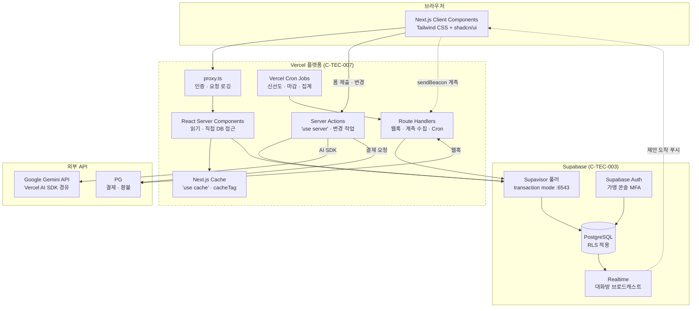
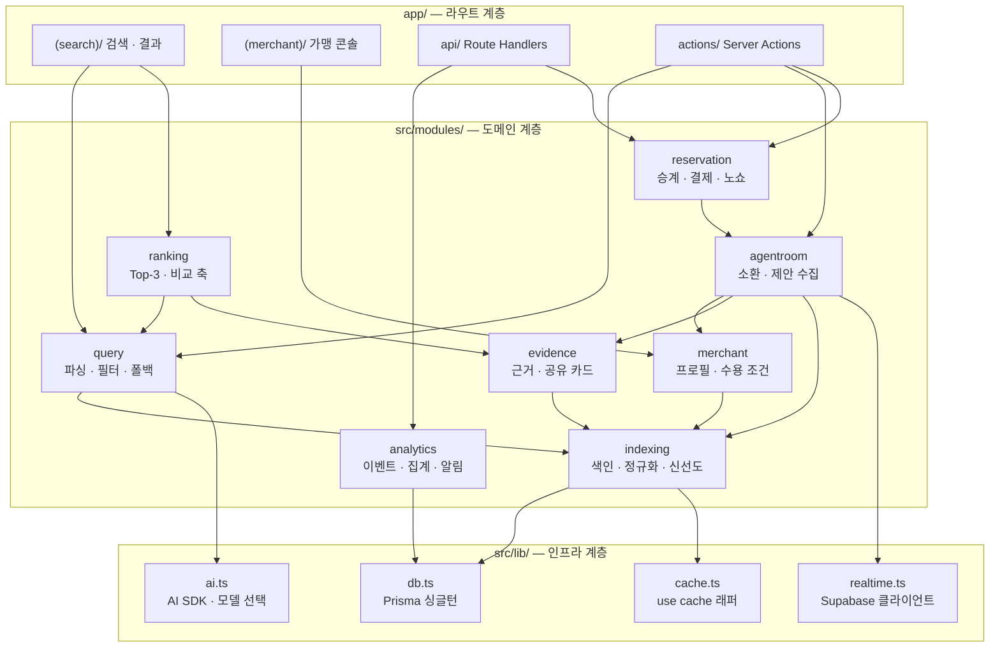
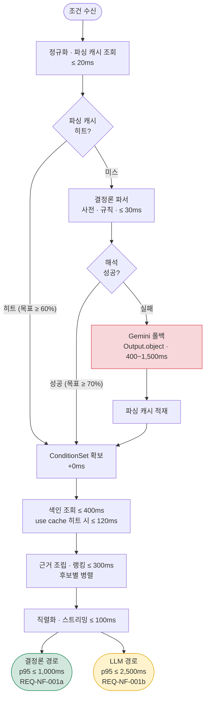
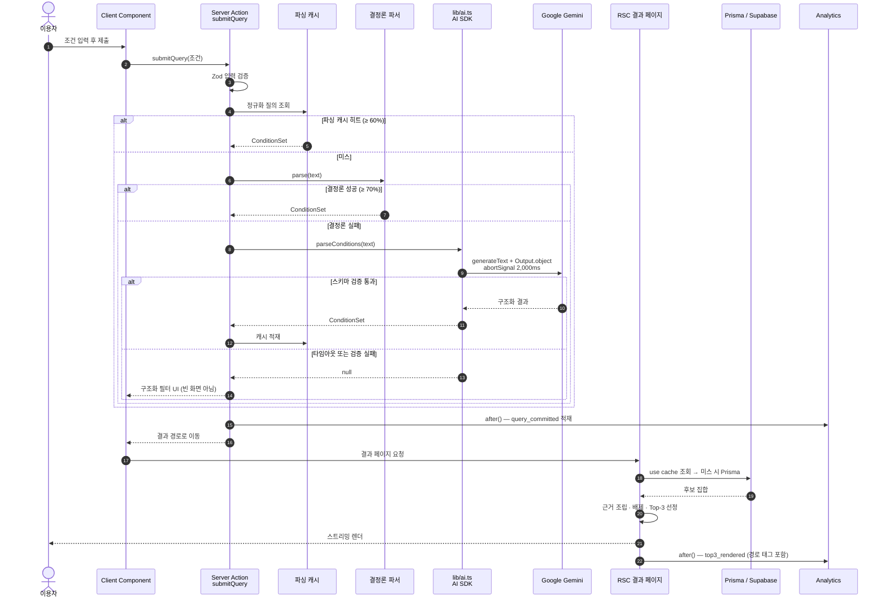
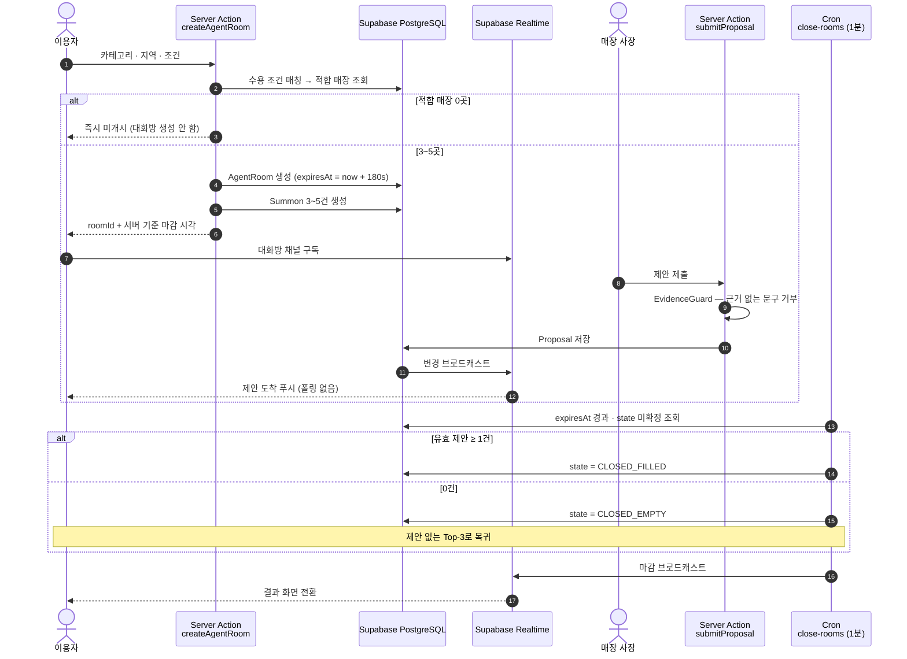
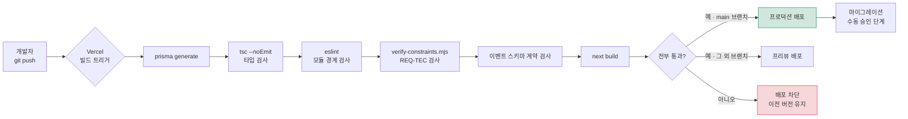

# [SRS 문서] AI-Place-Mate (기술제약 반영판)

# 소프트웨어 요구사항 명세서 (SRS)

**문서 ID:** SRS-AIPLACE-TEC-001

**개정 버전:** 1.0

**날짜:** 2026-08-25

**표준:** ISO/IEC/IEEE 29148:2018

**병렬 문서:** SRS-AIPLACE-MVP-001 v1.0 (`[SRS 문서] AI-Place-Mate (한글).md`) — 기술 중립판

---

## 0. 이 문서의 위치

기술 중립판 SRS(SRS-AIPLACE-MVP-001)는 **무엇을 만들 것인가**를 스택과 무관하게 정의한다. 본 문서는 그 요구사항에 **§1.5의 기술 제약 C-TEC-001 ~ 007을 정확히 적용했을 때 실제로 구현 가능한 형태**를 정의한다.

| 구분 | 기술 중립판 (MVP-001) | 기술제약 반영판 (TEC-001, 본 문서) |
| --- | --- | --- |
| 목적 | 무엇을 만들 것인가 | 주어진 스택으로 **어떻게 성립시킬 것인가** |
| 배포 단위 | 8개 마이크로서비스 | **단일 Next.js 앱** (모듈 경계로 환원) |
| 요구사항 ID | REQ-FUNC-xxx · REQ-NF-xxx | 동일 ID 유지 + **REQ-TEC-xxx** 신설 |
| 성능 목표 | p95 ≤ 1,000ms 단일 목표 | **경로별 분리** (§4.2 · §15-2) |
| 관계 | 원본 | 원본을 **대체하지 않는다.** 충돌 지점은 §15에 전량 기록 |

**두 문서가 어긋나면 §15의 대장이 판정 기준이다.** 본 문서는 요구사항을 새로 만들지 않으며, 제약 때문에 **성립하지 않는 요구사항은 숨기지 않고 조정 근거와 함께 기록**한다.

### 이 문서의 그림을 읽는 법

| 그림 | 답하는 질문 | 위치 |
| --- | --- | --- |
| 배포 토폴로지 | 코드가 **어디서 실행되는가** | §3.1 |
| 모듈 구조 | 단일 앱 **안이 어떻게 나뉘는가** | §3.3 |
| 시퀀스 | 요청 하나가 **어떤 순서로 처리되는가** | §9.1 · §9.3 |
| 플로차트 | **판단 분기**가 어떻게 갈리는가 | §4.2.1 · §10.3 |
| 배포 파이프라인 | Git Push 이후 **무슨 일이 일어나는가** | §14.4 |

---

## 1. 서론

### 1.1 목적

본 문서는 ISO/IEC/IEEE 29148:2018에 따라, **Next.js App Router 단일 풀스택 프레임워크 위에서 구현되는 AI 장소 큐레이션 서비스**의 소프트웨어 요구사항을 정의한다.

기술 중립판이 정의한 기능·비기능 요구사항을 유지하되, §1.5의 제약 아래에서 **실제로 도달 가능한 목표치와 구현 단위**로 다시 쓴다.

### 1.2 범위

대상 릴리스는 **제품 v0.1(MVP)** 이며 기능 아홉 개(F1–F9)로 구성된다. 기능 범위는 기술 중립판 §1.2와 동일하다. 본 문서에서 달라지는 것은 **구현 단위와 운영 방식**이다.

| 영역 | 기술 중립판 | 본 문서 |
| --- | --- | --- |
| 서버 구성 | 8개 마이크로서비스 + API Gateway | Next.js 단일 앱. 서비스는 `src/modules/*` 모듈 경계 |
| 서버 로직 | 서비스별 REST API | **Server Actions**(변경) + **Route Handlers**(외부·웹훅·GET 캐시) |
| 데이터 | 주 DB + 별도 캐시 계층 | **Supabase PostgreSQL + Prisma**, 캐시는 Next.js `use cache` |
| 자연어 파싱 | 자체 파서 서비스 | **결정론 파서 + Gemini 폴백** (Vercel AI SDK) |
| 실시간 | 서버 상태 유지 | **Supabase Realtime** 브로드캐스트 |
| 배치 | 야간 배치 서버 | **Vercel Cron Jobs** |
| 배포 | 서비스별 파이프라인 | **Vercel · Git Push 단일 경로** |

### 1.3 정의, 약어, 축약어

기술 중립판 §1.3의 도메인 용어(WEBD · Top-3 · canonical_key · Verification 등)를 그대로 승계한다. 본 문서에서 추가되는 기술 용어만 정의한다.

| 용어 | 정의 |
| --- | --- |
| Server Action | `'use server'` 로 표시된 서버 실행 함수. 클라이언트에서 직접 호출되며 **POST 전용**이고 외부에서 접근할 수 없다 |
| Route Handler | `app/**/route.ts` 로 정의하는 HTTP 엔드포인트. 외부 시스템·웹훅·캐시 가능한 GET에 사용한다 |
| RSC | React Server Component. 서버에서 렌더되며 DB에 직접 접근할 수 있다 |
| `use cache` | Next.js Cache Components 지시자. 함수 단위 캐싱을 선언하며 `cacheTag`·`cacheLife` 로 수명과 무효화를 제어한다 |
| `after()` | 응답을 보낸 **뒤** 실행되는 작업을 예약하는 Next.js 함수. 계측 적재에 사용한다 |
| Supavisor | Supabase의 커넥션 풀러. 트랜잭션 모드(포트 6543)로 서버리스 커넥션 고갈을 방지한다 |
| RLS | Row Level Security. PostgreSQL 행 단위 접근 제어 |
| 결정론 파서 | 사전·규칙 기반의 비-LLM 조건 파서. LLM 호출 없이 동작한다 |
| LLM 폴백 | 결정론 파서가 해석하지 못한 질의에 한해 Gemini를 호출하는 경로 |
| 파싱 캐시 | 정규화된 질의 문자열 → ConditionSet 매핑 캐시. 동일 질의의 LLM 재호출을 막는다 |

### 1.4 기존 SRS와의 관계

- 요구사항 **ID는 승계**한다. `REQ-FUNC-001` 은 두 문서에서 같은 요구사항이다.
- 제약으로 인해 **목표치가 바뀐 요구사항**은 본 문서의 값이 구현 기준이며, 변경 사유는 §15에 기록한다.
- 제약을 지키기 위해 **새로 필요해진 요구사항**은 `REQ-TEC-xxx` 로 부여한다 (§4.3).
- 기술 중립판의 사용자 특성(§8) · 리스크(§11.4) · 가정(§12)은 스택과 무관하므로 **참조로 대체**하고 중복 기술하지 않는다.

### 1.5 가정 및 제약조건 (Assumptions & Constraints)

발주 측이 확정한 기술 제약이다. **본 문서의 모든 설계 판단은 이 일곱 항목을 상위 규범으로 삼는다.**

#### 시스템 내부 — 단일 통합 프레임워크

| ID | 제약 |
| --- | --- |
| **C-TEC-001** | 모든 서비스는 Next.js (App Router) 기반의 단일 풀스택 프레임워크로 구현한다. (프론트엔드와 백엔드를 별도 분리하지 않는다.) |
| **C-TEC-002** | 서버 측 로직(DB 접근, API 호출 등)은 Next.js의 Server Actions 또는 Route Handlers를 사용하여 별도의 백엔드 서버 없이 구현한다. |
| **C-TEC-003** | 데이터베이스는 Prisma + 로컬 Supabase를 사용하여 로컬 개발환경을 구성하고 배포 시 Supabase(PostgreSQL)를 사용하여 인프라 설정 복잡도를 최소화한다. |
| **C-TEC-004** | UI 및 스타일링은 Tailwind CSS와 shadcn/ui를 사용하여 AI가 일관된 디자인 코드를 생성하도록 강제한다. |

#### 시스템 외부 — 연결 및 AI 통합

| ID | 제약 |
| --- | --- |
| **C-TEC-005** | (AI 호출 기능이 포함된 경우) AI 기능은 별도 자체 서버 구축 없이 Vercel AI SDK를 사용하여 Next.js 에서 외부 API를 호출하는 형태로 구현한다. |
| **C-TEC-006** | 외부 AI 서비스 API 호출은 Google Gemini API를 기본으로 사용하며, 환경 변수 설정만으로 모델 교체가 가능하도록 SDK의 표준 인터페이스를 준수한다. |
| **C-TEC-007** | 배포 및 인프라 관리는 Vercel 플랫폼으로 단일화하며, CI/CD 설정 없이 Git Push만으로 배포를 자동화한다. |

#### 1.5.1 제약에서 파생되는 규범

위 제약을 지키면 자동으로 따라오는 하위 규범이다. 설계 검토 시 이 표를 체크리스트로 쓴다.

| 파생 규범 | 출처 | 내용 |
| --- | --- | --- |
| **D-01** 별도 백엔드 프로세스 금지 | C-TEC-001 · 002 | Express·NestJS 등 독립 서버를 두지 않는다. 상시 구동 워커도 두지 않는다 |
| **D-02** 서비스 간 HTTP 호출 금지 | C-TEC-001 | 모듈 간 통신은 **함수 직접 호출**이다. 내부 통신에 네트워크 홉을 만들지 않는다 |
| **D-03** 별도 캐시 서버 금지 | C-TEC-003 | Redis·Memcached를 도입하지 않는다. 캐시는 Next.js `use cache` 와 PostgreSQL로 해결한다 |
| **D-04** 별도 메시지 큐 금지 | C-TEC-001 · 003 | Kafka·SQS를 도입하지 않는다. 비동기는 `after()` 와 DB 큐 테이블로 해결한다 |
| **D-05** 상시 실행 스케줄러 금지 | C-TEC-007 | cron 데몬을 두지 않는다. 주기 작업은 **Vercel Cron Jobs → Route Handler** 로 구현한다 |
| **D-06** 외부 CI 파이프라인 금지 | C-TEC-007 | GitHub Actions 등을 두지 않는다. 품질 게이트는 **Vercel 빌드 단계**에 넣는다 (§14.4) |
| **D-07** 모델 하드코딩 금지 | C-TEC-006 | 모델 ID는 환경 변수로만 지정한다. 코드에 모델명을 상수로 두지 않는다 |
| **D-08** 자체 UI 컴포넌트 신규 제작 최소화 | C-TEC-004 | shadcn/ui에 존재하는 컴포넌트를 직접 다시 만들지 않는다 |

### 1.6 제약 적용의 결과 — 한눈에

제약을 정확히 적용하면 기술 중립판의 요구사항 중 **네 건이 그대로는 성립하지 않는다.** 숨기지 않고 조정하며, 상세 근거는 §15에 있다.

| 요구사항 | 중립판 | 본 문서 | 사유 |
| --- | --- | --- | --- |
| REQ-NF-001 응답 시간 | p95 ≤ 1,000ms (단일) | **경로 분리** — 결정론 ≤ 1,000ms / LLM ≤ 2,500ms | LLM 왕복이 파싱 예산 150ms를 구조적으로 초과 |
| REQ-NF-003 처리량 | 3,000 RPS | **Phase 1 300 RPS → Phase 2 3,000 RPS (플랜 상향 전제)** | Supavisor 풀 크기와 Supabase 플랜에 종속 |
| REQ-NF-002 캐시 히트율 | 별도 캐시 계층 ≥ 70% | `use cache` 기반 ≥ 70% + **파싱 캐시 ≥ 60%** 신설 | Redis 금지(D-03). 대신 LLM 비용을 잡는 캐시가 추가로 필요 |
| §10.2.5 CI 계약 테스트 | CI에서 실패 시 배포 차단 | **Vercel 빌드 단계**에서 실패 시 배포 차단 | 외부 CI 금지(D-06). 차단 효과는 동일하게 보존 |

---

## 2. 이해관계자

단일 스택이므로 기술 중립판 §2 대비 **인프라 역할이 줄고 애플리케이션 역할이 늘어난다.**

| 역할 | 부서 | 책임 | 중립판 대비 |
| --- | --- | --- | --- |
| 제품 책임자 (PO) | 5팀 | 범위·우선순위 결정, 게이트 판정 | 동일 |
| 기획 분석가 | 5팀 | 요구사항 상세화, 수용 기준, KPI 정의 | 동일 |
| 풀스택 리드 | 개발팀 | Next.js 앱 구조·모듈 경계·ADR 관리, Prisma 스키마 승인 | **백엔드 리드 + 프런트엔드 리드 통합** |
| 풀스택 엔지니어 | 개발팀 | RSC·Server Action·Route Handler·UI 구현 | **프런트/백엔드 분리 없음** |
| 데이터 엔지니어 | 데이터팀 | Prisma 스키마·마이그레이션, 색인 파이프라인, 이벤트 적재 | 동일 |
| AI 엔지니어 | 개발팀 | 결정론 파서 사전, 프롬프트·스키마, 모델·비용 튜닝 | **신설** (C-TEC-005 · 006) |
| 서비스 운영자 | 운영팀 | 제안 심사, 재확인 큐 처리, 불이행 신고 처리 | 동일 |
| 가맹 영업 담당자 | 사업팀 | 가맹 온보딩, LOI, 필수 필드 충족 관리 | 동일 |
| 결제·정산 담당자 | 사업팀 | PG 계약, 환불·정산 정책, PCI-DSS 준수 확인 | 동일 |
| 데이터 분석가 | 데이터팀 | 계측 정의, 주간 리포트, 기준선 실측 | 동일 |

**전담 SRE를 두지 않는다** — Vercel과 Supabase가 인프라 운영을 흡수하므로(C-TEC-003 · 007), 관측·알림은 풀스택 리드가 겸한다. 대신 **플랫폼 장애 시 대응 수단이 제한**된다는 리스크가 생긴다(§11.2 LIM-T05).

---

## 3. 시스템 맥락 및 인터페이스

### 3.1 배포 토폴로지

**이 그림이 말하는 것:** 코드가 어디서 실행되는지다. **우리가 운영하는 서버는 0대**이며, 모든 서버 로직은 Vercel Functions 위에서 실행된다.



| 실행 위치 | 무엇이 실행되나 | 근거 |
| --- | --- | --- |
| 브라우저 | Client Components, 계측 발신 | C-TEC-001 · 004 |
| Vercel Functions (Node.js 런타임) | RSC 렌더, Server Actions, Route Handlers, Cron 수신 | C-TEC-002 · 007 |
| Supabase | PostgreSQL, Realtime, Auth | C-TEC-003 |
| 외부 | Gemini, PG | C-TEC-005 · 006 |

**Edge 런타임을 쓰지 않는다** — 기본 Node.js 런타임을 사용한다. Prisma와 Node.js API 전체가 필요하고, Edge는 이점 없이 제약만 늘린다.

### 3.2 인터페이스 목록

- **클라이언트**
    1. 네이버 지도 내 탭 (1차 유통) — Next.js 앱을 임베드
    2. 독립 모바일 웹 (병행 경로) — 동일 앱의 직접 진입
    3. 매장 에이전트 콘솔 (Phase 2) — 동일 앱의 `/(merchant)` 라우트 그룹
- **내부 (동일 프로세스 · 함수 호출)** — §3.3의 8개 모듈
- **외부**
    - Supabase PostgreSQL — Prisma 경유 (`DATABASE_URL` = Supavisor :6543, `DIRECT_URL` = :5432)
    - Supabase Realtime — 대화방 제안 브로드캐스트
    - Supabase Auth — 가맹 콘솔 인증 및 MFA
    - Google Gemini API — Vercel AI SDK `@ai-sdk/google` 경유
    - PG — 결제·환불. Server Action에서 호출, 결과는 Route Handler 웹훅으로 수신
    - 지도·경로 API — **v0.1 미사용**
    - 실시간 매장 상태 — 제휴 검토 단계

### 3.3 모듈 구조

**이 그림이 말하는 것:** 기술 중립판의 8개 서비스가 **배포 단위가 아니라 디렉터리 경계**로 바뀐 모습이다. 화살표는 네트워크 호출이 아니라 **함수 임포트**다(D-02).



**모듈 경계를 지키는 방법** — 물리적으로 분리되지 않으므로 경계가 쉽게 무너진다. 각 모듈은 `index.ts` 로만 외부에 노출하고, 모듈 내부 파일을 다른 모듈이 직접 임포트하는 것을 **ESLint `no-restricted-imports` 로 차단**한다(REQ-TEC-002).

---

## 4. 구체적 요구사항

### 4.1 기능 요구사항

기능의 **내용**은 기술 중립판과 동일하다. 달라지는 것은 **구현 단위**(Server Action / Route Handler / RSC)와 그로 인해 바뀌는 인수 기준이다.

| ID | 제목 | 구현 단위 | 우선순위 | 검증 방식 | 인수 기준 | 상태 | 담당자 |
| --- | --- | --- | --- | --- | --- | --- | --- |
| <a id="REQ-FUNC-001"></a>**REQ-FUNC-001** | 속성·dish 단위 공통 색인 | Prisma 스키마 + `modules/indexing` · Cron Route Handler | Must Have | 1) 스키마 마이그레이션 검증<br>2) `canonical_key` 정규화 테스트<br>3) 커버리지 배치 검증 | 색인 단위는 `Place` 가 아니라 **`Dish` + `Attribute`** 여야 한다. Prisma 모델과 인덱스가 §6.2대로 존재하고, 조건 검색 성공률이 **0% → 90%** 이상이어야 한다 | Proposed | 데이터 엔지니어 |
| <a id="REQ-FUNC-002"></a>**REQ-FUNC-002** | 인당 가격대 · 메뉴 옵션 필터 | RSC 직접 조회 + `modules/query` | Must Have | 1) 예산 필터 테스트<br>2) 범위 표기 검증<br>3) 사후 편차 반영(Server Action) | 모든 후보 카드에 인당 예상가와 오차 범위를 표기한다. 표기율 **100%**, 범위 폭 **≤ ±20%**, 예산 초과 매장은 '예산 초과 N곳'으로만 요약하며 오탐률 **≤ 3%** | Proposed | 풀스택 엔지니어 |
| <a id="REQ-FUNC-003"></a>**REQ-FUNC-003** | 대표 메뉴 단위 추천 | RSC + `modules/query` | Must Have | 1) 정답률 측정<br>2) 유사 메뉴 대체<br>3) 반경 확대 폴백 | 메뉴명 하나로 해당 메뉴를 취급하는 매장 Top-3를 반환한다. 정답 반환률 **≥ 92%**, 빈 결과 반환률 **≤ 2%** | Proposed | 풀스택 엔지니어 |
| <a id="REQ-FUNC-004"></a>**REQ-FUNC-004** | 자연어 상황 검색 및 폴백 | **2단 파싱** — 결정론 파서(동기) + Gemini 폴백(AI SDK) | Must Have | 1) 결정론 히트율 측정<br>2) LLM 스키마 준수 검증<br>3) 폴백 UI 전환 테스트 | 자연어 1줄로 조건을 입력할 수 있어야 하며, **결정론 파서가 질의의 ≥ 70%를 LLM 호출 없이 처리**해야 한다. 파싱 실패 시 빈 화면 대신 구조화 필터 UI로 전환한다. 최종 파싱 실패율 **≤ 1.5%**, 빈 화면 노출 **0건** | Proposed | AI 엔지니어 |
| <a id="REQ-FUNC-005"></a>**REQ-FUNC-005** | 근거·출처 표기 및 공유 카드 | `modules/evidence` + `next/og` 이미지 생성 | Must Have | 1) 4항목 검증기<br>2) 90일 경고 테스트<br>3) OG 이미지 렌더 테스트 | 모든 후보 카드에 선정 이유·근거 속성·확인 일자·확인 주체 **네 항목을 모두** 표시한다. 표기율 **100%**, 경고 누락률 **0%**, 판정형 문구 **0건**, 공유 카드 생성 p95 **≤ 3,000ms** | Proposed | 풀스택 엔지니어 |
| <a id="REQ-FUNC-006"></a>**REQ-FUNC-006** | 근거 있는 Top-3 제시 | `modules/ranking` (RSC 내 동기 호출) | Must Have | 1) 후보 수 고정<br>2) 근거 미충족 배제<br>3) 비교 축 검증 | 후보를 **정확히 3개** 반환하고 페이지네이션을 제공하지 않는다. 근거 없는 후보는 반환하지 않는다 | Proposed | 풀스택 엔지니어 |
| <a id="REQ-FUNC-007"></a>**REQ-FUNC-007** | 선택·예약 및 주문량 기반 결제 | Server Action(승계·결제 요청) + Route Handler(PG 웹훅) | Should Have | 1) 승계 테스트<br>2) 웹훅 서명 검증<br>3) 멱등성 테스트 | 제안의 인원·메뉴 구성·시간이 자동 승계된다. 재입력 필드 **0개**, 승계 누락률 **≤ 0.5%**, 금액 산출 오류율 **≤ 0.3%**, 환불 실패율 **≤ 0.5%**, 노쇼 오판정률 **≤ 1%**. **PG 웹훅은 멱등 처리되어 중복 수신 시 상태가 변하지 않아야 한다** | Proposed | 결제·정산 담당자 |
| <a id="REQ-FUNC-008"></a>**REQ-FUNC-008** | 매장 에이전트 콘솔 | `(merchant)` 라우트 그룹 + Supabase Auth | Could Have | 1) 등록 플로우<br>2) 수용 조건 매칭<br>3) 근거 없는 문구 차단 | 분위기·강점·서비스·수용 조건을 항목별로 등록할 수 있다. 설정 화면 **≤ 3개**, 필수 항목 **≤ 5개**, 부적합 소환률 **≤ 5%**, 근거 없는 제안 문구 **0건** | Proposed | 풀스택 엔지니어 |
| <a id="REQ-FUNC-009"></a>**REQ-FUNC-009** | 에이전트 소환 및 단체 대화방 | Server Action(생성·제출) + **Supabase Realtime**(수신) + Cron(마감) | Could Have | 1) 소환 수 검증<br>2) Realtime 수신 지연 측정<br>3) 마감 판정 테스트 | 조건에 맞는 매장 에이전트를 **3–5곳** 소환해 하나의 대화방을 만든다. 대화방 생성 p95 **≤ 2,000ms**, 180초 내 제안 도착률 **85%**, 정렬 1순위는 **조건 적합도**, 가격 협상 기능 **0건**. **마감은 서버 시각 기준이며 클라이언트 타이머에 의존하지 않는다** | Proposed | 풀스택 엔지니어 |
| <a id="REQ-FUNC-010"></a>**REQ-FUNC-010** | 성분·접근성 속성 필드 확보 | Prisma 스키마 필드만 | Won't Have<br>(필드만) | 1) 스키마 필드 존재<br>2) 판정 로직 부재 검토 | 성분·접근성 필드를 **스키마에만** 확보한다. 값을 그대로 노출하고 시스템이 적합 여부를 **판정하지 않는다** | Proposed | 데이터 엔지니어 |

### 4.2 비기능 요구사항

| ID | 제목 | 우선순위 | 검증 방식 | 인수 기준 | 상태 | 담당자 |
| --- | --- | --- | --- | --- | --- | --- |
| <a id="REQ-NF-001a"></a>**REQ-NF-001a** | 결정론 경로 응답 시간 | Must Have | Vercel Observability p95 + `top3_rendered.latency_ms` | LLM을 호출하지 않는 질의의 조건 수신 → Top-3 렌더 p95 **≤ 1,000ms**, p99 **≤ 2,000ms**. 전체 질의의 **≥ 70%** 가 이 경로여야 한다 | Proposed | 풀스택 리드 |
| <a id="REQ-NF-001b"></a>**REQ-NF-001b** | LLM 폴백 경로 응답 시간 | Must Have | 경로 태그 분리 측정 | LLM 폴백 질의의 p95 **≤ 2,500ms**. 첫 화면은 **500ms 내 스켈레톤**을 렌더해 빈 화면을 만들지 않는다 | Proposed | AI 엔지니어 |
| <a id="REQ-NF-002"></a>**REQ-NF-002** | 색인 조회 성능과 캐시 | Must Have | Prisma 쿼리 로그 + 캐시 태그 히트 계측 | 색인 조회 p95 **≤ 400ms**, `use cache` 히트 시 **≤ 120ms**. 속성·메뉴 조회 캐시 히트율 **≥ 70%** | Proposed | 데이터 엔지니어 |
| <a id="REQ-NF-002b"></a>**REQ-NF-002b** | 파싱 캐시 | Must Have | 파싱 캐시 히트율 계측 | 정규화 질의 문자열 기준 LLM 파싱 결과 캐시 히트율 **≥ 60%**. 동일 질의에 대한 LLM 재호출 **0건** | Proposed | AI 엔지니어 |
| <a id="REQ-NF-003"></a>**REQ-NF-003** | 처리량 | Should Have | 부하 테스트 + Supavisor 풀 사용률 | **Phase 1: 300 RPS**에서 REQ-NF-001a 유지. **Phase 2: 3,000 RPS** — Supabase 컴퓨트 상향과 풀 크기 증설을 전제로 한다 (§15-3) | Proposed | 풀스택 리드 |
| <a id="REQ-NF-004"></a>**REQ-NF-004** | 모바일 초기 렌더 | Should Have | Vercel Speed Insights (4G 조건) | LCP **≤ 2.5s**. Server Component 우선 렌더로 클라이언트 번들을 최소화한다 | Proposed | 풀스택 엔지니어 |
| <a id="REQ-NF-005"></a>**REQ-NF-005** | 가용성 | Must Have | Vercel + Supabase 상태 집계 | 월 가용성 **≥ 99.5%**. 두 플랫폼의 가용성이 곱으로 작용하므로 각 구성요소는 **≥ 99.9%** 를 전제로 한다 | Proposed | 풀스택 리드 |
| <a id="REQ-NF-006"></a>**REQ-NF-006** | 오류율 | Must Have | Vercel Runtime Logs 5분 윈도 | 5xx 오류율 **≤ 0.3%**, 결제 관련 Route Handler **≤ 0.1%** | Proposed | 풀스택 리드 |
| <a id="REQ-NF-007"></a>**REQ-NF-007** | 폴백 열화 | Must Have | 파싱 결과 로그 | 최종 파싱 실패율 **≤ 1.5%**, 실패 시 구조화 필터로 열화. 빈 결과 반환률 **≤ 2%** | Proposed | AI 엔지니어 |
| <a id="REQ-NF-008"></a>**REQ-NF-008** | 데이터 신선도 | Must Have | Cron 실행 로그 + 배치 결과 | 가격·속성이 **90일** 초과 시 경고를 표기한다. 신선도 스캔 Cron은 **매일 1회 실행되고 실행 실패 시 알림**이 발송되어야 한다. 90일 초과 비율 **> 20%** 시 재확인 큐 우선순위를 상향한다 | Proposed | 데이터 엔지니어 |
| <a id="REQ-NF-009"></a>**REQ-NF-009** | 복구 목표 | Should Have | 복원 훈련 | RTO **≤ 30분**, RPO **≤ 5분**. Supabase PITR(Point-in-Time Recovery) 활성화를 전제로 한다 | Proposed | 데이터 엔지니어 |
| <a id="REQ-NF-010"></a>**REQ-NF-010** | 개인정보 최소 수집 및 파기 | Must Have | 파기 Cron 검증 + RLS 정책 리뷰 | 참석자 출발지는 세션 종료 후 **30일 내 파기**한다. 식이·이동 제약은 **본인 단말에만** 저장하며 서버 전송 시 옵트인이 필수다. 회식 참석자의 비고·개인 취향 필드는 **스키마에 존재하지 않아야** 한다 | Proposed | 풀스택 리드 |
| <a id="REQ-NF-011"></a>**REQ-NF-011** | 결제 보안 | Must Have | PCI-DSS 준수 확인 + 스키마 검사 | 결제는 PG에 위탁하고 **카드 정보 컬럼이 Prisma 스키마에 존재하지 않아야** 한다. 전송은 **TLS 1.3**, Supabase 저장 암호화를 적용한다. PG 웹훅은 **서명 검증** 후에만 처리한다 | Proposed | 결제·정산 담당자 |
| <a id="REQ-NF-012"></a>**REQ-NF-012** | 접근 통제 및 감사 | Must Have | RLS 정책 테스트 + 감사 로그 검증 | 가맹 콘솔에 **Supabase Auth MFA**를 적용한다. 모든 테이블에 **RLS를 활성화**하고, 내부 조회는 `audit_logs` 에 전량 기록한다 | Proposed | 풀스택 리드 |
| <a id="REQ-NF-013"></a>**REQ-NF-013** | AI 추론 비용 | Must Have | 토큰 사용량 일간 집계 | 세션당 추론 비용 **≤ 12원**. 결정론 파서 70% 흡수 + 파싱 캐시 + 출력 토큰 상한으로 달성한다. 일간 **> 18원** 시 알림 | Proposed | AI 엔지니어 |
| <a id="REQ-NF-014"></a>**REQ-NF-014** | 단위 경제 및 운영 인력 상한 | Should Have | 월간 리포트 | 성사 1건당 수수료 > 처리 비용 **× 3**. 제안 품질 심사는 가맹점 **150곳당 1 FTE** 상한 | Proposed | 제품 책임자 (PO) |
| <a id="REQ-NF-015"></a>**REQ-NF-015** | 관측 및 알림 | Must Have | 알림 수신 검증 | §10.3의 관측 항목 전부에 수집 방식·임계·채널·대응이 정의되어야 하며, 임계 초과 시 자동 알림이 발송된다 | Proposed | 풀스택 리드 |

#### 4.2.1 응답 시간 예산 배분

**이 그림이 말하는 것:** 왜 REQ-NF-001을 두 개로 쪼갰는지다. 위쪽이 LLM을 부르지 않는 경로, 아래쪽이 부르는 경로다.



| 구간 | 예산 | 초과 시 대응 |
| --- | --- | --- |
| 정규화 · 파싱 캐시 | ≤ 20ms | 캐시 키 정규화 규칙 점검 |
| 결정론 파서 | ≤ 30ms | 사전 크기·매칭 알고리즘 점검 |
| Gemini 폴백 | 400~1,500ms | 더 가벼운 모델로 환경 변수 교체(D-07), 출력 토큰 상한 하향 |
| 색인 조회 | ≤ 400ms (캐시 ≤ 120ms) | `use cache` 태그 범위 조정, Prisma 인덱스 점검 |
| 근거 조립 · 랭킹 | ≤ 300ms | `Promise.all` 병렬도 확인, 근거 문장 캐싱 |

**LLM 경로에서도 빈 화면을 만들지 않는다** — RSC를 Suspense로 감싸 500ms 내에 스켈레톤을 스트리밍하고, 조건이 확정되면 결과를 채운다.

### 4.3 기술 제약 준수 요구사항 (REQ-TEC)

§1.5의 제약을 **검증 가능한 요구사항**으로 옮긴 것이다. 제약은 선언이고, 아래는 그 선언을 어겼을 때 탐지되는 장치다.

| ID | 제목 | 출처 | 검증 방식 | 인수 기준 | 담당자 |
| --- | --- | --- | --- | --- | --- |
| <a id="REQ-TEC-001"></a>**REQ-TEC-001** | 단일 배포 산출물 | C-TEC-001 · D-01 | 저장소 구조 검사 (빌드 단계) | 배포 산출물은 Next.js 앱 **1개**여야 한다. 독립 서버 프로세스·상시 워커가 저장소에 존재하지 않아야 한다 | 풀스택 리드 |
| <a id="REQ-TEC-002"></a>**REQ-TEC-002** | 모듈 경계 강제 | C-TEC-001 · D-02 | ESLint `no-restricted-imports` (빌드 단계) | 모듈 내부 파일을 다른 모듈이 직접 임포트하면 **빌드가 실패**해야 한다. 모듈 간 통신에 `fetch`(자기 자신 호출)를 사용하지 않아야 한다 | 풀스택 리드 |
| <a id="REQ-TEC-003"></a>**REQ-TEC-003** | 서버 로직 구현 수단 제한 | C-TEC-002 | 코드 리뷰 + 라우트 목록 검사 | 모든 서버 로직은 RSC · Server Action · Route Handler 중 하나여야 한다. 그 외 서버 진입점이 없어야 한다 | 풀스택 리드 |
| <a id="REQ-TEC-004"></a>**REQ-TEC-004** | DB 접근 단일화 | C-TEC-003 | 임포트 검사 (빌드 단계) | DB 접근은 `src/lib/db.ts` 의 Prisma 싱글턴을 통해서만 이뤄져야 한다. 원시 커넥션 생성이 없어야 한다 | 데이터 엔지니어 |
| <a id="REQ-TEC-005"></a>**REQ-TEC-005** | 커넥션 풀 구성 | C-TEC-003 | 환경 변수 검증 (빌드 단계) | `DATABASE_URL` 은 **Supavisor 트랜잭션 모드(:6543)**, `DIRECT_URL` 은 직결(:5432)이어야 한다. 두 값이 모두 없으면 빌드가 실패해야 한다 | 데이터 엔지니어 |
| <a id="REQ-TEC-006"></a>**REQ-TEC-006** | 로컬·운영 환경 동등성 | C-TEC-003 | `supabase start` 후 마이그레이션 검증 | 로컬 Supabase에서 운영과 **동일한 마이그레이션**이 적용되어야 하며, 스키마 드리프트가 0이어야 한다 | 데이터 엔지니어 |
| <a id="REQ-TEC-007"></a>**REQ-TEC-007** | 디자인 시스템 준수 | C-TEC-004 · D-08 | 스타일 린트 + 컴포넌트 인벤토리 | 스타일은 Tailwind 유틸리티로만 작성한다. shadcn/ui에 존재하는 컴포넌트를 자체 구현하지 않는다. 임의 CSS 파일 추가 시 리뷰 승인이 필요하다 | 풀스택 엔지니어 |
| <a id="REQ-TEC-008"></a>**REQ-TEC-008** | AI 호출 경로 단일화 | C-TEC-005 | 임포트 검사 | 모든 AI 호출은 `src/lib/ai.ts` 를 경유해야 한다. Gemini SDK나 원시 HTTP 호출을 직접 사용하지 않아야 한다 | AI 엔지니어 |
| <a id="REQ-TEC-009"></a>**REQ-TEC-009** | 모델 교체 가능성 | C-TEC-006 · D-07 | 환경 변수 교체 테스트 | 모델 ID는 환경 변수(`AI_MODEL_PARSE` · `AI_MODEL_EVIDENCE`)로만 지정한다. **코드 변경 없이 환경 변수만 바꿔** 다른 모델로 동작해야 한다 | AI 엔지니어 |
| <a id="REQ-TEC-010"></a>**REQ-TEC-010** | 구조화 출력 강제 | C-TEC-005 · 006 | 스키마 검증 실패율 측정 | LLM 응답은 반드시 스키마 검증(`Output.object`)을 통과해야 한다. 검증 실패 시 결정론 폴백으로 전환하며, 검증되지 않은 응답을 사용하지 않는다 | AI 엔지니어 |
| <a id="REQ-TEC-011"></a>**REQ-TEC-011** | 배포 경로 단일화 | C-TEC-007 · D-06 | 저장소 검사 | 배포는 **Git Push → Vercel** 경로만 존재해야 한다. 외부 CI 워크플로 파일이 저장소에 없어야 한다 | 풀스택 리드 |
| <a id="REQ-TEC-012"></a>**REQ-TEC-012** | 빌드 단계 품질 게이트 | C-TEC-007 · D-06 | 의도적 위반 후 빌드 실패 확인 | 타입 검사 · 린트 · Prisma 검증 · 이벤트 스키마 계약 검사가 **빌드 명령에 포함**되어야 하며, 하나라도 실패하면 배포가 차단되어야 한다 | 풀스택 리드 |
| <a id="REQ-TEC-013"></a>**REQ-TEC-013** | 주기 작업 구현 수단 | C-TEC-007 · D-05 | Cron 실행 로그 | 주기 작업은 **Vercel Cron Jobs → Route Handler** 로만 구현한다. 각 Cron 엔드포인트는 `CRON_SECRET` 으로 인증하며 외부 호출을 거부해야 한다 | 풀스택 리드 |
| <a id="REQ-TEC-014"></a>**REQ-TEC-014** | 비동기 작업 구현 수단 | C-TEC-001 · D-04 | 코드 리뷰 | 응답 이후 처리는 `after()` 또는 DB 큐 테이블로 구현한다. 외부 메시지 브로커를 도입하지 않는다 | 풀스택 리드 |
| <a id="REQ-TEC-015"></a>**REQ-TEC-015** | 캐시 구현 수단 | C-TEC-003 · D-03 | 의존성 검사 | 캐시는 Next.js `use cache` 와 PostgreSQL로만 구현한다. Redis 등 외부 캐시 의존성이 없어야 한다 | 풀스택 리드 |

---

## 5. 추적성 매트릭스

기술 중립판의 클래스명을 **파일 경로와 구현 단위**로 환원한 표다.

| 요구사항 ID | 모듈 | 구현 단위 · 경로 | 테스트 케이스 ID |
| --- | --- | --- | --- |
| REQ-FUNC-001 | indexing | `src/modules/indexing/indexer.ts` · `normalizer.ts` · `prisma/schema.prisma` | TC-FUNC-001 |
| REQ-FUNC-002 | query | `src/modules/query/price-filter.ts` · `estimator.ts` · RSC `app/(search)/results/page.tsx` | TC-FUNC-002 |
| REQ-FUNC-003 | query | `src/modules/query/dish-resolver.ts` · `similar-fallback.ts` | TC-FUNC-003 |
| REQ-FUNC-004 | query | `src/modules/query/deterministic-parser.ts` · `llm-parser.ts` · `parse-cache.ts` | TC-FUNC-004 |
| REQ-FUNC-005 | evidence | `src/modules/evidence/composer.ts` · `verification.ts` · `app/api/share-cards/route.ts` (`next/og`) | TC-FUNC-005 |
| REQ-FUNC-006 | ranking | `src/modules/ranking/top-three.ts` · `comparison-axis.ts` | TC-FUNC-006 |
| REQ-FUNC-007 | reservation | `app/actions/reservation.ts` · `src/modules/reservation/order-amount.ts` · `app/api/webhooks/pg/route.ts` | TC-FUNC-007 |
| REQ-FUNC-008 | merchant | `app/(merchant)/profile/page.tsx` · `app/actions/merchant.ts` · `src/modules/merchant/evidence-guard.ts` | TC-FUNC-008 |
| REQ-FUNC-009 | agentroom | `app/actions/agent-room.ts` · `src/modules/agentroom/summoner.ts` · `src/lib/realtime.ts` · `app/api/cron/close-rooms/route.ts` | TC-FUNC-009 |
| REQ-FUNC-010 | indexing | `prisma/schema.prisma` (`Attribute.scope` 확장 필드) | TC-FUNC-010 |
| REQ-NF-001a · 001b | query · ranking | `src/lib/observability.ts` (경로 태깅) | TC-NF-001 |
| REQ-NF-002 · 002b | indexing · query | `src/lib/cache.ts` · `src/modules/query/parse-cache.ts` | TC-NF-002 |
| REQ-NF-003 | 인프라 | `src/lib/db.ts` (Prisma 싱글턴) · Supavisor 설정 | TC-NF-003 |
| REQ-NF-004 | UI | `app/layout.tsx` · `next/font` · `next/image` | TC-NF-004 |
| REQ-NF-005 · 006 · 009 | 플랫폼 | Vercel Observability · Supabase PITR | TC-NF-005 |
| REQ-NF-007 | query | `src/modules/query/fallback-guard.ts` | TC-NF-007 |
| REQ-NF-008 | indexing | `app/api/cron/freshness/route.ts` · `src/modules/indexing/reverify-queue.ts` | TC-NF-008 |
| REQ-NF-010 · 012 | 플랫폼 · 보안 | `supabase/policies/*.sql` (RLS) · `app/api/cron/purge/route.ts` · `proxy.ts` | TC-NF-010 |
| REQ-NF-011 | reservation | `src/modules/reservation/pg-client.ts` · `app/api/webhooks/pg/route.ts` | TC-NF-011 |
| REQ-NF-013 | AI | `src/lib/ai.ts` · `src/modules/analytics/ai-cost.ts` | TC-NF-013 |
| REQ-NF-014 · 015 | analytics | `src/modules/analytics/aggregator.ts` · `app/api/cron/aggregate/route.ts` | TC-NF-015 |
| REQ-TEC-001 ~ 015 | 빌드 게이트 | `scripts/verify-constraints.mjs` · `eslint.config.mjs` · `package.json` build | TC-TEC-001 ~ 015 |

---

## 6. 부록

### 6.1 서버 진입점 목록

C-TEC-002에 따라 서버 로직은 **Server Action · Route Handler · RSC** 세 가지로만 존재한다. 선택 기준은 아래와 같다.

| 상황 | 선택 | 이유 |
| --- | --- | --- |
| 화면 렌더용 읽기 | **RSC 직접 조회** | API 왕복이 없고 비밀값이 서버에 머문다 |
| 사용자 변경 작업 | **Server Action** | 타입 안전 · 점진적 향상 · POST 전용 |
| 외부 시스템 수신 | **Route Handler** | 웹훅·Cron은 외부에서 HTTP로 들어온다 |
| 캐시 가능한 GET | **Route Handler** | Server Action은 항상 POST라 HTTP 캐시가 없다 |

#### Server Actions (`app/actions/`)

| 액션 | 파일 | 입력 | 출력 | 요구사항 |
| --- | --- | --- | --- | --- |
| `submitQuery` | `query.ts` | 자연어 1줄 또는 구조화 조건 · 지역 · 인원 | `ConditionSet` + 결과 경로 | REQ-FUNC-004 |
| `submitPriceFeedback` | `query.ts` | `placeId` · 실제 결제액 | 편차 기록 결과 | REQ-FUNC-002 |
| `reportMismatch` | `evidence.ts` | `placeId` · `attributeKey` | 재확인 큐 등록 결과 | REQ-FUNC-005 |
| `saveMerchantProfile` | `merchant.ts` | 분위기 · 강점 · 서비스 · 수용 조건 | 저장 결과 또는 근거 부족 안내 | REQ-FUNC-008 |
| `createAgentRoom` | `agent-room.ts` | 카테고리 · 지역 · 조건 json | `roomId` · 소환 수 (0곳이면 미개시) | REQ-FUNC-009 |
| `submitProposal` | `agent-room.ts` | `roomId` · headline · highlights · services | 수신 확인 또는 근거 부족 거부 | REQ-FUNC-008 · 009 |
| `selectProposal` | `reservation.ts` | `proposalId` | 승계된 예약 초안 | REQ-FUNC-007 |
| `requestPayment` | `reservation.ts` | `reservationId` | PG 결제 세션 정보 | REQ-FUNC-007 |
| `cancelReservation` | `reservation.ts` | `reservationId` | 취소·환불 접수 결과 | REQ-FUNC-007 |

**Server Action 공통 규약** — ① 입력은 Zod 스키마로 검증한다. ② 인증·인가를 함수 첫 줄에서 확인한다(Server Action은 공개 엔드포인트와 동등하다). ③ 변경 후 `revalidateTag`/`updateTag` 로 캐시를 무효화한다. ④ 계측은 `after()` 로 응답 뒤에 적재한다.

#### Route Handlers (`app/api/`)

| 엔드포인트 | 메서드 | 용도 | 인증 | 요구사항 |
| --- | --- | --- | --- | --- |
| `/api/share-cards/[id]` | GET | 공유 카드 OG 이미지 생성 (`next/og`) | 공개 · 캐시 가능 | REQ-FUNC-005 |
| `/api/events` | POST | 클라이언트 계측 배치 수집 (`sendBeacon`) | 세션 토큰 | §10.2 |
| `/api/webhooks/pg` | POST | PG 결제·환불 결과 수신 | **서명 검증 + 멱등 키** | REQ-FUNC-007 · REQ-NF-011 |
| `/api/cron/freshness` | GET | 야간 신선도 스캔 · 재확인 큐 적재 | `CRON_SECRET` | REQ-NF-008 |
| `/api/cron/close-rooms` | GET | 만료된 대화방 마감 판정 | `CRON_SECRET` | REQ-FUNC-009 |
| `/api/cron/aggregate` | GET | 일간 지표 집계 · 임계 알림 | `CRON_SECRET` | REQ-NF-015 |
| `/api/cron/purge` | GET | 개인정보 30일 파기 | `CRON_SECRET` | REQ-NF-010 |
| `/api/cron/noshow` | GET | 예약 시각 경과 건 노쇼 판정 | `CRON_SECRET` | REQ-FUNC-007 |

**Cron 스케줄** (`vercel.ts` 의 `crons`)

| 경로 | 주기 | 근거 |
| --- | --- | --- |
| `/api/cron/close-rooms` | 매 1분 | 180초 마감을 늦어도 1분 안에 확정 |
| `/api/cron/noshow` | 매 10분 | 노쇼 판정은 분 단위 정밀도가 불필요 |
| `/api/cron/aggregate` | 매일 03:00 KST | D+2 확정 규칙과 정합 |
| `/api/cron/freshness` | 매일 04:00 KST | 야간 배치 |
| `/api/cron/purge` | 매일 05:00 KST | 파기 작업은 집계 이후 |

### 6.2 데이터 모델 — Prisma 스키마 요지

```prisma
// prisma/schema.prisma  (발췌 — 전체 필드는 설계 문서 참조)
datasource db {
  provider  = "postgresql"
  url       = env("DATABASE_URL")   // Supavisor 트랜잭션 모드 :6543
  directUrl = env("DIRECT_URL")     // 마이그레이션 전용 직결 :5432
}

generator client {
  provider = "prisma-client-js"
}

enum AttributeScope { PLACE DISH }
enum VerificationStatus { VERIFIED STALE NEEDS_REVERIFY RETIRED }
enum RoomState { OPENING OPEN COLLECTING CLOSED_FILLED CLOSED_EMPTY NOT_STARTED }
enum ReservationState { CARRIED_OVER AWAITING_PAYMENT CONFIRMED CANCELED REFUNDED VISITED NO_SHOW SETTLED FAILED }

model Place {
  id           String     @id @default(uuid())
  name         String
  districtCode String
  seats        Int
  maxParty     Int
  latitude     Float
  longitude    Float
  deletedAt    DateTime?                       // 논리 삭제
  dishes       Dish[]
  attributes   Attribute[]
  priceProfile PriceProfile?
  @@index([districtCode, deletedAt])
}

model Dish {
  id           String @id @default(uuid())
  placeId      String
  name         String
  canonicalKey String                          // 메뉴명 정규화 키
  price        Int
  place        Place  @relation(fields: [placeId], references: [id])
  @@index([canonicalKey])                      // REQ-FUNC-003 정답률 92%의 전제
}

model PriceProfile {
  id            String  @id @default(uuid())
  placeId       String  @unique
  perPersonLow  Int                            // 단일 값 금지 — 범위 필수
  perPersonHigh Int
  sampleSize    Int                            // < 5 이면 '가격 확인 필요'
  place         Place   @relation(fields: [placeId], references: [id])
}

model Attribute {
  id           String         @id @default(uuid())
  ownerId      String                          // Place 또는 Dish
  scope        AttributeScope
  key          String                          // 성분 · 접근성 필드도 여기에 (REQ-FUNC-010)
  value        String
  verification Verification?
  @@index([ownerId, scope, key])
}

model Verification {
  id          String             @id @default(uuid())
  attributeId String             @unique
  status      VerificationStatus @default(VERIFIED)
  verifiedAt  DateTime
  verifiedBy  String                           // owner | platform | user
  sourceUrl   String?
  attribute   Attribute          @relation(fields: [attributeId], references: [id])
  @@index([verifiedAt])                        // 90일 초과 스캔 (REQ-NF-008)
}

model AgentRoom {
  id         String    @id @default(uuid())
  conditions Json
  state      RoomState @default(OPENING)
  expiresAt  DateTime                          // 서버 시각 기준 마감
  proposals  Proposal[]
  @@index([state, expiresAt])                  // 마감 Cron 조회
}

model Proposal {
  id          String   @id @default(uuid())
  roomId      String
  placeId     String
  headline    String
  highlights  Json                             // Attribute 참조 배열 — 가격 필드 없음
  submittedAt DateTime @default(now())
  room        AgentRoom @relation(fields: [roomId], references: [id])
}

model Payment {
  id               String @id @default(uuid())
  reservationId    String @unique
  orderAmount      Int
  pgTransactionId  String                      // 카드 정보 컬럼 없음 (REQ-NF-011)
  idempotencyKey   String @unique              // 웹훅 중복 수신 방어
}

model Event {
  eventId    String   @id                      // 클라이언트 생성 UUID — 중복 제거 키
  name       String
  sessionId  String
  occurredAt DateTime
  receivedAt DateTime @default(now())
  properties Json
  incomplete Boolean  @default(false)
  @@index([name, occurredAt])
}
```

**설계 판단 — 파티셔닝을 Prisma로 표현하지 않는다.** `Event` 테이블의 `occurredAt` 일 단위 파티셔닝은 Prisma 스키마로 표현할 수 없으므로, `prisma/migrations/` 안의 **원시 SQL 마이그레이션**으로 관리한다.

### 6.3 비즈니스 규칙 요약

기술 중립판 §6.3의 10개 규칙을 그대로 승계하며, 아래 **구현 강제 수단**을 덧붙인다.

| # | 규칙 | 본 스택에서의 강제 수단 |
| --- | --- | --- |
| 1 | 색인 단위는 `Dish` + `Attribute` | Prisma 스키마 + `@@index([canonicalKey])` |
| 2 | 근거 4항목 없는 후보 반환 금지 | `ranking` 모듈의 순수 함수. 플래그로 끌 수 없음 |
| 3 | 후보 정확히 3개 · 페이지네이션 없음 | 결과 라우트에 `page` 검색 파라미터를 두지 않음 |
| 4 | 판정하지 않는다 | 근거 문장 생성 프롬프트에 판정형 어휘 금지 규칙 + 출력 후 필터 |
| 5 | 90일 초과 시 경고 병기 | `Verification.verifiedAt` 인덱스 + 렌더 시 계산 |
| 6 | 빈 화면 금지 | Suspense 스켈레톤 + 폴백 분기 (§4.2.1) |
| 7 | 가격 협상 필드 부재 | `Proposal` 모델에 가격 필드를 두지 않음 — 스키마 수준 차단 |
| 8 | 선결제는 4인 이상 단체 제안만 | Server Action 입력 검증(Zod) |
| 9 | 광고 상품 미도입 | 정렬 키에 광고 관련 필드가 존재하지 않음 |
| 10 | 불이행 시 소환 가중치 하향 | `summon.fitness_score` 갱신 배치 |

### 6.4 데이터베이스 운영 규약

| 항목 | 규약 | 근거 |
| --- | --- | --- |
| 커넥션 | `DATABASE_URL` = Supavisor 트랜잭션 모드(:6543), `DIRECT_URL` = 직결(:5432) | REQ-TEC-005 |
| Prisma 인스턴스 | `src/lib/db.ts` 싱글턴. 개발 모드 HMR 대비 `globalThis` 캐싱 | REQ-TEC-004 |
| 마이그레이션 | `prisma migrate deploy` 를 빌드 단계가 아닌 **배포 전 수동 승인 단계**에서 실행 | 데이터 손실 방지 |
| RLS | 모든 테이블에 활성화. 서버 로직은 서비스 롤, 클라이언트 직접 접근은 익명 롤로 제한 | REQ-NF-012 |
| 감사 | `audit_logs` 테이블 + PostgreSQL 트리거 | REQ-NF-012 |
| 백업 | Supabase PITR 활성화 (RPO ≤ 5분) | REQ-NF-009 |
| 로컬 환경 | `supabase start` 로 동일 스키마 구성. 마이그레이션 드리프트 0 | REQ-TEC-006 |

### 6.5 환경 변수

**모든 값은 Vercel 환경 변수로 관리하며 저장소에 커밋하지 않는다.**

| 변수 | 용도 | 필수 | 비고 |
| --- | --- | --- | --- |
| `DATABASE_URL` | Prisma 런타임 커넥션 | ✔ | Supavisor :6543 · `pgbouncer=true` |
| `DIRECT_URL` | Prisma 마이그레이션 | ✔ | 직결 :5432 |
| `NEXT_PUBLIC_SUPABASE_URL` | Realtime · Auth 클라이언트 | ✔ | 공개 가능 |
| `NEXT_PUBLIC_SUPABASE_ANON_KEY` | 클라이언트 익명 키 | ✔ | RLS 전제 |
| `SUPABASE_SERVICE_ROLE_KEY` | 서버 전용 권한 작업 | ✔ | **클라이언트 노출 금지** |
| `GOOGLE_GENERATIVE_AI_API_KEY` | Gemini 인증 | ✔ | AI SDK 기본 인식 변수명 |
| `AI_MODEL_PARSE` | 조건 파싱 모델 ID | ✔ | 기본 `gemini-3.5-flash-lite` — 지연 우선 |
| `AI_MODEL_EVIDENCE` | 근거 문장 생성 모델 ID | ✔ | 기본 `gemini-3.7-flash` — 품질 우선 |
| `AI_MAX_OUTPUT_TOKENS` | 출력 토큰 상한 | ✔ | 비용 상한의 1차 방어 (REQ-NF-013) |
| `CRON_SECRET` | Cron 엔드포인트 인증 | ✔ | REQ-TEC-013 |
| `PG_WEBHOOK_SECRET` | PG 웹훅 서명 검증 | ✔ | REQ-NF-011 |

**모델 교체 절차 (REQ-TEC-009 검증 시나리오)** — Vercel 대시보드에서 `AI_MODEL_PARSE` 값을 다른 모델 ID로 변경하고 재배포한다. **코드 변경이 한 줄도 없어야 하며** 파싱 결과 스키마가 동일하게 유지되어야 한다.

### 6.6 AI 호출 규약

C-TEC-005 · 006을 만족하는 단일 진입점(`src/lib/ai.ts`)의 계약이다.

| 항목 | 규약 |
| --- | --- |
| SDK | Vercel AI SDK — `ai` 패키지 |
| 프로바이더 | `@ai-sdk/google` 의 `google(...)` |
| 호출 형태 | 구조화 출력 — `generateText({ model, output: Output.object({ schema }), prompt })` |
| 스키마 | Zod로 `ConditionSet` 형태를 정의. 검증 실패 시 결정론 폴백 (REQ-TEC-010) |
| 모델 지정 | `google(process.env.AI_MODEL_PARSE!)` — 상수 금지 (D-07) |
| 타임아웃 | `abortSignal` 로 **2,000ms** 상한. 초과 시 구조화 필터 폴백 |
| 재시도 | 최대 1회. 재시도가 REQ-NF-001b 예산을 넘기면 폴백 |
| 스트리밍 | 조건 파싱에는 사용하지 않는다 — 전체 객체가 있어야 필터를 시작할 수 있다 |
| 비용 방어 | 파싱 캐시 우선 조회 · 출력 토큰 상한 · 결정론 파서 70% 흡수 |

**프롬프트에 개인 식별 정보를 넣지 않는다** — 조건 문장만 전달하며 사용자 ID·위치 좌표·연락처를 포함하지 않는다(REQ-NF-010).

---

## 7. 향후 개선 사항

기술 중립판 §7의 제품 로드맵(다지점 지점 산출 · 리뷰 3축 · 커버리지 확대 · 실시간 상태)을 그대로 승계하며, 본 문서에서는 **스택 관점의 개선 항목**만 추가한다.

### 7.1 처리량 확장 경로

Phase 2의 3,000 RPS는 Supabase 컴퓨트 상향이 전제다(§15-3). 그 시점에 함께 검토할 것 — 읽기 전용 복제본 분리, `use cache` 태그 세분화, Prisma 쿼리 배칭.

### 7.2 AI 비용·품질 튜닝

결정론 파서 사전을 실제 질의 로그로 확장해 LLM 호출 비율을 70% → 85%까지 낮춘다. 파싱 캐시 키 정규화 규칙(어순·조사 제거)을 로그 기반으로 개선한다.

### 7.3 단일 앱의 한계가 드러나는 시점

가맹 콘솔(Phase 2)의 트래픽 특성이 검색과 크게 달라지면 라우트 그룹 분리만으로는 부족할 수 있다. 그때 **Vercel 마이크로프런트엔드로 분리**하는 경로를 검토한다 — C-TEC-001을 깨지 않고 배포 단위를 나눌 수 있는 유일한 선택지다.

---

# 확장 장 (Extended Clauses)

> 8장부터는 사내 SRS 양식에 대응 절이 없는 내용을 ISO/IEC/IEEE 29148:2018 §9.6에 근거해 확장한 장이다. 구성은 기술 중립판과 동일하며, **§15는 본 문서에만 있는 장**이다.

---

## 8. 사용자 특성

> **근거:** 29148 §9.6.6 User characteristics

사용자 집단(C1 · C2 · C3 · C4 · P5 · A2 · E1 · E2)의 특성은 스택과 무관하므로 **기술 중립판 §8을 그대로 참조**한다. 본 문서에서는 제약이 사용자 경험에 미치는 영향만 기록한다.

| 사용자 특성 | 제약이 만드는 영향 | 대응 |
| --- | --- | --- |
| 입력 부담 내성이 낮다 (C3) | LLM 폴백 경로는 응답이 최대 2.5초까지 늘어난다 | Suspense 스켈레톤 500ms + 결정론 파서 70% 흡수로 대다수 질의를 1초 경로에 둔다 |
| 판정에 대한 불신 (C4 · N1) | LLM이 생성한 근거 문장은 판정형 어휘를 만들기 쉽다 | 프롬프트 금지 규칙 + 출력 후 필터 (§6.3-4) |
| 공급 측 조작 숙련도가 낮다 (P5) | 콘솔이 같은 앱 안에 있어 검색 UI와 섞일 위험 | `(merchant)` 라우트 그룹으로 레이아웃을 완전 분리, 설정 화면 3개 상한 유지 |
| 제약 정보 민감성 (E1 · E2) | 프롬프트를 통한 외부 전송 위험이 새로 생긴다 | 조건 문장만 전송하고 개인 제약은 프롬프트에 포함하지 않는다 (§6.6) |

---

## 9. 수용 기준 명세

> **근거:** 29148 §9.6.10 d)

스토리별 수용 기준(US-1 ~ US-6, AC 27건)은 **기술 중립판 §9를 그대로 승계**한다. 본 장에는 제약으로 **판정 방법이나 임계가 달라지는 항목만** 기록한다.

### 9.1 조건 입력 흐름 — 2단 파싱

**이 그림이 말하는 것:** 사용자의 조건 하나가 Server Action을 거쳐 Top-3가 되기까지의 순서다. Gemini는 **결정론 파서가 실패했을 때만** 등장한다.



**계측 필수 사항** — `top3_rendered` 이벤트에 **`parse_path`(cache / deterministic / llm) 속성을 반드시 포함**한다. 이 값이 없으면 REQ-NF-001a와 001b를 분리 측정할 수 없다.

### 9.2 제약으로 달라지는 수용 기준

| 중립판 AC | 중립판 임계 | 본 문서 | 사유 |
| --- | --- | --- | --- |
| US-1 AC3 응답 | `응답 p95 ≤ 1,000ms` | **결정론 경로 ≤ 1,000ms / LLM 경로 ≤ 2,500ms** | §15-2 |
| US-2 AC1 첫 결과 | `첫 결과 p95 ≤ 1,000ms` | 동일 (메뉴명 질의는 결정론 경로 100%) | 메뉴명은 LLM이 불필요 |
| US-1 AC5 폴백 | 빈 화면 노출 0건 | 동일 + **LLM 타임아웃(2,000ms)도 폴백 사유에 포함** | AI 호출 실패가 새 실패 모드 |
| US-6 AC2 마감 | 180초 내 제안 ≥ 1건 85% | 동일 + **마감 판정은 서버 시각 기준** | 서버리스에서 클라이언트 타이머 신뢰 불가 |
| US-4 AC2 통보 | 통보 지연 ≤ 30s | 동일 + **웹훅 멱등 처리** | 웹훅 중복 수신이 새 실패 모드 |

### 9.3 대화방 실시간 흐름

**이 그림이 말하는 것:** 서버리스에는 180초 동안 켜져 있는 프로세스가 없다. 그래서 **대화방 상태를 DB에 두고 Supabase Realtime이 알림을 나른다.**



**Cron이 1분 주기인데 마감이 180초인 이유** — 사용자에게 보이는 마감은 **서버가 내려준 `expiresAt` 기준으로 클라이언트가 카운트다운**하고, 조회 시점에 만료가 확인되면 그 자리에서 확정한다(lazy close). Cron은 아무도 조회하지 않은 방을 정리하는 **보조 수단**이다. 마감 정확도가 Cron 주기에 종속되지 않는다.

---

## 10. 검증 및 확인 계획

> **근거:** 29148 §9.6.19 Verification

### 10.1 성과 지표

12개 지표의 정의·기준선·목표·측정 주기는 **기술 중립판 §10.1과 동일**하다. 본 스택에서 달라지는 것은 **측정 창구의 구현체**다.

| 지표 | 중립판 측정 창구 | 본 문서의 구현체 |
| --- | --- | --- |
| 북극성 WEBD | 퍼널 대시보드 `session_completed` | `Event` 테이블 + Cron 집계 → 지표 마트 뷰 |
| 보조 2 첫 결과 p95 | APM 트레이스 | **Vercel Observability** + `top3_rendered.latency_ms` (경로 태그 분리) |
| 보조 4 근거 표기율 | 렌더 이벤트 검증기 | RSC 렌더 시 `after()` 로 `evidence_complete` 적재 |
| 보조 5 예상가 오차 | 결제액 입력 로그 | Server Action `submitPriceFeedback` |
| 보조 8 제안 도착률 | 대화방·제안 로그 | `Proposal.submittedAt` − `AgentRoom.createdAt` |
| 보조 10 노쇼율 | 예약·방문 매칭 | Cron `/api/cron/noshow` 판정 결과 |
| **신규** LLM 호출 비율 | — | `top3_rendered.parse_path` 분포 (REQ-NF-013 비용 방어의 선행 지표) |

### 10.2 계측 구현

이벤트 20종의 정의는 기술 중립판 §10.2.2를 승계한다. 본 스택에서의 **수집 경로**만 규정한다.

| 발생원 | 수집 경로 | 근거 |
| --- | --- | --- |
| 클라이언트 상호작용 | `navigator.sendBeacon` → `POST /api/events` (배치) | 페이지 이탈 시에도 유실 최소화 |
| 서버 처리 결과 | Server Action · RSC 내부에서 **`after()`** 로 적재 | 응답 지연 0 — 사용자 경험에 영향 없음 |
| 주기 배치 | Cron Route Handler에서 직접 적재 | REQ-TEC-013 |

**중복 제거** — `Event.eventId` 를 기본 키로 두어 DB 제약으로 이중 계수를 차단한다. 애플리케이션 로직이 아니라 **스키마가 보장**한다.

**지연 도착** — 48시간 허용, D+2 확정. `occurredAt` 기준 집계이며 확정 전 값은 `provisional` 로 표기한다.

### 10.3 관측 항목 및 알림

| 항목 | 수집 방식 | 임계 | 채널 | 대응 |
| --- | --- | --- | --- | --- |
| 결정론 경로 p95 | Vercel Observability (`parse_path=deterministic`) | 10분 > 1,500ms | Slack | `use cache` 태그 점검, Prisma 인덱스 확인 |
| LLM 경로 p95 | Vercel Observability (`parse_path=llm`) | 10분 > 3,000ms | Slack | 더 가벼운 모델로 환경 변수 교체 |
| **LLM 호출 비율** | `parse_path` 분포 | 일간 > 40% | Slack | 결정론 사전 확장 — 비용·지연 동시 악화 신호 |
| **세션당 추론 비용** | 토큰 사용량 집계 | 일간 > 18원 | Slack | 출력 토큰 상한 하향, 캐시 정책 조정 |
| **파싱 캐시 히트율** | 캐시 조회 계측 | 일간 < 50% | Slack | 질의 정규화 규칙 점검 |
| 조건 파싱 실패율 | 파싱 결과 로그 | 5분 > 3% | Slack + PagerDuty | 폴백 강제, 모델 롤백 |
| 근거 표기 누락 | 렌더 이벤트 검증 | 1건 발생 | Slack | 해당 카드 노출 차단 |
| 5xx 오류율 | Vercel Runtime Logs | 5분 > 0.3% (결제 0.1%) | PagerDuty | 장애 대응, PG 이중화 경로 |
| **Supavisor 풀 사용률** | Supabase 대시보드 | > 80% | Slack | 컴퓨트 상향 또는 캐시 범위 확대 |
| **Cron 실행 실패** | Vercel Cron 로그 | 1건 발생 | PagerDuty | 신선도·마감·집계가 멈춘 상태 — 즉시 대응 |
| 속성 신선도 | 야간 배치 결과 | 90일 초과 > 20% | Slack + 데이터팀 | 재확인 큐 우선순위 상향 |
| 선택 제안 노쇼율 | Cron 판정 결과 | 주간 > 8% | Slack + 경영 리포트 | F7·F8 신규 노출 중단 |

**굵게 표시한 6개 항목이 본 문서에서 신설된 것이다** — 전부 제약이 만든 새로운 실패 모드(LLM 비용·지연, 커넥션 풀, Cron 중단)를 감시한다.

### 10.4 릴리스 게이트

게이트 조건은 기술 중립판 §10.4와 동일하되, **게이트 0에 기술 준수 항목을 추가**한다.

| 게이트 | 기존 조건 | 추가 조건 |
| --- | --- | --- |
| **게이트 0** (Phase 0 종료) | 파싱 실패율 ≤ 3% · Top-3 p95 ≤ 1.5s | **REQ-TEC-001 ~ 015 전건 통과** · 결정론 파서 히트율 ≥ 60% · 모델 교체 시나리오 검증 완료 |
| 게이트 1 (Phase 1 종료) | WEBD ≥ 목표 60% · 불일치 ≤ 15% · LOI ≥ 30곳 | 세션당 추론 비용 ≤ 12원 실측 확인 |
| 게이트 2 (Phase 2 종료) | 제안 도착 ≥ 70% · 노쇼 ≤ 8% | 300 RPS 부하 테스트 통과 · Supavisor 풀 사용률 ≤ 80% |

---

## 11. 제약 사항

> **근거:** 29148 §9.6.7 Limitations

### 11.1 기술 제약에서 직접 오는 제한

| ID | 제한 | 출처 | 영향 |
| --- | --- | --- | --- |
| **LIM-T01** | 장시간 실행 프로세스를 둘 수 없다 | C-TEC-001 · 007 | 대화방 마감을 DB 상태 + Cron + lazy close로 구현 (§9.3) |
| **LIM-T02** | 별도 캐시 서버가 없다 | D-03 | 캐시 무효화가 태그 단위로만 가능. 세밀한 키 단위 제어 불가 |
| **LIM-T03** | 커넥션 수가 Supabase 플랜에 종속된다 | C-TEC-003 | 3,000 RPS는 컴퓨트 상향 전제 (§15-3) |
| **LIM-T04** | Server Action은 GET 캐시가 없다 | C-TEC-002 | 캐시가 필요한 읽기는 RSC 또는 Route Handler로 구현해야 한다 |
| **LIM-T05** | 플랫폼 장애 시 대응 수단이 제한된다 | C-TEC-007 | Vercel·Supabase 장애는 자체 복구가 불가능하다. 상태 페이지 구독과 사용자 공지가 유일한 대응 |
| **LIM-T06** | AI 응답 지연을 통제할 수 없다 | C-TEC-005 · 006 | 외부 API 지연은 우리 코드로 줄일 수 없다. 타임아웃·폴백·캐시가 유일한 방어 |
| **LIM-T07** | 외부 CI를 쓸 수 없다 | D-06 | 품질 게이트를 빌드 명령에 넣어야 하며, 빌드 시간이 길어진다 |
| **LIM-T08** | 데이터가 Supabase 리전에 종속된다 | C-TEC-003 | 개인정보 처리 위치를 리전 선택으로만 통제한다 |

### 11.2 승계하는 정책·리스크

정책 제약(LIM-01 ~ 04) · 외부 제약(LIM-05 ~ 08) · 품질 제약(LIM-09 ~ 11)과 리스크 R1 ~ R6은 **기술 중립판 §11을 그대로 승계**한다. 본 문서에서 추가되는 리스크만 기록한다.

| ID | 리스크 | 등급 | 완화 |
| --- | --- | --- | --- |
| **R-T1** | LLM 호출 비율이 예상을 초과해 비용·지연이 동시에 악화 | 중대 · 中 | 결정론 파서 히트율을 게이트 0 조건으로 고정(≥ 60%) · `parse_path` 분포 일간 감시 · 40% 초과 시 사전 확장 |
| **R-T2** | 서버리스 커넥션 고갈로 피크에 5xx 급증 | 치명 · 中 | Supavisor 트랜잭션 모드 필수화 · `use cache` 로 DB 실호출 감축 · 풀 사용률 80% 알림 |
| **R-T3** | Cron 실행 누락으로 신선도·마감·집계가 조용히 멈춤 | 중대 · 中 | Cron 실행 실패를 PagerDuty로 승격 · 각 배치가 마지막 실행 시각을 기록하고 24시간 초과 시 알림 |
| **R-T4** | 단일 앱이라 한 모듈의 결함이 전체 배포를 막음 | 보통 · 高 | 모듈 경계를 ESLint로 강제 · Vercel 즉시 롤백 절차 문서화 · 기능 플래그로 모듈 단위 비활성화 |

---

## 12. 가정 및 의존성

> **근거:** 29148 §9.6.8 Assumptions and dependencies

### 12.1 가정

비즈니스 가정 ASM-01 ~ 05는 **기술 중립판 §12.1을 그대로 승계**한다. 기술 가정만 추가한다.

| ID | 가정 | 검증 장치 | 반증 시 조치 |
| --- | --- | --- | --- |
| **ASM-T1** | 결정론 파서가 실제 질의의 70% 이상을 해석할 수 있다 | Phase 0 실제 질의 로그의 `parse_path` 분포 | 60% 미만이면 REQ-NF-001a의 "≥ 70%" 조건을 하향하고 비용 목표를 재산정 |
| **ASM-T2** | Gemini 호출이 p95 1,500ms 안에 완료된다 | Phase 0 실측 | 초과 시 더 가벼운 모델로 교체(환경 변수) 또는 LLM 경로를 비동기 UX로 재설계 |
| **ASM-T3** | Supabase 기본 플랜이 Phase 1의 300 RPS를 감당한다 | Phase 1 부하 테스트 | 미달 시 컴퓨트 상향이 Phase 1 예산에 편입되어야 한다 |
| **ASM-T4** | Vercel 함수 실행 시간 상한 안에서 모든 요청이 완료된다 | 실행 시간 분포 관측 | 초과 작업은 Cron 배치로 이관 |

### 12.2 외부 의존성

| ID | 의존 대상 | 미충족 시 영향 |
| --- | --- | --- |
| **DEP-T1** | Vercel 계정 · 프로젝트 연결 | 배포 불가 (C-TEC-007) |
| **DEP-T2** | Supabase 프로젝트 (운영 · 로컬 CLI) | 전 기능 불가 (C-TEC-003) |
| **DEP-T3** | Google Gemini API 키 및 쿼터 | 자연어 검색이 결정론 경로로만 동작 — 파싱 성공률 하락 |
| **DEP-T4** | PG 계약 | REQ-FUNC-007의 결제 슬라이스 착수 불가 |
| **DEP-T5** | 가맹 온보딩 인력 · 상권 3곳 데이터 | 게이트 0 통과 불가 |

---

## 13. 설계 제약 (기술 ADR)

> **근거:** 29148 §9.6.16 Design constraints

제품 구조 결정(ADR-001 ~ 005)은 기술 중립판 §13을 승계한다. 아래는 **제약을 만족시키기 위해 내린 기술 결정**이다.

| ID | 결정 | 맥락 | 채택 근거 | 기각한 대안 | 되돌림 비용 |
| --- | --- | --- | --- | --- | --- |
| **ADR-T01** | 마이크로서비스를 **모듈 경계**로 환원하고 ESLint로 강제 | C-TEC-001이 단일 앱을 요구하는데, 경계가 없으면 결합이 자라 나중에 분리가 불가능해진다 | 물리적 분리 없이도 경계를 유지하는 유일한 실효 수단. 위반이 빌드 실패로 즉시 드러난다 | 규약만 문서화 → 지켜지지 않음 | 낮음 — 린트 규칙 변경 |
| **ADR-T02** | 조건 파싱을 **결정론 우선 · LLM 폴백** 2단으로 | LLM 왕복이 파싱 예산 150ms를 구조적으로 초과한다 | 대다수 질의를 1초 경로에 유지하면서 자연어 커버리지를 확보. 비용도 같이 잡힌다 | ① LLM 단독 → 지연·비용 모두 초과 ② 결정론 단독 → 자연어 커버리지 상실 | 중간 — 파서·캐시 제거 후 예산 재설계 |
| **ADR-T03** | 읽기를 **RSC 직접 조회**로, 변경을 **Server Action**으로 | C-TEC-002가 별도 백엔드를 금지한다 | API 왕복이 사라져 지연이 줄고, 비밀값이 서버에 머문다 | 내부 REST를 만들어 클라이언트가 호출 → 자기 자신 호출로 홉만 추가 | 낮음 |
| **ADR-T04** | 커넥션을 **Supavisor 트랜잭션 모드**로 고정 | 서버리스는 인스턴스마다 커넥션을 만들어 Postgres를 고갈시킨다 | 서버리스 + Postgres의 표준 해법. 플랜 상향 없이 동시성을 확보 | 직결 → 피크에 커넥션 고갈 | 낮음 — 환경 변수 변경 |
| **ADR-T05** | 캐시를 **`use cache` + 태그**로 | D-03이 외부 캐시를 금지한다 | 프레임워크 내장이라 인프라 추가가 0. `updateTag` 로 변경 시점 무효화가 명확 | 인메모리 캐시 → 인스턴스마다 달라 일관성 없음 | 중간 |
| **ADR-T06** | 대화방을 **DB 상태 + Realtime + lazy close**로 | LIM-T01이 장시간 프로세스를 금지한다 | 마감 정확도가 Cron 주기에 종속되지 않고, 추가 인프라가 0 | ① 클라이언트 타이머 → 조작 가능 ② Cron 단독 → 주기만큼 마감 지연 | 중간 |
| **ADR-T07** | 계측 적재를 **`after()`** 로 | 계측이 응답 지연 원인이 되면 REQ-NF-001을 해친다 | 응답 이후 실행되어 사용자 지연이 0 | 동기 적재 → 지연 증가 · 실패 시 요청 실패 | 낮음 |
| **ADR-T08** | 품질 게이트를 **빌드 명령**에 | D-06이 외부 CI를 금지하지만 §10.2.5는 배포 차단을 요구한다 | 빌드 실패 = 배포 차단이라 차단 효과가 동일하게 보존된다 | 게이트 포기 → 계약 위반이 운영에 유입 | 낮음 |
| **ADR-T09** | 모델 ID를 **환경 변수로만** | C-TEC-006이 코드 변경 없는 교체를 요구한다 | 재배포만으로 모델 전환·롤백이 가능 | 코드 상수 → 교체가 배포 변경을 요구 | 낮음 |
| **ADR-T10** | AI 호출을 **`src/lib/ai.ts` 단일 진입점**으로 | 호출 지점이 흩어지면 비용·타임아웃·스키마 규약이 무너진다 | 타임아웃·재시도·토큰 상한·스키마 검증을 한 곳에서 강제 | 각 모듈이 직접 호출 → 규약 산발 | 낮음 |

---

## 14. 요구사항 배분 및 릴리스 계획

> **근거:** 29148 §9.6.9 Apportioning of requirements

### 14.1 디렉터리 구조

```
ai-place-mate/
├─ app/
│  ├─ (search)/                    # 수요 측 라우트 그룹
│  │  ├─ page.tsx                  # 조건 입력 (RSC + Client 폼)
│  │  └─ results/page.tsx          # Top-3 (RSC · Suspense 스트리밍)
│  ├─ (merchant)/                  # 공급 측 라우트 그룹 · Phase 2
│  │  ├─ layout.tsx                # 콘솔 전용 레이아웃 (검색과 분리)
│  │  └─ profile/page.tsx
│  ├─ actions/                     # Server Actions ('use server')
│  ├─ api/                         # Route Handlers
│  │  ├─ events/route.ts
│  │  ├─ share-cards/[id]/route.ts
│  │  ├─ webhooks/pg/route.ts
│  │  └─ cron/{freshness,close-rooms,aggregate,purge,noshow}/route.ts
│  └─ layout.tsx
├─ src/
│  ├─ modules/{indexing,query,evidence,ranking,agentroom,merchant,reservation,analytics}/
│  │  └─ index.ts                  # 모듈의 유일한 공개 표면 (REQ-TEC-002)
│  ├─ lib/{db,ai,cache,realtime,observability}.ts
│  └─ components/ui/               # shadcn/ui (REQ-TEC-007)
├─ prisma/{schema.prisma,migrations/}
├─ supabase/{config.toml,policies/}
├─ scripts/verify-constraints.mjs  # REQ-TEC 빌드 게이트
├─ proxy.ts                        # 인증 · 요청 태깅
└─ vercel.ts                       # crons · headers (C-TEC-007)
```

### 14.2 스프린트 배분

1 SP = 2주. 기술 중립판 §14.1의 슬라이스에 **기반 작업(S-1)** 이 앞에 붙는다.

| 스프린트 | 산출물 | 요구사항 |
| --- | --- | --- |
| **S-1 기반** | Next.js 앱 생성 · Supabase 로컬·운영 연결 · Prisma 초기 스키마 · shadcn/ui 설치 · 빌드 게이트 스크립트 · Vercel 연결 | REQ-TEC-001 ~ 015 |
| S0 | Prisma 스키마 확정 (성분·접근성 필드 포함) · RLS 정책 | REQ-FUNC-001 · 010 · REQ-NF-012 |
| S1 | 색인 파이프라인 · `use cache` 계층 | REQ-FUNC-001 · REQ-NF-002 |
| S2 | 가격 필터 · 메뉴 추천 (RSC 조회) | REQ-FUNC-002 · 003 |
| S3 | 2단 파싱 (결정론 + Gemini 폴백 + 파싱 캐시) · 근거 표기 | REQ-FUNC-004 · 005 · REQ-NF-002b |
| S4 | Top-3 선정 · 비교 축 · 공유 카드(`next/og`) | REQ-FUNC-006 |
| S5 | 예약 승계 Server Action | REQ-FUNC-007 |
| S6 | PG 결제 · 웹훅 · 노쇼 Cron | REQ-FUNC-007 · REQ-NF-011 |
| S7 | 가맹 콘솔 · Supabase Auth MFA | REQ-FUNC-008 |
| S8 | 소환 · Realtime 대화방 · 마감 Cron | REQ-FUNC-009 |

**S-1이 새로 필요한 이유** — 기술 중립판에는 없던 스프린트다. 제약이 정한 스택을 세우고 **REQ-TEC 게이트를 먼저 작동시켜야** 이후 스프린트에서 제약 위반이 즉시 탐지된다. 게이트 없이 진행하면 위반이 누적된 뒤에 드러난다.

### 14.3 연기하는 요구사항

기술 중립판 §14.2와 동일하다 (다지점 지점 산출 · 리뷰 3축 · AI 예약 에이전트 · 성분·접근성 커버리지 · 광고 상품 · 결제 자체 구축).

### 14.4 배포 파이프라인

**이 그림이 말하는 것:** Git Push 이후 무슨 일이 일어나는지다. **외부 CI가 없어도 빌드 단계가 게이트 역할**을 한다(ADR-T08).



**마이그레이션을 빌드에 넣지 않는 이유** — `prisma migrate deploy` 가 빌드에 있으면 롤백이 어려운 스키마 변경이 자동 적용된다. 배포는 자동화하되 **스키마 변경은 사람이 승인**한다.

---

## 15. 제약 충돌 해소 대장

> 본 문서에만 있는 장이다. 기술 중립판의 요구사항 중 §1.5의 제약과 충돌한 항목과, 그것을 어떻게 풀었는지를 전량 기록한다. **두 문서가 어긋나 보이면 이 표가 판정 기준이다.**

| # | 충돌 지점 | 중립판 요구 | 제약 | 해소 방법 | 남는 대가 |
| --- | --- | --- | --- | --- | --- |
| **1** | 배포 단위 | 8개 마이크로서비스 · API Gateway | C-TEC-001 | 서비스를 `src/modules/*` **모듈 경계**로 환원. Gateway는 `proxy.ts` 로. 모듈 간은 함수 호출 | 한 모듈의 결함이 전체 배포를 막는다 (R-T4) |
| **2** | 응답 시간 | p95 ≤ 1,000ms (파싱 예산 150ms) | C-TEC-005 · 006 | **경로 분리** — 결정론 ≤ 1,000ms(REQ-NF-001a) / LLM ≤ 2,500ms(REQ-NF-001b). 결정론 파서가 ≥ 70% 흡수, 파싱 캐시 ≥ 60% | 자연어 질의 일부는 최대 2.5초. 스켈레톤으로 체감 완화 |
| **3** | 처리량 | 3,000 RPS | C-TEC-003 | **Phase 1 300 RPS · Phase 2 3,000 RPS(컴퓨트 상향 전제)**. Supavisor 트랜잭션 모드 + `use cache` 로 DB 실호출 감축 | 3,000 RPS가 예산 항목이 된다 (ASM-T3) |
| **4** | 캐시 계층 | 별도 캐시 서비스 히트율 ≥ 70% | D-03 | `use cache` + `cacheTag`. **파싱 캐시(REQ-NF-002b)를 신설**해 LLM 비용까지 방어 | 키 단위 세밀 제어 불가 (LIM-T02) |
| **5** | 야간 배치 | 배치 서버의 신선도 스캔 | D-05 | **Vercel Cron → Route Handler**. `CRON_SECRET` 인증 | 실행 누락이 조용히 발생할 수 있어 실패 알림 필수 (R-T3) |
| **6** | 대화방 180초 | 서버가 대화방 상태를 유지 | LIM-T01 | **DB 상태 + Supabase Realtime + lazy close + 보조 Cron**. 마감은 서버 `expiresAt` 기준 | 실시간 전달이 Supabase Realtime 가용성에 종속 |
| **7** | CI 계약 테스트 | CI 실패 시 배포 차단 | C-TEC-007 · D-06 | **Vercel 빌드 명령에 게이트 편입**. 빌드 실패 = 배포 차단 | 빌드 시간 증가 (LIM-T07) |
| **8** | 인증·감사 | 2FA · 내부 조회 전량 감사 | C-TEC-003 | **Supabase Auth MFA + RLS + `audit_logs` 트리거** | 인증 정책이 Supabase 기능 범위에 제한 |
| **9** | 결제 연동 | 결제 API 호출과 결과 수신 | C-TEC-002 | 요청은 Server Action, 결과 수신은 **Route Handler 웹훅**(서명 검증 + 멱등 키) | 웹훅 중복 수신이라는 새 실패 모드 (§9.2) |
| **10** | 계측 적재 | 이벤트 20종 수집 | D-04 | 클라이언트 `sendBeacon` → `/api/events`, 서버는 **`after()`**, 중복 제거는 **PK 제약** | 큐가 없어 대량 유입 시 DB 쓰기 부하 |
| **11** | 별도 캐시·큐·워커 | 인프라 구성요소 다수 | D-01 · D-03 · D-04 | 전부 프레임워크·DB 기능으로 대체 | 운영 단순화의 대가로 각 기능의 튜닝 여지가 좁다 |
| **12** | 근거 문장 생성 | 자체 생성 로직 | C-TEC-005 · 006 | 템플릿 우선, LLM은 보조. 판정형 어휘 금지 규칙 + 출력 후 필터 | LLM 사용분만큼 비용·지연이 추가 |

### 15.1 해소되지 않은 것

정직하게 남긴다. 아래 두 건은 **제약 아래에서 완전히 해결되지 않으며**, 발주 측 판단이 필요하다.

| 항목 | 내용 | 필요한 결정 |
| --- | --- | --- |
| **플랫폼 장애 대응** | Vercel 또는 Supabase 장애 시 자체 복구 수단이 없다 (LIM-T05). 가용성 99.5%는 두 플랫폼 가용성의 곱에 종속된다 | 99.5%를 계약상 보증해야 한다면 멀티 클라우드가 필요하고, 이는 C-TEC-007과 정면 충돌한다. **목표를 두 플랫폼 SLA 곱으로 재산정할지** 결정 필요 |
| **3,000 RPS 달성 시점** | 기본 플랜으로는 불가능하다. 컴퓨트 상향은 비용 항목이다 | Phase 2 예산에 Supabase 컴퓨트 상향을 편입할지, 아니면 **목표를 하향할지** 결정 필요 |

---

**SRS-AIPLACE-TEC-001 · v1.0 · 2026-08-25 · Owner 5팀**

병렬 문서: `[SRS 문서] AI-Place-Mate (한글).md` (기술 중립판) · `[설계 문서] AI-Place-Mate (한글).md` (SDD) · `ai-place-prd-v1_0.md` (PRD)
