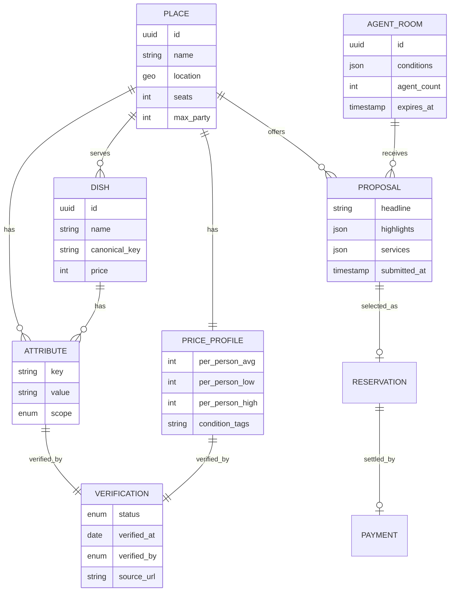
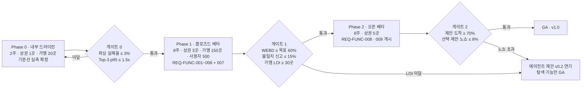

# [SRS 문서] AI-Place-Mate (한글)

# 소프트웨어 요구사항 명세서 (SRS)

**문서 ID:** SRS-AIPLACE-MVP-001

**개정 버전:** 1.0

**날짜:** 2026-08-24

**표준:** ISO/IEC/IEEE 29148:2018

**상위 문서:** AI 장소 큐레이션 PRD v1.0 (`ai-place-prd-v1_0.md`)

---

## 문서 구성 안내

본 문서의 **1–7장은 사내 SRS 양식**(AD-Core-Platform SRS)을 그대로 따른다. **8–14장은 PRD v1.0이 이미 확정한 내용 중 해당 양식에 대응 절이 없는 것**을 ISO/IEC/IEEE 29148:2018 §9.6에 근거해 확장한 장이다.

| 장 | 구분 | 근거 |
| --- | --- | --- |
| 1 ~ 7 | 사내 표준 양식 | AD-Core-Platform SRS 양식 |
| 8. 사용자 특성 | 확장 | 29148 §9.6.6 User characteristics |
| 9. 수용 기준 명세 | 확장 | 29148 §9.6.10 d) Specified requirements |
| 10. 검증 및 확인 계획 | 확장 | 29148 §9.6.19 Verification |
| 11. 제약 사항 | 확장 | 29148 §9.6.7 Limitations |
| 12. 가정 및 의존성 | 확장 | 29148 §9.6.8 Assumptions and dependencies |
| 13. 설계 제약 (ADR) | 확장 | 29148 §9.6.16 Design constraints |
| 14. 요구사항 배분 및 릴리스 계획 | 확장 | 29148 §9.6.9 Apportioning of requirements |

확장은 **PRD가 이미 정한 내용에 한정**한다. PRD에 없는 항목은 신설하지 않으며, 양식상 필요하나 PRD가 정하지 않은 값은 `미정`으로 표기한다.

---

## 1. 서론

### 1.1 목적

본 문서는 ISO/IEC/IEEE 29148:2018 표준에 따라, **자연어 또는 구조화 조건을 입력하면 선정 근거가 붙은 장소 후보 3곳을 반환하는 AI 장소 큐레이션 서비스**의 소프트웨어 요구사항을 정의한다.

본 시스템이 대체하는 현행 경로는 지도앱 목록 스크롤 → 리뷰·블로그 확인 → 메뉴판 사진 확대·합산으로 이어지는 다채널 탐색이며, 이 경로에서 발생하는 **탐색 노동 12분·외부 채널 4개**를 **60초·채널 1개**로 축소하는 것이 본 소프트웨어의 존재 이유이다.

### 1.2 범위

**대상 릴리스는 제품 v0.1(MVP)** 이며, 기능 아홉 개(F1–F9)로 구성된다.

**In Scope**

- 자연어 1줄 및 구조화 조건 입력을 통한 **조건 파싱**
- **인당 가격대·메뉴 옵션 필터** 및 인당 예상가의 범위 표기
- 가게 단위가 아닌 **메뉴(dish) 단위 색인 및 검색**
- 상황 속성(1인석·소음·체류 허용 등) 필터
- 후보마다 **선정 이유·근거 속성·확인 일자·확인 주체**를 표기하는 근거 체계
- **Top-3 고정 반환** 및 공유 카드 생성
- 매장 에이전트 콘솔과 **에이전트 소환·단체 대화방 제안 수집** (Phase 2)
- 예약 승계와 **주문량 기반 선결제·환불·정산** (Phase 1 말 착수)
- 성분·접근성 속성은 **스키마 필드만** 확보
- 대상 지역은 수도권 상권 3곳(Phase 1) → 5곳(Phase 2)
- 1차 유통 형태는 **네이버 지도 내 별도 탭**, 독립 모바일 웹을 병행

**Out of Scope**

- 다지점 공정 지점 산출 및 경로 API 연동
- 리뷰 수집·분류 파이프라인 전체(리뷰 3축 재가공)
- 전화 대행형 AI 예약 에이전트
- 성분·접근성 데이터의 전국 커버리지
- 광고 상품 — **노출 순서를 판매하지 않는다**
- 결제·정산 자체 구축 (PG 위탁)

### 1.3 정의, 약어, 축약어

| 용어 | 정의 |
| --- | --- |
| WEBD | Weekly Evidence-Backed Decisions. 조건 2개 이상 입력 → Top-3 수신 → 1곳 선택까지 완주한 주간 세션 수. 본 시스템의 북극성 지표 |
| Top-3 | 조건에 부합하는 장소 후보 3개. 개수는 고정이며 페이지네이션을 제공하지 않는다 |
| Dish | 장소가 취급하는 개별 메뉴. 색인의 기본 단위 |
| canonical_key | 메뉴명 정규화 키. '물냉면/평양냉면/냉면'을 동일 키로 묶는다 |
| Attribute | 장소 또는 메뉴에 부여되는 사실 속성. `scope` 로 `place`/`dish` 를 구분한다 |
| Verification | 속성의 확인 상태를 담는 별도 엔터티. 확인 일자·확인 주체·출처를 보유한다 |
| 근거 표기 | 후보 카드에 선정 이유 1줄·근거 속성·확인 일자·확인 주체 네 항목을 모두 표시하는 것 |
| 판정 금지 원칙 | 기준이 사람마다 다른 조건에 대해 시스템이 적합/부적합을 판정하지 않고 판단 재료만 노출하는 원칙 |
| 에이전트 소환 | 이용자 조건에 맞는 매장 에이전트 3–5곳을 하나의 대화방에 불러 모으는 동작 |
| Proposal | 매장 에이전트가 대화방에 제출하는 제안. 등록된 Attribute를 참조하며 가격 협상 필드를 갖지 않는다 |
| 선결제 | 선택된 제안의 주문량을 기준으로 방문 전 결제하는 방식. 노쇼 손실을 흡수한다 |
| SP | Sprint. 본 문서에서 1 SP = 2주 |
| MSCW | Must / Should / Could / Won't 우선순위 분류 |
| p50 / p95 / p99 | 응답 시간 백분위수 |
| LCP | Largest Contentful Paint. 모바일 초기 렌더 지표 |
| RTO / RPO | Recovery Time Objective / Recovery Point Objective |

---

## 2. 이해관계자

| 역할 | 이름 / 부서 | 책임 |
| --- | --- | --- |
| 제품 책임자 (PO) | 5팀 | PRD 소유, 범위·우선순위 결정, 게이트 통과 판정 |
| 기획 분석가 | 5팀 | 요구사항 상세화, 수용 기준 정의, KPI 정의서 관리 |
| 개발팀 리드 | 백엔드 팀 리드 | 설계 검토·승인, ADR 관리, 스프린트 슬라이스 확정 |
| 개발 엔지니어 | 백엔드 / 프런트엔드 | 구현 및 단위 테스트 |
| 데이터 엔지니어 | 데이터팀 | 색인 파이프라인, 속성 신선도 배치, 이벤트 로그 적재 |
| 시스템 운영자 | 운영팀 | 배포, 모니터링 임계 관리, 장애 대응 |
| 서비스 운영자 | 운영팀 | 제안 품질 심사, 재확인 큐 처리, 불이행 신고 처리 |
| 가맹 영업 담당자 | 사업팀 | 가맹 온보딩, LOI 확보, 필수 필드 5개 충족 관리 |
| 결제·정산 담당자 | 사업팀 | PG 계약, 환불·정산 정책, PCI-DSS 준수 확인 |
| 데이터 분석가 | 데이터팀 | 계측 정의 및 카운트 규칙 관리, 주간 리포트, 기준선 실측 |

---

## 3. 시스템 맥락 및 인터페이스

- **클라이언트 애플리케이션**
    1. 네이버 지도 내 별도 탭 (1차 유통 형태)
    2. 독립 모바일 웹 `https://m.aiplace.example.com` (병행 경로)
    3. 매장 에이전트 콘솔 (공급 측 · Phase 2)
- **내부 마이크로서비스**
    - Index Service : 속성·dish 단위 공통 색인, canonical_key 정규화, 신선도 관리
    - Query Service : 자연어 파싱, 구조화 조건 필터, 폴백 처리
    - Evidence Service : 근거 문장 생성, Verification 조회, 공유 카드 생성
    - Ranking Service : Top-3 선정 및 비교 축 정리
    - Reservation & Payment Service : 제안 승계, 예약, 주문량 기반 결제·환불·정산
    - Agent Room Service : 에이전트 소환, 대화방 수명 관리, 제안 수집·정렬
    - Merchant Console Service : 매장 프로필·수용 조건 등록, 제안 발신
    - Analytics Service : 이벤트 수집, 퍼널·커버리지·신선도 집계
- **외부 시스템**
    - PG (주문량 기반 결제·부분 환불)
    - 네이버 지도 플랫폼 (탭 노출·유입)
    - 지도·경로 API — **v0.1 미사용**, v0.2에서 접근성 가중치와 함께 도입
    - 실시간 매장 상태 공급 사업자 — 제휴 검토 단계

---

## 4. 구체적 요구사항

### 4.1 기능 요구사항

| ID | 제목 | 출처 | 우선순위 | 유형 | 검증 방식 | 인수 기준 | 상태 | 담당자 |
| --- | --- | --- | --- | --- | --- | --- | --- | --- |
| **REQ-FUNC-001** | 속성·dish 단위 공통 색인 | PRD v1.0 §4.1 F1 · ADR-001 | Must Have | Functional | 1) 색인 단위 스키마 검증<br>2) canonical_key 정규화 테스트<br>3) 커버리지 배치 검증 | 색인의 기본 단위는 place가 아니라 dish + attribute여야 한다. 장소→메뉴→가격→속성→확인 상태→확인 일자가 하나의 색인에서 조회되어야 하며, 조건 검색 성공률이 **0% → 90%** 이상이어야 한다 | Proposed | 데이터 엔지니어 |
| **REQ-FUNC-002** | 인당 가격대 · 메뉴 옵션 필터 | PRD v1.0 §4.1 F2 · US-1 | Must Have | Functional | 1) 예산 상한 필터 테스트<br>2) 예상가 범위 표기 검증<br>3) 사후 편차 반영 테스트 | 모든 후보 카드에 인당 예상가와 오차 범위를 표기해야 한다. 표기율 **100%**, 범위 폭 **≤ ±20%**, 예산 초과 매장은 기본 결과에서 제외하고 '예산 초과 N곳'으로만 요약하며 오탐률 **≤ 3%** | Proposed | 개발 엔지니어 |
| **REQ-FUNC-003** | 대표 메뉴 단위 추천 | PRD v1.0 §4.1 F3 · US-2 | Must Have | Functional | 1) 메뉴명 질의 정답률 측정<br>2) 유사 메뉴 대체 테스트<br>3) 반경 확대 폴백 테스트 | 메뉴명 하나만 입력해도 업종 목록이 아니라 해당 메뉴를 취급하는 매장 Top-3를 반환해야 한다. 정답 반환률 **≥ 92%**, 빈 결과 반환률 **≤ 2%** | Proposed | 개발 엔지니어 |
| **REQ-FUNC-004** | 자연어 상황 검색 및 폴백 | PRD v1.0 §4.1 F4 · US-1 AC5 | Must Have | Functional | 1) 파싱 정확도 테스트<br>2) 폴백 전환 테스트<br>3) 판정 금지 원칙 검토 | 자연어 1줄로 조건을 입력할 수 있어야 하며, 파싱 실패 시 빈 화면 대신 구조화 필터 UI로 전환해야 한다. 파싱 실패율 **≤ 1.5%**, 빈 화면 노출 **0건** | Proposed | 개발 엔지니어 |
| **REQ-FUNC-005** | 근거·출처 표기 및 공유 카드 | PRD v1.0 §4.1 F5 · ADR-002 · US-3 | Must Have | Functional | 1) 4항목 표기 검증기<br>2) 90일 경과 경고 테스트<br>3) 공유 카드 생성 테스트 | 모든 후보 카드에 선정 이유 1줄·근거 속성·확인 일자·확인 주체 **네 항목을 모두** 표시해야 한다. 표기율 **100%**, 경고 누락률 **0%**, 판정형 문구 **0건**, 공유 카드 생성 p95 **≤ 3,000ms** | Proposed | 개발 엔지니어 |
| **REQ-FUNC-006** | 근거 있는 Top-3 제시 | PRD v1.0 §4.1 F6 · ADR-003 | Must Have | Functional | 1) 후보 수 고정 테스트<br>2) 근거 누락 차단 테스트<br>3) 비교 축 표기 검토 | 후보를 **정확히 3개** 반환하고 페이지네이션을 제공하지 않아야 한다. 근거가 없는 후보는 반환하지 않으며, 비교 축과 근거를 함께 제시해 결정 시간을 **−20%** 단축해야 한다 | Proposed | 개발 엔지니어 |
| **REQ-FUNC-007** | 선택·예약 및 주문량 기반 결제 | PRD v1.0 §4.1 F9 · US-4 | Should Have | Functional | 1) 조건 승계 테스트<br>2) 결제·환불 연동 테스트<br>3) 노쇼 판정 테스트 | 선택한 제안의 인원·메뉴 구성·시간이 예약 화면으로 자동 승계되어야 한다. 재입력 필드 **0개**, 승계 누락률 **≤ 0.5%**, 금액 산출 오류율 **≤ 0.3%**, 환불 실패율 **≤ 0.5%**, 노쇼 오판정률 **≤ 1%** | Proposed | 결제·정산 담당자 |
| **REQ-FUNC-008** | 매장 에이전트 콘솔 | PRD v1.0 §4.1 F8 · US-5 | Could Have | Functional | 1) 프로필 등록 플로우 테스트<br>2) 수용 조건 매칭 테스트<br>3) 근거 없는 문구 차단 테스트 | 분위기·강점·제공 가능한 서비스·수용 조건을 항목별로 등록할 수 있어야 한다. 설정 화면 **≤ 3개**, 필수 항목 **≤ 5개**, 부적합 소환률 **≤ 5%**, 근거 없는 제안 문구 **0건** | Proposed | 개발 엔지니어 |
| **REQ-FUNC-009** | 에이전트 소환 및 단체 대화방 | PRD v1.0 §4.1 F7 · US-6 | Could Have | Functional | 1) 소환 수 검증<br>2) 마감 타이머 테스트<br>3) 제안 정렬 기준 검토 | 조건에 맞는 매장 에이전트를 **3–5곳** 소환해 하나의 대화방을 만들어야 한다. 대화방 생성 p95 **≤ 2,000ms**, 180초 내 제안 1건 이상 도착률 **85%**, 정렬 1순위는 가격이 아니라 **조건 적합도**, 가격 협상 기능 **0건** | Proposed | 개발 엔지니어 |
| **REQ-FUNC-010** | 성분·접근성 속성 필드 확보 | PRD v1.0 §4.1 F1a·F1b | Won't Have<br>(필드만) | Functional | 1) 스키마 필드 존재 검증<br>2) 판정 로직 부재 검토 | F1과 동일한 자료구조로 성분·접근성 필드를 **스키마에만** 확보해야 한다. 등록된 정보를 그대로 노출하고 시스템이 적합 여부를 **판정하지 않아야** 하며, 검증되지 않은 구간은 명시해야 한다 | Proposed | 데이터 엔지니어 |

### 4.2 비기능 요구사항

| ID | 제목 | 출처 | 우선순위 | 유형 | 검증 방식 | 인수 기준 | 상태 | 담당자 |
| --- | --- | --- | --- | --- | --- | --- | --- | --- |
| **REQ-NF-001** | 조건 파싱 + Top-3 응답 시간 | PRD v1.0 §5 성능 | Must Have | Performance | 부하 테스트 + APM 트레이스 p95/p99 측정 | 조건 수신부터 Top-3 렌더 완료까지 p95 **≤ 1,000ms**, p99 **≤ 2,000ms** 여야 한다 | Proposed | 시스템 운영자 |
| **REQ-NF-002** | 메뉴 색인 질의 성능 | PRD v1.0 §5 성능 | Must Have | Performance | 캐시 히트/미스 분리 부하 테스트 | 메뉴 색인 질의 p95 **≤ 400ms**, 캐시 히트 시 **≤ 120ms** 여야 한다 | Proposed | 데이터 엔지니어 |
| **REQ-NF-003** | 처리량 · 동시 세션 | PRD v1.0 §5 성능 | Should Have | Scalability | 피크 트래픽 재현 부하 테스트 | 피크 **3,000 RPS** 에서 REQ-NF-001·002의 목표를 유지해야 한다 | Proposed | 시스템 운영자 |
| **REQ-NF-004** | 모바일 초기 렌더 | PRD v1.0 §5 성능 | Should Have | Performance | 4G 회선 조건 Lighthouse 측정 | 모바일 초기 렌더 LCP **≤ 2.5s** (4G 기준) 여야 한다 | Proposed | 개발 엔지니어 |
| **REQ-NF-005** | 가용성 | PRD v1.0 §5 신뢰성 | Must Have | Reliability | 헬스체크 · SLA 검증 | 월 가용성 **≥ 99.5%**, 월 다운타임 **≤ 3시간 39분** 이어야 한다 | Proposed | 시스템 운영자 |
| **REQ-NF-006** | 오류율 | PRD v1.0 §5 신뢰성 | Must Have | Reliability | 게이트웨이 로그 5분 윈도 집계 | 5xx 오류율 **≤ 0.3%**, 결제 API **≤ 0.1%** 여야 한다 | Proposed | 시스템 운영자 |
| **REQ-NF-007** | 파싱 실패 및 빈 결과 열화 | PRD v1.0 §5 신뢰성 | Must Have | Reliability | 질의 로그 집계 + 폴백 전환 검증 | 조건 파싱 실패율 **≤ 1.5%** 이며 실패 시 폴백 필터로 열화해야 한다. 빈 결과 반환률 **≤ 2%** | Proposed | 개발 엔지니어 |
| **REQ-NF-008** | 데이터 신선도 | PRD v1.0 §5 신뢰성 · ADR-002 | Must Have | Reliability | 야간 배치 스캔 + 경고 표기 검증 | 가격·속성이 **90일** 초과 시 경고를 표기해야 하며, 90일 초과 속성 비율이 **20%** 를 넘으면 재확인 큐 우선순위를 상향해야 한다 | Proposed | 데이터 엔지니어 |
| **REQ-NF-009** | 복구 목표 | PRD v1.0 §5 신뢰성 | Should Have | Reliability | 장애 복구 훈련 | RTO **≤ 30분**, RPO **≤ 5분** 이어야 한다 | Proposed | 시스템 운영자 |
| **REQ-NF-010** | 개인정보 최소 수집 및 파기 | PRD v1.0 §5 보안 | Must Have | Security | 보안 감사 + 파기 배치 검증 | 참석자 출발지는 세션 종료 후 **30일 내 파기**하고 목적 외 사용을 금지한다. 식이·이동 제약은 **본인 단말에만** 저장하며 서버 전송 시 옵트인이 필수다. 회식 참석자의 **비고·개인 취향 필드는 수집하지 않는다** | Proposed | 개발팀 리드 |
| **REQ-NF-011** | 결제 보안 및 암호화 | PRD v1.0 §5 보안 | Must Have | Security | PCI-DSS 준수 확인 + 암호화 점검 | 결제는 PCI-DSS 준수 PG에 위탁하고 카드 정보를 **비보관**해야 한다. 결제·정산 데이터는 저장 시 **AES-256**, 전송 시 **TLS 1.3** 을 적용한다 | Proposed | 결제·정산 담당자 |
| **REQ-NF-012** | 접근 통제 및 감사 | PRD v1.0 §5 보안 | Must Have | Security | 접근 제어 테스트 + 감사 로그 검증 | 가맹점 콘솔에 **2FA** 를 적용하고 내부 조회를 **전량 감사 로그**로 남겨야 한다 | Proposed | 시스템 운영자 |
| **REQ-NF-013** | 세션당 추론 비용 및 캐시 효율 | PRD v1.0 §5 비용 | Must Have | Cost | 토큰 사용량 일간 집계 + 캐시 히트율 측정 | 세션당 추론 비용 **≤ 12원**(조건 파싱 + 근거 문장 생성), 속성·메뉴 조회 캐시 히트율 **≥ 70%** 여야 한다 | Proposed | 개발팀 리드 |
| **REQ-NF-014** | 단위 경제 및 운영 인력 상한 | PRD v1.0 §5 비용 | Should Have | Cost | 월간 단위 경제 리포트 | 성사 1건당 수수료가 처리 비용의 **3배** 를 초과해야 한다. 제안 품질 심사는 가맹점 **150곳당 1 FTE** 를 상한으로 한다. 외부 실시간 상태 API 도입 시 건당 단가는 **수수료의 15% 이하** 여야 한다 | Proposed | 제품 책임자 (PO) |
| **REQ-NF-015** | 모니터링 및 자동 알림 | PRD v1.0 §5.5 | Must Have | Observability | 알림 임계 도달 시 채널 수신 검증 | §10.3의 10개 관측 항목 전부에 대해 수집 방식·알림 임계·채널·대응 절차가 정의되어 있어야 하며, 임계 초과 시 자동 알림이 발송되어야 한다 | Proposed | 시스템 운영자 |

---

## 5. 추적성 매트릭스

| 요구사항 ID | 모듈 | 구현 클래스 | 테스트 케이스 ID |
| --- | --- | --- | --- |
| REQ-FUNC-001 | Index Service | DishAttributeIndexer · CanonicalKeyNormalizer | TC-FUNC-001 |
| REQ-FUNC-002 | Query Service | PricePlanFilter · PerPersonEstimator | TC-FUNC-002 |
| REQ-FUNC-003 | Query Service | DishQueryResolver · SimilarDishFallback | TC-FUNC-003 |
| REQ-FUNC-004 | Query Service | NaturalConditionParser · StructuredFilterFallback | TC-FUNC-004 |
| REQ-FUNC-005 | Evidence Service | EvidenceComposer · VerificationChecker · ShareCardRenderer | TC-FUNC-005 |
| REQ-FUNC-006 | Ranking Service | TopThreeSelector · ComparisonAxisBuilder | TC-FUNC-006 |
| REQ-FUNC-007 | Reservation & Payment Service | ProposalCarryOver · OrderAmountCalculator · NoShowResolver | TC-FUNC-007 |
| REQ-FUNC-008 | Merchant Console Service | MerchantProfileEditor · AcceptanceRuleMatcher · EvidenceGuard | TC-FUNC-008 |
| REQ-FUNC-009 | Agent Room Service | AgentSummoner · ProposalCollector · FitnessRanker | TC-FUNC-009 |
| REQ-FUNC-010 | Index Service | DietaryFieldSchema · AccessibilityFieldSchema | TC-FUNC-010 |
| REQ-NF-001 · 003 | API Gateway | LatencyBudgetMonitor | TC-NF-001 |
| REQ-NF-002 · 013 | Index Service | AttributeCacheLayer | TC-NF-002 |
| REQ-NF-004 | Web Client | InitialRenderProfiler | TC-NF-004 |
| REQ-NF-005 · 006 · 009 | Platform / SRE | HealthProbe · FailoverController | TC-NF-005 |
| REQ-NF-007 | Query Service | ParseFailureGuard | TC-NF-007 |
| REQ-NF-008 | Index Service | FreshnessScanBatch · ReverifyQueue | TC-NF-008 |
| REQ-NF-010 · 012 | Platform / Security | PrivacyRetentionJob · AccessAuditLogger | TC-NF-010 |
| REQ-NF-011 | Reservation & Payment Service | PgDelegationClient · PaymentCryptoPolicy | TC-NF-011 |
| REQ-NF-014 | Analytics Service | UnitEconomicsReporter | TC-NF-014 |
| REQ-NF-015 | Analytics Service | MetricAlertDispatcher | TC-NF-015 |

---

## 6. 부록

### 6.1 API 엔드포인트 목록

| 서비스 유형 | 메서드 | 엔드포인트 | 설명 |
| --- | --- | --- | --- |
| **Query Service** | POST | `/v1/query` | 자연어 1줄 또는 구조화 조건·지역·인원을 받아 근거 문장과 Verification을 포함한 Top-3 반환. p95 ≤ 1,000ms · 후보 정확히 3개 · 근거 없는 후보 반환 금지 |
| **Index Service** | GET | `/v1/places/{id}/dishes` | place id와 canonical_key 필터로 Dish 목록과 PriceProfile 조회. p95 ≤ 400ms · 캐시 TTL 6시간 |
| **Evidence Service** | POST | `/v1/share-cards` | 선택한 후보 id와 조건 요약으로 공유 카드(이미지 URL + 딥링크) 생성. p95 ≤ 3,000ms · 근거 4항목 누락 시 400 반환 |
| **Agent Room Service** | POST | `/v1/agent-rooms` | 카테고리·지역·조건 json·만료 180s를 받아 대화방 생성. 소환 3–5곳 · 0곳이면 즉시 미개시 응답 · 조건 2개 이상 필수 |
| **Agent Room Service** | POST | `/v1/proposals` | room id·headline·highlights·services를 받아 제안 등록. 등록 속성으로 뒷받침되지 않는 문구는 400 반환 · 가격 협상 필드 없음 |
| **외부 — PG** | — | 주문량 기반 결제 | 금액·예약 id로 승인/취소/환불 처리. 오류율 ≤ 0.1% · 카드 정보 비보관 · 환불 ≤ 24h |
| **외부 — 지도·경로** | — | 대중교통 소요시간 | 좌표·시각으로 소요시간 조회. **v0.1 미사용** — 지역 직접 지정. v0.2에서 접근성 가중치와 함께 도입 |
| **외부 — 매장 상태** | — | 대기·좌석 상태 | place id로 실시간 상태 조회. 제휴 검토 단계 · 단가 ≤ 수수료의 15% |

### 6.2 데이터 모델 정의



**주요 필드 규칙**

| 엔터티 | 필수 필드 | 제약 |
| --- | --- | --- |
| **Dish** | `canonical_key` | 메뉴명 정규화 키. '물냉면/평양냉면/냉면'을 동일 키로 묶어 정답률 92%를 만든다 |
| **PriceProfile** | `per_person_low/high` | 단일 값 금지. 범위 폭 ≤ ±20% |
| **Attribute** | `scope` | `place` / `dish` 구분. 성분(F1a)·접근성(F1b) 필드를 같은 테이블에 사전 확보 |
| **Verification** | `verified_at` · `verified_by` | 모든 노출 속성에 필수. `verified_by` 는 `owner` / `platform` / `user`. 90일 초과 시 경고 표기 |
| **Proposal** | `highlights` | 등록된 Attribute를 참조하는 배열. 근거 없는 문구 저장 금지. **가격 필드를 두지 않는다** |
| **Payment** | `order_amount` | 선택된 제안의 주문량 기준 산출. 취소 시 24시간 내 전액 환불, 노쇼 시 매장 정산 |

### 6.3 `비즈니스` 규칙 요약

1. **색인 단위**: 색인의 기본 단위는 place가 아니라 dish + attribute여야 한다 (ADR-001)
2. **근거 없는 후보 반환 금지**: 선정 이유·근거 속성·확인 일자·확인 주체 네 항목을 모두 갖추지 못한 후보는 반환하지 않는다
3. **후보 수 고정**: 후보는 정확히 3개를 반환하고 페이지네이션을 제공하지 않는다 (ADR-003)
4. **판정 금지**: 기준이 사람마다 다른 조건은 시스템이 적합 여부를 판정하지 않고 판단 재료만 노출한다
5. **신선도 경고**: 속성이 90일 이상 갱신되지 않으면 경고를 함께 표시하며, 경고 누락률은 0%여야 한다
6. **빈 화면 금지**: 파싱 실패·제안 0건·결과 0건 어느 경우에도 빈 화면을 노출하지 않고 폴백 결과를 반환한다
7. **가격 협상 부재**: 제안의 경쟁 축은 가격이 아니라 조건 적합도이며, Proposal에 가격 협상 필드를 두지 않는다
8. **선결제 적용 범위**: 선결제는 4인 이상 단체 제안에만 적용하고, 취소 시 24시간 내 전액 환불한다
9. **광고 상품 미도입**: 노출 순서를 판매하지 않는다 (ADR-004)
10. **불이행 가중치**: 제안 불이행이 신고되면 해당 매장의 소환 가중치를 하향한다

### 6.4 데이터베이스 스키마 개요

```sql
-- 핵심 테이블 요약
places                     -- 장소 기본 정보 · 좌석 · 최대 수용 인원
dishes                     -- 메뉴 단위 색인 (canonical_key 정규화)
price_profiles             -- 인당 예상가 범위 · 조건 태그
attributes                 -- 장소/메뉴 사실 속성 (scope 로 구분, 성분·접근성 필드 포함)
verifications              -- 확인 상태 · 확인 일자 · 확인 주체 · 출처 (별도 엔터티)
agent_rooms                -- 대화방 · 조건 json · 만료 시각
proposals                  -- 매장 제안 (가격 필드 없음, highlights 는 attribute 참조)
reservations               -- 예약 · 제안 승계 정보
payments                   -- 주문량 기반 결제 · 환불 · 정산
events                     -- 이벤트 로그 (파티셔닝, KPI 측정 창구)
```

---

## 7. 향후 개선 사항

현재 MVP 설계는 수도권 상권 3곳에서의 조건 검색·근거 표기·Top-3 반환에 초점을 둔다. 다음 개선 사항은 향후 버전에서 계획된다.

### 7.1 다지점 공정 지점 산출

- 경로 엔진을 도입해 참석자 출발지 기반의 공정 지점을 산출
- 접근성 가중치(F1b 필드)를 경로 계산과 함께 설계
- 지도·경로 API를 실제 연동해 대중교통 소요시간을 후보 정렬에 반영

### 7.2 리뷰 3축 재가공

- 리뷰 수집·분류 파이프라인 구축
- 맛·분위기·서비스 3축으로 재가공해 근거 속성의 보조 신호로 활용
- 리뷰량 경쟁이 아니라 **근거 품질**로 활용하는 것을 전제로 설계

### 7.3 성분·접근성 데이터 커버리지 확대

- v0.1에서 스키마 필드만 확보한 F1a·F1b를 실제 값으로 채움
- 등록 정보를 그대로 노출하는 원칙(판정 금지)을 유지한 채 커버리지만 확대
- 검증되지 않은 구간은 계속 명시하고 정확도를 약속하지 않음

### 7.4 실시간 매장 상태 연동

- 외부 공급 사업자와의 제휴로 대기·좌석 상태를 후보 카드에 반영
- 건당 단가를 수수료의 15% 이하로 유지하는 것이 도입 조건

---

# 확장 장 (Extended Clauses)

> 8장부터는 PRD v1.0이 이미 확정했으나 사내 SRS 양식에 대응 절이 없는 내용을, ISO/IEC/IEEE 29148:2018 §9.6에 근거해 확장한 장이다. 각 장 머리에 근거 조항을 밝힌다.

---

## 8. 사용자 특성

> **근거:** ISO/IEC/IEEE 29148:2018 §9.6.6 User characteristics — 의도된 사용자 집단의 일반적 특성을 기술하되, 구체적 요구사항을 서술하지 않고 **왜 그 요구사항이 뒤에서 명세되는지의 이유**를 기술한다.

### 8.1 대상 사용자 집단

| 코드 | 집단 | 이용 빈도 | 특성 | 이 특성이 낳은 요구사항 |
| --- | --- | --- | --- | --- |
| **C2** | 예산 상한형 (대학원생 등) | 주 3–5회 | 인당 예산을 먼저 정하고 움직인다. 가격 확인 행위를 **남에게 보이고 싶어 하지 않는다** | REQ-FUNC-002 — 목록 단계에서 인당 예상가를 범위로 표기 |
| **C3** | 메뉴 지목형 (직장인) | 점심 매일 | 메뉴가 먼저 떠오르고, 점심 시간 제약이 강하다. 채널을 여러 개 거칠 여유가 없다 | REQ-FUNC-003 — 메뉴명 단독 질의로 Top-3 반환 |
| **C4** | 사전 판단형 (프리랜서) | 주 3–4회 | 1인석·소음·체류 허용을 **가기 전에** 확인하고자 한다. 시스템의 판정보다 판단 재료를 원한다 | REQ-FUNC-005 — 근거 속성 노출 및 판정 금지 원칙 |
| **C1** | 근거 요구형 (모임 총무) | 월 1–2회 | 결정을 **남에게 설명해야** 하는 위치에 있다 | REQ-FUNC-005 — 선정 이유 1줄 및 공유 카드 |
| **P5** | 공급 측 로컬 사장 | 매일 | 20–40석 규모. 광고 영업의 수신자 위치에 있었고, **자기 조건을 거는 쪽**이 되기를 원한다. 화면 수가 늘면 이탈한다 | REQ-FUNC-008 — 설정 화면 3개 이하 · 필수 항목 5개 이하 |
| **A2** | 단체 조율형 (회식 총무) | 분기 | 룸·주차·법인카드·단체 수용을 전화로 확인해 왔다 | REQ-FUNC-009 — 조건 전달 후 제안 수신 |

### 8.2 스키마만 확보한 집단

| 코드 | 집단 | 처리 방침 |
| --- | --- | --- |
| **E1** | 식이 제약 보유자 | 성분 필드를 스키마에 확보하되 값은 채우지 않으며, 시스템이 안전 여부를 **판정하지 않는다** (REQ-FUNC-010) |
| **E2** | 이동 제약 보유자 | 접근성 필드를 스키마에 확보하되 정확도를 약속하지 않고, 검증되지 않은 구간을 명시한다 (REQ-FUNC-010) |

### 8.3 사용성에 영향을 주는 특성

- **입력 부담 내성이 낮다** — 필수 입력 필드를 0개로 두고 입력 단계를 1회 이하로 제한하는 요구(REQ-FUNC-003)의 근거
- **판정에 대한 불신** — 시스템이 '적합'을 선언하면 광고로 읽힌다. 근거와 확인 일자를 노출하는 요구(REQ-FUNC-005)의 근거
- **공급 측의 조작 숙련도가 낮다** — 콘솔 화면 수 상한(REQ-FUNC-008)의 근거

---

## 9. 수용 기준 명세

> **근거:** ISO/IEC/IEEE 29148:2018 §9.6.10 d) — 소프트웨어 시스템으로 들어가는 **모든 입력(stimulus)**, 나오는 **모든 출력(response)**, 그리고 입력에 대응해 수행하는 모든 기능을 기술한다. 본 장은 §4.1 기능 요구사항의 인수 기준을 Given–When–Then 형식으로 전개한 것이다.

각 수용 기준은 **정상 흐름**과 **실패 흐름**으로 구분한다. 모든 사용자 스토리는 실패 흐름을 **2건 이상** 보유한다.

### 9.1 US-1 · 예산과 조건의 동시 필터 (REQ-FUNC-001·002·004)

| AC | 구분 | Given | When | Then | SLO |
| --- | --- | --- | --- | --- | --- |
| AC1 | 정상 | 이용자가 인당 예산 상한을 입력한 상태 | 후보 목록을 요청하면 | 모든 후보 카드에 인당 예상가와 오차 범위가 표시된다 | 표기율 100% · 범위 폭 ≤ ±20% |
| AC2 | 정상 | 예산 상한이 2만원 | 인당 예상가가 2만원을 넘는 매장이 존재하면 | 기본 결과에서 제외하고 '예산 초과 N곳'으로만 요약한다 | 오탐률 ≤ 3% |
| AC3 | 정상 | '야채 무한리필' 같은 운영 조건 입력 | 조건 카테고리 사전에 등록되어 있으면 | 그 조건을 만족하는 매장만 반환한다 | 카테고리 적중률 ≥ 90% · 응답 p95 ≤ 1,000ms |
| AC4 | 정상 | 방문 후 결제 완료 | 이용자가 실제 결제액을 입력하면 | 표기 예상가와의 편차를 기록하고 다음 표기에 반영한다 | ±10% 내 비율 ≥ 80% |
| **AC5** | **실패** | 조건 사전에 없는 표현을 입력 | 시스템이 그 표현을 조건으로 해석하지 못하면 | 빈 화면 대신 **구조화 필터 UI로 전환**하고 해석하지 못한 표현을 그대로 표기한다 | 파싱 실패율 ≤ 1.5% · 빈 화면 노출 0건 |
| **AC6** | **실패** | 가격 데이터가 90일 초과 미갱신이거나 결제 표본 5건 미만 | 그 매장이 후보에 포함되면 | 인당 예상가 대신 **'가격 확인 필요'** 로 표기하고 예산 필터 판정 대상에서 제외한다 | 예상가 오표기 0건 · 제외 사유 표기율 100% |

### 9.2 US-2 · 메뉴명 단독 질의 (REQ-FUNC-003)

| AC | 구분 | Given | When | Then | SLO |
| --- | --- | --- | --- | --- | --- |
| AC1 | 정상 | 이용자가 반경 1km 안에 있음 | 검색창에 메뉴명 하나만 입력하면 | 업종 목록이 아니라 해당 메뉴를 취급하는 매장 Top-3를 반환한다 | 정답 반환률 ≥ 92% · 첫 결과 p95 ≤ 1,000ms |
| **AC2** | **실패** | 메뉴 색인에 해당 메뉴 없음 | 유사 메뉴가 3건 이상 존재하면 | '찾는 메뉴가 없어 유사 메뉴로 대체했다'를 명시하고 반환한다 | 빈 결과 반환률 ≤ 2% |
| AC3 | 정상 | 조건 입력 필드가 노출된 상태 | 추가 조건 없이 바로 검색하면 | 필수 입력 없이 결과가 반환된다 | 필수 입력 필드 0개 · 입력 단계 ≤ 1회 |
| **AC4** | **실패** | 반경 1km 안에 해당 메뉴도 유사 메뉴도 없음 | 검색이 실행되면 | 반경을 **3km로 1회 자동 확대**하고 확대 사실을 표기하며, 그래도 0건이면 인접 카테고리 Top-3를 사유와 함께 반환한다 | 결과 0건 종료 0회 · 반경 확대 표기율 100% |

### 9.3 US-3 · 근거와 확인 일자 (REQ-FUNC-005·006)

| AC | 구분 | Given | When | Then | SLO |
| --- | --- | --- | --- | --- | --- |
| AC1 | 정상 | Top-3가 반환된 상태 | 각 후보 카드를 보면 | 선정 이유 1줄 + 근거 속성 + 확인 일자 + 확인 주체가 모두 표시된다 | 4개 항목 표기율 100% |
| **AC2** | **실패** | 어떤 속성이 90일 이상 미갱신 | 그 속성이 후보 카드에 노출되면 | '확인 90일 경과' 경고를 함께 표시한다 | 경고 누락률 0% · 판정형 문구 0건 |
| AC3 | 정상 | 이용자가 후보를 하나 선택 | 공유를 요청하면 | 선정 이유와 근거를 담은 카드가 3초 내에 이미지 또는 링크로 생성된다 | 생성 p95 ≤ 3,000ms · 공유 카드 생성률 ≥ 60% |
| **AC4** | **실패** | 방문 완료 | 이용자가 '조건이 달랐다'를 신고하면 | 해당 속성의 확인 상태가 '재확인 필요'로 즉시 전환된다 | 반영 지연 ≤ 60s · 불일치 신고율 ≤ 10% |

### 9.4 US-4 · 제안 승계와 결제 (REQ-FUNC-007)

| AC | 구분 | Given | When | Then | SLO |
| --- | --- | --- | --- | --- | --- |
| AC1 | 정상 | 이용자가 제안 하나를 선택 | 예약 화면으로 넘어가면 | 제안에 담긴 인원·메뉴 구성·시간이 자동 승계된다 | 재입력 필드 0개 · 승계 누락률 ≤ 0.5% |
| AC2 | 정상 | 제안에 메뉴 구성 포함 | 이용자가 결제를 진행하면 | 주문량 기준으로 금액이 산출되고 매장에 확정이 통보된다 | 통보 지연 ≤ 30s · 금액 산출 오류율 ≤ 0.3% |
| **AC3** | **실패** | 이용자가 예약 2시간 전까지 취소 | 취소가 접수되면 | 선결제 금액을 전액 환불하고 매장에 즉시 알린다 | 환불 처리 ≤ 24h · 환불 실패율 ≤ 0.5% |
| **AC4** | **실패** | 예약 시각 경과 | 방문 확인이 없으면 | 노쇼로 기록하고 선결제 금액을 매장에 정산한다 | 선택 제안 노쇼율 ≤ 5% · 오판정률 ≤ 1% |

### 9.5 US-5 · 매장 프로필 등록 (REQ-FUNC-008)

| AC | 구분 | Given | When | Then | SLO |
| --- | --- | --- | --- | --- | --- |
| AC1 | 정상 | 사장이 에이전트 콘솔에 접속 | 가게 프로필을 작성하면 | 분위기·강점·제공 가능한 서비스·수용 조건을 항목별로 등록할 수 있다 | 설정 화면 ≤ 3개 · 필수 항목 ≤ 5개 |
| **AC2** | **실패** | 등록한 수용 조건 밖의 요청 도착 | 시스템이 매칭을 시도하면 | 해당 매장의 에이전트는 소환되지 않는다 | 부적합 소환률 ≤ 5% · 알림 무시율 ≤ 20% |
| AC3 | 정상 | 프로필 작성 완료 | 사장이 내용을 갱신하려 하면 | 기존 항목을 1회 클릭으로 불러와 수정할 수 있다 | 프로필 갱신율 ≥ 70% · 월 제안 참여율 ≥ 60% |
| **AC4** | **실패** | 사장이 강점 문구를 입력 | 등록된 사실 속성으로 뒷받침되지 않는 표현이 포함되면 | 해당 문구를 저장하지 않고 근거가 될 속성 등록을 안내한다 | 근거 없는 제안 문구 0건 |

### 9.6 US-6 · 에이전트 소환과 제안 비교 (REQ-FUNC-009)

| AC | 구분 | Given | When | Then | SLO |
| --- | --- | --- | --- | --- | --- |
| AC1 | 정상 | 이용자가 카테고리와 지역을 말함 | 시스템이 후보를 고르면 | 조건에 맞는 매장 에이전트를 3–5곳 소환해 하나의 대화방을 만든다 | 소환 수 3–5곳 · 대화방 생성 p95 ≤ 2,000ms |
| AC2 | 정상 | 대화방 형성 | 이용자가 예산·인원·상황을 적으면 | 에이전트들이 등록된 속성에 근거한 제안을 보내고 카운트다운이 노출된다 | 180초 내 제안 ≥ 1건: 85% · 첫 제안 p50 ≤ 60s |
| AC3 | 정상 | 제안 수집 완료 | 제안을 정리해 보여 주면 | 가격이 아니라 조건 적합도를 1순위로 정렬하고 비교 축과 근거를 함께 표시한다 | 근거 표기율 100% · 가격 협상 기능 0건 |
| **AC4** | **실패** | 180초 경과 | 유효 제안이 0건이면 | 빈 화면 대신 제안 없는 Top-3로 되돌리고 그 사실을 알린다 | 빈 제안 화면 노출 0건 |
| **AC5** | **실패** | 제안을 선택해 방문 | 현장에서 제안 내용이 적용되지 않으면 | 이용자 신고로 불이행이 기록되고 해당 매장의 소환 가중치가 하향된다 | 제안 이행률 ≥ 95% · 신고 처리 ≤ 48h |

---

## 10. 검증 및 확인 계획

> **근거:** ISO/IEC/IEEE 29148:2018 §9.6.19 Verification — 소프트웨어를 적격화하기 위해 계획된 **검증 접근법과 방법**을 제시하며, §9.6.10 ~ §9.6.18의 정보 항목과 **병렬로** 기술할 것을 권고한다. 본 장은 §4의 요구사항과 병렬로 성과 지표·계측 방법·릴리스 게이트를 기술한다.

### 10.1 성과 지표 및 측정 창구

북극성 지표는 **WEBD(주간 근거 기반 결정 완료 수)** 하나이며, 조건 입력·근거 제시·후보 압축·결정이 한 지표 안에서 동시에 성립해야 값이 올라간다.

| 구분 | 지표 | 기준선 | 12주 목표 | 측정 주기 | 측정 창구 (이벤트/도구) | 관련 요구사항 |
| --- | --- | --- | --- | --- | --- | --- |
| **북극성** | 주간 근거 기반 결정 완료 수 (WEBD) | 0 · 미출시 | 5,000건/주 | 주간 | 퍼널 대시보드 `session_completed` | REQ-FUNC-001 ~ 006 |
| 보조 1 | 조건 입력 완료율 | 0% · 미출시 | 70% | 주간 | `query_started` / `query_committed` | REQ-FUNC-004 · 002 |
| 보조 2 | 첫 결과 p95 응답 시간 | 게이트 0 기준 1,500ms | ≤ 1,000ms | 일간 | APM 트레이스 `/v1/query` p95 | REQ-NF-001 |
| 보조 3 | Top-3 내 선택률 | 0% · 미출시 | 45% | 주간 | `top3_rendered` / `place_selected` | REQ-FUNC-006 · 005 |
| 보조 4 | 근거 표기율 | 0% · 경쟁 3사 관찰 | 100% | 일간 | 렌더 이벤트 검증기 `evidence_complete` | REQ-FUNC-005 |
| 보조 5 | 예상가 오차 ±10% 내 비율 | 40% · 결제 영수증 대조 | 80% | 월간 | `price_feedback` | REQ-FUNC-002 |
| 보조 6 | 방문 후 조건 불일치 신고율 | 35% · 인터뷰 | ≤ 10% | 월간 | `mismatch_reported` | REQ-FUNC-001 · 005 |
| 보조 7 | 공유 카드 생성률 | 0% · 미출시 | 60% | 주간 | `share_card_created` | REQ-FUNC-005 |
| 보조 8 | 3분 내 제안 도착률 | 0% · 미출시 | 85% | 일간 | `proposal_received` | REQ-FUNC-009 · 008 |
| 보조 9 | 제안 이행률 | 0% · 미출시 | ≥ 95% | 월간 | `proposal_fulfilled` | REQ-FUNC-009 · 007 |
| 보조 10 | 선택 제안 노쇼율 | 15% · 가맹 예약 대장 | ≤ 5% | 월간 | `noshow_flagged` | REQ-FUNC-007 |
| 보조 11 | 가맹점 월 제안 참여율 | 0% · 미출시 | 60% | 월간 | `agent_proposed` | REQ-FUNC-008 |

**측정 게이트 조건** — 보조 8–11은 Phase 2에서만 측정한다. 보조 10(노쇼율)이 목표를 넘으면 REQ-FUNC-009·008의 신규 노출을 중단하고 REQ-FUNC-007을 먼저 교정한다.

### 10.2 KPI 계측 계획

MVP 단계에서는 A/B 실험 설계를 미리 확정하지 않는다. 실험은 **비교할 값이 신뢰 가능하게 세어진 뒤**에 설계해야 하므로, 본 절은 §10.1의 12개 지표 각각을 **어떤 사용자 행동으로 어떻게 세는지**만 확정한다.

#### 10.2.1 계측 기본 규칙

| 항목 | 규칙 |
| --- | --- |
| 세션 정의 | 마지막 이벤트로부터 **30분 무활동** 시 종료. 자정 경과로 분리하지 않는다 |
| 이용자 식별 | 익명 디바이스 ID를 1차 키로 쓰고, 로그인 시 사용자 ID로 소급 병합한다. 개인 식별 정보를 이벤트 속성에 담지 않는다 (REQ-NF-010) |
| 중복 제거 | 모든 이벤트에 `event_id`(UUID v4)를 부여하고 동일 `event_id` 재수신은 폐기한다 — 클라이언트 재시도로 인한 이중 계수 방지 |
| 순서 보정 | 클라이언트 `occurred_at`(발생)과 서버 `received_at`(수신)을 분리 기록하고, 집계는 `occurred_at` 기준으로 한다 |
| 지연 도착 | 최대 **48시간** 지연 도착을 허용한다. 일간 집계는 D+2에 확정하며 확정 전 값은 `provisional` 로 표기한다 |
| 타임존 | 저장은 UTC, 집계·리포트는 KST(UTC+9) |
| 봇·내부 트래픽 | 내부 IP·QA 계정·자동화 UA는 `traffic_type` 으로 분리하고 **지표 분모에서 제외**한다 |
| 측정 원장 | 이벤트명·속성·카운트 규칙의 단일 출처는 본 절이다. 변경 시 §10.1 표를 **같은 PR에서** 갱신한다 |

#### 10.2.2 이벤트 스펙

필수 속성이 하나라도 비면 이벤트를 폐기하지 않고 `incomplete` 플래그로 적재해 §10.2.5의 결측률로 집계한다.

**수요 측 — 조건 입력**

| 이벤트 | 발생 시점 (사용자 행동) | 필수 속성 | 관련 요구사항 |
| --- | --- | --- | --- |
| `query_started` | 조건 입력 필드에 **첫 입력이 들어간** 순간 | `session_id` · `entry_point`(탭/웹) · `input_mode`(자연어/구조화) | REQ-FUNC-004 |
| `query_field_committed` | 조건 하나가 **확정된** 순간 (칩 생성 또는 필드 이탈) | `field_key` · `order_index` | REQ-FUNC-002 · 004 |
| `query_abandoned` | 조건 확정 없이 **입력 화면을 벗어난** 순간 | `last_field_key` · `committed_count` · `dwell_ms` | REQ-FUNC-004 |
| `query_committed` | **검색이 실행된** 순간 | `committed_count` · `parse_status`(success/fallback) · `parse_ms` | REQ-FUNC-004 · REQ-NF-007 |
| `query_parse_failed` | 자연어 파싱이 실패해 **폴백 UI로 전환된** 순간 | `unparsed_text_len` · `fallback_shown` | REQ-NF-007 · AC5 |

**수요 측 — 후보 소비와 결정**

| 이벤트 | 발생 시점 (사용자 행동) | 필수 속성 | 관련 요구사항 |
| --- | --- | --- | --- |
| `top3_rendered` | Top-3가 **화면에 그려진** 순간 | `candidate_count` · `latency_ms` · `radius_expanded` · `substitute_used` | REQ-FUNC-006 · REQ-NF-001 |
| `evidence_complete` | 렌더된 후보 카드의 **근거 4항목 충족 여부** 검증 결과 | `place_id` · `has_reason` · `has_attribute` · `has_verified_at` · `has_verified_by` · `stale_warning` | REQ-FUNC-005 |
| `card_expanded` | 근거 문장 또는 확인 일자를 **펼친** 순간 | `place_id` · `section`(reason/verification) · `dwell_ms` | REQ-FUNC-005 |
| `place_selected` | 후보 1곳을 **선택한** 순간 | `place_id` · `rank`(1–3) · `time_to_select_ms` | REQ-FUNC-006 |
| `session_abandoned` | Top-3 수신 후 **선택 없이 이탈한** 순간 | `rendered_at` · `dwell_ms` | 보조 3 분모 보정 |
| `share_card_created` | 공유 카드 **생성이 완료된** 순간 | `place_id` · `render_ms` · `channel` | REQ-FUNC-005 |
| `session_completed` | 선택이 예약 또는 저장으로 **확정된** 순간 | `place_id` · `condition_count` · `decision_path` | 북극성 (WEBD) |

**방문 후**

| 이벤트 | 발생 시점 (사용자 행동) | 필수 속성 | 관련 요구사항 |
| --- | --- | --- | --- |
| `price_feedback` | 방문 후 **실제 결제액을 입력한** 순간 | `place_id` · `estimated_low` · `estimated_high` · `actual_amount` | REQ-FUNC-002 |
| `mismatch_reported` | 방문 후 **'조건이 달랐다'를 신고한** 순간 | `place_id` · `attribute_key` · `reverify_queued_at` | REQ-FUNC-005 · REQ-NF-008 |
| `revisit` | 이전 결정 세션이 있는 이용자가 **재진입한** 순간 | `days_since_last`(7 / 30 버킷) | 보조 3 보조 신호 |

**공급 측 — Phase 2**

| 이벤트 | 발생 시점 (사용자 행동) | 필수 속성 | 관련 요구사항 |
| --- | --- | --- | --- |
| `agent_summoned` | 매장 에이전트가 **소환 알림을 수신한** 순간 | `room_id` · `place_id` · `fitness_score` | REQ-FUNC-009 |
| `agent_proposed` | 매장이 **제안을 제출한** 순간 | `room_id` · `place_id` · `elapsed_ms` · `evidence_refs` | REQ-FUNC-008 |
| `agent_ignored` | 소환 후 **마감까지 무응답**인 순간 | `room_id` · `place_id` | 보조 11 분모 |
| `proposal_received` | 대화방에 **유효 제안이 도착한** 순간 | `room_id` · `proposal_id` · `elapsed_ms` | 보조 8 |
| `proposal_fulfilled` / `proposal_violated` | 방문 후 **제안 이행 여부가 확인된** 순간 | `proposal_id` · `reported_by` | 보조 9 |
| `noshow_flagged` | 예약 시각 경과 후 **방문 확인이 없어** 노쇼로 판정된 순간 | `reservation_id` · `judged_at` · `settled` | 보조 10 |

#### 10.2.3 지표별 카운트 규칙

§10.1의 12개 지표를 위 이벤트로 환산하는 식이다. **분모가 명시되지 않은 지표는 절대 수**다.

| 지표 | 분자 — 세는 행동 | 분모 | 중복 제거 단위 | 집계 |
| --- | --- | --- | --- | --- |
| **북극성 WEBD** | `session_completed` 세션 수. 단 **동일 세션에 `query_committed`(`committed_count` ≥ 2) · `top3_rendered` · `place_selected` 가 모두 존재**해야 집계한다 | — | 세션 | 주간 |
| 보조 1 조건 입력 완료율 | `query_committed` 중 `committed_count` ≥ 2 인 세션 | `query_started` 세션 | 세션 | 주간 |
| 보조 2 첫 결과 p95 | `top3_rendered.latency_ms` 의 p95 (APM 트레이스와 교차 검증) | — | 요청 | 일간 |
| 보조 3 Top-3 내 선택률 | `place_selected` 가 있는 세션 | `top3_rendered` 세션 | 세션 | 주간 |
| 보조 4 근거 표기율 | `evidence_complete` 의 4개 `has_*` 가 **전부 true** 인 카드 | 렌더된 카드 총수 | 카드 | 일간 |
| 보조 5 예상가 오차 ±10% 내 비율 | `abs(actual_amount − (estimated_low+estimated_high)/2) / actual_amount ≤ 0.10` 인 `price_feedback` | `price_feedback` 총수 | 피드백 | 월간 |
| 보조 6 불일치 신고율 | `mismatch_reported` 의 고유 (세션, `place_id`) 쌍 | 방문 확인된 (세션, `place_id`) 쌍 | 방문 | 월간 |
| 보조 7 공유 카드 생성률 | `share_card_created` 가 있는 결정 세션 | `session_completed` 세션 | 세션 | 주간 |
| 보조 8 3분 내 제안 도착률 | 최초 `proposal_received.elapsed_ms ≤ 180,000` 인 대화방 | 생성된 대화방 수 | 대화방 | 일간 |
| 보조 9 제안 이행률 | `proposal_fulfilled` | `proposal_fulfilled` + `proposal_violated` | 제안 | 월간 |
| 보조 10 선택 제안 노쇼율 | `noshow_flagged` | 선택 제안 기반 예약 확정 수 | 예약 | 월간 |
| 보조 11 가맹점 월 제안 참여율 | 당월 `agent_proposed` 가 1건 이상인 고유 `place_id` | 당월 활성 가맹 `place_id` | 가맹점 | 월간 |

#### 10.2.4 계측 도입 순서

| 시점 | 심는 이벤트 | 이유 |
| --- | --- | --- |
| **Phase 0** (드라이런) | 조건 입력 5개 + 후보 소비·결정 7개 | §10.1의 기준선을 실측으로 확정하는 최소 집합 |
| **Phase 1 착수 시** | `price_feedback` · `mismatch_reported` · `revisit` | 방문 후 행동은 첫 방문이 발생한 뒤에야 관측된다 |
| **Phase 2 착수 전** | 공급 측 6개 (`agent_*` · `proposal_*` · `noshow_flagged`) | 보조 8–11은 Phase 2에서만 측정한다 (§10.1) |

**계측이 선행한다** — 이벤트가 심기지 않은 지표는 §10.1의 목표값을 판정 근거로 쓰지 않는다.

#### 10.2.5 계측 품질 검증

지표가 틀리는 원인은 제품이 아니라 계측일 수 있다. 아래를 통과하지 못한 지표는 판정에 쓰지 않는다.

| 점검 항목 | 방법 | 임계 |
| --- | --- | --- |
| 이벤트 누락률 | 서버 측 기대 발생 수(예: `/v1/query` 호출 수) 대비 수신 이벤트 수 | > 2% 시 계측 결함으로 처리 |
| 필수 속성 결측률 | `incomplete` 플래그 비율 | > 1% |
| 세션 스티칭 정확도 | 로그인 전후 병합 세션의 중복 계수 검사 | 중복 > 0.5% |
| 지표 재현성 | 동일 기간 재집계 시 값 일치 여부 | 불일치 0건 |
| 스키마 변경 감지 | 이벤트 스키마 계약 테스트 (CI) | 실패 시 배포 차단 |

계측 결함이 임계를 넘는 동안 해당 지표는 `unreliable` 로 표기하고 **릴리스 게이트 판정(§10.4)에 사용하지 않는다.**

### 10.3 관측 항목 및 알림 (REQ-NF-015)

| 항목 | 수집 방식 | 알림 임계 | 채널 | 대응 |
| --- | --- | --- | --- | --- |
| 조건 파싱 실패율 | 질의 로그 · 5분 윈도 | 5분 > 3% | Slack + PagerDuty | 폴백 필터 강제 전환, 파서 모델 롤백 |
| Top-3 p95 응답 | APM 트레이스 | 10분 > 1,500ms | Slack | 캐시 워밍, 색인 샤드 확인 |
| 근거 표기 누락 | 렌더 이벤트 검증 | 1건 발생 | Slack | 해당 카드 노출 차단 — 표기 없는 후보는 내보내지 않음 |
| 빈 결과 반환률 | 질의 로그 · 시간당 | 시간당 > 4% | Slack | 유사 메뉴 임계 완화, 색인 커버리지 점검 |
| 제안 도착률 | 대화방 → 제안 매칭 | 일간 < 70% | Slack + 가맹 영업 | 대상 매장 재선정, 알림 적합도 점검 |
| 선택 제안 노쇼율 | 방문 확인 · 결제 매칭 | 주간 > 8% | Slack + 경영 리포트 | REQ-FUNC-009·008 신규 노출 중단, 선결제 정책 재검토 |
| 세션당 추론 비용 | 토큰 사용량 집계 | 일간 > 18원 | Slack | 프롬프트 축약, 캐시 정책 조정 |
| 가용성 · 5xx 오류율 | 헬스체크 · 게이트웨이 로그 | 5분 5xx > 0.3%<br>결제 API > 0.1% | PagerDuty | 장애 대응 절차 개시, 결제는 PG 이중화 경로로 전환 |
| 속성 신선도 | 야간 배치 스캔 | 90일 초과 속성 > 20% | Slack + 데이터팀 | 재확인 큐 우선순위 상향, 온보딩 인력 재배치 |
| 커버리지 | 상권별 필수 필드 5개 충족 매장 수 | 상권당 < 300곳 | Slack + 경영 리포트 | 신규 상권 확장 중단, 기존 상권 채우기에 집중 |

### 10.4 릴리스 게이트



**게이트 판정 권한은 제품 책임자(PO)에게 있으며, 게이트 0을 통과하지 못하면 Phase 1을 시작하지 않는다.**

---

## 11. 제약 사항

> **근거:** ISO/IEC/IEEE 29148:2018 §9.6.7 Limitations — 공급자의 선택지를 제한하는 항목을 기술한다. 규제 요구사항과 정책 a), 타 애플리케이션과의 인터페이스 c), 품질 요구사항 i), 안전·보안 고려사항 k), 그리고 인터페이스를 통해 유입되는 외부 시스템발 제약 m) 이 해당한다.

### 11.1 정책 및 규제 제약

| ID | 제약 | 근거 조항 | 영향 요구사항 |
| --- | --- | --- | --- |
| LIM-01 | 결제는 PCI-DSS 준수 PG에 위탁하며 카드 정보를 자체 보관하지 않는다 | §9.6.7 a) k) | REQ-NF-011 · REQ-FUNC-007 |
| LIM-02 | 개인 제약 정보(식이·이동)는 본인 단말에만 저장하고 서버 전송 시 옵트인을 요구한다 | §9.6.7 a) k) | REQ-NF-010 · REQ-FUNC-010 |
| LIM-03 | 회식 참석자의 비고·개인 취향 필드를 수집하지 않는다 | §9.6.7 a) | REQ-NF-010 |
| LIM-04 | 노출 순서를 판매하는 광고 상품을 도입하지 않는다 | §9.6.7 f) 통제 기능 | REQ-FUNC-006 · ADR-004 |

### 11.2 외부 시스템발 제약

| ID | 제약 | 근거 조항 | 영향 요구사항 |
| --- | --- | --- | --- |
| LIM-05 | 1차 유통 경로인 네이버 지도 탭의 노출·정책 결정권이 당사에 없다 | §9.6.7 c) m) | 전 기능 · ADR-005 |
| LIM-06 | 지도·경로 API를 v0.1에서 사용하지 않으므로 지역은 이용자가 직접 지정한다 | §9.6.7 c) | REQ-FUNC-004 |
| LIM-07 | 실시간 매장 상태는 외부 공급 사업자 제휴에 의존하며 건당 단가가 수수료의 15%를 넘으면 도입하지 않는다 | §9.6.7 c) m) | REQ-NF-014 |
| LIM-08 | PG 계약 체결 전까지 REQ-FUNC-007의 결제 슬라이스(S6)를 착수할 수 없다 | §9.6.7 c) | REQ-FUNC-007 |

### 11.3 품질 및 운영 제약

| ID | 제약 | 근거 조항 | 영향 요구사항 |
| --- | --- | --- | --- |
| LIM-09 | 제안 품질 심사는 사람이 수행하며 가맹점 150곳당 1 FTE를 상한으로 한다. 상한 초과 시 신규 가맹 온보딩 속도를 조절한다 | §9.6.7 i) | REQ-NF-014 · REQ-FUNC-008 |
| LIM-10 | 대상 지역을 수도권 상권 3곳(Phase 1)·5곳(Phase 2)으로 제한하며 전국 확장을 하지 않는다 | §9.6.7 i) | 전 기능 |
| LIM-11 | A/B 실험을 v0.1 범위에 포함하지 않는다 — **계측 체계 구축과 기준선 확정이 선행**한다. 실험 착수 시에도 동시 실행은 2개 이하로 제한한다 (상권 3곳 규모에서 3개 이상은 표본이 갈린다) | §9.6.7 i) | §10.2 |

### 11.4 리스크 및 완화

리스크는 **영향도 × 발생 가능성**으로 평가한다.

| ID | 리스크 | 등급 | 영향 | 완화 대책 | 연결 |
| --- | --- | --- | --- | --- | --- |
| **R1** | 매장의 제안 참여가 목표에 미달 | 치명 · 高 | REQ-FUNC-008·009가 성립하지 않고 대화방이 참여 매장 없는 빈 화면이 된다 | Phase 1 중 가맹점 30곳 사전 인터뷰 + LOI 확보를 착수 게이트로 설정. 제안 도착률 70% 미달 시 v0.2로 연기하고 탐색 기능만 출시 | ASM-02 · 게이트 1 |
| **R2** | 속성 데이터 커버리지 부족 | 치명 · 高 | 스키마가 있어도 값이 비면 Top-3가 성립하지 않는다. 상권당 최소 300곳 필요 | 상권 3곳 집중(전국 확장 금지) · 결제 데이터 기반 인당가 추정 · 외부 실시간 상태 공급자 제휴 검토 · 온보딩 필수 필드를 5개로 제한 | REQ-NF-008 · ASM-05 |
| **R3** | 자연어 조건 파싱 정확도 미달 | 중대 · 中 | REQ-FUNC-004가 실패하면 색인의 속성이 사용자에게 닿지 않는다. '조용히 혼밥'처럼 기준이 사람마다 다른 표현의 해석 오류가 불일치 신고로 이어진다 | 파싱 실패 시 구조화 필터 UI로 즉시 폴백(빈 화면 금지) · 애매한 조건은 판정하지 않고 재료만 노출 · 실패율 3% 초과 시 파서 롤백 자동화 | REQ-NF-007 · AC5 |
| **R4** | 선결제가 예약 전환을 떨어뜨림 | 중대 · 中 | 경쟁 서비스가 '0원 예약'을 내세운 시장에서 선결제 요구가 전환율을 낮춘다 | 4인 이상 단체 제안에만 선결제 적용 · 취소 시 24시간 내 전액 환불 · `noshow_flagged` 와 예약 확정 수를 병렬 관측해 노쇼율과 전환율의 교환비를 산출 | REQ-FUNC-007 · §10.2.3 보조 10 |
| **R5** | 유통 채널 사업자가 동시에 경쟁자 | 치명 · 中 | 1차 유통 형태가 네이버 지도 탭인데 해당 사업자가 같은 결정 구간을 직접 구현하면 채널이 닫힌다 | 독립 모바일 웹을 같은 스프린트에서 병행 개발 · 탭 유입 비율 주간 추적, 80% 초과 시 독립 경로 투자 확대 · 매장 에이전트 제안으로 차별화 · 상권 3곳에서 깊이로 선점 | ADR-005 · LIM-05 |
| **R6** | 제안 품질 심사 비용의 선형 증가 | 보통 · 中 | 사람이 심사하면 가맹점 수에 비례해 인력이 늘고, 느슨하게 하면 제안 카드가 광고로 변한다 | 150곳당 1 FTE 상한을 비기능 요구로 고정 · 규칙 위반 자동 탐지 후 사람이 예외만 처리 · 상한 초과 시 신규 온보딩 속도 조절 | REQ-NF-014 · LIM-09 |

---

## 12. 가정 및 의존성

> **근거:** ISO/IEC/IEEE 29148:2018 §9.6.8 Assumptions and dependencies — SRS에 기술된 요구사항에 영향을 주는 요인을 열거한다. 이 요인들은 설계 제약이 아니지만, **요인이 바뀌면 SRS의 요구사항이 바뀌어야 한다.**

### 12.1 가정

각 가정에는 그것을 반증할 수 있는 검증 장치와, 반증되었을 때 **어느 요구사항을 어떻게 바꿀지**가 지정되어 있다.

| ID | 가정 | 검증 장치 | 반증 시 요구사항 변경 |
| --- | --- | --- | --- |
| **ASM-01** | 인당 예산 상한을 두는 이용자가 수도권 20–34세에서 과반이다 | Phase 0 온보딩 설문 (n=200) | REQ-FUNC-002를 필터가 아닌 **표기 전용**으로 축소 |
| **ASM-02** | 매장은 자기 강점·서비스를 대화방에서 제안할 의향이 있다 | 게이트 1 — 가맹 LOI 30곳 (R1) | REQ-FUNC-008·009를 **v0.2로 연기**, 탐색 기능만 GA |
| **ASM-03** | 후보 3개는 목록 20개보다 선택률이 높다 | 보조 3(Top-3 내 선택률)과 `place_selected.time_to_select_ms` 관측 (§10.2.3) | REQ-FUNC-006의 후보 수를 5개로 조정하고 ADR-003 재검토 |
| **ASM-04** | 근거 표기가 선택률과 재방문을 올린다 | `card_expanded` 확장률 · 보조 3 · `revisit`(7/30일) 관측 (§10.2.3) | REQ-FUNC-005의 근거를 **접힘 기본**으로 변경해 렌더 비용 절감 |
| **ASM-05** | 결제 데이터로 인당가를 ±20% 내로 추정할 수 있다 | Phase 0 커버리지 실측 (R2) | 가맹 **직접 입력**으로 전환하고 온보딩 필수 필드에 추가 |

### 12.2 외부 의존성

| ID | 의존 대상 | 내용 | 미충족 시 영향 |
| --- | --- | --- | --- |
| **DEP-01** | PG 사업자 | 주문량 기반 결제 및 부분 환불 지원 계약 | REQ-FUNC-007의 결제 슬라이스(S6) 착수 불가 |
| **DEP-02** | 가맹 온보딩 인력 | 상권당 1명 | R2의 커버리지 300곳 미달 → REQ-FUNC-001·002 결과 품질 저하 |
| **DEP-03** | 상권 3곳 데이터 | 필수 필드 5개 기준 충족 | 게이트 0 통과 불가 |
| **DEP-04** | 네이버 지도 플랫폼 | 탭 노출 승인 및 유지 | 1차 유통 경로 상실 → ADR-005의 독립 경로로 전환 |

### 12.3 검증 우선순위

1. **Phase 0 기준선 확정** — §10.1의 기준선을 드라이런 실측으로 확정한다. 목표값이 크게 어긋나면 지표 표를 먼저 교정한다
2. **경쟁 3사 수동 벤치마크** — 동일 과업을 직접 수행해 대안 대비 배수 주장을 실증하거나 문서에서 내린다. 계측이 아니라 사람이 수행하므로 출시 전에 착수할 수 있다
3. **가맹점 30곳 LOI** — ASM-02가 반증되면 REQ-FUNC-008·009를 v0.2로 연기한다

**셋 중 3이 최우선이다.** 1·2는 제품을 교정하는 문제이고, 3은 사업 모델의 성립 여부에 관한 문제다.

---

## 13. 설계 제약 (ADR)

> **근거:** ISO/IEC/IEEE 29148:2018 §9.6.16 Design constraints — 다른 표준, 하드웨어 한계 등에서 비롯되어 설계 선택지를 구속하는 제약을 기술한다. 본 장은 제품 구조 결정을 **되돌리는 비용과 함께** 기록한 것으로, 되돌림 비용이 큰 순서로 나열한다.

| ID | 결정 | 맥락 — 왜 결정이 필요했나 | 채택 근거 | 기각한 대안 | 되돌림 비용 | 검증 장치 |
| --- | --- | --- | --- | --- | --- | --- |
| **ADR-001** | 색인 단위를 place가 아니라 **dish + attribute**로 둔다 | 메뉴명 정답 반환률 0%의 원인이 랭킹이 아니라 색인 단위였다. 가게 단위 색인 위에서는 메뉴 질의가 원리적으로 풀리지 않는다 | 경쟁 3사가 모두 place 색인이라 메뉴 질의에서 동일하게 실패한다 — 색인 단위 자체가 차별 축 | ① place 색인 + 메뉴 텍스트 검색 보강 → 정답률 상한이 낮음<br>② 외부 메뉴 DB 구매 → 갱신 주기 통제 불가 | **최대** — 전면 재색인 + REQ-FUNC-002~005 전부 재작업 | 정답률 ≥ 92% (보조 2·3) |
| **ADR-002** | Verification을 **별도 엔터티**로 분리한다 | 근거 표기는 값과 함께 누가 언제 확인했는지를 요구한다. 속성 테이블 컬럼으로 붙이면 속성마다 확인 이력이 갈라진다 | 90일 경과 경고·재확인 큐·불일치 신고가 한 엔터티에서 처리된다 | 속성 테이블에 `verified_at` 컬럼 추가 → 속성별 이력 추적 및 재확인 큐 구현 불가 | **높음** — 스키마 마이그레이션 + REQ-FUNC-005 렌더 로직 재작성 | 근거 표기율 100% (보조 4) |
| **ADR-003** | 후보 수를 **3개로 고정**하고 페이지네이션을 제공하지 않는다 | 경쟁사가 전부 '목록을 길게'로 경쟁하며 그 결과가 스크롤 길이를 늘리는 제품이다. 후보 수는 화면 설계 선택이라 되돌릴 수 있어야 한다 | 결정 시간 −20%가 목표이고, 후보를 늘리면 WEBD가 아니라 체류 시간이 올라간다 | ① 5개 + 더보기<br>② 20개 목록 — 둘 다 현행 경로와 같아져 차별 축이 소멸 | **낮음** — 렌더 파라미터 변경 수준 | 보조 3 선택률 · 결정 소요 시간 (§10.2.3) — 목표 미달 시 5개로 조정 |
| **ADR-004** | v0.1에서 **광고 상품을 도입하지 않는다** | 근거 표기가 신뢰를 만드는 축인데, 노출 순서를 팔면 '추천이 광고로 읽힘'이 그대로 재현된다 | 노출 판매 모델의 정체가 공개 실적으로 확인된다 (서치플랫폼 4Q −0.5% vs 커머스 +36%) | 초기 수익을 위한 상단 광고 슬롯 → 차별 가치의 전제가 무너짐 | **중간** — 수익 모델 재설계 + 근거 표기 정책 재검토 | 추천 신뢰 응답률 (Phase 0 설문) |
| **ADR-005** | 1차 유통을 **네이버 지도 내 탭**으로 하되 독립 모바일 웹을 같은 스프린트에서 병행한다 | 새 앱 설치 없이 진입하는 것이 탐색 노동 12분→60초의 전제다. 동시에 채널 소유권이 당사에 없다 (R5) | 설치 장벽 제거 효과가 크고, 병행 개발 비용이 채널 폐쇄 리스크보다 작다 | ① 탭 단독 → 채널이 닫히면 제품이 사라짐<br>② 독립 앱 단독 → 설치 장벽으로 초기 학습 속도 상실 | **중간** — 유통 경로 전환 + 유입 재확보 | 탭 유입 비율 주간 추적 — 80% 초과 시 독립 경로 투자 확대 |

---

## 14. 요구사항 배분 및 릴리스 계획

> **근거:** ISO/IEC/IEEE 29148:2018 §9.6.9 Apportioning of requirements — 소프트웨어 요구사항을 소프트웨어 요소에 배분하고, **기능과 소프트웨어 요소의 교차 참조 표**로 배분을 요약한다. 또한 **향후 버전으로 연기될 수 있는 요구사항을 식별**한다.

### 14.1 요구사항 · 소프트웨어 요소 배분

1 SP = 2주. 모든 요구사항은 **단일 슬라이스가 1 SP를 넘지 않도록** 분해했다.

| 요구사항 ID | 우선순위 | Phase | 공수 | 슬라이스 | 선행 요구사항 |
| --- | --- | --- | --- | --- | --- |
| REQ-FUNC-001 | Must | P1 | 2 SP | S0 스키마 확정 / S1 색인 파이프라인 | — |
| REQ-FUNC-002 | Must | P1 | 1 SP | S2 | REQ-FUNC-001 |
| REQ-FUNC-003 | Must | P1 | 1 SP | S2 | REQ-FUNC-001 |
| REQ-FUNC-004 | Must | P1 | 1 SP | S3 | REQ-FUNC-001 |
| REQ-FUNC-005 | Must | P1 | 1 SP | S3 | REQ-FUNC-001 |
| REQ-FUNC-006 | Must | P1 | 1 SP | S4 | REQ-FUNC-002 · 003 · 004 · 005 |
| REQ-FUNC-007 | Should | P1 말 | 2 SP | S5 예약 승계 / S6 PG 결제·환불 | REQ-FUNC-006 · DEP-01 |
| REQ-FUNC-008 | Could | P2 | 1 SP | S7 | REQ-FUNC-007 |
| REQ-FUNC-009 | Could | P2 | 1 SP | S8 | REQ-FUNC-001 · 006 · 007 · 008 |
| REQ-FUNC-010 | Won't (필드만) | P1 | — | REQ-FUNC-001의 S0에 포함 | — |

**병목** — REQ-FUNC-001이 밀리면 여섯 개가 함께 밀리고, REQ-FUNC-007이 밀리면 두 개가 함께 밀린다. Could 우선순위인 REQ-FUNC-008·009는 각각 **1 SP 안에 구현 가능한 범위**로 정의되어 있다.

### 14.2 향후 버전으로 연기하는 요구사항

> §9.6.9의 "향후 버전으로 연기될 수 있는 요구사항 식별" 요건에 따른다.

| 항목 | 연기 대상 | 연기 사유 |
| --- | --- | --- |
| 다지점 공정 지점 산출 | v0.2+ | v0.1은 이용자가 지역을 직접 지정한다. 경로 엔진 착수 시 접근성 가중치와 함께 설계한다 (§7.1) |
| 리뷰 3축 재가공 | v0.2+ | 리뷰량 경쟁 경로의 수익성 한계가 공개 실적에서 확인되었다 (§7.2) |
| AI 예약 에이전트 | v0.2+ | 해결이 매장 응대라는 제3자 행동에 달려 있어 자체 코드로 품질을 보증할 수 없다 |
| 성분·접근성 데이터 커버리지 | v0.2+ | v0.1은 스키마 필드만 확보한다 (REQ-FUNC-010 · §7.3) |
| 광고 상품 | 도입 계획 없음 | ADR-004에 따라 노출 순서를 판매하지 않는다 |
| 결제·정산 자체 구축 | 도입 계획 없음 | PG 위탁 (LIM-01) |

### 14.3 PRD 대응 관계

| SRS 위치 | PRD v1.0 출처 |
| --- | --- |
| §1.2 범위 | §7 SCOPE (In / Out of Scope) |
| §4.1 기능 요구사항 | §4.1 MSCW 우선순위와 근거 (F1–F9 · F1a · F1b) |
| §4.2 비기능 요구사항 | §5 비기능 요구사항 (성능 · 신뢰성 · 보안 · 비용) |
| §6.1 API | §6.3 API 개요 |
| §6.2 데이터 모델 | §6.1 핵심 엔터티 · §6.2 주요 필드 규칙 |
| §8 사용자 특성 | §2 핵심 페르소나와 여정 Pain |
| §9 수용 기준 명세 | §3 사용자 스토리 US-1 ~ US-6 |
| §10.1 성과 지표 | §1.3 북극성 KPI와 보조 KPI |
| §10.2 계측 계획 | §9 수립할 측정 체계 (행동 감지 · 통계 추출) |
| §10.4 릴리스 게이트 | §8 단계별 출시 |
| §10.3 관측 항목 | §5.5 모니터링 |
| §11.4 리스크 | §7.2 리스크 |
| §12 가정 및 의존성 | §7.3 가정 · 외부 의존성 |
| §13 ADR | §7.4 ADR |
| §14 배분 | §4.1 공수 · 슬라이스 · §4.2 기능 의존성 |

---

**SRS-AIPLACE-MVP-001 · v1.0 · 2026-08-24 · Owner 5팀**
