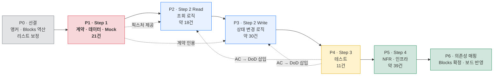

# [분석] 태스크 추출 방법론 적합성 평가

**문서 ID:** ANL-AIPLACE-TASK-001

**날짜:** 2026-08-25

**평가 대상:** TASK-AIPLACE-MVP-001 (`[태스크 리스트] AI-Place-Mate.md` · 97건)

**평가 기준:** 4단계 태스크 추출 방법론 (계약·데이터 → 로직 → 테스트 → NFR·의존성)

---

## 1. 요약

현재 태스크 리스트는 **방법론의 Step 2(로직)와 Step 4(NFR·인프라)에는 충분히 대응하지만, Step 1의 절반과 Step 3 전체가 비어 있다.**

| Step | 방법론이 요구하는 것 | 현재 상태 | 판정 |
| --- | --- | --- | --- |
| **1** | 데이터베이스 Task | DAT-001 ~ 004 (4건) | ✅ 충족 |
| **1** | API·통신 계약 Task (DTO · 에러 코드) | **독립 태스크 없음** — 기능 태스크에 묻힘 | ❌ 미충족 |
| **1** | Mock 데이터 Task | **0건** | ❌ 미충족 |
| **2** | Read (Query) Task 분리 | 48건 존재하나 **Read/Write 구분 열 없음** | ⚠️ 부분 충족 |
| **2** | Write (Command) Task 분리 | 위와 동일 | ⚠️ 부분 충족 |
| **3** | AC → 테스트 코드 작성 Task | **0건** | ❌ 미충족 |
| **4** | 인프라·보안·성능 Task | 27건 존재. 단 **성능 검증 수단 없음** | ⚠️ 부분 충족 |
| **4** | 의존성 매핑 (`Depends on` / `Blocks`) | `Depends on`만 존재. **`Blocks` 열 없음** | ⚠️ 부분 충족 |

**측정 근거** — 문서 전문 키워드 검사 결과: `테스트` 0회 · `Mock` 0회 · `DTO` 0회 · `에러 코드` 0회 · `부하`/`k6` 0회 · `계약` 2회.

**결론:** 현재 리스트를 그대로 풀버전으로 확장하면 **테스트 태스크가 영원히 생기지 않고**, 프론트엔드 작업이 백엔드 완성을 기다리는 직렬 구조가 된다. 본문 작성 전에 **태스크 리스트를 먼저 보정**해야 한다.

---

## 2. Step별 상세 평가

### 2.1 Step 1 — 계약·규약 및 데이터 명세

#### 추출 대상 1: 데이터베이스 Task — ✅ 충족

| 태스크 | 내용 | SRS 근거 |
| --- | --- | --- |
| DAT-001 | `Place` · `Dish` · `PriceProfile` 스키마 | §6.2 |
| DAT-002 | `Attribute` · `Verification` 스키마 | §6.2 |
| DAT-003 | `AgentRoom` · `Proposal` · `Reservation` · `Payment` 스키마 | §6.2 |
| DAT-004 | `Event` 스키마 및 파티셔닝 마이그레이션 | §6.2 · §10.2 |

방법론의 예시(`[DB] User 및 Profile 테이블 스키마, 마이그레이션 스크립트 작성`)와 **입도가 일치**한다. 수정 불필요.

#### 추출 대상 2: API 및 통신 계약 Task — ❌ 미충족

방법론은 `[API Spec] Auth 도메인 Request/Response DTO 및 에러 코드 정의`처럼 **계약을 독립 태스크로** 뽑을 것을 요구한다. 현재 리스트에는 이런 태스크가 없다.

**계약이 실제로 존재하는 곳** — SRS에는 있으나 태스크로 승격되지 않았다.

| 계약 | SRS 위치 | 현재 어디에 묻혀 있나 |
| --- | --- | --- |
| Server Action 9종 입출력 | §6.1 Server Actions | 각 기능 태스크(QRY-005, RSV-001 …) 내부 |
| Route Handler 8종 요청·응답 | §6.1 Route Handlers | ANA-002, RSV-004, EVD-004 내부 |
| `ConditionSet` 스키마 (LLM 구조화 출력) | §6.6 · REQ-TEC-010 | QRY-003 내부 |
| 에러 코드 체계 (400 · 409 · 폴백 신호) | §6.1 · §6.3-6 | **어디에도 없음** |
| 이벤트 계약 20종 | §10.2 | ANA-001 (Analytics Epic에 묻힘) |
| 모듈 공개 표면 | §3.3 · REQ-TEC-002 | TEC-001 (게이트 Epic에 묻힘) |

**영향** — 계약이 기능 태스크 안에 있으면 **두 태스크가 같은 계약을 서로 다르게 구현**해도 탐지되지 않는다. 예: `submitQuery`의 반환 타입과 결과 RSC가 기대하는 타입이 어긋나도 계약 태스크가 없으면 어디서 틀렸는지 지목할 수 없다.

#### 추출 대상 3: Mock 데이터 Task — ❌ 미충족 (0건)

방법론의 목적은 **프론트엔드가 백엔드 완성을 기다리지 않게** 하는 것이다. 현재 리스트에는 Mock 태스크가 하나도 없고, 그 결과 의존성이 직렬로 묶여 있다.

```
현재:  DAT-006 색인 → QRY-007 필터 → RNK-001 선정 → RNK-003 렌더 → UX 검증
        (UI 작업이 색인 파이프라인 완성까지 대기)

Mock 도입 시:  MCK-001 Top-3 픽스처 ─┬→ RNK-003 렌더 (병행 가능)
                                     └→ UX-006 카드 디자인 검증
```

**본 프로젝트에서 특히 중요한 이유** — SRS의 "빈 화면 금지"(§6.3-6)와 "근거 없는 후보 반환 금지"(§6.3-2)는 **실패·경계 상태의 UI**를 요구한다. 실제 데이터로는 이 상태를 만들기 어렵다. 근거 4항목 중 하나가 빠진 후보, 제안 0건인 대화방, 90일 경과 속성 — 전부 픽스처가 있어야 개발·검증할 수 있다.

### 2.2 Step 2 — 로직 및 상태 변경 (CQRS) — ⚠️ 부분 충족

로직 태스크 **48건**이 존재하고 입도도 적절하다. 문제는 **Read/Write 구분이 문서에 없다**는 것이다.

**구분 자체는 가능하다** — SRS §6.1이 이미 그 기준을 정해 두었다.

| SRS의 구현 단위 | CQRS 대응 | 예 |
| --- | --- | --- |
| RSC 직접 조회 | **Read (Query)** | QRY-007 가격 필터 · RNK-001 Top-3 선정 · EVD-002 4항목 검증 |
| Server Action | **Write (Command)** | QRY-005 `submitQuery` · RSV-003 `requestPayment` · MCH-004 프로필 저장 |
| Route Handler (웹훅·Cron) | **Write (Command)** | RSV-004 PG 웹훅 · DAT-010 신선도 Cron |
| Route Handler (GET) | **Read (Query)** | EVD-004 공유 카드 OG |

키워드 기준 추정으로 Write성 21건 · Read성 12건이 식별되나, **나머지 64건은 유형 열이 없어 기계적 판별이 불가능**하다.

**영향** — Read/Write를 구분하지 않으면 캐싱 전략(`use cache` 적용 여부)과 무효화(`updateTag`) 책임이 태스크 문서에 명시되지 않는다. 본 프로젝트는 캐시 히트율이 요구사항(REQ-NF-002 ≥ 70%)이므로 이 구분이 곧 인수 기준과 직결된다.

### 2.3 Step 3 — AC를 테스트 Task로 변환 — ❌ 미충족 (0건)

**테스트 태스크가 0건이다.** 단위 테스트는 각 태스크의 `Task Breakdown` 체크박스로만 존재하며, 독립 태스크가 아니다.

**변환 재료는 충분하다.**

| 재료 | 위치 | 분량 |
| --- | --- | --- |
| GWT 수용 기준 | 중립판 SRS §9.1 ~ 9.6 | **AC 27건** (US-1 ~ US-6) |
| 제약 반영 조정분 | 반영판 SRS §9.2 | 5건 |
| 제약 준수 검증 | 반영판 SRS §4.3 | REQ-TEC-001 ~ 015 |
| 계측 품질 기준 | 반영판 SRS §10.2.5 · §10.3 | 임계 12종 |

**영향** — 방법론의 Tip("AC 내용이 Feature 이슈의 DoD 체크리스트로 삽입된다")이 작동하려면 AC가 먼저 테스트 태스크로 정리되어 있어야 한다. 지금은 97개 문서를 쓰면서 **각자 AC를 즉석에서 유도**하게 되고, 같은 요구사항이 문서마다 다른 GWT로 기술될 위험이 크다.

**앞서 확인된 제약** — 97건 중 SRS §9의 GWT를 직접 인용할 수 있는 것은 6개 Epic(QRY·EVD·RNK·RSV·MCH·AGR, 38건)뿐이고, 나머지 **59건은 요구사항 인수 기준에서 GWT를 유도**해야 한다.

### 2.4 Step 4 — NFR 및 의존성 매핑 — ⚠️ 부분 충족

#### 추출 대상 1: 인프라·보안·성능 Task

**보안은 충족, 성능은 미충족이다.**

| 영역 | 현재 태스크 | 판정 |
| --- | --- | --- |
| 인프라 | INF-001 ~ 011 (11건) | ✅ |
| 보안 | SEC-001 ~ 003 · DAT-008 RLS · DAT-009 감사 · MCH-001 MFA | ✅ |
| 운영·관측 | REL-001 ~ 005 · ANA-005 · ANA-006 | ✅ |
| **성능 검증** | **없음** | ❌ |

방법론 예시 `[Infra] p95 ≤ 300ms 검증을 위한 k6 부하 테스트 스크립트 작성`에 해당하는 태스크가 없다. 현재 REL-003은 Supavisor 풀 사용률 **감시**이지 **검증**이 아니다.

| 미검증 요구사항 | 임계 | SRS |
| --- | --- | --- |
| REQ-NF-003 처리량 | Phase 1 300 RPS | 반영판 §4.2 |
| REQ-NF-001a 결정론 경로 | p95 ≤ 1,000ms | 반영판 §4.2 |
| REQ-NF-001b LLM 경로 | p95 ≤ 2,500ms | 반영판 §4.2 |
| REQ-NF-004 초기 렌더 | LCP ≤ 2.5s | 반영판 §4.2 |

게이트 2 통과 조건이 "300 RPS 부하 테스트 통과"(§10.4)인데 **그 부하 테스트를 만드는 태스크가 없다.**

#### 추출 대상 2: 의존성 설정

| 항목 | 현재 | 판정 |
| --- | --- | --- |
| `Depends on` (선행) | 97건 전부 보유 · 순환 0 · 미정의 참조 0 | ✅ |
| **`Blocks` (후행)** | **열 없음** | ❌ |
| 스프린트 배치 | 97/97 배치 완료 | ✅ |

템플릿의 `🚧 Dependencies & Blockers`는 두 방향을 모두 요구한다. `Blocks`는 `Depends on`에서 기계적으로 역산할 수 있으나, **자동 생성 없이 97개 문서에 손으로 쓰면 반드시 어긋난다.**

---

## 3. 태스크 리스트 수정 제안

### 3.1 열 추가 2건

| 추가할 열 | 값 | 목적 |
| --- | --- | --- |
| **유형 (Type)** | `Contract` · `Data` · `Read` · `Write` · `Test` · `Infra` · `NFR` · `Design` | Step 1~4 소속을 판별 가능하게 (§2.2) |
| **Blocks (후행)** | 태스크 ID 목록 (`Depends on`에서 역산) | 템플릿 `Blocks` 필드 자동 채움 (§2.4) |

### 3.2 Epic 신설 3건 · 22개 태스크

#### `CTR` 계약 (Contract) — 6건 · Step 1

| 제안 ID | Feature | SRS 근거 | 비고 |
| --- | --- | --- | --- |
| CTR-001 | Server Action 9종 입출력 계약 (Zod DTO) | §6.1 | 신설 |
| CTR-002 | Route Handler 8종 요청·응답 계약 | §6.1 | 신설 |
| CTR-003 | `ConditionSet` 스키마 (LLM 구조화 출력 계약) | §6.6 · REQ-TEC-010 | QRY-003에서 분리 |
| CTR-004 | 에러 코드 체계 및 폴백 신호 규약 | §6.1 · §6.3-6 | **신설 — SRS에도 없어 정의 필요** |
| CTR-005 | 계측 이벤트 계약 20종 | §10.2 | **ANA-001 이관** |
| CTR-006 | 모듈 공개 표면 계약 | §3.3 · REQ-TEC-002 | TEC-001에서 분리 |

#### `MCK` Mock — 5건 · Step 1

| 제안 ID | Feature | 커버하는 상태 |
| --- | --- | --- |
| MCK-001 | Top-3 응답 픽스처 | 정상 3건 / 근거 누락 / 후보 2건 이하 |
| MCK-002 | 파싱 결과 픽스처 | 캐시 히트 / 결정론 / LLM / 파싱 실패 |
| MCK-003 | 대화방·제안 픽스처 | 제안 0건 / 1건 / 5건 / 마감 경과 |
| MCK-004 | 결제·웹훅 픽스처 | 승인 / 거절 / 중복 수신 / 환불 |
| MCK-005 | Mock 모드 스위치 (환경 변수) | 로컬·프리뷰에서만 활성 |

#### `TST` 테스트 — 11건 · Step 3

| 제안 ID | Feature | 변환 대상 |
| --- | --- | --- |
| TST-001 ~ 006 | US-1 ~ US-6 GWT 시나리오 테스트 | 중립판 §9.1 ~ 9.6 · AC 27건 |
| TST-007 | 제약 게이트 위반 검증 (의도적 위반 → 빌드 실패) | REQ-TEC-001 ~ 015 |
| TST-008 | RLS 정책 접근 제어 테스트 | REQ-NF-012 |
| TST-009 | PG 웹훅 멱등성 테스트 | 반영판 §9.2 |
| TST-010 | 부하 테스트 스크립트 (300 RPS · 경로별 p95) | REQ-NF-001a · 001b · 003 |
| TST-011 | 초기 렌더 LCP 측정 | REQ-NF-004 |

### 3.3 규모 변화

| | 현재 | 제안 |
| --- | --- | --- |
| 태스크 수 | 97 | **118** → 축약 후 **56** (ANL-002 v1.1) |
| Epic 수 | 13 | 16 |
| Step 1 커버리지 | 6건 (계약 2 · 데이터 4) | 15건 (계약 6 · 데이터 4 · Mock 5) |
| Step 3 커버리지 | **0건** | 11건 |

### 3.4 분리 검토 대상 (선택)

CQRS 분리는 대부분 **유형 열 추가로 충분**하며 태스크를 쪼갤 필요는 낮다. 다만 아래 2건은 성격이 섞여 있어 검토할 만하다.

| 태스크 | 현재 | 분리 시 |
| --- | --- | --- |
| RSV-003 `requestPayment` + PG 클라이언트 | Write + 외부 연동이 한 태스크 | Write / Infra 분리 |
| DAT-006 색인 파이프라인 | 적재(Write) + 조회 인터페이스(Read) | 필요 시 분리 |

---

## 4. 풀버전 문서 작성 순서

### 4.1 원칙

**작성 순서는 실행 순서가 아니라 추출 순서를 따른다.** 계약이 확정되어야 로직 문서가 그것을 인용할 수 있고, AC가 정리되어야 DoD 체크리스트를 채울 수 있기 때문이다.



### 4.2 단계별 작성 계획

| Phase | 대상 | 건수 | 왜 이 순서인가 |
| --- | --- | --- | --- |
| **P0** 선결 | 태스크 리스트 보정 (열 2 · Epic 3) · 참조 앵커 심기 · `Blocks` 역산 | 0 (문서 작업) | 이것 없이 쓰면 118개 문서가 전부 깨진 링크와 빈 `Blocks`를 갖는다 |
| **P1** 계약·데이터·Mock | `Contract` 3 · `Data` 3 | **6** | 이후 모든 문서가 인용할 기준점. 계약이 흔들리면 전부 다시 써야 한다 |
| **P2** Read · UI 구현 | `Read` 5 · `UI` 6 | **11** | Mock 픽스처가 있으면 백엔드 완성 전에 착수 가능. **UX 구현은 기능 구현과 분리해 다룬다** |
| **P3** Write 로직 | `Write` 12 | **12** | 계약(P1)과 조회(P2)가 정해진 뒤라야 상태 변경의 결과를 기술할 수 있다 |
| **P4** 테스트 | `Test` 6 | **6** | 여기서 정리된 GWT가 P2·P3 문서의 DoD로 역삽입된다 (방법론 Tip) |
| **P5** NFR·인프라·디자인 | `Infra` 6 · `NFR` 7 · `Design` 8 | **21** | 앞 단계에서 확정된 임계치를 검증 수단으로 옮기는 단계 |
| **P6** 의존성 매핑 | `Blocks` 확정 · 보드 반영 · 순환 재검증 | 0 (검증 작업) | 전체가 존재해야 후행 관계가 완결된다 |

### 4.3 P0에서 반드시 끝내야 할 것

| 항목 | 내용 | 미이행 시 결과 |
| --- | --- | --- |
| **참조 앵커** | 요구사항·태스크 ID에 앵커 삽입 (`<a id="REQ-FUNC-001"></a>` 권장) | 템플릿 References의 `#앵커` 링크가 전부 깨짐 |
| **`Blocks` 역산** | `Depends on`에서 후행 관계 자동 생성 | 템플릿 `Blocks` 필드를 손으로 쓰다 어긋남 |
| **유형 열** | Read / Write / Contract / Test 등 분류 | P2·P3를 나눌 기준이 없어 작성 순서가 정해지지 않음 |
| **Epic 신설** | CTR · MCK · TST 3개 Epic 22건 추가 | Step 1·3이 비어 있는 채로 문서화가 굳어짐 |

### 4.4 Phase별 진행 방식

```
① Phase 단위 일괄 초안 — 같은 계약을 공유하는 태스크를 함께 써서 표기 일관성 확보
② Phase 내 교차 점검 — 같은 계약을 서로 다르게 기술한 곳 탐지
③ 스크립트 검증 — 선행 태스크 실재 · AC 실패 흐름 ≥ 1 · SRS 섹션 실재 · 앵커 해결
④ 커밋
```

P5(21건)만 2회로 나누면 충분하다. **총 6회 프롬프팅으로 56건을 완결하는 규모다.**

> **개정** — 축약 적용(ANL-AIPLACE-TASK-002 v1.1)으로 118 → 56건이 되면서 Phase별 건수를 재산정했다. P2에 `UI` 유형이 신설되어 **UX 구현과 기능 구현이 분리 추적**된다.

---

## 5. 검증 방법

작성 완료 후 아래를 스크립트로 확인하면 방법론 충족 여부가 기계적으로 판정된다.

| 검사 | 통과 기준 |
| --- | --- |
| Step 1 커버리지 | 모든 Server Action·Route Handler가 CTR 태스크 1건 이상에 매핑 |
| Step 2 분류 | 유형 열이 전건 채워짐 · Read/Write 미분류 0건 |
| Step 3 커버리지 | SRS §9의 AC 27건 전부가 TST 태스크에 매핑 |
| Step 4 검증 수단 | 임계치를 가진 NFR 전건이 검증 태스크 보유 |
| 의존성 무결성 | 순환 0 · 미정의 참조 0 · `Depends on`과 `Blocks` 상호 정합 |
| 문서 무결성 | 앵커 해결률 100% · AC 실패 흐름 ≥ 1건/태스크 |

---

**ANL-AIPLACE-TASK-001 · 2026-08-25 · Owner 5팀**

관련 문서: `[태스크 리스트] AI-Place-Mate.md` · `[SRS 문서] AI-Place-Mate (기술제약 반영판).md` · `.github/ISSUE_TEMPLATE/feature-task.md`
