# [설계 문서] AI-Place-Mate (한글)

# 소프트웨어 설계 명세서 (SDD)

**문서 ID:** SDD-AIPLACE-MVP-001

**개정 버전:** 1.0

**날짜:** 2026-08-24

**상위 문서:** SRS-AIPLACE-MVP-001 v1.0 (`[SRS 문서] AI-Place-Mate (한글).md`)

본 문서는 SRS가 정한 요구사항을 **어떻게 구현할 것인지**를 그림으로 설명한다. 새로운 요구사항을 만들지 않으며, 모든 설계 요소는 SRS의 요구사항 ID로 되짚을 수 있다.

---

## 0. 이 문서를 읽는 법

설계 문서는 여러 종류의 그림을 섞어 쓴다. 각 그림이 **무엇에 답하는지**만 알면 배경지식 없이도 읽을 수 있다.

| 그림 종류 | 답하는 질문 | 읽는 법 | 본문 위치 |
| --- | --- | --- | --- |
| **컨텍스트 다이어그램** | 우리 시스템의 **경계는 어디까지인가** | 가운데 상자가 우리가 만드는 것. 바깥은 우리가 만들지 않는 것 | §1.1 |
| **컴포넌트 다이어그램** | 시스템 **안은 어떻게 나뉘는가** | 상자는 서비스, 화살표는 호출 방향 | §1.2 |
| **유스케이스 다이어그램** | **누가 무엇을 할 수 있는가** | 사람 모양이 행위자, 둥근 것이 할 수 있는 일 | §2.1 |
| **ERD** (개체-관계도) | 데이터가 **어떤 모양으로 저장되는가** | 상자는 테이블, 선의 기호는 개수 관계 (`\|\|`=1개, `o{`=0개 이상) | §3.1 |
| **상태 다이어그램** | 하나의 데이터가 **어떤 상태를 거치는가** | 검은 점에서 시작해 화살표를 따라간다 | §3.2 |
| **클래스 다이어그램 (CLD)** | 코드가 **어떤 부품으로 짜이는가** | 상자는 클래스, `+`는 외부 공개 기능 | §4 |
| **시퀀스 다이어그램** | 요청 하나가 **어떤 순서로 처리되는가** | 위에서 아래로 시간이 흐른다. 세로선은 참여자 | §5 |
| **플로차트** | **판단 분기**가 어떻게 갈리는가 | 마름모가 판단 지점, 화살표 글자가 조건 | §6 |

### 설계를 지배하는 네 가지 규칙

그림을 읽기 전에 알아 두면 왜 이렇게 생겼는지 이해가 빠르다. 넷 다 SRS에서 온 규칙이다.

| 규칙 | 내용 | 출처 |
| --- | --- | --- |
| **근거 없는 후보는 못 나간다** | 선정 이유·근거 속성·확인 일자·확인 주체 4항목이 없으면 후보에서 제외한다 | SRS §6.3-2 · REQ-FUNC-005 |
| **빈 화면은 없다** | 파싱 실패·결과 0건·제안 0건 어느 경우에도 대체 결과를 반환한다 | SRS §6.3-6 |
| **판정하지 않는다** | 기준이 사람마다 다른 조건은 적합 여부를 판단하지 않고 재료만 보여 준다 | SRS §6.3-4 |
| **1초 안에 답한다** | 조건 수신부터 Top-3 렌더까지 p95 ≤ 1,000ms | REQ-NF-001 |

---

## 1. 시스템 개관

### 1.1 컨텍스트 다이어그램 — 시스템의 경계

**이 그림이 말하는 것:** 가운데 점선 안이 우리가 만드는 것이고, 바깥은 우리가 만들지 않고 **연결만** 하는 것이다. 결제와 지도는 직접 만들지 않는다.

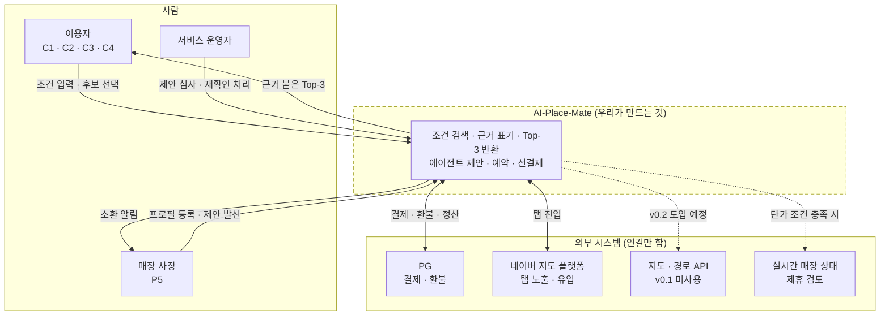
```mermaid
flowchart TB
    subgraph users["사람"]
        U1["이용자<br/>C1 · C2 · C3 · C4"]
        U2["매장 사장<br/>P5"]
        U3["서비스 운영자"]
    end

    subgraph sys["AI-Place-Mate (우리가 만드는 것)"]
        CORE["조건 검색 · 근거 표기 · Top-3 반환<br/>에이전트 제안 · 예약 · 선결제"]
    end

    subgraph ext["외부 시스템 (연결만 함)"]
        E1["PG<br/>결제 · 환불"]
        E2["네이버 지도 플랫폼<br/>탭 노출 · 유입"]
        E3["지도 · 경로 API<br/>v0.1 미사용"]
        E4["실시간 매장 상태<br/>제휴 검토"]
    end

    U1 -->|"조건 입력 · 후보 선택"| CORE
    U2 -->|"프로필 등록 · 제안 발신"| CORE
    U3 -->|"제안 심사 · 재확인 처리"| CORE
    CORE -->|"근거 붙은 Top-3"| U1
    CORE -->|"소환 알림"| U2
    CORE <-->|"결제 · 환불 · 정산"| E1
    CORE <-->|"탭 진입"| E2
    CORE -.->|"v0.2 도입 예정"| E3
    CORE -.->|"단가 조건 충족 시"| E4

    style sys stroke-dasharray: 6 4
```

**핵심 판단** — 결제를 자체 구축하지 않고 PG에 위탁한다(SRS LIM-01). 카드 정보를 저장하지 않으므로 PCI-DSS 부담이 PG로 넘어간다.

### 1.2 컴포넌트 다이어그램 — 시스템 내부 구조

**이 그림이 말하는 것:** 시스템 안이 8개 서비스로 나뉘고, 어느 서비스가 어느 서비스를 부르는지를 보여 준다. **Index Service가 맨 아래**에 있는 것이 중요하다 — 나머지가 모두 그 위에 얹힌다.

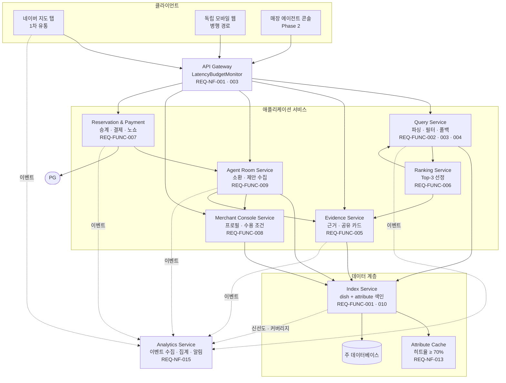
```mermaid
flowchart TB
    subgraph client["클라이언트"]
        C1["네이버 지도 탭<br/>1차 유통"]
        C2["독립 모바일 웹<br/>병행 경로"]
        C3["매장 에이전트 콘솔<br/>Phase 2"]
    end

    GW["API Gateway<br/>LatencyBudgetMonitor<br/>REQ-NF-001 · 003"]

    subgraph app["애플리케이션 서비스"]
        QS["Query Service<br/>파싱 · 필터 · 폴백<br/>REQ-FUNC-002 · 003 · 004"]
        RS["Ranking Service<br/>Top-3 선정<br/>REQ-FUNC-006"]
        ES["Evidence Service<br/>근거 · 공유 카드<br/>REQ-FUNC-005"]
        ARS["Agent Room Service<br/>소환 · 제안 수집<br/>REQ-FUNC-009"]
        MCS["Merchant Console Service<br/>프로필 · 수용 조건<br/>REQ-FUNC-008"]
        RPS["Reservation & Payment<br/>승계 · 결제 · 노쇼<br/>REQ-FUNC-007"]
    end

    subgraph data["데이터 계층"]
        IS["Index Service<br/>dish + attribute 색인<br/>REQ-FUNC-001 · 010"]
        CACHE["Attribute Cache<br/>히트율 ≥ 70%<br/>REQ-NF-013"]
        DB[("주 데이터베이스")]
    end

    AS["Analytics Service<br/>이벤트 수집 · 집계 · 알림<br/>REQ-NF-015"]
    PG(["PG"])

    C1 --> GW
    C2 --> GW
    C3 --> GW
    GW --> QS
    GW --> ES
    GW --> ARS
    GW --> MCS
    GW --> RPS
    QS --> IS
    RS --> QS
    RS --> ES
    QS --> RS
    ES --> IS
    ARS --> IS
    ARS --> MCS
    ARS --> ES
    RPS --> ARS
    RPS --> PG
    MCS --> IS
    IS --> CACHE
    IS --> DB
    C1 -.->|"이벤트"| AS
    QS -.->|"이벤트"| AS
    ES -.->|"이벤트"| AS
    ARS -.->|"이벤트"| AS
    RPS -.->|"이벤트"| AS
    IS -.->|"신선도 · 커버리지"| AS
```

**점선은 계측 경로다** — 기능 호출이 아니라 이벤트 적재이며, 실패해도 사용자 요청을 막지 않는다(§7).

### 1.3 서비스 책임과 경계

| 서비스 | 책임 | 하지 않는 것 | 요구사항 |
| --- | --- | --- | --- |
| **Index Service** | dish + attribute 색인, `canonical_key` 정규화, 신선도 배치 | 조건 해석·랭킹을 하지 않는다 | REQ-FUNC-001 · 010 · REQ-NF-002 · 008 |
| **Query Service** | 자연어 파싱, 구조화 필터, 폴백 전환 | 근거 문장을 만들지 않는다 | REQ-FUNC-002 · 003 · 004 · REQ-NF-007 |
| **Evidence Service** | 근거 문장 생성, Verification 조회, 공유 카드 | 후보 순서를 정하지 않는다 | REQ-FUNC-005 |
| **Ranking Service** | Top-3 선정, 비교 축 정리, **근거 미충족 후보 배제** | 필터링을 다시 하지 않는다 | REQ-FUNC-006 |
| **Agent Room Service** | 소환, 대화방 수명 관리, 제안 수집·정렬 | 가격을 협상하지 않는다 | REQ-FUNC-009 |
| **Merchant Console Service** | 프로필·수용 조건 등록, 제안 발신, 근거 없는 문구 차단 | 할인폭을 받지 않는다 | REQ-FUNC-008 |
| **Reservation & Payment** | 제안 승계, 예약, 선결제·환불·정산, 노쇼 판정 | 카드 정보를 보관하지 않는다 | REQ-FUNC-007 · REQ-NF-011 |
| **Analytics Service** | 이벤트 수집, 지표 집계, 임계 알림 | 사용자 요청 경로에 끼어들지 않는다 | REQ-NF-014 · 015 |

---

## 2. 유스케이스

### 2.1 유스케이스 다이어그램

**이 그림이 말하는 것:** 왼쪽·오른쪽의 사람 모양이 **행위자**, 가운데 둥근 상자가 그 사람이 **할 수 있는 일**이다. 점선 `«include»` 는 "그 일을 하면 반드시 이것도 일어난다"는 뜻이다.

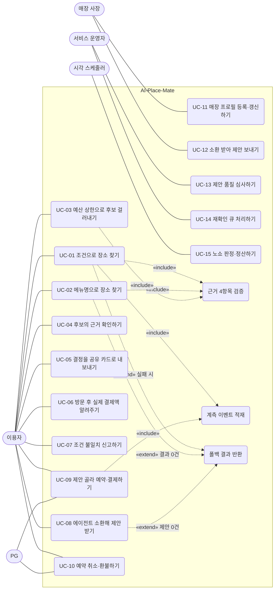
```mermaid
flowchart LR
    A1(["이용자"])
    A2(["매장 사장"])
    A3(["서비스 운영자"])
    A4(["PG"])
    A5(["시각 스케줄러"])

    subgraph SYS["AI-Place-Mate"]
        UC01("UC-01 조건으로 장소 찾기")
        UC02("UC-02 메뉴명으로 장소 찾기")
        UC03("UC-03 예산 상한으로 후보 걸러내기")
        UC04("UC-04 후보의 근거 확인하기")
        UC05("UC-05 결정을 공유 카드로 내보내기")
        UC06("UC-06 방문 후 실제 결제액 알려주기")
        UC07("UC-07 조건 불일치 신고하기")
        UC08("UC-08 에이전트 소환해 제안 받기")
        UC09("UC-09 제안 골라 예약·결제하기")
        UC10("UC-10 예약 취소·환불하기")
        UC11("UC-11 매장 프로필 등록·갱신하기")
        UC12("UC-12 소환 받아 제안 보내기")
        UC13("UC-13 제안 품질 심사하기")
        UC14("UC-14 재확인 큐 처리하기")
        UC15("UC-15 노쇼 판정·정산하기")

        UCI1("근거 4항목 검증")
        UCI2("계측 이벤트 적재")
        UCI3("폴백 결과 반환")
    end

    A1 --- UC01
    A1 --- UC02
    A1 --- UC03
    A1 --- UC04
    A1 --- UC05
    A1 --- UC06
    A1 --- UC07
    A1 --- UC08
    A1 --- UC09
    A1 --- UC10
    A2 --- UC11
    A2 --- UC12
    A3 --- UC13
    A3 --- UC14
    A4 --- UC09
    A4 --- UC10
    A5 --- UC15

    UC01 -.->|"«include»"| UCI1
    UC02 -.->|"«include»"| UCI1
    UC03 -.->|"«include»"| UCI1
    UC01 -.->|"«include»"| UCI2
    UC09 -.->|"«include»"| UCI2
    UC01 -.->|"«extend» 실패 시"| UCI3
    UC02 -.->|"«extend» 결과 0건"| UCI3
    UC08 -.->|"«extend» 제안 0건"| UCI3
```

**행위자 `시각 스케줄러`가 사람이 아닌 이유** — 노쇼 판정은 사용자 행동이 아니라 **예약 시각 경과**라는 시간 조건으로 시작된다(SRS §9.4 AC4). 시작 주체가 없으면 유스케이스가 성립하지 않으므로 시간을 행위자로 세운다.

### 2.2 유스케이스 명세

| ID | 유스케이스 | 주 행위자 | 사전 조건 | 주 흐름 요약 | 대체·실패 흐름 | 요구사항 | AC |
| --- | --- | --- | --- | --- | --- | --- | --- |
| **UC-01** | 조건으로 장소 찾기 | 이용자 | 상권 3곳 중 하나 | 조건 입력 → 파싱 → 필터 → 근거 검증 → Top-3 | 파싱 실패 시 구조화 필터 UI (FC-01) | REQ-FUNC-004 · 006 | US-1 AC5 |
| **UC-02** | 메뉴명으로 장소 찾기 | 이용자 | 반경 1km 위치 확보 | 메뉴명 1개 입력 → `canonical_key` 조회 → Top-3 | 색인 부재 시 유사 메뉴 대체 → 반경 3km 확대 → 인접 카테고리 | REQ-FUNC-003 | US-2 AC2 · AC4 |
| **UC-03** | 예산 상한으로 후보 걸러내기 | 이용자 | 예상가 데이터 존재 | 상한 입력 → 범위 표기 → 초과분 요약 제외 | 가격 데이터 부실 시 '가격 확인 필요' 표기 후 판정 제외 | REQ-FUNC-002 | US-1 AC1 · AC2 · AC6 |
| **UC-04** | 후보의 근거 확인하기 | 이용자 | Top-3 반환됨 | 카드 확장 → 근거 문장·확인 일자·확인 주체 열람 | 90일 초과 속성은 경고 병기 | REQ-FUNC-005 | US-3 AC1 · AC2 |
| **UC-05** | 결정을 공유 카드로 내보내기 | 이용자 | 후보 1곳 선택 | 공유 요청 → 카드 렌더 → 이미지/링크 반환 | 근거 4항목 누락 시 400 반환 | REQ-FUNC-005 | US-3 AC3 |
| **UC-06** | 방문 후 실제 결제액 알려주기 | 이용자 | 방문·결제 완료 | 결제액 입력 → 편차 기록 → 추정 모델 반영 | — | REQ-FUNC-002 | US-1 AC4 |
| **UC-07** | 조건 불일치 신고하기 | 이용자 | 방문 완료 | 신고 → 속성 상태 '재확인 필요' 전환 (≤ 60s) | — | REQ-FUNC-005 | US-3 AC4 |
| **UC-08** | 에이전트 소환해 제안 받기 | 이용자 | 조건 2개 이상 · Phase 2 | 카테고리·지역 입력 → 3–5곳 소환 → 180s 수집 → 적합도 정렬 | 유효 제안 0건이면 제안 없는 Top-3로 복귀 | REQ-FUNC-009 | US-6 AC1 · AC4 |
| **UC-09** | 제안 골라 예약·결제하기 | 이용자 · PG | 제안 1건 이상 | 제안 선택 → 조건 승계 → 주문량 금액 산출 → 결제 → 매장 통보 | 금액 산출 오류 시 결제 중단 | REQ-FUNC-007 | US-4 AC1 · AC2 |
| **UC-10** | 예약 취소·환불하기 | 이용자 · PG | 예약 2시간 전 | 취소 접수 → 전액 환불 → 매장 즉시 통보 | 환불 실패 시 재시도 큐 | REQ-FUNC-007 | US-4 AC3 |
| **UC-11** | 매장 프로필 등록·갱신하기 | 매장 사장 | 콘솔 접속 (2FA) | 분위기·강점·서비스·수용 조건 등록 | 근거 없는 문구는 저장 거부 후 속성 등록 안내 | REQ-FUNC-008 | US-5 AC1 · AC3 · AC4 |
| **UC-12** | 소환 받아 제안 보내기 | 매장 사장 | 수용 조건 충족 | 소환 수신 → 제안 작성 → 발신 | 수용 조건 밖이면 소환 자체가 발생하지 않음 | REQ-FUNC-008 · 009 | US-5 AC2 |
| **UC-13** | 제안 품질 심사하기 | 서비스 운영자 | 규칙 위반 자동 탐지됨 | 예외 건만 사람이 판정 | 150곳당 1 FTE 상한 초과 시 온보딩 속도 조절 | REQ-NF-014 | LIM-09 |
| **UC-14** | 재확인 큐 처리하기 | 서비스 운영자 | 90일 초과 또는 신고 발생 | 큐 조회 → 확인 → Verification 갱신 | 90일 초과 비율 20% 초과 시 우선순위 상향 | REQ-NF-008 | US-3 AC2 |
| **UC-15** | 노쇼 판정·정산하기 | 시각 스케줄러 | 예약 시각 경과 | 방문 확인 조회 → 미확인 시 노쇼 기록 → 매장 정산 | 오판정률 ≤ 1% | REQ-FUNC-007 | US-4 AC4 |

---

## 3. 데이터 설계

### 3.1 ERD — 개체와 관계

**이 그림이 말하는 것:** 상자는 저장 단위(테이블), 선은 관계다. 선 끝 기호가 개수를 뜻한다 — `||` 은 정확히 1개, `o{` 은 0개 이상, `o|` 은 0개 또는 1개.

**가장 중요한 관계는 `ATTRIBUTE ||--|| VERIFICATION` 이다.** 속성마다 "누가 언제 확인했는지"가 반드시 하나 붙는다 — 이것이 근거 표기의 구조적 근거다(ADR-002).

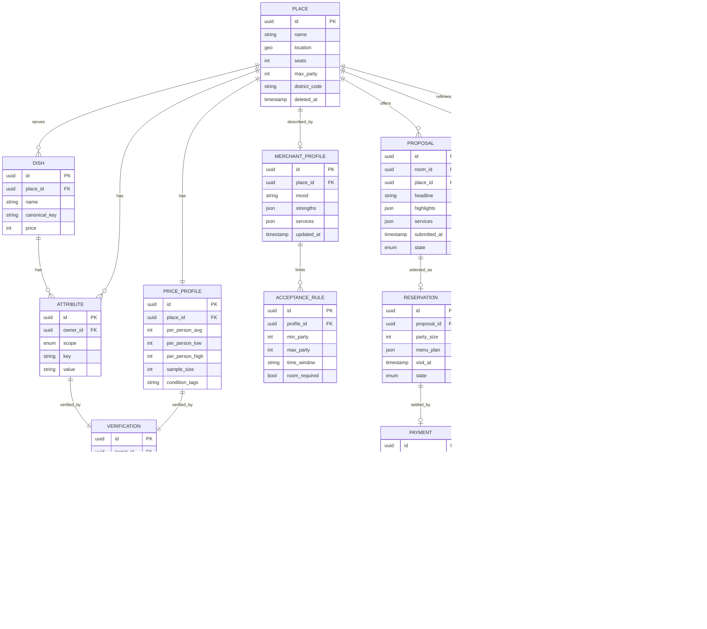
```mermaid
erDiagram
    PLACE ||--o{ DISH : "serves"
    PLACE ||--o{ ATTRIBUTE : "has"
    PLACE ||--|| PRICE_PROFILE : "has"
    PLACE ||--o| MERCHANT_PROFILE : "described_by"
    DISH ||--o{ ATTRIBUTE : "has"
    ATTRIBUTE ||--|| VERIFICATION : "verified_by"
    PRICE_PROFILE ||--|| VERIFICATION : "verified_by"
    MERCHANT_PROFILE ||--o{ ACCEPTANCE_RULE : "limits"
    PLACE ||--o{ PROPOSAL : "offers"
    AGENT_ROOM ||--o{ PROPOSAL : "receives"
    AGENT_ROOM ||--o{ SUMMON : "issues"
    PLACE ||--o{ SUMMON : "receives"
    PROPOSAL ||--o| RESERVATION : "selected_as"
    RESERVATION ||--o| PAYMENT : "settled_by"
    VERIFICATION ||--o{ REVERIFY_TASK : "queues"
    PLACE ||--o{ EVENT : "referenced_by"

    PLACE {
        uuid id PK
        string name
        geo location
        int seats
        int max_party
        string district_code
        timestamp deleted_at
    }
    DISH {
        uuid id PK
        uuid place_id FK
        string name
        string canonical_key
        int price
    }
    PRICE_PROFILE {
        uuid id PK
        uuid place_id FK
        int per_person_avg
        int per_person_low
        int per_person_high
        int sample_size
        string condition_tags
    }
    ATTRIBUTE {
        uuid id PK
        uuid owner_id FK
        enum scope
        string key
        string value
    }
    VERIFICATION {
        uuid id PK
        uuid target_id FK
        enum status
        date verified_at
        enum verified_by
        string source_url
    }
    REVERIFY_TASK {
        uuid id PK
        uuid verification_id FK
        enum reason
        int priority
        timestamp queued_at
    }
    MERCHANT_PROFILE {
        uuid id PK
        uuid place_id FK
        string mood
        json strengths
        json services
        timestamp updated_at
    }
    ACCEPTANCE_RULE {
        uuid id PK
        uuid profile_id FK
        int min_party
        int max_party
        string time_window
        bool room_required
    }
    AGENT_ROOM {
        uuid id PK
        json conditions
        int agent_count
        timestamp created_at
        timestamp expires_at
        enum state
    }
    SUMMON {
        uuid id PK
        uuid room_id FK
        uuid place_id FK
        float fitness_score
        enum state
    }
    PROPOSAL {
        uuid id PK
        uuid room_id FK
        uuid place_id FK
        string headline
        json highlights
        json services
        timestamp submitted_at
        enum state
    }
    RESERVATION {
        uuid id PK
        uuid proposal_id FK
        int party_size
        json menu_plan
        timestamp visit_at
        enum state
    }
    PAYMENT {
        uuid id PK
        uuid reservation_id FK
        int order_amount
        enum state
        string pg_transaction_id
    }
    EVENT {
        uuid event_id PK
        string name
        uuid session_id
        timestamp occurred_at
        timestamp received_at
        json properties
        bool incomplete
    }
```

**SRS §6.2에서 확장한 부분과 근거**

| 추가 개체 | 왜 필요한가 | 요구사항 |
| --- | --- | --- |
| `MERCHANT_PROFILE` · `ACCEPTANCE_RULE` | 수용 조건 밖 요청에 소환이 발생하지 않아야 하므로, 조건을 조회 가능한 개체로 분리 | REQ-FUNC-008 · US-5 AC2 |
| `SUMMON` | 소환 수신·열람·무시를 세려면(보조 11 분모) 소환 자체가 기록되어야 한다 | REQ-FUNC-009 · §10.2.2 |
| `REVERIFY_TASK` | 재확인 큐를 운영자가 처리하려면 대기 항목이 실체여야 한다 | REQ-NF-008 · UC-14 |
| `EVENT` | 계측 계획의 20개 이벤트를 담는 단일 테이블 (파티셔닝) | SRS §10.2 |
| `PLACE.deleted_at` | 논리 삭제로 이력을 보존한다 | SRS §6.4 |

### 3.2 상태 다이어그램 — 데이터의 생애

**이 그림이 말하는 것:** 하나의 데이터가 시간에 따라 어떤 상태를 거치는지다. 검은 점이 시작, 검은 겹점이 종료다.

#### 3.2.1 Verification — 속성 확인 상태

근거 표기의 심장이다. `STALE` 과 `NEEDS_REVERIFY` 를 구분하는 이유는 **경고를 띄우는 것**과 **사람이 처리해야 하는 것**이 다르기 때문이다.

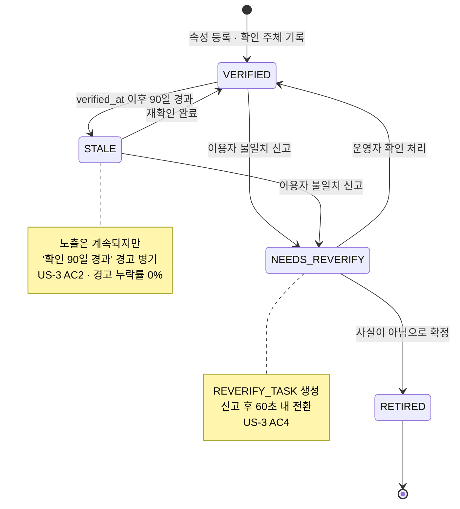
```mermaid
stateDiagram-v2
    [*] --> VERIFIED : 속성 등록 · 확인 주체 기록
    VERIFIED --> STALE : verified_at 이후 90일 경과
    STALE --> VERIFIED : 재확인 완료
    VERIFIED --> NEEDS_REVERIFY : 이용자 불일치 신고
    STALE --> NEEDS_REVERIFY : 이용자 불일치 신고
    NEEDS_REVERIFY --> VERIFIED : 운영자 확인 처리
    NEEDS_REVERIFY --> RETIRED : 사실이 아님으로 확정
    RETIRED --> [*]

    note right of STALE
        노출은 계속되지만
        '확인 90일 경과' 경고 병기
        US-3 AC2 · 경고 누락률 0%
    end note
    note right of NEEDS_REVERIFY
        REVERIFY_TASK 생성
        신고 후 60초 내 전환
        US-3 AC4
    end note
```

#### 3.2.2 AgentRoom — 대화방 수명

180초 마감이 상태로 표현된다. `CLOSED_EMPTY` 로 끝나도 사용자에게는 빈 화면이 아니라 Top-3가 돌아간다.

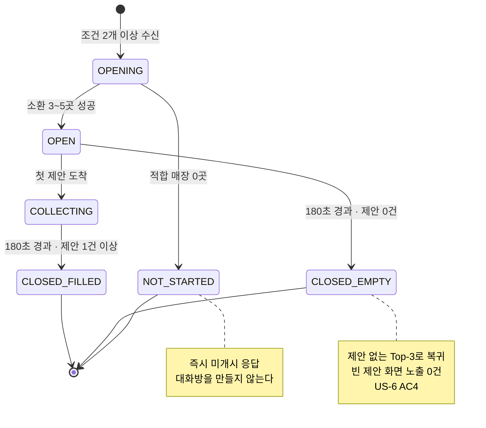
```mermaid
stateDiagram-v2
    [*] --> OPENING : 조건 2개 이상 수신
    OPENING --> OPEN : 소환 3~5곳 성공
    OPENING --> NOT_STARTED : 적합 매장 0곳
    OPEN --> COLLECTING : 첫 제안 도착
    OPEN --> CLOSED_EMPTY : 180초 경과 · 제안 0건
    COLLECTING --> CLOSED_FILLED : 180초 경과 · 제안 1건 이상
    CLOSED_FILLED --> [*]
    CLOSED_EMPTY --> [*]
    NOT_STARTED --> [*]

    note right of NOT_STARTED
        즉시 미개시 응답
        대화방을 만들지 않는다
    end note
    note right of CLOSED_EMPTY
        제안 없는 Top-3로 복귀
        빈 제안 화면 노출 0건
        US-6 AC4
    end note
```

#### 3.2.3 Reservation · Payment — 예약과 결제

취소 시점(2시간 전)과 노쇼 판정이 분기점이다. 두 경로 모두 정산으로 끝나지만 **돈이 가는 방향이 반대**다.

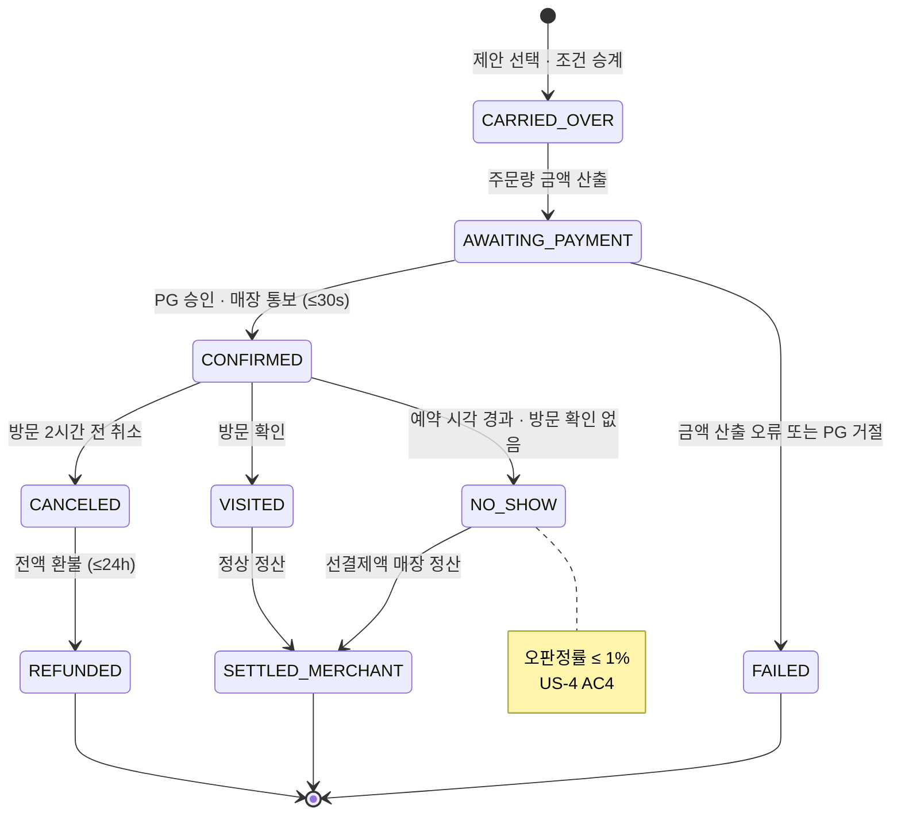
```mermaid
stateDiagram-v2
    [*] --> CARRIED_OVER : 제안 선택 · 조건 승계
    CARRIED_OVER --> AWAITING_PAYMENT : 주문량 금액 산출
    AWAITING_PAYMENT --> CONFIRMED : PG 승인 · 매장 통보 (≤30s)
    AWAITING_PAYMENT --> FAILED : 금액 산출 오류 또는 PG 거절
    CONFIRMED --> CANCELED : 방문 2시간 전 취소
    CANCELED --> REFUNDED : 전액 환불 (≤24h)
    CONFIRMED --> VISITED : 방문 확인
    CONFIRMED --> NO_SHOW : 예약 시각 경과 · 방문 확인 없음
    VISITED --> SETTLED_MERCHANT : 정상 정산
    NO_SHOW --> SETTLED_MERCHANT : 선결제액 매장 정산
    REFUNDED --> [*]
    SETTLED_MERCHANT --> [*]
    FAILED --> [*]

    note right of NO_SHOW
        오판정률 ≤ 1%
        US-4 AC4
    end note
```

#### 3.2.4 Proposal — 제안의 생애

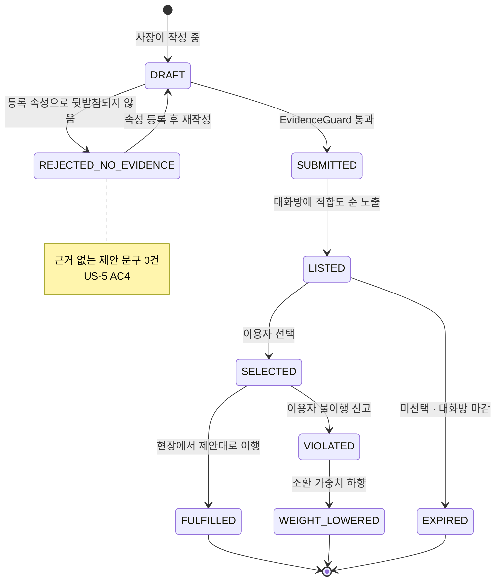
```mermaid
stateDiagram-v2
    [*] --> DRAFT : 사장이 작성 중
    DRAFT --> REJECTED_NO_EVIDENCE : 등록 속성으로 뒷받침되지 않음
    DRAFT --> SUBMITTED : EvidenceGuard 통과
    REJECTED_NO_EVIDENCE --> DRAFT : 속성 등록 후 재작성
    SUBMITTED --> LISTED : 대화방에 적합도 순 노출
    LISTED --> SELECTED : 이용자 선택
    LISTED --> EXPIRED : 미선택 · 대화방 마감
    SELECTED --> FULFILLED : 현장에서 제안대로 이행
    SELECTED --> VIOLATED : 이용자 불이행 신고
    VIOLATED --> WEIGHT_LOWERED : 소환 가중치 하향
    FULFILLED --> [*]
    WEIGHT_LOWERED --> [*]
    EXPIRED --> [*]

    note right of REJECTED_NO_EVIDENCE
        근거 없는 제안 문구 0건
        US-5 AC4
    end note
```

### 3.3 데이터베이스 물리 설계 요점

| 항목 | 설계 | 근거 |
| --- | --- | --- |
| `dishes.canonical_key` | 인덱스 필수. 정규화 사전은 별도 관리 테이블 | REQ-FUNC-003 정답률 92% |
| `attributes(owner_id, scope, key)` | 복합 인덱스. `scope` 로 place/dish 분기 | REQ-FUNC-001 |
| `verifications.verified_at` | 인덱스 — 90일 초과 야간 배치 스캔 | REQ-NF-008 |
| `events` | `occurred_at` 일 단위 파티셔닝. 48시간 지연 도착 허용 | SRS §10.2.1 |
| `payments` | 카드 정보 컬럼을 두지 않는다. `pg_transaction_id` 만 보관 | REQ-NF-011 |
| 논리 삭제 | 물리 삭제 없음. `deleted_at` 만 갱신 | SRS §6.4 |
| 저장 암호화 | `payments` · 정산 데이터 AES-256 | REQ-NF-011 |

---

## 4. 정적 구조 — 클래스 다이어그램 (CLD)

클래스 이름은 SRS §5 추적성 매트릭스에 등재된 것과 동일하다. `+` 는 외부에 공개하는 기능, `-` 는 내부용이다.

### 4.1 Query Service — 조건을 해석하는 부품

**이 그림이 말하는 것:** 조건 입력을 받아 후보 목록까지 좁히는 부품들이다. `ParseFailureGuard` 가 파싱 실패를 붙잡아 `StructuredFilterFallback` 으로 넘기는 것이 "빈 화면 없음" 규칙의 구현 지점이다.

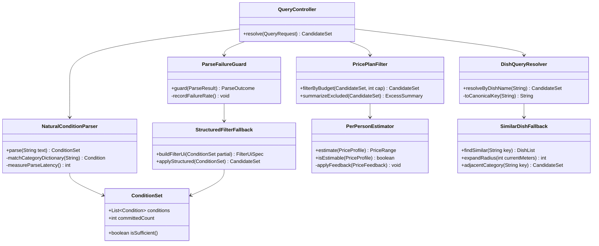
```mermaid
classDiagram
    class QueryController {
        +resolve(QueryRequest) CandidateSet
    }
    class NaturalConditionParser {
        +parse(String text) ConditionSet
        -matchCategoryDictionary(String) Condition
        -measureParseLatency() int
    }
    class StructuredFilterFallback {
        +buildFilterUi(ConditionSet partial) FilterUiSpec
        +applyStructured(ConditionSet) CandidateSet
    }
    class ParseFailureGuard {
        +guard(ParseResult) ParseOutcome
        -recordFailureRate() void
    }
    class PricePlanFilter {
        +filterByBudget(CandidateSet, int cap) CandidateSet
        +summarizeExcluded(CandidateSet) ExcessSummary
    }
    class PerPersonEstimator {
        +estimate(PriceProfile) PriceRange
        +isEstimable(PriceProfile) boolean
        -applyFeedback(PriceFeedback) void
    }
    class DishQueryResolver {
        +resolveByDishName(String) CandidateSet
        -toCanonicalKey(String) String
    }
    class SimilarDishFallback {
        +findSimilar(String key) DishList
        +expandRadius(int currentMeters) int
        +adjacentCategory(String key) CandidateSet
    }
    class ConditionSet {
        +List~Condition~ conditions
        +int committedCount
        +boolean isSufficient()
    }

    QueryController --> NaturalConditionParser
    QueryController --> ParseFailureGuard
    QueryController --> DishQueryResolver
    QueryController --> PricePlanFilter
    ParseFailureGuard --> StructuredFilterFallback
    NaturalConditionParser --> ConditionSet
    StructuredFilterFallback --> ConditionSet
    PricePlanFilter --> PerPersonEstimator
    DishQueryResolver --> SimilarDishFallback
```

**`PerPersonEstimator.isEstimable()` 이 왜 공개 기능인가** — 가격 데이터가 부실한 매장은 예상가를 만들지 않고 '가격 확인 필요'로 표기해야 하며(US-1 AC6), 그 판단을 `PricePlanFilter` 가 필터 적용 전에 물어봐야 한다.

### 4.2 Index Service — 색인과 신선도

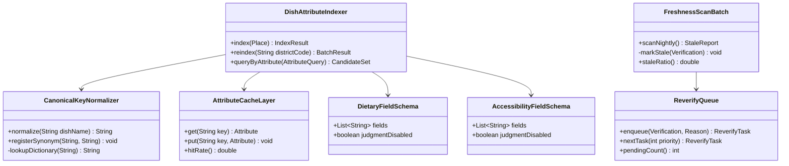
```mermaid
classDiagram
    class DishAttributeIndexer {
        +index(Place) IndexResult
        +reindex(String districtCode) BatchResult
        +queryByAttribute(AttributeQuery) CandidateSet
    }
    class CanonicalKeyNormalizer {
        +normalize(String dishName) String
        +registerSynonym(String, String) void
        -lookupDictionary(String) String
    }
    class AttributeCacheLayer {
        +get(String key) Attribute
        +put(String key, Attribute) void
        +hitRate() double
    }
    class FreshnessScanBatch {
        +scanNightly() StaleReport
        -markStale(Verification) void
        +staleRatio() double
    }
    class ReverifyQueue {
        +enqueue(Verification, Reason) ReverifyTask
        +nextTask(int priority) ReverifyTask
        +pendingCount() int
    }
    class DietaryFieldSchema {
        +List~String~ fields
        +boolean judgmentDisabled
    }
    class AccessibilityFieldSchema {
        +List~String~ fields
        +boolean judgmentDisabled
    }

    DishAttributeIndexer --> CanonicalKeyNormalizer
    DishAttributeIndexer --> AttributeCacheLayer
    DishAttributeIndexer --> DietaryFieldSchema
    DishAttributeIndexer --> AccessibilityFieldSchema
    FreshnessScanBatch --> ReverifyQueue
```

**`judgmentDisabled` 플래그** — 성분·접근성 필드는 값을 노출하되 시스템이 적합 여부를 판정하지 않는다(REQ-FUNC-010). 판정 금지를 주석이 아니라 **코드 수준 불변식**으로 둔다.

### 4.3 Evidence Service · Ranking Service — 근거와 순서

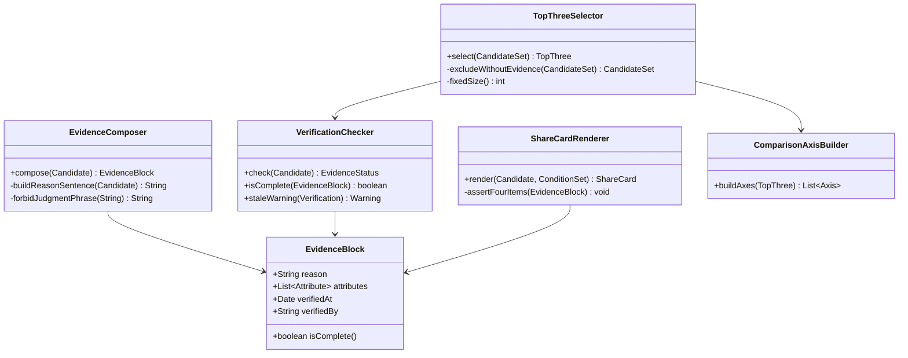
```mermaid
classDiagram
    class EvidenceComposer {
        +compose(Candidate) EvidenceBlock
        -buildReasonSentence(Candidate) String
        -forbidJudgmentPhrase(String) String
    }
    class VerificationChecker {
        +check(Candidate) EvidenceStatus
        +isComplete(EvidenceBlock) boolean
        +staleWarning(Verification) Warning
    }
    class ShareCardRenderer {
        +render(Candidate, ConditionSet) ShareCard
        -assertFourItems(EvidenceBlock) void
    }
    class EvidenceBlock {
        +String reason
        +List~Attribute~ attributes
        +Date verifiedAt
        +String verifiedBy
        +boolean isComplete()
    }
    class TopThreeSelector {
        +select(CandidateSet) TopThree
        -excludeWithoutEvidence(CandidateSet) CandidateSet
        -fixedSize() int
    }
    class ComparisonAxisBuilder {
        +buildAxes(TopThree) List~Axis~
    }

    EvidenceComposer --> EvidenceBlock
    VerificationChecker --> EvidenceBlock
    ShareCardRenderer --> EvidenceBlock
    TopThreeSelector --> VerificationChecker
    TopThreeSelector --> ComparisonAxisBuilder
```

**`TopThreeSelector.excludeWithoutEvidence()` 가 private인 이유** — 근거 미충족 후보 배제는 선택적 기능이 아니라 `select()` 의 일부다. 밖에서 끄고 켤 수 있으면 규칙이 규칙이 아니게 된다(SRS §6.3-2).

### 4.4 Agent Room Service · Merchant Console Service — 공급 측

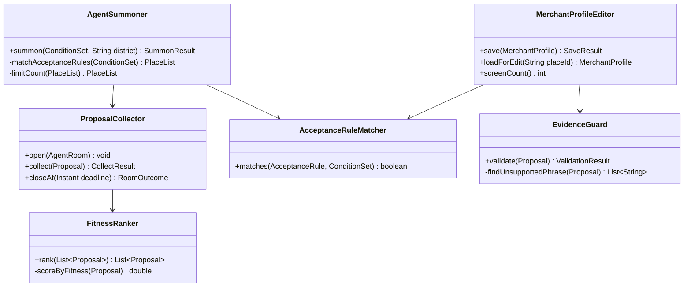
```mermaid
classDiagram
    class AgentSummoner {
        +summon(ConditionSet, String district) SummonResult
        -matchAcceptanceRules(ConditionSet) PlaceList
        -limitCount(PlaceList) PlaceList
    }
    class ProposalCollector {
        +open(AgentRoom) void
        +collect(Proposal) CollectResult
        +closeAt(Instant deadline) RoomOutcome
    }
    class FitnessRanker {
        +rank(List~Proposal~) List~Proposal~
        -scoreByFitness(Proposal) double
    }
    class MerchantProfileEditor {
        +save(MerchantProfile) SaveResult
        +loadForEdit(String placeId) MerchantProfile
        +screenCount() int
    }
    class AcceptanceRuleMatcher {
        +matches(AcceptanceRule, ConditionSet) boolean
    }
    class EvidenceGuard {
        +validate(Proposal) ValidationResult
        -findUnsupportedPhrase(Proposal) List~String~
    }

    AgentSummoner --> AcceptanceRuleMatcher
    AgentSummoner --> ProposalCollector
    ProposalCollector --> FitnessRanker
    MerchantProfileEditor --> EvidenceGuard
    MerchantProfileEditor --> AcceptanceRuleMatcher
```

**`FitnessRanker` 에 가격 관련 기능이 없다** — 정렬 1순위가 조건 적합도이고 가격 협상 기능은 0건이어야 한다(US-6 AC3). 가격 필드가 아예 없으므로 실수로 정렬 키에 넣을 수 없다.

### 4.5 Reservation & Payment Service

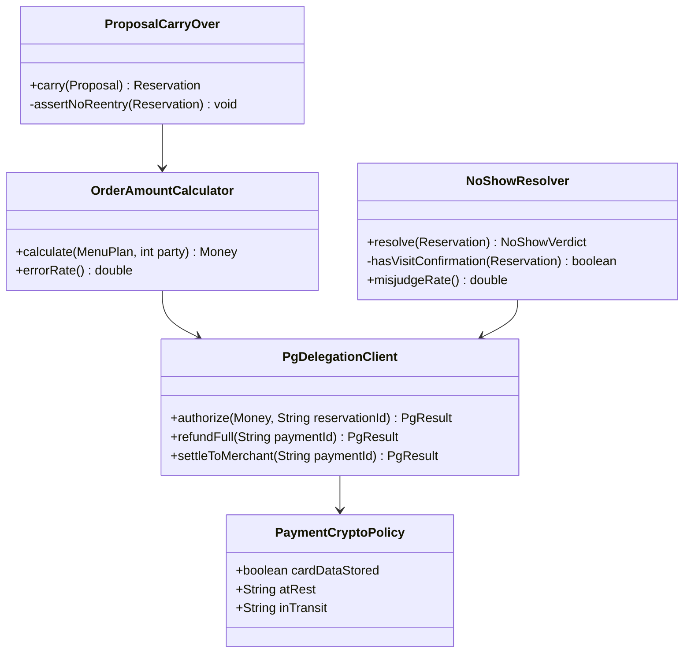
```mermaid
classDiagram
    class ProposalCarryOver {
        +carry(Proposal) Reservation
        -assertNoReentry(Reservation) void
    }
    class OrderAmountCalculator {
        +calculate(MenuPlan, int party) Money
        +errorRate() double
    }
    class NoShowResolver {
        +resolve(Reservation) NoShowVerdict
        -hasVisitConfirmation(Reservation) boolean
        +misjudgeRate() double
    }
    class PgDelegationClient {
        +authorize(Money, String reservationId) PgResult
        +refundFull(String paymentId) PgResult
        +settleToMerchant(String paymentId) PgResult
    }
    class PaymentCryptoPolicy {
        +boolean cardDataStored
        +String atRest
        +String inTransit
    }

    ProposalCarryOver --> OrderAmountCalculator
    OrderAmountCalculator --> PgDelegationClient
    NoShowResolver --> PgDelegationClient
    PgDelegationClient --> PaymentCryptoPolicy
```

`PaymentCryptoPolicy.cardDataStored` 는 항상 `false` 다 — 값이 아니라 **불변식**이며 계약 테스트로 고정한다(REQ-NF-011).

### 4.6 Analytics Service — 계측

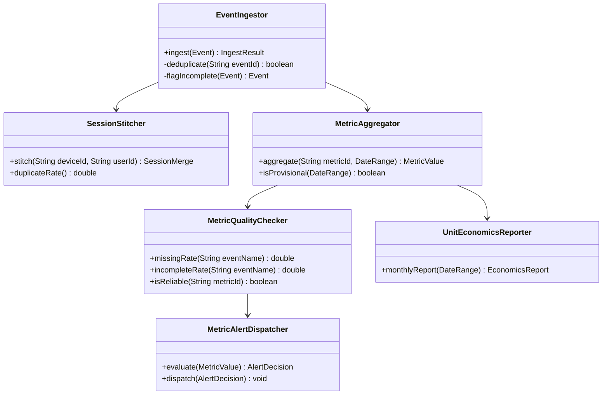
```mermaid
classDiagram
    class EventIngestor {
        +ingest(Event) IngestResult
        -deduplicate(String eventId) boolean
        -flagIncomplete(Event) Event
    }
    class SessionStitcher {
        +stitch(String deviceId, String userId) SessionMerge
        +duplicateRate() double
    }
    class MetricAggregator {
        +aggregate(String metricId, DateRange) MetricValue
        +isProvisional(DateRange) boolean
    }
    class MetricQualityChecker {
        +missingRate(String eventName) double
        +incompleteRate(String eventName) double
        +isReliable(String metricId) boolean
    }
    class MetricAlertDispatcher {
        +evaluate(MetricValue) AlertDecision
        +dispatch(AlertDecision) void
    }
    class UnitEconomicsReporter {
        +monthlyReport(DateRange) EconomicsReport
    }

    EventIngestor --> SessionStitcher
    EventIngestor --> MetricAggregator
    MetricAggregator --> MetricQualityChecker
    MetricQualityChecker --> MetricAlertDispatcher
    MetricAggregator --> UnitEconomicsReporter
```

**`MetricQualityChecker.isReliable()` 이 게이트를 막는다** — 계측 결함이 임계를 넘는 지표는 `unreliable` 로 표기되어 릴리스 게이트 판정에 쓰이지 않는다(SRS §10.2.5).

---

## 5. 동적 흐름 — 시퀀스 다이어그램

**읽는 법:** 위에서 아래로 시간이 흐른다. 세로선은 참여자, 실선 화살표는 요청, 점선 화살표는 응답이다. `alt` 는 분기, `loop` 는 반복, `par` 는 동시 실행이다.

### SD-01 조건 검색 → Top-3 반환 (정상 흐름)

가장 중요한 흐름이다. **1,000ms 예산을 어떻게 쪼개 쓰는지**가 이 그림의 핵심이다.

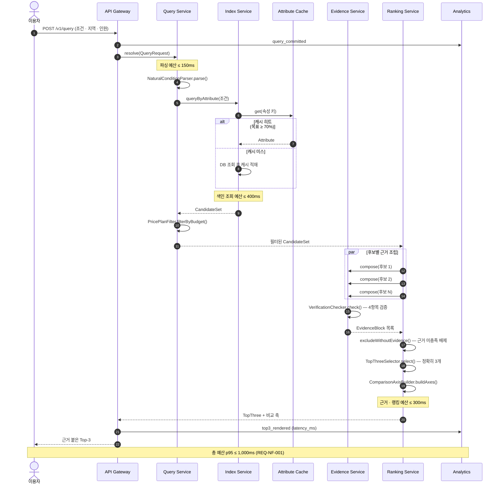
```mermaid
sequenceDiagram
    autonumber
    actor U as 이용자
    participant GW as API Gateway
    participant QS as Query Service
    participant IS as Index Service
    participant CA as Attribute Cache
    participant ES as Evidence Service
    participant RS as Ranking Service
    participant AN as Analytics

    U->>GW: POST /v1/query (조건 · 지역 · 인원)
    GW->>AN: query_committed
    GW->>QS: resolve(QueryRequest)
    Note over QS: 파싱 예산 ≤ 150ms
    QS->>QS: NaturalConditionParser.parse()
    QS->>IS: queryByAttribute(조건)
    IS->>CA: get(속성 키)
    alt 캐시 히트 (목표 ≥ 70%)
        CA-->>IS: Attribute
    else 캐시 미스
        IS->>IS: DB 조회 후 캐시 적재
    end
    Note over IS: 색인 조회 예산 ≤ 400ms
    IS-->>QS: CandidateSet
    QS->>QS: PricePlanFilter.filterByBudget()
    QS-->>RS: 필터된 CandidateSet
    par 후보별 근거 조립
        RS->>ES: compose(후보 1)
        RS->>ES: compose(후보 2)
        RS->>ES: compose(후보 N)
    end
    ES->>ES: VerificationChecker.check() — 4항목 검증
    ES-->>RS: EvidenceBlock 목록
    RS->>RS: excludeWithoutEvidence() — 근거 미충족 배제
    RS->>RS: TopThreeSelector.select() — 정확히 3개
    RS->>RS: ComparisonAxisBuilder.buildAxes()
    Note over RS: 근거 · 랭킹 예산 ≤ 300ms
    RS-->>GW: TopThree + 비교 축
    GW->>AN: top3_rendered (latency_ms)
    GW-->>U: 근거 붙은 Top-3
    Note over U,AN: 총 예산 p95 ≤ 1,000ms (REQ-NF-001)
```

**설계 판단** — 근거 조립을 `par` 로 병렬화한다. 후보 3~5개를 순차 조립하면 300ms 예산을 넘기기 때문이다.

### SD-02 자연어 파싱 실패 → 구조화 필터 폴백

**빈 화면 없음** 규칙의 구현이다. 실패해도 Top-3는 반드시 반환된다.

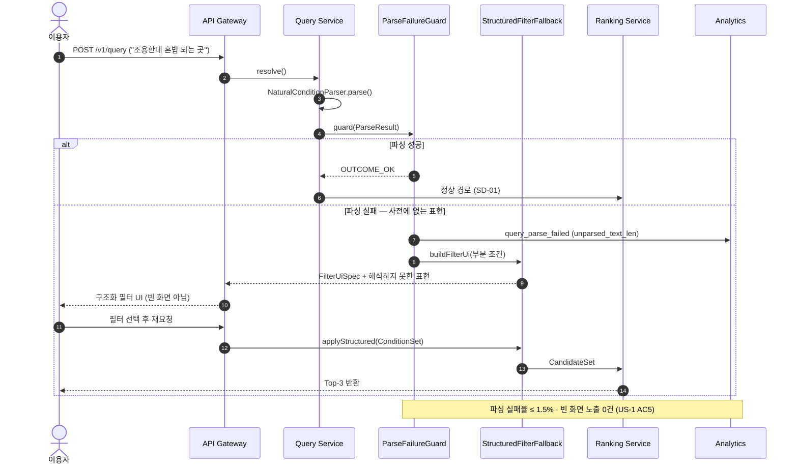
```mermaid
sequenceDiagram
    autonumber
    actor U as 이용자
    participant GW as API Gateway
    participant QS as Query Service
    participant PG2 as ParseFailureGuard
    participant FB as StructuredFilterFallback
    participant RS as Ranking Service
    participant AN as Analytics

    U->>GW: POST /v1/query ("조용한데 혼밥 되는 곳")
    GW->>QS: resolve()
    QS->>QS: NaturalConditionParser.parse()
    QS->>PG2: guard(ParseResult)
    alt 파싱 성공
        PG2-->>QS: OUTCOME_OK
        QS->>RS: 정상 경로 (SD-01)
    else 파싱 실패 — 사전에 없는 표현
        PG2->>AN: query_parse_failed (unparsed_text_len)
        PG2->>FB: buildFilterUi(부분 조건)
        FB-->>GW: FilterUiSpec + 해석하지 못한 표현
        GW-->>U: 구조화 필터 UI (빈 화면 아님)
        U->>GW: 필터 선택 후 재요청
        GW->>FB: applyStructured(ConditionSet)
        FB->>RS: CandidateSet
        RS-->>U: Top-3 반환
    end
    Note over PG2,AN: 파싱 실패율 ≤ 1.5% · 빈 화면 노출 0건 (US-1 AC5)
```

### SD-03 메뉴명 질의 → 유사 메뉴 → 반경 확대

3단 폴백이다. 어느 단계에서도 "0건입니다"로 끝나지 않는다.

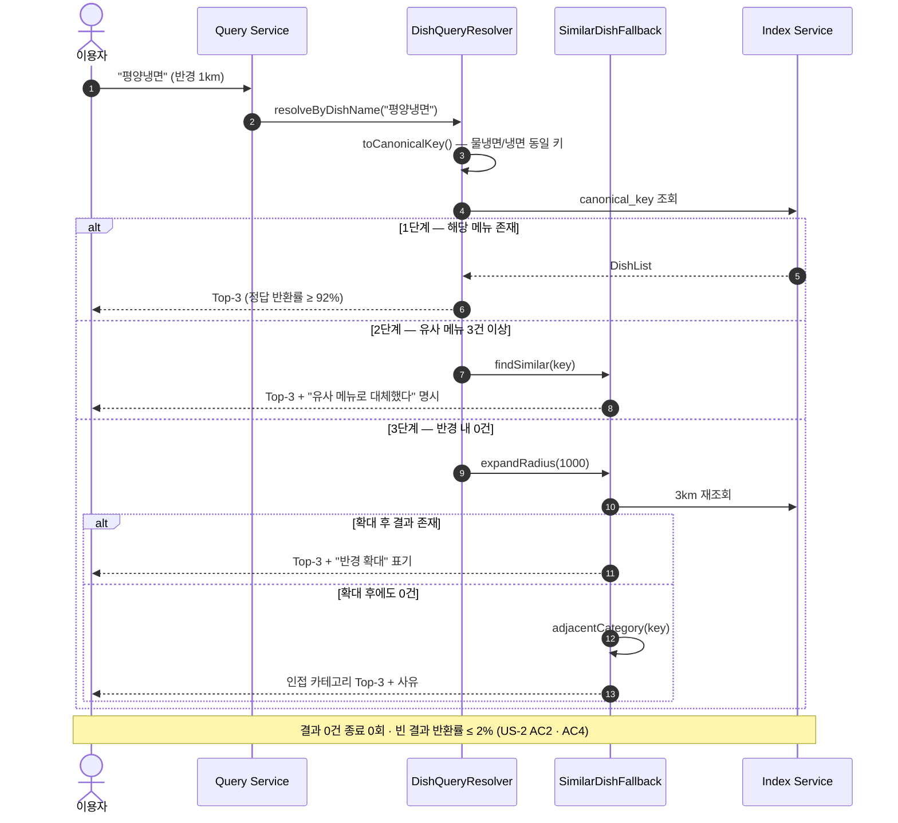
```mermaid
sequenceDiagram
    autonumber
    actor U as 이용자
    participant QS as Query Service
    participant DR as DishQueryResolver
    participant SF as SimilarDishFallback
    participant IS as Index Service

    U->>QS: "평양냉면" (반경 1km)
    QS->>DR: resolveByDishName("평양냉면")
    DR->>DR: toCanonicalKey() — 물냉면/냉면 동일 키
    DR->>IS: canonical_key 조회
    alt 1단계 — 해당 메뉴 존재
        IS-->>DR: DishList
        DR-->>U: Top-3 (정답 반환률 ≥ 92%)
    else 2단계 — 유사 메뉴 3건 이상
        DR->>SF: findSimilar(key)
        SF-->>U: Top-3 + "유사 메뉴로 대체했다" 명시
    else 3단계 — 반경 내 0건
        DR->>SF: expandRadius(1000)
        SF->>IS: 3km 재조회
        alt 확대 후 결과 존재
            SF-->>U: Top-3 + "반경 확대" 표기
        else 확대 후에도 0건
            SF->>SF: adjacentCategory(key)
            SF-->>U: 인접 카테고리 Top-3 + 사유
        end
    end
    Note over U,IS: 결과 0건 종료 0회 · 빈 결과 반환률 ≤ 2% (US-2 AC2 · AC4)
```

### SD-04 근거 표기와 90일 경고

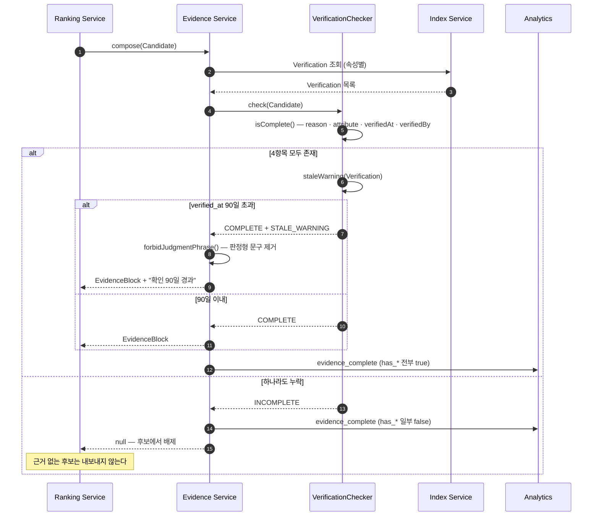
```mermaid
sequenceDiagram
    autonumber
    participant RS as Ranking Service
    participant ES as Evidence Service
    participant VC as VerificationChecker
    participant IS as Index Service
    participant AN as Analytics

    RS->>ES: compose(Candidate)
    ES->>IS: Verification 조회 (속성별)
    IS-->>ES: Verification 목록
    ES->>VC: check(Candidate)
    VC->>VC: isComplete() — reason · attribute · verifiedAt · verifiedBy
    alt 4항목 모두 존재
        VC->>VC: staleWarning(Verification)
        alt verified_at 90일 초과
            VC-->>ES: COMPLETE + STALE_WARNING
            ES->>ES: forbidJudgmentPhrase() — 판정형 문구 제거
            ES-->>RS: EvidenceBlock + "확인 90일 경과"
        else 90일 이내
            VC-->>ES: COMPLETE
            ES-->>RS: EvidenceBlock
        end
        ES->>AN: evidence_complete (has_* 전부 true)
    else 하나라도 누락
        VC-->>ES: INCOMPLETE
        ES->>AN: evidence_complete (has_* 일부 false)
        ES-->>RS: null — 후보에서 배제
        Note over RS: 근거 없는 후보는 내보내지 않는다
    end
```

### SD-05 공유 카드 생성

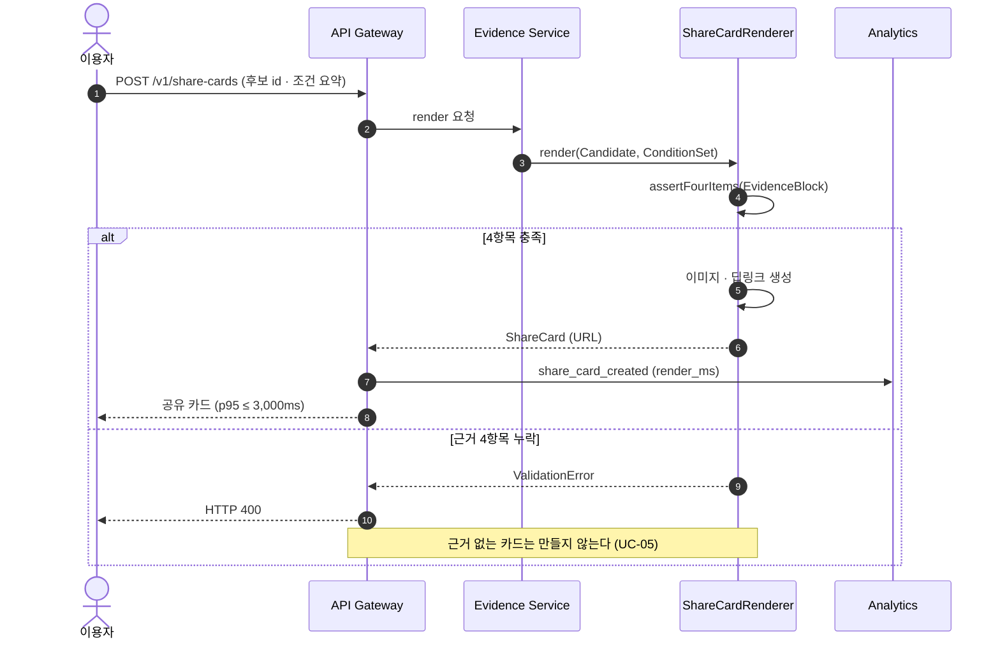
```mermaid
sequenceDiagram
    autonumber
    actor U as 이용자
    participant GW as API Gateway
    participant ES as Evidence Service
    participant SR as ShareCardRenderer
    participant AN as Analytics

    U->>GW: POST /v1/share-cards (후보 id · 조건 요약)
    GW->>ES: render 요청
    ES->>SR: render(Candidate, ConditionSet)
    SR->>SR: assertFourItems(EvidenceBlock)
    alt 4항목 충족
        SR->>SR: 이미지 · 딥링크 생성
        SR-->>GW: ShareCard (URL)
        GW->>AN: share_card_created (render_ms)
        GW-->>U: 공유 카드 (p95 ≤ 3,000ms)
    else 근거 4항목 누락
        SR-->>GW: ValidationError
        GW-->>U: HTTP 400
        Note over SR,GW: 근거 없는 카드는 만들지 않는다 (UC-05)
    end
```

### SD-06 에이전트 소환 → 제안 수집 → 180초 마감

Phase 2의 핵심 흐름이다. 마감 처리가 두 갈래로 갈리고, 제안 0건이어도 사용자는 결과를 받는다.

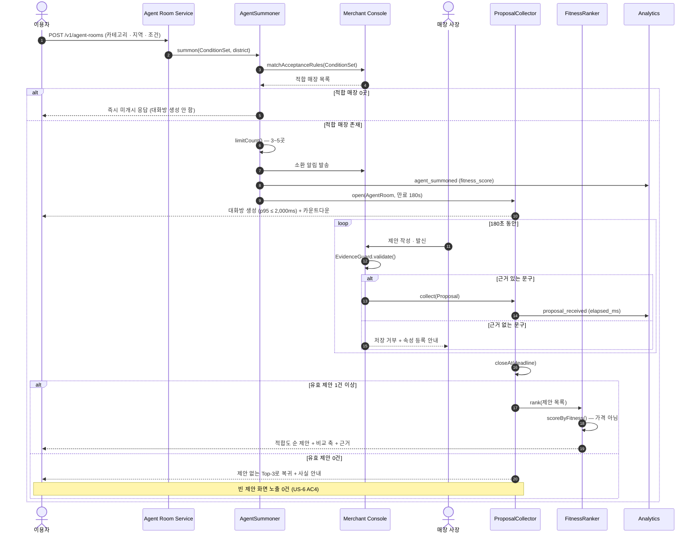
```mermaid
sequenceDiagram
    autonumber
    actor U as 이용자
    participant ARS as Agent Room Service
    participant AS2 as AgentSummoner
    participant MCS as Merchant Console
    actor M as 매장 사장
    participant PC as ProposalCollector
    participant FR as FitnessRanker
    participant AN as Analytics

    U->>ARS: POST /v1/agent-rooms (카테고리 · 지역 · 조건)
    ARS->>AS2: summon(ConditionSet, district)
    AS2->>MCS: matchAcceptanceRules(ConditionSet)
    MCS-->>AS2: 적합 매장 목록
    alt 적합 매장 0곳
        AS2-->>U: 즉시 미개시 응답 (대화방 생성 안 함)
    else 적합 매장 존재
        AS2->>AS2: limitCount() — 3~5곳
        AS2->>MCS: 소환 알림 발송
        AS2->>AN: agent_summoned (fitness_score)
        AS2->>PC: open(AgentRoom, 만료 180s)
        PC-->>U: 대화방 생성 (p95 ≤ 2,000ms) + 카운트다운
        loop 180초 동안
            M->>MCS: 제안 작성 · 발신
            MCS->>MCS: EvidenceGuard.validate()
            alt 근거 있는 문구
                MCS->>PC: collect(Proposal)
                PC->>AN: proposal_received (elapsed_ms)
            else 근거 없는 문구
                MCS-->>M: 저장 거부 + 속성 등록 안내
            end
        end
        PC->>PC: closeAt(deadline)
        alt 유효 제안 1건 이상
            PC->>FR: rank(제안 목록)
            FR->>FR: scoreByFitness() — 가격 아님
            FR-->>U: 적합도 순 제안 + 비교 축 + 근거
        else 유효 제안 0건
            PC-->>U: 제안 없는 Top-3로 복귀 + 사실 안내
            Note over PC,U: 빈 제안 화면 노출 0건 (US-6 AC4)
        end
    end
```

### SD-07 제안 선택 → 예약 승계 → 선결제

```mermaid
sequenceDiagram
    autonumber
    actor U as 이용자
    participant RPS as Reservation & Payment
    participant CO as ProposalCarryOver
    participant OC as OrderAmountCalculator
    participant PGC as PgDelegationClient
    participant PG3 as PG (외부)
    participant MCS as Merchant Console
    participant AN as Analytics

    U->>RPS: 제안 선택
    RPS->>CO: carry(Proposal)
    CO->>CO: 인원 · 메뉴 구성 · 시간 승계
    CO->>CO: assertNoReentry() — 재입력 필드 0개
    CO-->>U: 예약 화면 (승계 누락률 ≤ 0.5%)
    U->>RPS: 결제 진행
    RPS->>OC: calculate(MenuPlan, party)
    alt 금액 산출 성공
        OC->>PGC: authorize(Money, reservationId)
        PGC->>PG3: 결제 승인 요청
        alt PG 승인
            PG3-->>PGC: 승인 완료 (카드 정보 비보관)
            PGC-->>RPS: CONFIRMED
            RPS->>MCS: 확정 통보 (≤ 30s)
            RPS->>AN: session_completed
            RPS-->>U: 예약 확정
        else PG 거절
            PG3-->>PGC: 거절
            PGC-->>U: 결제 실패 안내 (예약 미확정)
        end
    else 산출 오류 (오류율 ≤ 0.3%)
        OC-->>U: 결제 중단 + 재시도 안내
    end
```

### SD-08 취소·환불 / 노쇼 판정·정산

두 흐름을 나란히 둔다 — **돈이 가는 방향이 반대**여서 함께 봐야 이해된다.

```mermaid
sequenceDiagram
    autonumber
    actor U as 이용자
    participant SCH as 시각 스케줄러
    participant RPS as Reservation & Payment
    participant NR as NoShowResolver
    participant PGC as PgDelegationClient
    participant MCS as Merchant Console
    participant AN as Analytics

    alt 취소 경로 — 방문 2시간 전
        U->>RPS: 예약 취소 요청
        RPS->>PGC: refundFull(paymentId)
        PGC-->>RPS: 환불 접수 (≤ 24h · 실패율 ≤ 0.5%)
        RPS->>MCS: 취소 즉시 통보
        RPS-->>U: 전액 환불 안내
    else 노쇼 경로 — 예약 시각 경과
        SCH->>NR: resolve(Reservation)
        NR->>NR: hasVisitConfirmation()
        alt 방문 확인 있음
            NR-->>RPS: VISITED
            RPS->>PGC: settleToMerchant() — 정상 정산
        else 방문 확인 없음
            NR-->>RPS: NO_SHOW (오판정률 ≤ 1%)
            RPS->>PGC: settleToMerchant() — 선결제액 매장 정산
            RPS->>AN: noshow_flagged (judged_at · settled)
            Note over AN: 주간 노쇼율 > 8% 시 F7·F8 노출 중단
        end
    end
```

### SD-09 불일치 신고 → 재확인 큐

```mermaid
sequenceDiagram
    autonumber
    actor U as 이용자
    participant ES as Evidence Service
    participant IS as Index Service
    participant RQ as ReverifyQueue
    actor OP as 서비스 운영자
    participant AN as Analytics

    U->>ES: "조건이 달랐다" 신고 (속성 지정)
    ES->>IS: Verification 상태 전환 요청
    IS->>IS: status = NEEDS_REVERIFY
    IS->>RQ: enqueue(Verification, REASON_USER_REPORT)
    RQ-->>IS: ReverifyTask 생성
    IS-->>U: 반영 완료 (지연 ≤ 60s)
    ES->>AN: mismatch_reported (attribute_key)
    OP->>RQ: nextTask(우선순위)
    RQ-->>OP: ReverifyTask
    OP->>IS: 확인 결과 입력
    alt 사실 확인됨
        IS->>IS: status = VERIFIED · verified_at 갱신
    else 사실이 아님
        IS->>IS: status = RETIRED · 속성 노출 중단
    end
    Note over U,AN: 불일치 신고율 ≤ 10% (보조 6)
```

### SD-10 계측 이벤트 수집 → 집계 → 알림

```mermaid
sequenceDiagram
    autonumber
    participant CL as 클라이언트 · 서비스
    participant EI as EventIngestor
    participant SS as SessionStitcher
    participant MA as MetricAggregator
    participant QC as MetricQualityChecker
    participant AD as MetricAlertDispatcher
    participant OP as 운영 채널

    CL->>EI: Event (event_id · occurred_at · properties)
    EI->>EI: deduplicate(event_id)
    alt 중복 event_id
        EI-->>CL: 폐기 (이중 계수 방지)
    else 신규
        EI->>EI: flagIncomplete() — 필수 속성 결측 표기
        EI->>SS: stitch(deviceId, userId)
        SS-->>EI: 세션 병합 결과
        EI->>MA: 적재 (occurred_at 파티션)
    end
    MA->>MA: aggregate(metricId, 기간)
    Note over MA: 48h 지연 도착 허용 · D+2 확정
    MA->>QC: 품질 점검
    QC->>QC: missingRate · incompleteRate · 재현성
    alt 품질 임계 통과
        QC-->>MA: isReliable = true
        MA->>AD: MetricValue
        AD->>AD: evaluate(임계 비교)
        alt 임계 초과
            AD->>OP: Slack · PagerDuty 알림 + 대응 절차
        end
    else 품질 결함
        QC-->>MA: isReliable = false
        MA->>OP: 지표 unreliable 표기 — 게이트 판정 제외
    end
```

---

## 6. 논리 흐름 — 플로차트

**읽는 법:** 마름모가 판단 지점이고, 화살표에 붙은 글자가 그 판단의 결과다.

### FC-01 조건 파싱 판정 흐름

```mermaid
flowchart TD
    S(["조건 입력 수신"]) --> A{"입력 형태"}
    A -->|"자연어 1줄"| B["NaturalConditionParser.parse()"]
    A -->|"구조화 조건"| E["조건 확정"]
    B --> C{"조건 카테고리<br/>사전에 존재?"}
    C -->|"예"| E
    C -->|"아니오"| D["ParseFailureGuard 포착<br/>query_parse_failed 적재"]
    D --> F["구조화 필터 UI 전환<br/>해석 못한 표현 그대로 표기"]
    F --> G{"이용자가<br/>필터 선택?"}
    G -->|"예"| E
    G -->|"이탈"| X(["query_abandoned"])
    E --> H{"확정 조건 수<br/>≥ 2개?"}
    H -->|"예"| I["필터 적용 → FC-02"]
    H -->|"1개 이하"| J["필수 입력 없이 진행<br/>필수 입력 필드 0개"]
    J --> I
    I --> K(["Top-3 반환"])

    style D fill:#fff3cd,stroke:#e0a800
    style F fill:#fff3cd,stroke:#e0a800
```

**판단 근거** — 조건이 1개 이하여도 진행한다. 필수 입력을 요구하면 US-2 AC3(필수 입력 필드 0개)을 위반한다. 단 북극성 지표(WEBD)는 조건 2개 이상 세션만 집계한다.

### FC-02 Top-3 선정 흐름

```mermaid
flowchart TD
    S(["필터된 후보 집합"]) --> A["후보별 EvidenceComposer.compose()"]
    A --> B{"근거 4항목<br/>모두 존재?"}
    B -->|"아니오"| C["후보 배제<br/>근거 없는 후보 반환 금지"]
    B -->|"예"| D{"verified_at<br/>90일 초과?"}
    D -->|"예"| E["'확인 90일 경과' 경고 부착"]
    D -->|"아니오"| F["경고 없음"]
    E --> G["판정형 문구 제거<br/>forbidJudgmentPhrase()"]
    F --> G
    G --> H{"근거 충족 후보<br/>몇 개?"}
    C --> H
    H -->|"3개 이상"| I["상위 3개 선정<br/>페이지네이션 없음"]
    H -->|"1~2개"| J["있는 만큼 반환<br/>+ 커버리지 부족 안내"]
    H -->|"0개"| K["FC-03 폴백 경로<br/>반경 확대 · 인접 카테고리"]
    I --> L["ComparisonAxisBuilder.buildAxes()"]
    J --> L
    L --> M(["Top-3 + 비교 축"])
    K --> M

    style C fill:#f8d7da,stroke:#dc3545
    style K fill:#fff3cd,stroke:#e0a800
```

**설계 판단** — 근거 충족 후보가 3개 미만이면 **후보를 채우지 않고 부족을 알린다.** 근거 없는 후보로 3칸을 메우는 것은 규칙 위반이고, 그 순간 경쟁사 화면과 같아진다.

### FC-03 인당 예상가 산출·제외 판정

```mermaid
flowchart TD
    S(["후보 매장"]) --> A{"PriceProfile<br/>존재?"}
    A -->|"아니오"| Z["'가격 확인 필요' 표기<br/>예산 필터 판정 제외"]
    A -->|"예"| B{"verified_at<br/>90일 이내?"}
    B -->|"아니오"| Z
    B -->|"예"| C{"결제 표본<br/>≥ 5건?"}
    C -->|"아니오"| Z
    C -->|"예"| D["PerPersonEstimator.estimate()"]
    D --> E{"범위 폭<br/>≤ ±20%?"}
    E -->|"아니오"| F["범위 재산출<br/>표본 추가 수집 큐"]
    F --> Z
    E -->|"예"| G["인당 예상가 범위 표기"]
    G --> H{"예산 상한<br/>초과?"}
    H -->|"예"| I["기본 결과 제외<br/>'예산 초과 N곳' 요약"]
    H -->|"아니오"| J(["후보 유지"])
    I --> K(["요약에만 노출"])
    Z --> L(["후보 유지 · 판정 대상 아님"])

    style Z fill:#fff3cd,stroke:#e0a800
    style I fill:#e2e3e5,stroke:#6c757d
```

**핵심** — 데이터가 부실한 매장을 **후보에서 빼지 않는다.** 빼면 커버리지 부족이 사용자에게 "결과 없음"으로 보인다. 대신 예상가를 만들지 않고 판정 대상에서만 제외한다(US-1 AC6).

### FC-04 제안 마감 처리

```mermaid
flowchart TD
    S(["대화방 생성"]) --> A{"적합 매장<br/>3곳 이상?"}
    A -->|"아니오"| B["즉시 미개시 응답<br/>대화방 만들지 않음"]
    A -->|"예"| C["3~5곳 소환 · 카운트다운 시작"]
    C --> D{"180초 경과<br/>전 제안 도착?"}
    D -->|"예"| E["EvidenceGuard.validate()"]
    E --> F{"등록 속성으로<br/>뒷받침?"}
    F -->|"아니오"| G["저장 거부<br/>속성 등록 안내"]
    G --> D
    F -->|"예"| H["제안 수집"]
    H --> D
    D -->|"180초 경과"| I{"유효 제안<br/>≥ 1건?"}
    I -->|"예"| J["FitnessRanker.rank()<br/>1순위 = 조건 적합도"]
    J --> K(["제안 비교 화면"])
    I -->|"아니오"| L["제안 없는 Top-3 복귀<br/>+ 사실 안내"]
    L --> M(["빈 제안 화면 노출 0건"])
    B --> M

    style G fill:#f8d7da,stroke:#dc3545
    style L fill:#fff3cd,stroke:#e0a800
```

### FC-05 노쇼 판정·정산 흐름

```mermaid
flowchart TD
    S(["예약 시각 경과"]) --> A{"방문 확인<br/>존재?"}
    A -->|"예"| B["VISITED · 정상 정산"]
    A -->|"아니오"| C{"취소 이력<br/>존재?"}
    C -->|"2시간 전 취소"| D["CANCELED → 전액 환불 (≤24h)"]
    C -->|"없음"| E{"매장 측<br/>수용 불가 사유?"}
    E -->|"있음"| F["매장 귀책 · 이용자 환불"]
    E -->|"없음"| G["NO_SHOW 기록<br/>noshow_flagged 적재"]
    G --> H["선결제액 매장 정산"]
    H --> I{"주간 노쇼율<br/>> 8%?"}
    I -->|"예"| J["F7·F8 신규 노출 중단<br/>선결제 정책 재검토"]
    I -->|"아니오"| K(["정산 완료"])
    B --> K
    D --> K
    F --> K
    J --> K

    style G fill:#f8d7da,stroke:#dc3545
    style J fill:#f8d7da,stroke:#dc3545
```

**오판정 방지 장치** — 매장 측 수용 불가 사유를 노쇼 판정 앞에 둔다. 매장이 문을 닫았는데 이용자를 노쇼로 기록하면 오판정률 1% 목표를 지킬 수 없다.

### FC-06 속성 신선도 관리 흐름

```mermaid
flowchart TD
    S(["야간 배치 시작"]) --> A["FreshnessScanBatch.scanNightly()"]
    A --> B{"verified_at<br/>90일 초과?"}
    B -->|"아니오"| C(["VERIFIED 유지"])
    B -->|"예"| D["status = STALE<br/>노출 시 경고 병기"]
    D --> E["ReverifyQueue.enqueue()"]
    E --> F{"90일 초과 속성<br/>비율 > 20%?"}
    F -->|"예"| G["재확인 큐 우선순위 상향<br/>온보딩 인력 재배치"]
    F -->|"아니오"| H["정상 우선순위"]
    G --> I["운영자 처리"]
    H --> I
    I --> J{"확인 결과"}
    J -->|"사실 확인"| K["VERIFIED · verified_at 갱신"]
    J -->|"사실 아님"| L["RETIRED · 노출 중단"]
    K --> C
    L --> M(["속성 제거 · 후보 근거 재계산"])

    style D fill:#fff3cd,stroke:#e0a800
    style G fill:#f8d7da,stroke:#dc3545
```

---

## 7. 계측 파이프라인 — 데이터 흐름

**이 그림이 말하는 것:** 사용자 행동이 어떻게 숫자가 되는지다. **사용자 요청 경로와 분리**되어 있어서, 계측이 실패해도 사용자는 영향을 받지 않는다.

```mermaid
flowchart LR
    subgraph src["발생원"]
        C["클라이언트<br/>화면 상호작용"]
        SVC["서비스<br/>서버 이벤트"]
        BATCH["야간 배치<br/>신선도 · 커버리지"]
    end

    Q[["이벤트 큐<br/>비동기 · 유실 허용"]]
    ING["EventIngestor<br/>event_id 중복 제거<br/>incomplete 플래그"]
    STITCH["SessionStitcher<br/>익명 ID → 사용자 ID 소급 병합"]
    RAW[("events 테이블<br/>occurred_at 파티션")]
    AGG["MetricAggregator<br/>12개 지표 집계"]
    QC{"MetricQualityChecker<br/>누락 ≤ 2% · 결측 ≤ 1%"}
    MART[("지표 마트<br/>일간 · 주간 · 월간")]
    DASH["퍼널 대시보드"]
    ALERT["MetricAlertDispatcher"]
    GATE["릴리스 게이트 판정"]
    UNREL["unreliable 표기<br/>게이트 판정 제외"]

    C --> Q
    SVC --> Q
    BATCH --> Q
    Q --> ING --> STITCH --> RAW --> AGG --> QC
    QC -->|"통과"| MART
    QC -->|"결함"| UNREL
    MART --> DASH
    MART --> ALERT
    MART --> GATE
    UNREL --> GATE

    style Q stroke-dasharray: 5 3
    style UNREL fill:#f8d7da,stroke:#dc3545
```

| 설계 결정 | 이유 |
| --- | --- |
| 이벤트 큐를 **비동기·유실 허용**으로 둔다 | 계측이 사용자 요청의 지연이나 실패 원인이 되면 안 된다 (REQ-NF-001) |
| `event_id` 중복 제거를 **수집 단계**에 둔다 | 클라이언트 재시도로 인한 이중 계수는 집계 단계에서는 되돌릴 수 없다 |
| 품질 점검을 **집계 뒤, 게이트 앞**에 둔다 | 계측 결함과 제품 실패를 구분하지 못하면 잘못된 릴리스 결정을 한다 |
| `occurred_at` 파티셔닝 | 48시간 지연 도착을 허용하면서 D+2 확정이 가능해야 한다 |

---

## 8. 성능 예산 배분

REQ-NF-001의 1,000ms를 구간별로 쪼갠 것이다. **어느 구간이 예산을 넘었는지**를 APM에서 바로 지목할 수 있어야 한다.

```mermaid
flowchart LR
    A["클라이언트 → GW<br/>≤ 50ms"] --> B["조건 파싱<br/>≤ 150ms"]
    B --> C["색인 조회<br/>≤ 400ms<br/>캐시 히트 시 ≤ 120ms"]
    C --> D["근거 조립 · 랭킹<br/>≤ 300ms<br/>후보별 병렬"]
    D --> E["직렬화 · 응답<br/>≤ 100ms"]
    E --> F(["합계 p95 ≤ 1,000ms"])

    style F fill:#d1e7dd,stroke:#198754
```

| 구간 | 예산 | 초과 시 대응 | 관측 |
| --- | --- | --- | --- |
| 조건 파싱 | ≤ 150ms | 파서 모델 롤백 | `query_committed.parse_ms` |
| 색인 조회 | ≤ 400ms (캐시 히트 ≤ 120ms) | 캐시 워밍 · 샤드 확인 | REQ-NF-002 · 캐시 히트율 |
| 근거 조립·랭킹 | ≤ 300ms | 후보 수 축소 · 근거 문장 캐싱 | `top3_rendered.latency_ms` |
| 전체 | p95 ≤ 1,000ms / p99 ≤ 2,000ms | 10분 > 1,500ms 시 Slack 알림 | SRS §10.3 |

---

## 9. 요구사항 ↔ 설계 산출물 추적표

SRS의 모든 기능 요구사항이 최소 한 개의 설계 산출물로 이어지는지 확인하는 표다.

| 요구사항 | 유스케이스 | 클래스 (§4) | 시퀀스 (§5) | 플로차트 (§6) | 상태 (§3.2) |
| --- | --- | --- | --- | --- | --- |
| REQ-FUNC-001 색인 | UC-01 · 02 | §4.2 | SD-01 | — | — |
| REQ-FUNC-002 가격 필터 | UC-03 · 06 | §4.1 | SD-01 | FC-03 | — |
| REQ-FUNC-003 메뉴 추천 | UC-02 | §4.1 | SD-03 | FC-01 | — |
| REQ-FUNC-004 자연어 검색 | UC-01 | §4.1 | SD-02 | FC-01 | — |
| REQ-FUNC-005 근거·공유 | UC-04 · 05 · 07 | §4.3 | SD-04 · 05 · 09 | FC-02 · 06 | §3.2.1 |
| REQ-FUNC-006 Top-3 | UC-01 | §4.3 | SD-01 | FC-02 | — |
| REQ-FUNC-007 예약·결제 | UC-09 · 10 · 15 | §4.5 | SD-07 · 08 | FC-05 | §3.2.3 |
| REQ-FUNC-008 매장 콘솔 | UC-11 · 12 | §4.4 | SD-06 | FC-04 | §3.2.4 |
| REQ-FUNC-009 소환·대화방 | UC-08 | §4.4 | SD-06 | FC-04 | §3.2.2 |
| REQ-FUNC-010 성분·접근성 필드 | — (스키마만) | §4.2 | — | — | — |
| REQ-NF-001 · 002 · 003 응답 | — | §4.1 · 4.2 | SD-01 | — | — |
| REQ-NF-007 폴백 | UC-01 · 02 | §4.1 | SD-02 · 03 | FC-01 | — |
| REQ-NF-008 신선도 | UC-14 | §4.2 | SD-09 | FC-06 | §3.2.1 |
| REQ-NF-011 결제 보안 | UC-09 · 10 | §4.5 | SD-07 · 08 | — | §3.2.3 |
| REQ-NF-013 · 014 비용 | UC-13 | §4.6 | SD-10 | — | — |
| REQ-NF-015 모니터링 | — | §4.6 | SD-10 | — | — |

**REQ-FUNC-010에 시퀀스가 없는 이유** — v0.1에서는 스키마 필드만 확보하고 동작을 만들지 않는다. 흐름이 없는 것이 설계대로다.

---

**SDD-AIPLACE-MVP-001 · v1.0 · 2026-08-24 · Owner 5팀**

상위 문서: `[SRS 문서] AI-Place-Mate (한글).md` · `ai-place-prd-v1_0.md`
