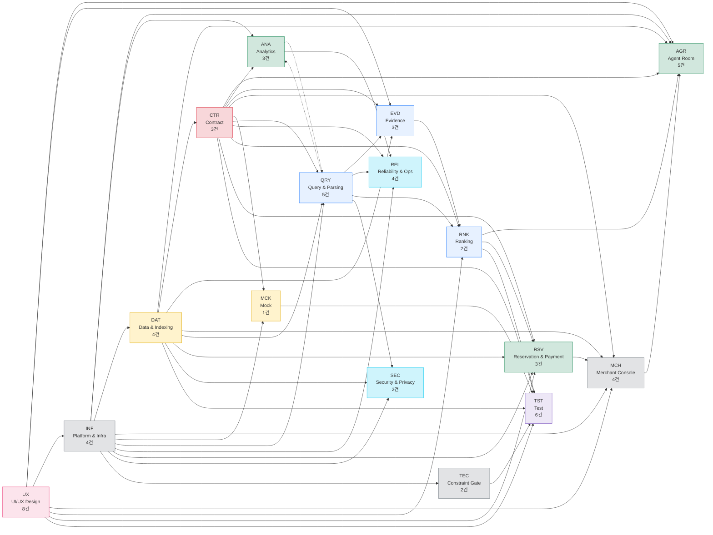
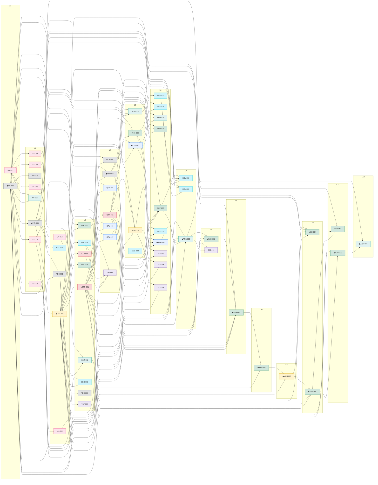
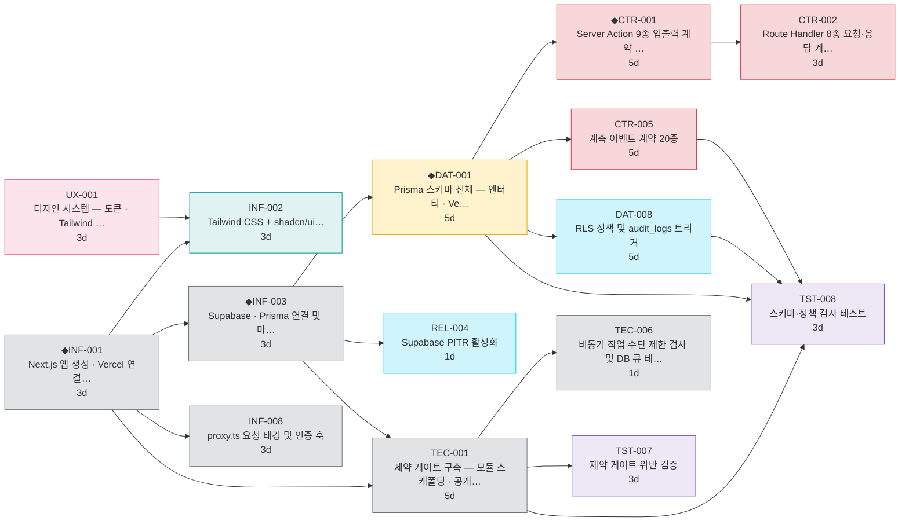
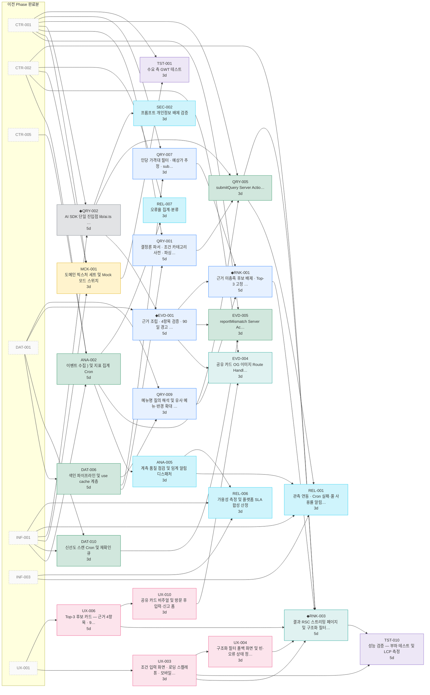
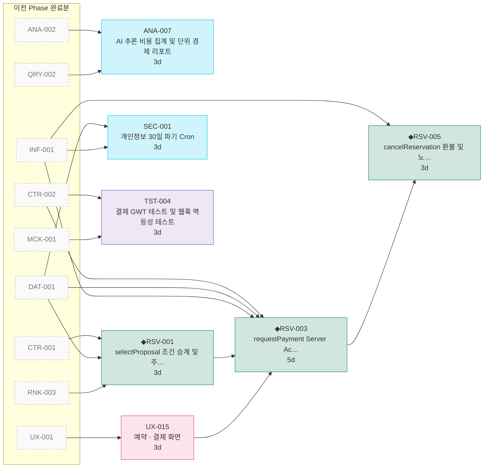
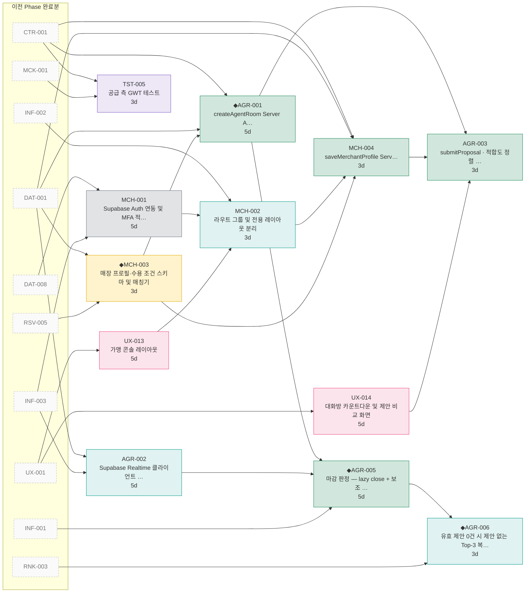
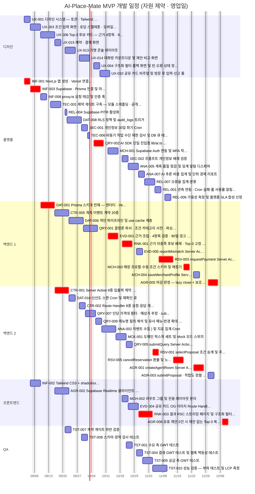
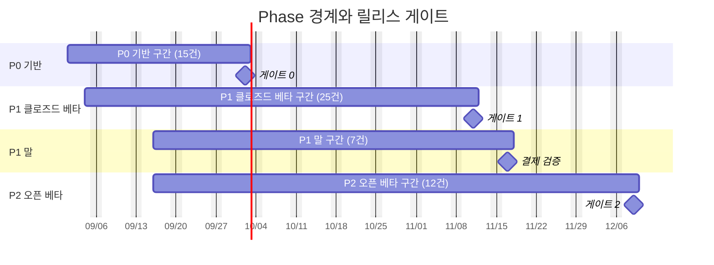

# [총괄] 개발 실행 계획 — AI-Place-Mate

**문서 ID:** PLAN-AIPLACE-MVP-001

**개정 버전:** 1.0

**날짜:** 2026-08-25

**근거 문서:** TASK-AIPLACE-MVP-001 v3.2 (`[태스크 리스트] AI-Place-Mate.md` · 59건) · `docs/tasks/*.md` (태스크별 이슈 명세 59건)

> ⚙️ **이 문서는 생성물이다.** 단일 원천은 `tools/tasks_data.py` 이며 `python3 tools/gen_exec_plan.py` 로 재생성한다. **일정의 모든 선후 관계는 `선행 태스크` 열에 실재하는 의존성**이며, 임의로 그린 간선이 없다.

---

## 0. 이 문서의 위치

| 문서 | 답하는 질문 |
| --- | --- |
| SRS (기술제약 반영판) | **무엇을** 만드는가 |
| 설계 문서 (SDD) | **어떻게** 만드는가 |
| 태스크 리스트 | **무엇을 쪼개** 만드는가 |
| `docs/tasks/*.md` | **각 조각을 어떻게** 끝내는가 (AC · DoD) |
| **본 문서** | **어떤 순서로, 누가, 언제** 만드는가 |

실무자는 본 문서에서 **자기 트랙과 착수 시점**을 확인하고, 실제 작업은 `docs/tasks/<TASK-ID>.md` 의 Task Breakdown과 Acceptance Criteria를 따른다.

---

## 1. 실행 전략

### 1.1 네 가지 원칙

| # | 원칙 | 근거 | 어기면 |
| --- | --- | --- | --- |
| **1** | **게이트를 먼저 세운다** — `TEC-001`·`TST-007` 을 첫 주에 작동시킨다 | SRS §14.2 | 제약 위반이 누적된 뒤 한꺼번에 드러난다 |
| **2** | **계약을 먼저 확정한다** — `CTR-001`·`CTR-002`·`CTR-005` 가 모든 구현의 기준점 | 방법론 Step 1 | 두 태스크가 같은 계약을 다르게 구현해도 탐지되지 않는다 |
| **3** | **Mock으로 병행한다** — `MCK-001` 픽스처로 UI가 백엔드를 기다리지 않는다 | ANL-002 §2.1 | 프론트가 직렬 대기하며 임계 경로가 길어진다 |
| **4** | **디자인이 앞선다** — `UX-001` 은 착수 0일차. 6개 태스크를 막고 있다 | DAG L0 | 프론트·플랫폼이 동시에 대기한다 |

### 1.2 트랙 구성

역할은 **유형(Type)** 을 기준으로 나눈다 — Epic이 아니라 유형이 담당자를 정한다(태스크 리스트 §0.3).

| 트랙 | 담당 유형 | 레인 수 | 태스크 | 공수 |
| --- | --- | --- | --- | --- |
| **플랫폼** | `Infra` · `NFR` | 1 | 16건 | 52 person-day |
| **백엔드** | `Contract` · `Data` · `Read` · `Write` | 2 | 23건 | 91 person-day |
| **프론트엔드** | `UI` | 1 | 6건 | 22 person-day |
| **디자인** | `Design` | 1 | 8건 | 30 person-day |
| **QA** | `Test` | 1 | 6건 | 20 person-day |
| | | **6** | **59건** | **215 person-day** |

**최소 인원 근거** — 총 공수 215 person-day를 임계 경로 63일 안에 소화하려면 이론상 **3.4명**이 필요하다. 역할별 부하 불균형(백엔드 91일)을 고려해 백엔드만 2레인으로 두고 총 6명으로 구성했다.

### 1.3 착수 전에 풀어야 할 것

외부 의존성은 코드로 해결할 수 없다. **아래가 막히면 해당 트랙이 통째로 멈춘다.**

| 외부 의존 | 막는 태스크 | 필요 시점 | 미확보 시 |
| --- | --- | --- | --- |
| **DEP-T1** Vercel 계정·프로젝트 | `INF-001` | **0일차** | 아무것도 배포되지 않는다 |
| **DEP-T2** Supabase 프로젝트·CLI | `INF-003` · `DAT-001` | **0일차** | 데이터 계층 전체 정지 |
| **DEP-T3** Gemini API 키·쿼터 | `QRY-002` | S3 착수 전 | 결정론 경로로만 동작 (자연어 커버리지 하락) |
| **DEP-T4** PG 계약 (서명·멱등 키) | `RSV-003` · `CTR-002` 웹훅 절 | S6 착수 전 | 결제 슬라이스 착수 불가 |
| **DEP-T5** 가맹 온보딩 인력 · 상권 3곳 데이터 | `DAT-006` · `AGR-001` | S1 착수 전 | 색인에 값이 비어 Top-3가 성립하지 않는다 (R2) |

### 1.4 게이트와 중단 조건

SRS §10.4의 릴리스 게이트를 일정에 박아 둔다. **게이트를 통과하지 못하면 다음 Phase를 시작하지 않는다.**

| 게이트 | 시점 | 통과 조건 | 미달 시 |
| --- | --- | --- | --- |
| **게이트 0** | S-1 종료 | `REQ-TEC-001~015` 전건 통과 · 파싱 실패율 ≤ 3% · Top-3 p95 ≤ 1.5s · 결정론 히트율 ≥ 60% | Phase 1을 시작하지 않는다 |
| **게이트 1** | Phase 1 종료 | WEBD ≥ 목표 60% · 불일치 신고 ≤ 15% · **가맹 LOI ≥ 30곳** | 에이전트 제안(`AGR`·`MCH`)을 v0.2로 연기하고 탐색 기능만 GA |
| **게이트 2** | Phase 2 종료 | 제안 도착 ≥ 70% · 선택 제안 노쇼 ≤ 8% · **300 RPS 부하 테스트 통과**(`TST-010`) | 에이전트 제안 중단 |

**상시 중단 조건** — 주간 노쇼율 8% 초과 시 `AGR`·`MCH` 신규 노출을 즉시 중단한다(SRS §10.3). 가맹점은 노쇼 한 번으로 이탈하므로 이 순서를 뒤집을 수 없다.

### 1.5 운영 규칙

- **한 태스크 = 한 PR = 한 이슈.** 축약으로 흡수된 태스크는 한 PR로 처리하되 커밋을 흡수 단위로 나눈다.
- **DoD 6개 공통 항목**을 통과하지 못한 PR은 머지하지 않는다 (`docs/tasks/*.md` 참조).
- **빌드 실패 = 배포 차단.** 외부 CI가 없으므로 품질 게이트가 빌드 안에 있다 (C-TEC-007 · ADR-T08).
- **스키마 변경은 사람이 승인한다.** 마이그레이션은 빌드에 넣지 않는다 (SRS §14.4).
- **계측 없는 지표는 판정에 쓰지 않는다.** `unreliable` 표기 지표는 게이트에서 배제한다 (SRS §10.2.5).

---

## 2. 의존성 구조

태스크 59건 · 의존 간선 120개 · 진입점(선행 없음) 2건 · 말단(후행 없음) 19건 · 순환 0.

### 2.1 DAG 레벨 — 동시 착수 가능 묶음

같은 레벨의 태스크는 **선행이 모두 끝난 시점에 동시 착수할 수 있다.** 자원이 무한하면 이 레벨 수가 곧 단계 수다.

| 레벨 | 건수 | 태스크 | 최장 소요 |
| --- | --- | --- | --- |
| **L0** | 2 | INF-001 · UX-001 | 3d |
| **L1** | 8 | INF-002 · INF-003 · INF-008 · UX-003 · UX-006 · UX-013 · UX-014 · UX-015 | 5d |
| **L2** | 5 | DAT-001 · REL-004 · TEC-001 · UX-004 · UX-010 | 5d |
| **L3** | 9 | AGR-002 · CTR-001 · CTR-005 · DAT-006 · DAT-008 · DAT-010 · SEC-001 · TEC-006 · TST-007 | 5d |
| **L4** | 7 | CTR-002 · MCH-001 · QRY-001 · QRY-002 · QRY-007 · QRY-009 · TST-008 | 5d |
| **L5** | 5 | ANA-002 · EVD-001 · MCH-002 · MCK-001 · SEC-002 | 5d |
| **L6** | 10 | ANA-005 · ANA-007 · EVD-004 · EVD-005 · QRY-005 · REL-007 · RNK-001 · TST-001 · TST-004 · TST-005 | 5d |
| **L7** | 3 | REL-001 · REL-006 · RNK-003 | 5d |
| **L8** | 2 | RSV-001 · TST-010 | 5d |
| **L9** | 1 | RSV-003 | 5d |
| **L10** | 1 | RSV-005 | 3d |
| **L11** | 1 | MCH-003 | 3d |
| **L12** | 2 | AGR-001 · MCH-004 | 5d |
| **L13** | 2 | AGR-003 · AGR-005 | 5d |
| **L14** | 1 | AGR-006 | 3d |

**레벨 15단계** — 자원이 무한해도 이보다 적은 단계로 끝낼 수 없다. 실제로는 자원 제약 때문에 아래 §3의 일정이 적용된다.

### 2.2 Epic 수준 의존 구조

**이 그림이 말하는 것:** 태스크 59건을 Epic 16개로 접었을 때의 큰 그림이다. 화살표는 "이 Epic이 저 Epic의 결과를 필요로 한다"는 뜻이며, 개별 태스크 간선을 Epic 단위로 합친 것이다.



> ⚠️ **점선은 Epic 수준에서만 생기는 양방향 관계**다 (`ANA` ↔ `QRY`). 태스크 수준에서는 순환이 없다 — `QRY-005` 가 `ANA-002`(계측 태깅)를 필요로 하고, `ANA-007`(AI 비용 집계)이 `QRY-002` 를 필요로 하는 **서로 다른 태스크 쌍**이기 때문이다. Epic으로 접으면서 생긴 착시이므로 착수 순서에 영향을 주지 않는다.

Epic 간 간선 50개. `INF` → `DAT` → `CTR` 이 모든 갈래의 뿌리이고, `UX` 는 `INF`·`RNK`·`MCH`·`AGR`·`EVD`·`RSV` 여섯 갈래로 뻗는다 — 디자인이 늦으면 여섯 곳이 동시에 막힌다.

### 2.3 전체 태스크 DAG

**이 그림이 말하는 것:** 태스크 59건과 의존 간선 120개 전부다. 세로 묶음(`L0`~`L14`)이 DAG 레벨이며, **같은 묶음 안의 태스크는 서로 의존하지 않아 동시에 착수할 수 있다.** 왼쪽에서 오른쪽으로 갈수록 나중에 시작한다.

> 화면이 넓지 않으면 가로 스크롤로 본다. 읽기 편한 단위는 §2.4의 Phase별 DAG다.



**◆ 표시가 임계 경로**(§2.5) 위의 태스크다. 색은 유형을 뜻한다 — `Infra` · `Data` · `Contract` · `Read` · `Write` · `UI` · `NFR` · `Test` · `Design` 순으로 회색·노랑·빨강·파랑·초록·청록·하늘·보라·분홍.

### 2.4 Phase별 상세 DAG

전체 DAG를 실무 단위로 자른 것이다. **실선 노드가 해당 Phase에서 수행하는 태스크**, 점선 노드는 앞 Phase에서 이미 끝난 선행이다.

#### P0 기반 · 계약 — 15건

내부 간선 18개 · 외부 선행 0건.



#### P1 클로즈드 베타 — 25건

내부 간선 30개 · 외부 선행 7건 (`CTR-001` · `CTR-002` · `CTR-005` · `DAT-001` · `INF-001` · `INF-003` · `UX-001`).



#### P1 말 · 예약·결제 — 7건

내부 간선 3개 · 외부 선행 9건 (`ANA-002` · `CTR-001` · `CTR-002` · `DAT-001` · `INF-001` · `MCK-001` · `QRY-002` · `RNK-003` · `UX-001`).



#### P2 오픈 베타 — 12건

내부 간선 11개 · 외부 선행 10건 (`CTR-001` · `DAT-001` · `DAT-008` · `INF-001` · `INF-002` · `INF-003` · `MCK-001` · `RNK-003` · `RSV-005` · `UX-001`).



### 2.5 임계 경로

**15단계 · 63영업일.** 위 DAG에서 가장 긴 사슬만 뽑은 것이다. 인원을 늘려도 이보다 빨라지지 않으며, 이 사슬 위의 태스크가 하루 밀리면 전체가 하루 밀린다.

```mermaid
flowchart LR
    INF001["INF-001<br/>Next.js 앱 생성 · Vercel 연결…<br/>3d"]:::inf
    INF003["INF-003<br/>Supabase · Prisma 연결 및 마…<br/>3d"]:::inf
    DAT001["DAT-001<br/>Prisma 스키마 전체 — 엔터티 · Ve…<br/>5d"]:::dat
    CTR001["CTR-001<br/>Server Action 9종 입출력 계약 …<br/>5d"]:::ctr
    QRY002["QRY-002<br/>AI SDK 단일 진입점 lib/ai.ts …<br/>5d"]:::inf
    EVD001["EVD-001<br/>근거 조립 · 4항목 검증 · 90일 경고 …<br/>5d"]:::rd
    RNK001["RNK-001<br/>근거 미충족 후보 배제 · Top-3 고정 …<br/>5d"]:::rd
    RNK003["RNK-003<br/>결과 RSC 스트리밍 페이지 및 구조화 필터…<br/>5d"]:::ui
    RSV001["RSV-001<br/>selectProposal 조건 승계 및 주…<br/>3d"]:::wr
    RSV003["RSV-003<br/>requestPayment Server Ac…<br/>5d"]:::wr
    RSV005["RSV-005<br/>cancelReservation 환불 및 노…<br/>3d"]:::wr
    MCH003["MCH-003<br/>매장 프로필·수용 조건 스키마 및 매칭기<br/>3d"]:::dat
    AGR001["AGR-001<br/>createAgentRoom Server A…<br/>5d"]:::wr
    AGR005["AGR-005<br/>마감 판정 — lazy close + 보조 …<br/>5d"]:::wr
    AGR006["AGR-006<br/>유효 제안 0건 시 제안 없는 Top-3 복…<br/>3d"]:::ui
    INF001 --> INF003
    INF003 --> DAT001
    DAT001 --> CTR001
    CTR001 --> QRY002
    QRY002 --> EVD001
    EVD001 --> RNK001
    RNK001 --> RNK003
    RNK003 --> RSV001
    RSV001 --> RSV003
    RSV003 --> RSV005
    RSV005 --> MCH003
    MCH003 --> AGR001
    AGR001 --> AGR005
    AGR005 --> AGR006
    classDef ctr fill:#f8d7da,stroke:#dc3545
    classDef dat fill:#fff3cd,stroke:#e0a800
    classDef inf fill:#e2e3e5,stroke:#6c757d
    classDef rd fill:#e7f1ff,stroke:#0d6efd
    classDef wr fill:#d1e7dd,stroke:#198754
    classDef tst fill:#ede7f6,stroke:#7e57c2
    classDef nfr fill:#cff4fc,stroke:#0dcaf0
    classDef dsg fill:#fce4ec,stroke:#ec407a
    classDef ui fill:#e0f2f1,stroke:#009688
```



### 2.6 병목 — 후행이 많은 태스크

아래 태스크가 밀리면 괄호 안 수만큼이 **직접** 밀린다. 리뷰를 최우선으로 배정한다.

| 태스크 | 유형 | 직접 후행 | 임계 경로 | 소요 |
| --- | --- | --- | --- | --- |
| [`DAT-001`](../docs/tasks/DAT-001.md) | `Data` | **15건** | ✅ 포함 | 5d |
| [`INF-001`](../docs/tasks/INF-001.md) | `Infra` | **14건** | ✅ 포함 | 3d |
| [`CTR-001`](../docs/tasks/CTR-001.md) | `Contract` | **12건** | ✅ 포함 | 5d |
| [`INF-003`](../docs/tasks/INF-003.md) | `Infra` | **7건** | ✅ 포함 | 3d |
| [`CTR-002`](../docs/tasks/CTR-002.md) | `Contract` | **7건** | — | 3d |
| [`UX-001`](../docs/tasks/UX-001.md) | `Design` | **6건** | — | 3d |
| [`ANA-002`](../docs/tasks/ANA-002.md) | `Write` | **4건** | — | 5d |
| [`QRY-002`](../docs/tasks/QRY-002.md) | `Infra` | **4건** | ✅ 포함 | 5d |

### 2.7 병렬 가능성이 큰 구간

- **L6 (10건)** — 플랫폼 3건 · 프론트엔드 1건 · 백엔드 3건 · QA 3건. 트랙을 모두 가동하면 5일에 소화된다.
- **L3 (9건)** — 프론트엔드 1건 · 백엔드 4건 · 플랫폼 3건 · QA 1건. 트랙을 모두 가동하면 5일에 소화된다.
- **L1 (8건)** — 프론트엔드 1건 · 플랫폼 2건 · 디자인 5건. 트랙을 모두 가동하면 5일에 소화된다.

---

## 3. 일정

### 3.1 산정 기준

| 항목 | 값 | 근거 |
| --- | --- | --- |
| 복잡도 → 소요 | **H 5일 · M 3일 · L 1일** | 태스크 리스트 §0.5의 판정 기준을 영업일로 환산 |
| 총 공수 | 215 person-day | 59건 합계 |
| 임계 경로 | **63영업일** | 기간 가중 최장 경로 (§2.2) |
| 트랙 구성 | 6레인 | 플랫폼1 · 백엔드2 · 프론트1 · 디자인1 · QA1 |
| **자원 제약 완료** | **72영업일** | 아래 시뮬레이션 결과 |
| 시작일 | 2026-09-01 (월) | 주말 제외 |
| 완료일 | 2026-12-09 | 약 14주 |

**임계 경로 63일 대비 실제 72일** — 차이 9일은 자원 대기다. 인원을 늘려도 63일 밑으로는 내려가지 않는다.

> ⚠️ **소요일은 복잡도 등급에서 기계적으로 환산한 값이다.** 실제 팀 역량으로 재산정해야 하며, 재산정 시 `tools/gen_exec_plan.py` 의 `DUR` 를 고치고 재생성한다.

### 3.2 트랙별 Gantt

**이 그림이 말하는 것:** 가로가 시간, 각 구획이 한 사람의 작업 레인이다. 같은 시각에 여러 레인이 차 있으면 그만큼 **병렬로 진행**된다.



붉게 표시된 것이 **임계 경로** 위의 태스크다.

### 3.3 Phase · 게이트 일정

**이 그림이 말하는 것:** Phase 경계와 게이트가 언제 오는지다. 게이트는 **통과 판정 시점**이며 미달 시 다음 Phase가 시작되지 않는다.



| Phase | 태스크 | 기간 | 종료 시 판정 |
| --- | --- | --- | --- |
| **P0 기반** | 15건 | 2026-09-01 ~ 2026-10-02 (24d) | 게이트 0 — REQ-TEC 전건 통과 · 결정론 히트율 ≥ 60% |
| **P1 클로즈드 베타** | 25건 | 2026-09-04 ~ 2026-11-11 (49d) | 게이트 1 — WEBD ≥ 목표 60% · 가맹 LOI ≥ 30곳 |
| **P1 말** | 7건 | 2026-09-16 ~ 2026-11-17 (45d) | 결제 검증 — 웹훅 멱등성 · 노쇼 오판정률 ≤ 1% |
| **P2 오픈 베타** | 12건 | 2026-09-16 ~ 2026-12-09 (61d) | 게이트 2 — 제안 도착 ≥ 70% · 노쇼 ≤ 8% · 300 RPS 통과 |

### 3.4 웨이브별 착수표

자원 제약을 반영한 **실제 착수 순서**다. 같은 주에 시작하는 태스크가 병렬 작업 단위다.

| 주차 | 착수 태스크 | 트랙 |
| --- | --- | --- |
| **W1** (2026-09-01~) | `UX-001` · `UX-003` · `INF-002` · `INF-001` · `INF-003` | 디자인 프론트엔드 플랫폼 |
| **W2** (2026-09-08~) | `DAT-001` · `UX-006` · `INF-008` · `TEC-001` | 디자인 백엔드 플랫폼 |
| **W3** (2026-09-15~) | `CTR-001` · `CTR-005` · `UX-013` · `UX-015` · `AGR-002` · `REL-004` · `TST-007` | QA 디자인 백엔드 프론트엔드 플랫폼 |
| **W4** (2026-09-22~) | `CTR-002` · `DAT-006` · `DAT-010` · `UX-014` · `DAT-008` | 디자인 백엔드 플랫폼 |
| **W5** (2026-09-29~) | `QRY-001` · `QRY-007` · `UX-004` · `QRY-002` · `SEC-001` · `TEC-006` · `TST-008` | QA 디자인 백엔드 플랫폼 |
| **W6** (2026-10-06~) | `ANA-002` · `EVD-001` · `QRY-009` · `UX-010` · `MCH-001` | 디자인 백엔드 플랫폼 |
| **W7** (2026-10-13~) | `MCK-001` · `RNK-001` · `MCH-002` · `SEC-002` | 백엔드 프론트엔드 플랫폼 |
| **W8** (2026-10-20~) | `EVD-005` · `QRY-005` · `EVD-004` · `ANA-005` · `TST-001` · `TST-004` | QA 백엔드 프론트엔드 플랫폼 |
| **W9** (2026-10-27~) | `RNK-003` · `ANA-007` · `REL-007` · `TST-005` | QA 프론트엔드 플랫폼 |
| **W10** (2026-11-03~) | `RSV-001` · `RSV-003` · `REL-001` · `REL-006` · `TST-010` | QA 백엔드 플랫폼 |
| **W11** (2026-11-10~) | `RSV-005` | 백엔드 |
| **W12** (2026-11-17~) | `AGR-001` · `MCH-003` · `MCH-004` | 백엔드 |
| **W13** (2026-11-24~) | `AGR-003` · `AGR-005` | 백엔드 |
| **W14** (2026-12-01~) | `AGR-006` | 프론트엔드 |

---

## 4. 리스크와 대응

일정 관점에서 본 리스크다. 제품 리스크(R1~R6)와 기술 리스크(R-T1~T4)는 SRS §11에 있다.

| 리스크 | 일정 영향 | 조기 신호 | 대응 |
| --- | --- | --- | --- |
| **DAT-001 지연** | 후행 15건이 함께 밀린다. 임계 경로 위 | S0 첫 주에 스키마 리뷰가 안 끝남 | 스키마 확정을 S0 최우선으로. ADR-001 되돌림 비용이 '최대'라 급하게 시작하면 더 비싸다 |
| **CTR-001 지연** | 후행 12건. 계약이 흔들리면 재작업 | 계약 리뷰가 2일 이상 지연 | 계약만 먼저 머지하고 구현은 뒤로. 스냅샷 테스트로 변경을 가시화 |
| **DEP-T4 PG 계약 미확정** | `RSV-003` 착수 불가 → 결제·대화방 전체 정지 | S5 진입 시점에 서명 알고리즘 미확정 | 웹훅 계약을 잠정 정의해 `CTR-002` 를 진행하고, 확정 후 서명부만 교체 |
| **DEP-T5 상권 데이터 미확보** | `DAT-006` 이 빈 파이프라인이 된다 (R2) | 상권당 필수 필드 5개 충족 매장 300곳 미달 | 상권 3곳 집중 · 전국 확장 금지. 커버리지 리포트를 주간 추적 |
| **결정론 파서 흡수율 미달** | `QRY-001` 재작업 + 비용·지연 동시 악화 (R-T1) | Phase 0 로그에서 `parse_path=llm` 비율 40% 초과 | 사전 확장을 별도 태스크로 분리. 게이트 0 조건(히트율 ≥ 60%)으로 고정 |
| **가맹 LOI 30곳 미달** | 게이트 1 미통과 → `MCH`·`AGR` 9건이 v0.2로 연기 | Phase 1 중반 LOI 확보 속도 | 탐색 기능만으로 GA 하는 축소 경로를 미리 준비 |

### 일정 버퍼

- 임계 경로 63일에 **버퍼가 포함되어 있지 않다.** 복잡도 H 태스크 21건 중 임계 경로 위 항목이 지연되면 그대로 전체 지연이다.
- 권장 버퍼는 Phase 경계마다 **3영업일** — 게이트 판정과 미달 시 재작업 시간이다.
- 버퍼를 넣으려면 `tools/gen_exec_plan.py` 의 `DUR` 를 조정하지 말고 Phase 사이에 별도 여유를 두는 편이 낫다. 태스크 소요를 부풀리면 병목이 어디인지 흐려진다.

---

## 5. 진척 추적

### 5.1 무엇을 본다

| 지표 | 정의 | 위험 신호 |
| --- | --- | --- |
| 임계 경로 진척 | 임계 경로 15건 중 완료 수 | 계획 대비 2건 이상 지연 |
| 병목 태스크 리드타임 | 후행 6건 이상 태스크의 착수~머지 | 예상 소요의 1.5배 초과 |
| 차단된 태스크 수 | 선행 미완으로 착수 못 하는 수 | 트랙 하나가 3일 이상 유휴 |
| DoD 미충족 반려율 | PR 반려 / 전체 PR | 30% 초과 시 AC 해석이 갈리고 있다는 신호 |
| 외부 블로커 미해소 | DEP-T1~T5 중 미확보 | 착수 시점 도달 전 미해소 |

### 5.2 운영 리듬

- **일간** — 임계 경로 위 태스크의 상태만 확인한다. 나머지는 주간에 본다.
- **주간** — 웨이브별 착수표(§3.4) 대비 실제 착수를 대조하고, 밀린 것의 후행 영향을 계산한다.
- **Phase 종료** — 게이트 조건을 판정한다. `unreliable` 지표는 판정에 쓰지 않는다.

### 5.3 계획 갱신

태스크가 추가·병합되거나 소요 추정이 바뀌면 **문서를 고치지 말고** 단일 원천을 고친다.

```
tools/tasks_data.py     ← 태스크 · 의존성 · 복잡도 수정
tools/gen_exec_plan.py  ← DUR · CAP(트랙 수) · START 수정
        ↓
python3 tools/gen_exec_plan.py
docs/[총괄] 개발 실행 계획.md   ← 재생성 (일정 · Gantt 전부 갱신)
```

---

**PLAN-AIPLACE-MVP-001 · v1.0 · 2026-08-25 · Owner 5팀 · 태스크 59건 · 72영업일 · 6레인**
