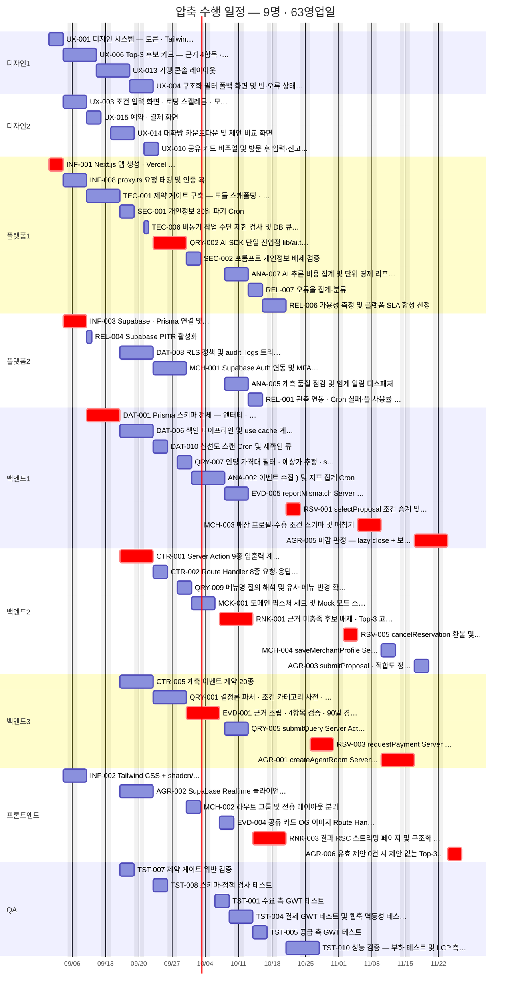

# [총괄] 압축 수행 일정 — AI-Place-Mate

**문서 ID:** PLAN-AIPLACE-FAST-001

**개정 버전:** 1.0

**날짜:** 2026-08-26

**기본 계획:** PLAN-AIPLACE-MVP-001 (`[총괄] 개발 실행 계획.md` · 6명 · 72영업일)

**근거 문서:** TASK-AIPLACE-MVP-001 v3.2 (59건)

> ⚙️ **이 문서는 생성물이다.** `python3 tools/gen_fasttrack_plan.py` 로 재생성한다. **기본 계획을 대체하지 않는다** — 일정 압축이 필요할 때 선택하는 대안이다.

---

## 0. 이 문서를 언제 쓰는가

기본 계획(6명 · 72일)이 **표준**이다. 아래 상황에서만 이 압축안을 검토한다.

- 출시일이 고정되어 있고 **9일을 줄여야** 할 때
- 게이트 0·1 통과 시점을 앞당겨 **의사결정을 빨리** 받아야 할 때
- 인력을 일시 투입할 수 있고 **투입 기간이 제한적**일 때

압축의 효과는 **9영업일 단축**이며, 그 대가는 인원 6명 → 9명과 §5의 리스크다.

---

## 1. 세 가지 편성안 비교

| 안 | 인원 | 완료 | 총 공수 | 평균 가동률 | 성격 |
| --- | --- | --- | --- | --- | --- |
| **기본안** (PLAN-001) | 6명 | 72일 | 215pd | 50% | 자원 효율 우선 |
| **압축안** (본 문서) | **9명** | **63일** | 215pd | 38% | **임계 경로 하한 달성** |
| 최대 병렬 | 16명 | 63일 | 215pd | 21% | 참고 — 더 넣어도 안 빨라짐 |

### 왜 63일 밑으로 못 가는가

**임계 경로가 63영업일**이기 때문이다. 이 사슬은 전부 선후 관계로 묶여 있어 동시에 할 수 없다. 인원을 16명으로 늘려도 결과는 같다.

```mermaid
flowchart LR
    INF001["INF-001<br/>3d"]:::inf
    INF003["INF-003<br/>3d"]:::inf
    DAT001["DAT-001<br/>5d"]:::dat
    CTR001["CTR-001<br/>5d"]:::ctr
    QRY002["QRY-002<br/>5d"]:::inf
    EVD001["EVD-001<br/>5d"]:::rd
    RNK001["RNK-001<br/>5d"]:::rd
    RNK003["RNK-003<br/>5d"]:::ui
    RSV001["RSV-001<br/>3d"]:::wr
    RSV003["RSV-003<br/>5d"]:::wr
    RSV005["RSV-005<br/>3d"]:::wr
    MCH003["MCH-003<br/>3d"]:::dat
    AGR001["AGR-001<br/>5d"]:::wr
    AGR005["AGR-005<br/>5d"]:::wr
    AGR006["AGR-006<br/>3d"]:::ui
    INF001 --> INF003
    INF003 --> DAT001
    DAT001 --> CTR001
    CTR001 --> QRY002
    QRY002 --> EVD001
    EVD001 --> RNK001
    RNK001 --> RNK003
    RNK003 --> RSV001
    RSV001 --> RSV003
    RSV003 --> RSV005
    RSV005 --> MCH003
    MCH003 --> AGR001
    AGR001 --> AGR005
    AGR005 --> AGR006
    classDef ctr fill:#f8d7da,stroke:#dc3545
    classDef dat fill:#fff3cd,stroke:#e0a800
    classDef inf fill:#e2e3e5,stroke:#6c757d
    classDef rd fill:#e7f1ff,stroke:#0d6efd
    classDef wr fill:#d1e7dd,stroke:#198754
    classDef tst fill:#ede7f6,stroke:#7e57c2
    classDef nfr fill:#cff4fc,stroke:#0dcaf0
    classDef dsg fill:#fce4ec,stroke:#ec407a
    classDef ui fill:#e0f2f1,stroke:#009688
```

**15단계 · 63일.** 압축안은 이 하한에 정확히 도달했으므로 **더 줄일 방법은 인원이 아니라 태스크 분해를 바꾸는 것**뿐이다 (§6).

### 최소 인원 도출

기본안에서 한 명씩 늘려 가며 완료일이 가장 많이 줄어드는 역할을 골랐다.

| 단계 | 편성 | 완료 | 단축 |
| --- | --- | --- | --- |
| 기본안 | 6명 (P1·B2·F1·D1·Q1) | 72일 | — |
| 플랫폼 +1 | 7명 (P2·B2·F1·D1·Q1) | 70일 | −2일 |
| 백엔드 +1 | 8명 (P2·B3·F1·D1·Q1) | 65일 | −5일 |
| 디자인 +1 | 9명 (P2·B3·F1·D2·Q1) | 63일 | −2일 |

**프론트엔드와 QA는 늘리지 않았다** — 두 역할은 기본안에서도 임계 경로를 제약하지 않는다. 늘려도 완료일이 바뀌지 않으므로 순수 비용이다.

---

## 2. 압축 수행 Gantt

**이 그림이 말하는 것:** 9개 레인이 동시에 도는 모습이다. 붉은 것이 임계 경로이며, 이 사슬만은 어떤 편성으로도 병렬화할 수 없다.

시작 2026-09-01 · 완료 2026-11-26 (약 13주).

---

## 3. 동시 작업 프로파일

압축의 효과가 **어느 구간에 몰려 있는지** 보여 준다. 인원 투입 계획의 근거다.

| 주차 | 기간 | 동시 작업 (피크/평균) | 착수 태스크 | 투입 필요 |
| --- | --- | --- | --- | --- |
| **W1** | 2026-09-01~ | **5** / 3.2 | `INF-001` `INF-002` `INF-003` `INF-008` `UX-001` `UX-003` `UX-006` | 디자인3 · 프론트엔드1 · 플랫폼3 |
| **W2** | 2026-09-08~ | **5** / 4.4 | `DAT-001` `REL-004` `TEC-001` `UX-013` `UX-014` `UX-015` | 백엔드1 · 디자인5 · 프론트엔드1 · 플랫폼4 |
| **W3** | 2026-09-15~ | **9** / 7.8 | `AGR-002` `CTR-001` `CTR-005` `DAT-006` `DAT-008` `SEC-001` `TEC-006` `TST-007` `UX-004` `UX-010` | 백엔드4 · 디자인4 · 프론트엔드1 · 플랫폼4 · QA1 |
| **W4** | 2026-09-22~ | **7** / 6.2 | `CTR-002` `DAT-010` `MCH-001` `QRY-001` `QRY-002` `QRY-007` `QRY-009` `TST-008` | 백엔드8 · 디자인2 · 프론트엔드1 · 플랫폼3 · QA1 |
| **W5** | 2026-09-29~ | **5** / 4.6 | `ANA-002` `EVD-001` `MCH-002` `MCK-001` `SEC-002` | 백엔드6 · 프론트엔드1 · 플랫폼3 |
| **W6** | 2026-10-06~ | **7** / 5.4 | `ANA-005` `ANA-007` `EVD-004` `EVD-005` `QRY-005` `RNK-001` `TST-001` `TST-004` | 백엔드5 · 프론트엔드1 · 플랫폼2 · QA2 |
| **W7** | 2026-10-13~ | **4** / 3.4 | `REL-001` `REL-006` `REL-007` `RNK-003` `TST-005` | 백엔드1 · 프론트엔드1 · 플랫폼3 · QA2 |
| **W8** | 2026-10-20~ | **2** / 2.0 | `RSV-001` `RSV-003` `TST-010` | 백엔드2 · 프론트엔드1 · 플랫폼1 · QA1 |
| **W9** | 2026-10-27~ | **2** / 1.2 | `RSV-005` | 백엔드2 · QA1 |
| **W10** | 2026-11-03~ | **1** / 1.0 | `MCH-003` | 백엔드2 |
| **W11** | 2026-11-10~ | **2** / 1.6 | `AGR-001` `MCH-004` | 백엔드2 |
| **W12** | 2026-11-17~ | **2** / 1.6 | `AGR-003` `AGR-005` | 백엔드2 |
| **W13** | 2026-11-24~ | **1** / 1.0 | `AGR-006` | 프론트엔드1 |

### 압축이 통하는 구간과 통하지 않는 구간

- **W1~W6 — 압축이 통한다.** 동시 작업이 최대 9건까지 오른다(피크 W3). 인원을 넣으면 실제로 빨라진다.
- **W8 이후 — 압축이 통하지 않는다.** 동시 작업이 1~2건으로 떨어진다. `RSV → MCH → AGR` 사슬이 순수 직렬이라 인원을 넣어도 대기만 늘어난다.

**그래서 인원을 상시 유지할 필요가 없다.** 아래 §4의 투입 곡선을 따른다.

---

## 4. 인원 투입 곡선

주차별로 **실제 필요한 인원**이다. 압축안의 명목 인원은 9명이지만 전 기간 유지할 필요는 없다.

| 주차 | 플랫폼 | 백엔드 | 프론트 | 디자인 | QA | 합계 |
| --- | --- | --- | --- | --- | --- | --- |
| **W1** | 2 | — | 1 | 2 | — | **5** |
| **W2** | 2 | 1 | 1 | 2 | — | **6** |
| **W3** | 2 | 3 | 1 | 2 | 1 | **9** |
| **W4** | 2 | 3 | 1 | 2 | 1 | **9** |
| **W5** | 2 | 3 | 1 | — | — | **6** |
| **W6** | 2 | 3 | 1 | — | 1 | **7** |
| **W7** | 2 | 1 | 1 | — | 1 | **5** |
| **W8** | 1 | 1 | 1 | — | 1 | **4** |
| **W9** | — | 1 | — | — | 1 | **2** |
| **W10** | — | 1 | — | — | — | **1** |
| **W11** | — | 2 | — | — | — | **2** |
| **W12** | — | 2 | — | — | — | **2** |
| **W13** | — | — | 1 | — | — | **1** |

**인원×기간 = 293 person-day 확보 필요** (실제 작업 215pd · 유휴 78pd). 기본안은 432pd 확보에 유휴 217pd다.

### 투입·철수 권고

| 시점 | 조치 | 근거 |
| --- | --- | --- |
| W1 시작 | 디자인 2 · 플랫폼 2 전원 투입 | `UX-001` 이 6개를 막고, L1에 디자인 5건이 동시 착수 가능 |
| W2~W3 | 백엔드 3 전원 가동 | 계약·스키마 구간. 동시 작업 피크 |
| W6 이후 | **디자인 1 · 플랫폼 1 철수** | 디자인 태스크 소진, 플랫폼은 관측만 남음 |
| W7 이후 | **백엔드 1~2로 축소** | 직렬 사슬 구간 진입 — 인원을 늘려도 빨라지지 않음 |

---

## 5. 압축의 대가

일정 9일을 줄이는 대신 아래를 감수한다. **이 표가 압축 여부 판단의 실질 근거다.**

| 항목 | 기본안 | 압축안 | 영향 |
| --- | --- | --- | --- |
| 인원 | 6명 | 9명 | +3명 |
| 완료 | 72일 | 63일 | **−9일** |
| 평균 가동률 | 50% | 38% | 유휴 증가 |
| 확보 공수 | 432pd | 293pd (변동 투입) | 절감 139pd |

### 정량 외 리스크

| 리스크 | 왜 압축에서 커지는가 | 완화 |
| --- | --- | --- |
| **리뷰 병목** | 동시 작업 최대 9건 → PR이 몰린다. 리뷰어는 늘지 않는다 | 임계 경로 PR을 리뷰 최우선으로. 나머지는 24시간 SLA |
| **통합 충돌** | 계약(`CTR-001`) 위에서 여러 태스크가 동시에 작업 | 계약을 먼저 머지하고 구현을 뒤로. 스냅샷 테스트로 변경 가시화 |
| **온보딩 비용** | 추가 3명이 SRS·SDD·제약 체계를 익혀야 한다 | W1을 온보딩 겸 기반 구간으로 두되 일정에 반영되지 않음 — **별도 버퍼 필요** |
| **컨텍스트 분산** | 백엔드 3레인이 서로 다른 Epic을 동시 진행 | Epic 단위로 레인을 고정해 담당 도메인을 유지 |
| **유휴 인원** | W7 이후 디자인·플랫폼이 놀게 된다 | 투입 곡선(§4)대로 철수. 상시 계약이면 압축 이득이 사라진다 |

> ⚠️ **온보딩 시간이 일정에 없다.** 위 표의 −9일은 추가 인원이 **즉시 생산성을 낸다는 가정**이다. 실제로는 온보딩 1~2주를 감안하면 순 이득이 사라질 수 있다. **이미 이 프로젝트 맥락을 아는 인력**을 투입할 때만 압축이 성립한다.

---

## 6. 63일보다 더 줄이려면

인원으로는 불가능하다. **임계 경로 자체를 짧게 만드는 것**만 남는다.

| 방법 | 대상 | 예상 단축 | 대가 |
| --- | --- | --- | --- |
| **범위 축소** — 에이전트 제안(`AGR`·`MCH`)을 v0.2로 연기 | 7건이 임계 경로에서 빠짐 | 약 27일 | SRS 게이트 1 미달 시 어차피 연기되는 경로 |
| **태스크 재분해** — `DAT-001`(5d)을 스키마/정규화로 분리 | 임계 경로 상류 | 2~3일 | ADR-001 되돌림 비용이 '최대'라 분해가 위험 |
| **선행 완화** — `RSV-001` 이 `RNK-003`(UI) 대신 계약에만 의존 | 직렬 사슬 단축 | 5일 내외 | 실제 화면 없이 승계 로직을 검증해야 함 — Mock 확대 필요 |
| **외부 의존 선점** — PG 계약(`DEP-T4`)을 W1에 확정 | `RSV-003` 대기 제거 | 0일 (이미 반영) | 미확정 시 오히려 늘어남 |

**가장 확실한 단축은 범위 축소**다. SRS §10.4의 게이트 1에서 가맹 LOI 30곳이 미달하면 `AGR`·`MCH`는 어차피 v0.2로 연기되므로, 그 시나리오를 미리 계획에 넣는 편이 낫다.

---

## 7. 권고

1. **기본안(6명 · 72일)을 표준으로 유지한다.** 가동률이 높고 리뷰·통합 부담이 작다.
2. 출시일 압박이 실재할 때만 압축안(9명 · 63일)을 채택하고, **투입 곡선(§4)대로 W6 이후 철수**한다. 상시 9명이면 압축 이득이 사라진다.
3. **16명 편성은 채택하지 않는다.** 9명과 완료일이 같고 가동률만 절반이 된다.
4. 압축을 택하면 **온보딩 버퍼 1~2주를 별도로** 잡는다. 그러지 않으면 −9일이 장부상 숫자로만 남는다.
5. 더 큰 단축이 필요하면 인원이 아니라 **범위를 줄인다** (§6).

---

**PLAN-AIPLACE-FAST-001 · v1.0 · 2026-08-26 · Owner 5팀 · 9명 · 63영업일 · 임계 경로 하한 도달**
