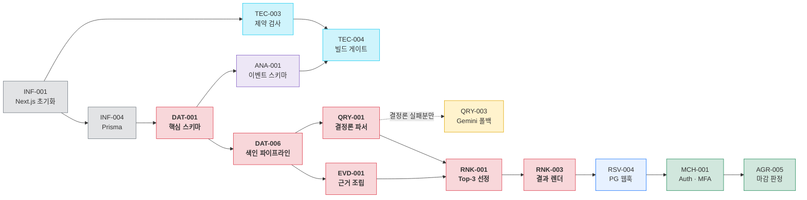

# [태스크 리스트] AI-Place-Mate

**문서 ID:** TASK-AIPLACE-MVP-001

**개정 버전:** 1.0

**날짜:** 2026-08-25

**근거 문서:** SRS-AIPLACE-TEC-001 v1.0 (`[SRS 문서] AI-Place-Mate (기술제약 반영판).md`)

**참조 문서:** SRS-AIPLACE-MVP-001 (기술 중립판) · SDD-AIPLACE-MVP-001 (설계 문서)

---

## 0. 이 문서를 읽는 법

### 0.1 근거와 범위

본 태스크 리스트는 **기술제약 반영판 SRS**를 기준으로 작성했다. 기술 중립판이 아니라 반영판을 택한 이유는, 반영판만이 구현 단위(Server Action · Route Handler · RSC · Cron)를 확정하고 있어 **실행 가능한 태스크로 분해할 수 있기 때문**이다.

- SRS에 **명시되지 않은 기능은 추가하지 않았다.** 모든 태스크는 `관련 SRS 섹션` 열로 원문을 지목한다.
- 요구사항 ID는 두 SRS가 공유하므로, `REQ-FUNC-006` 같은 참조는 양쪽에서 동일하게 성립한다.
- 연기 대상(§14.3 — 다지점 지점 산출 · 리뷰 3축 · AI 예약 에이전트 · 광고 상품 등)은 **태스크로 만들지 않았다.**

### 0.2 관점 분리

제약에 따라 두 관점을 분리해 별도의 표로 제시한다.

| Part | 관점 | ID 접두어 | 산출물 성격 |
| --- | --- | --- | --- |
| **Part A** | 백엔드 · 프론트엔드 개발 및 인프라 구성 | `INF` `TEC` `DAT` `QRY` `EVD` `RNK` `RSV` `MCH` `AGR` `ANA` `SEC` `REL` | 동작하는 코드 · 구성 |
| **Part B** | UI/UX 디자인 | `UX` | 화면 정의 · 디자인 산출물 |

Part B는 Part A의 **선행 또는 병행** 작업이다. 의존 관계는 각 표의 `선행 태스크` 열에 명시했다.

### 0.3 Epic 목록

| Epic | 도메인 | 관련 요구사항 | 태스크 수 |
| --- | --- | --- | --- |
| `INF` Platform & Infra | 프레임워크 · DB 연결 · 배포 기반 | C-TEC-001 ~ 007 | 11 |
| `TEC` Constraint Gate | 제약 준수 자동 검증 | REQ-TEC-001 ~ 015 | 5 |
| `DAT` Data & Indexing | 스키마 · 색인 · 신선도 · RLS | REQ-FUNC-001 · 010 · REQ-NF-002 · 008 · 012 | 11 |
| `QRY` Query & Parsing | 2단 파싱 · 필터 · 메뉴 질의 | REQ-FUNC-002 · 003 · 004 · REQ-NF-001 · 002b · 007 | 11 |
| `EVD` Evidence | 근거 표기 · 공유 카드 · 신고 | REQ-FUNC-005 | 5 |
| `RNK` Ranking | Top-3 선정 · 비교 축 · 결과 렌더 | REQ-FUNC-006 | 3 |
| `RSV` Reservation & Payment | 승계 · 결제 · 환불 · 노쇼 | REQ-FUNC-007 · REQ-NF-011 | 6 |
| `MCH` Merchant Console | 가맹 인증 · 프로필 · 수용 조건 | REQ-FUNC-008 · REQ-NF-012 | 6 |
| `AGR` Agent Room | 소환 · 실시간 · 마감 · 제안 정렬 | REQ-FUNC-009 | 7 |
| `ANA` Analytics | 계측 · 집계 · 알림 · 비용 | §10 · REQ-NF-013 ~ 015 | 8 |
| `SEC` Security & Privacy | 파기 · 프롬프트 · 결제 스키마 | REQ-NF-010 · 011 | 3 |
| `REL` Reliability & Ops | 관측 · Cron 감시 · 복구 · 롤백 | REQ-NF-005 · 006 · 009 · R-T2 ~ T4 | 5 |
| `UX` UI/UX Design | 디자인 시스템 · 화면 정의 | C-TEC-004 · REQ-TEC-007 | 16 |
| | | **합계** | **97** |

### 0.4 복잡도 판정 기준

| 등급 | 기준 | 예 |
| --- | --- | --- |
| **H** | 외부 시스템 연동, 새 개념 도입, 되돌림 비용이 크거나 SRS가 임계치를 건 항목 | PG 웹훅 멱등 처리, 2단 파싱, RLS 정책 |
| **M** | 기존 패턴의 조합. 설계는 정해져 있고 구현량이 있음 | Server Action 작성, Cron 엔드포인트 |
| **L** | 설정·선언 수준. 판단이 거의 필요 없음 | 환경 변수 등록, PITR 활성화 |

---

## Part A. 백엔드 · 프론트엔드 개발 및 인프라 구성

### A-1. Epic `INF` — Platform & Infra

| Task ID | Epic (도메인) | Feature (기능명) | 관련 SRS 섹션 | 선행 태스크 (Dependencies) | 복잡도 (H/M/L) |
|---|---|---|---|---|---|
| INF-001 | Platform & Infra | Next.js App Router 프로젝트 초기화 | §1.5 C-TEC-001 · §14.1 디렉터리 구조 | None | M |
| INF-002 | Platform & Infra | Tailwind CSS + shadcn/ui 설치 및 설정 | §1.5 C-TEC-004 · §4.3 REQ-TEC-007 | INF-001, UX-001 | L |
| INF-003 | Platform & Infra | 로컬 Supabase 환경 구성 (`supabase start`) | §1.5 C-TEC-003 · §4.3 REQ-TEC-006 | None | M |
| INF-004 | Platform & Infra | Prisma 초기화 및 싱글턴 클라이언트 (`lib/db.ts`) | §6.4 · §4.3 REQ-TEC-004 | INF-001, INF-003 | M |
| INF-005 | Platform & Infra | Supavisor 커넥션 구성 (`DATABASE_URL` / `DIRECT_URL`) | §6.4 · §4.3 REQ-TEC-005 · ADR-T04 | INF-004 | M |
| INF-006 | Platform & Infra | Vercel 프로젝트 연결 및 Git Push 배포 경로 확립 | §1.5 C-TEC-007 · §14.4 | INF-001 | L |
| INF-007 | Platform & Infra | 환경 변수 등록 및 필수값 검증 | §6.5 환경 변수 | INF-006 | L |
| INF-008 | Platform & Infra | `proxy.ts` 요청 태깅 및 인증 훅 | §3.1 배포 토폴로지 · §3.3 | INF-001 | M |
| INF-009 | Platform & Infra | `vercel.ts` Cron 스케줄 정의 (5종) | §6.1 Cron 스케줄 · §4.3 REQ-TEC-013 | INF-006 | L |
| INF-010 | Platform & Infra | 마이그레이션 수동 승인 절차 수립 | §6.4 · §14.4 배포 파이프라인 | INF-005 | L |
| INF-011 | Platform & Infra | 네이버 지도 탭 임베드 진입 경로 구성 | §3.2 인터페이스 목록 · ADR-005 | INF-006 | M |

### A-2. Epic `TEC` — Constraint Gate

> 제약은 선언이고, 이 Epic은 **선언을 어겼을 때 빌드가 실패하게 만드는 장치**다. S-1에서 먼저 작동시켜야 이후 스프린트의 위반이 즉시 드러난다(§14.2).

| Task ID | Epic (도메인) | Feature (기능명) | 관련 SRS 섹션 | 선행 태스크 (Dependencies) | 복잡도 (H/M/L) |
|---|---|---|---|---|---|
| TEC-001 | Constraint Gate | 모듈 디렉터리 스캐폴딩 및 `index.ts` 공개 표면 | §3.3 모듈 구조 · §14.1 | INF-001 | M |
| TEC-002 | Constraint Gate | ESLint `no-restricted-imports` 모듈 경계 규칙 | §4.3 REQ-TEC-002 · ADR-T01 | TEC-001 | M |
| TEC-003 | Constraint Gate | `verify-constraints.mjs` 제약 검사 스크립트 | §4.3 REQ-TEC-001 · 003 · 004 · 005 · 008 · 011 · 015 | TEC-001, INF-005 | H |
| TEC-004 | Constraint Gate | 빌드 명령에 품질 게이트 편입 | §4.3 REQ-TEC-012 · §14.4 · ADR-T08 | TEC-002, TEC-003, INF-006 | M |
| TEC-005 | Constraint Gate | 이벤트 스키마 계약 검사 | §4.3 REQ-TEC-012 · §10.2 | TEC-004, ANA-001 | M |

### A-3. Epic `DAT` — Data & Indexing

| Task ID | Epic (도메인) | Feature (기능명) | 관련 SRS 섹션 | 선행 태스크 (Dependencies) | 복잡도 (H/M/L) |
|---|---|---|---|---|---|
| DAT-001 | Data & Indexing | Prisma 스키마 — `Place` · `Dish` · `PriceProfile` | §6.2 · §4.1 REQ-FUNC-001 | INF-004 | H |
| DAT-002 | Data & Indexing | Prisma 스키마 — `Attribute` · `Verification` (성분·접근성 필드 포함) | §6.2 · §4.1 REQ-FUNC-001 · 010 | DAT-001 | M |
| DAT-003 | Data & Indexing | Prisma 스키마 — `AgentRoom` · `Proposal` · `Reservation` · `Payment` | §6.2 · §4.1 REQ-FUNC-007 · 009 | DAT-001 | M |
| DAT-004 | Data & Indexing | Prisma 스키마 — `Event` 및 일 단위 파티셔닝 원시 SQL 마이그레이션 | §6.2 · §10.2 계측 구현 | DAT-001 | M |
| DAT-005 | Data & Indexing | `canonicalKey` 메뉴명 정규화기 | §6.2 · §4.1 REQ-FUNC-001 · 003 | DAT-001 | H |
| DAT-006 | Data & Indexing | 색인 파이프라인 (dish + attribute 색인 적재) | §4.1 REQ-FUNC-001 · ADR-001 | DAT-002, DAT-005 | H |
| DAT-007 | Data & Indexing | `use cache` 캐시 계층 및 태그 무효화 | §4.2 REQ-NF-002 · ADR-T05 | DAT-006 | M |
| DAT-008 | Data & Indexing | RLS 정책 작성 (전 테이블) | §6.4 · §4.2 REQ-NF-012 | DAT-002, DAT-003 | H |
| DAT-009 | Data & Indexing | `audit_logs` 테이블 및 PostgreSQL 트리거 | §6.4 · §4.2 REQ-NF-012 | DAT-008 | M |
| DAT-010 | Data & Indexing | 신선도 스캔 Cron (`/api/cron/freshness`) | §6.1 · §4.2 REQ-NF-008 | DAT-002, INF-009 | M |
| DAT-011 | Data & Indexing | 재확인 큐 적재 및 우선순위 상향 로직 | §6.1 · §4.2 REQ-NF-008 | DAT-010 | M |

### A-4. Epic `QRY` — Query & Parsing

> **2단 파싱이 이 Epic의 핵심**이다(ADR-T02). 결정론 파서가 질의의 70% 이상을 흡수하지 못하면 응답 시간(REQ-NF-001a)과 추론 비용(REQ-NF-013)이 동시에 무너진다.

| Task ID | Epic (도메인) | Feature (기능명) | 관련 SRS 섹션 | 선행 태스크 (Dependencies) | 복잡도 (H/M/L) |
|---|---|---|---|---|---|
| QRY-001 | Query & Parsing | 결정론 파서 및 조건 카테고리 사전 | §4.2.1 · §4.1 REQ-FUNC-004 · ADR-T02 | DAT-006 | H |
| QRY-002 | Query & Parsing | AI SDK 단일 진입점 `lib/ai.ts` (타임아웃·재시도·토큰 상한) | §6.6 · §4.3 REQ-TEC-008 · 009 · 010 · ADR-T10 | INF-007 | H |
| QRY-003 | Query & Parsing | Gemini 폴백 파서 (`Output.object` + Zod 스키마) | §6.6 · §4.1 REQ-FUNC-004 · §1.5 C-TEC-005 · 006 | QRY-002 | H |
| QRY-004 | Query & Parsing | 파싱 캐시 (정규화 질의 → ConditionSet) | §4.2 REQ-NF-002b · §4.2.1 | QRY-001, DAT-007 | M |
| QRY-005 | Query & Parsing | `submitQuery` Server Action (2단 파싱 오케스트레이션) | §6.1 Server Actions · §9.1 | QRY-001, QRY-003, QRY-004 | M |
| QRY-006 | Query & Parsing | 폴백 가드 및 구조화 필터 전환 | §4.2 REQ-NF-007 · §6.3-6 | QRY-005, UX-004 | M |
| QRY-007 | Query & Parsing | 인당 가격대 필터 및 예상가 범위 추정 | §4.1 REQ-FUNC-002 | DAT-006 | M |
| QRY-008 | Query & Parsing | `submitPriceFeedback` Server Action (편차 기록) | §6.1 · §4.1 REQ-FUNC-002 | QRY-007 | L |
| QRY-009 | Query & Parsing | 메뉴명 단독 질의 해석 (`canonicalKey` 조회) | §4.1 REQ-FUNC-003 | DAT-005, DAT-006 | M |
| QRY-010 | Query & Parsing | 유사 메뉴 대체 및 반경 확대 폴백 | §4.1 REQ-FUNC-003 · §6.3-6 | QRY-009 | M |
| QRY-011 | Query & Parsing | `parse_path` 경로 태깅 계측 | §9.1 계측 필수 사항 · §10.1 | QRY-005, ANA-003 | M |

### A-5. Epic `EVD` — Evidence

| Task ID | Epic (도메인) | Feature (기능명) | 관련 SRS 섹션 | 선행 태스크 (Dependencies) | 복잡도 (H/M/L) |
|---|---|---|---|---|---|
| EVD-001 | Evidence | 근거 문장 조립기 (선정 이유 + 근거 속성) | §4.1 REQ-FUNC-005 · ADR-002 | DAT-002 | H |
| EVD-002 | Evidence | 근거 4항목 검증기 및 90일 경과 경고 | §4.1 REQ-FUNC-005 · §6.3-2 · 5 | EVD-001 | M |
| EVD-003 | Evidence | 판정형 문구 금지 필터 | §6.3-4 · §6.6 프롬프트 규약 | EVD-001, QRY-002 | M |
| EVD-004 | Evidence | 공유 카드 OG 이미지 Route Handler (`next/og`) | §6.1 · §4.1 REQ-FUNC-005 | EVD-002, UX-010 | M |
| EVD-005 | Evidence | `reportMismatch` Server Action (재확인 큐 연동) | §6.1 · §4.1 REQ-FUNC-005 | EVD-002, DAT-011 | M |

### A-6. Epic `RNK` — Ranking

| Task ID | Epic (도메인) | Feature (기능명) | 관련 SRS 섹션 | 선행 태스크 (Dependencies) | 복잡도 (H/M/L) |
|---|---|---|---|---|---|
| RNK-001 | Ranking | 근거 미충족 후보 배제 및 Top-3 고정 선정 | §4.1 REQ-FUNC-006 · §6.3-2 · 3 · ADR-003 | EVD-002, QRY-007, QRY-010 | H |
| RNK-002 | Ranking | 비교 축 생성 | §4.1 REQ-FUNC-006 | RNK-001 | M |
| RNK-003 | Ranking | 결과 RSC 페이지 스트리밍 조립 (Suspense) | §9.1 · §4.2 REQ-NF-001a · 001b | RNK-002, QRY-005, UX-005, UX-006 | H |

### A-7. Epic `RSV` — Reservation & Payment

> SRS §14.1에 따라 **REQ-FUNC-007은 REQ-FUNC-006과 DEP-01(PG 계약)에 선행 종속**하며, 가맹 콘솔·대화방보다 **먼저** 착수한다.

| Task ID | Epic (도메인) | Feature (기능명) | 관련 SRS 섹션 | 선행 태스크 (Dependencies) | 복잡도 (H/M/L) |
|---|---|---|---|---|---|
| RSV-001 | Reservation & Payment | `selectProposal` 선택 대상 조건 승계 Server Action | §6.1 · §4.1 REQ-FUNC-007 | RNK-003, DAT-003 | M |
| RSV-002 | Reservation & Payment | 주문량 기반 금액 산출기 | §4.1 REQ-FUNC-007 | RSV-001 | M |
| RSV-003 | Reservation & Payment | `requestPayment` Server Action 및 PG 클라이언트 | §6.1 · §4.2 REQ-NF-011 · DEP-T4 | RSV-002, INF-007, UX-015 | H |
| RSV-004 | Reservation & Payment | PG 웹훅 Route Handler (서명 검증 + 멱등 키) | §6.1 · §9.2 · §4.2 REQ-NF-011 · §15-9 | RSV-003, DAT-003 | H |
| RSV-005 | Reservation & Payment | `cancelReservation` 및 전액 환불 처리 | §6.1 · §4.1 REQ-FUNC-007 | RSV-004 | M |
| RSV-006 | Reservation & Payment | 노쇼 판정 Cron (`/api/cron/noshow`) 및 정산 | §6.1 · §4.1 REQ-FUNC-007 | RSV-004, INF-009 | M |

### A-8. Epic `MCH` — Merchant Console

| Task ID | Epic (도메인) | Feature (기능명) | 관련 SRS 섹션 | 선행 태스크 (Dependencies) | 복잡도 (H/M/L) |
|---|---|---|---|---|---|
| MCH-001 | Merchant Console | Supabase Auth 연동 및 MFA 적용 | §4.2 REQ-NF-012 · §3.2 | INF-003, DAT-008 | H |
| MCH-002 | Merchant Console | `(merchant)` 라우트 그룹 및 전용 레이아웃 분리 | §14.1 · §8 사용자 특성 | INF-002, MCH-001, UX-013 | M |
| MCH-003 | Merchant Console | 매장 프로필 · 수용 조건 스키마 | §6.2 · §4.1 REQ-FUNC-008 | DAT-002, RSV-006 | M |
| MCH-004 | Merchant Console | `saveMerchantProfile` Server Action | §6.1 · §4.1 REQ-FUNC-008 | MCH-003, MCH-002 | M |
| MCH-005 | Merchant Console | EvidenceGuard — 근거 없는 문구 저장 차단 | §4.1 REQ-FUNC-008 · §6.3-2 | MCH-004, DAT-002 | M |
| MCH-006 | Merchant Console | 수용 조건 매칭기 (부적합 소환 차단) | §4.1 REQ-FUNC-008 | MCH-003 | M |

### A-9. Epic `AGR` — Agent Room

> 대화방은 **서버 프로세스 없이** 구현한다 — DB 상태 + Realtime + lazy close(ADR-T06). 마감 정확도가 Cron 주기에 종속되지 않아야 한다(§9.3).

| Task ID | Epic (도메인) | Feature (기능명) | 관련 SRS 섹션 | 선행 태스크 (Dependencies) | 복잡도 (H/M/L) |
|---|---|---|---|---|---|
| AGR-001 | Agent Room | `createAgentRoom` Server Action 및 에이전트 3–5곳 소환 | §6.1 · §4.1 REQ-FUNC-009 · §9.3 | MCH-006, DAT-003 | H |
| AGR-002 | Agent Room | Supabase Realtime 클라이언트 및 대화방 채널 구독 | §3.2 · §9.3 · ADR-T06 | INF-003, DAT-003 | H |
| AGR-003 | Agent Room | `submitProposal` Server Action | §6.1 · §4.1 REQ-FUNC-009 | AGR-001, MCH-005 | M |
| AGR-004 | Agent Room | 조건 적합도 정렬 (가격 협상 필드 부재) | §4.1 REQ-FUNC-009 · §6.3-7 | AGR-003, UX-014 | M |
| AGR-005 | Agent Room | 마감 판정 — lazy close + 보조 Cron (`/api/cron/close-rooms`) | §9.3 · §6.1 · §15-6 | AGR-001, AGR-002, INF-009 | H |
| AGR-006 | Agent Room | 유효 제안 0건 시 제안 없는 Top-3 복귀 | §6.3-6 · §4.1 REQ-FUNC-009 | AGR-005, RNK-003 | M |
| AGR-007 | Agent Room | 불이행 신고 및 소환 가중치 하향 | §6.3-10 | AGR-004 | M |

### A-10. Epic `ANA` — Analytics & Observability

| Task ID | Epic (도메인) | Feature (기능명) | 관련 SRS 섹션 | 선행 태스크 (Dependencies) | 복잡도 (H/M/L) |
|---|---|---|---|---|---|
| ANA-001 | Analytics | 이벤트 스키마 정의 20종 (필수 속성 포함) | §10.2 계측 구현 | DAT-004 | H |
| ANA-002 | Analytics | `/api/events` Route Handler 및 `sendBeacon` 배치 수집 | §6.1 · §10.2 | ANA-001 | M |
| ANA-003 | Analytics | `after()` 기반 서버 이벤트 적재 | §10.2 · ADR-T07 | ANA-001 | M |
| ANA-004 | Analytics | 지표 집계 Cron (`/api/cron/aggregate`) 및 지표 마트 | §6.1 · §10.1 성과 지표 | ANA-002, ANA-003, INF-009 | H |
| ANA-005 | Analytics | 계측 품질 점검 (누락률·결측률·스티칭·재현성) | §10.2 · §10.3 | ANA-004 | M |
| ANA-006 | Analytics | 임계 알림 디스패처 (Slack · PagerDuty) | §10.3 · §4.2 REQ-NF-015 | ANA-005 | M |
| ANA-007 | Analytics | AI 추론 비용 집계 및 LLM 호출 비율 감시 | §4.2 REQ-NF-013 · §10.3 | QRY-002, ANA-004 | M |
| ANA-008 | Analytics | 단위 경제 월간 리포트 | §4.2 REQ-NF-014 · §10.1 | ANA-004 | L |

### A-11. Epic `SEC` — Security & Privacy

| Task ID | Epic (도메인) | Feature (기능명) | 관련 SRS 섹션 | 선행 태스크 (Dependencies) | 복잡도 (H/M/L) |
|---|---|---|---|---|---|
| SEC-001 | Security & Privacy | 개인정보 30일 파기 Cron (`/api/cron/purge`) | §6.1 · §4.2 REQ-NF-010 | DAT-004, INF-009 | M |
| SEC-002 | Security & Privacy | 프롬프트 개인정보 배제 검증 | §6.6 · §4.2 REQ-NF-010 | QRY-002 | M |
| SEC-003 | Security & Privacy | 결제 스키마 카드 정보 컬럼 부재 검사 | §4.2 REQ-NF-011 · §6.2 | DAT-003, TEC-003 | L |

### A-12. Epic `REL` — Reliability & Ops

| Task ID | Epic (도메인) | Feature (기능명) | 관련 SRS 섹션 | 선행 태스크 (Dependencies) | 복잡도 (H/M/L) |
|---|---|---|---|---|---|
| REL-001 | Reliability & Ops | Vercel Observability 연동 및 경로별 p95 관측 | §10.3 · §4.2 REQ-NF-001a · 001b | INF-006, QRY-011 | M |
| REL-002 | Reliability & Ops | Cron 실행 실패 알림 (마지막 실행 시각 추적) | §10.3 · §11.2 R-T3 | INF-009, ANA-006 | M |
| REL-003 | Reliability & Ops | Supavisor 풀 사용률 감시 | §10.3 · §11.2 R-T2 | INF-005, ANA-006 | M |
| REL-004 | Reliability & Ops | Supabase PITR 활성화 (RPO ≤ 5분) | §6.4 · §4.2 REQ-NF-009 | INF-003 | L |
| REL-005 | Reliability & Ops | Vercel 즉시 롤백 절차 문서화 및 훈련 | §11.2 R-T4 · §4.2 REQ-NF-009 | INF-006 | L |

---

## Part B. UI/UX 디자인

> C-TEC-004에 따라 **shadcn/ui에 존재하는 컴포넌트를 자체 구현하지 않는다**(D-08 · REQ-TEC-007). 따라서 디자인 태스크는 컴포넌트 제작이 아니라 **토큰 정의 · 조합 규칙 · 화면 정의**가 중심이다.

| Task ID | Epic (도메인) | Feature (기능명) | 관련 SRS 섹션 | 선행 태스크 (Dependencies) | 복잡도 (H/M/L) |
|---|---|---|---|---|---|
| UX-001 | Design System | 디자인 토큰 및 Tailwind 테마 정의 | §1.5 C-TEC-004 | None | M |
| UX-002 | Design System | shadcn/ui 컴포넌트 인벤토리 확정 (자체 제작 금지 목록) | §4.3 REQ-TEC-007 · §1.5.1 D-08 | UX-001 | L |
| UX-003 | Search UI | 조건 입력 화면 (필수 입력 필드 0개) | §9.2 · §4.1 REQ-FUNC-004 | UX-002 | M |
| UX-004 | Search UI | 구조화 필터 폴백 화면 (해석 실패 표현 표기) | §4.2.1 · §4.1 REQ-FUNC-004 | UX-003 | M |
| UX-005 | Search UI | 로딩 스켈레톤 (500ms 내 렌더) | §4.2 REQ-NF-001b | UX-003 | M |
| UX-006 | Result UI | Top-3 후보 카드 (근거 4항목 표기) | §4.1 REQ-FUNC-005 · 006 · §6.3-2 | UX-002 | H |
| UX-007 | Result UI | '확인 90일 경과' 경고 표시 규칙 | §6.3-5 · §4.1 REQ-FUNC-005 | UX-006 | L |
| UX-008 | Result UI | 인당 예상가 범위 및 '가격 확인 필요' 표기 | §4.1 REQ-FUNC-002 | UX-006 | M |
| UX-009 | Result UI | 비교 축 레이아웃 | §4.1 REQ-FUNC-006 | UX-006 | M |
| UX-010 | Result UI | 공유 카드 비주얼 (OG 이미지 규격) | §4.1 REQ-FUNC-005 · §6.1 | UX-006 | M |
| UX-011 | Result UI | 빈 상태 · 오류 상태 정의 (빈 화면 금지) | §6.3-6 · §4.2 REQ-NF-007 | UX-004, UX-005 | M |
| UX-012 | Result UI | 방문 후 결제액 입력 및 불일치 신고 폼 | §6.1 · §4.1 REQ-FUNC-002 · 005 | UX-006 | L |
| UX-013 | Merchant UI | 가맹 콘솔 레이아웃 (설정 화면 ≤ 3개 · 필수 항목 ≤ 5개) | §4.1 REQ-FUNC-008 · §8 | UX-002 | H |
| UX-014 | Agent Room UI | 대화방 카운트다운 및 제안 비교 화면 | §9.3 · §4.1 REQ-FUNC-009 | UX-002 | H |
| UX-015 | Reservation UI | 예약 · 결제 화면 (재입력 필드 0개) | §4.1 REQ-FUNC-007 · §9.2 | UX-002 | M |
| UX-016 | Performance | 모바일 초기 렌더 가이드 (LCP ≤ 2.5s) | §4.2 REQ-NF-004 | UX-001 | M |

---

## 부록 A. 임계 경로 (Critical Path)

**이 그림이 말하는 것:** 어느 태스크가 밀리면 몇 개가 함께 밀리는지다. 굵은 경로가 임계 경로이며, 여기가 지연되면 릴리스 전체가 지연된다.

| 병목 | 밀리면 함께 밀리는 것 | 완화 |
| --- | --- | --- |
| **DAT-001 · DAT-006** | 색인 위에 얹히는 QRY · EVD · RNK 전부 | S0에서 스키마를 확정하고 되돌리지 않는다 (ADR-001) |
| **RNK-003** | RSV → MCH → AGR 전 계열 | Top-3가 나와야 선택·예약이 성립한다 |
| **TEC-004** | 이후 모든 태스크의 제약 위반 탐지 | S-1에서 먼저 작동시킨다 (§14.2) |
| **ANA-001** | TEC-005 · QRY-011 · ANA 전 계열 | 이벤트 스키마는 코드보다 먼저 확정한다 |

---

## 부록 B. 스프린트 배치

SRS §14.2의 스프린트 정의에 태스크를 배치한 것이다.

| 스프린트 | 개발 · 인프라 태스크 | UI/UX 태스크 |
| --- | --- | --- |
| **S-1** 기반 | INF-001 ~ 011 · TEC-001 ~ 004 | UX-001 · UX-002 |
| **S0** 스키마 | DAT-001 ~ 005 · DAT-008 · DAT-009 · ANA-001 · TEC-005 · SEC-003 · REL-004 | UX-003 |
| **S1** 색인 | DAT-006 · DAT-007 · DAT-010 · DAT-011 · ANA-002 · ANA-003 | UX-005 · UX-016 |
| **S2** 필터·메뉴 | QRY-007 ~ QRY-010 | UX-006 · UX-008 |
| **S3** 파싱·근거 | QRY-001 ~ QRY-006 · QRY-011 · EVD-001 ~ EVD-003 · EVD-005 · SEC-002 · ANA-007 | UX-004 · UX-007 · UX-011 · UX-012 |
| **S4** Top-3 | RNK-001 ~ RNK-003 · EVD-004 · ANA-004 ~ ANA-006 · REL-001 ~ REL-003 · REL-005 | UX-009 · UX-010 |
| **S5** 예약 승계 | RSV-001 · RSV-002 · SEC-001 · ANA-008 | UX-015 |
| **S6** 결제 | RSV-003 ~ RSV-006 | — |
| **S7** 가맹 콘솔 | MCH-001 ~ MCH-006 | UX-013 |
| **S8** 대화방 | AGR-001 ~ AGR-007 | UX-014 |

**Phase 경계** — S-1 ~ S4가 Phase 1 클로즈드 베타, S5 ~ S6이 Phase 1 말, S7 ~ S8이 Phase 2다(SRS §10.4 게이트 조건과 정합).

---

## 부록 C. 요구사항 커버리지 검증

SRS의 모든 요구사항이 최소 한 개의 태스크로 이어지는지 확인하는 표다. **빈칸이 있으면 누락이다.**

| 요구사항 | 담당 태스크 |
| --- | --- |
| REQ-FUNC-001 색인 | DAT-001 · DAT-002 · DAT-005 · DAT-006 |
| REQ-FUNC-002 가격 필터 | QRY-007 · QRY-008 · UX-008 |
| REQ-FUNC-003 메뉴 추천 | DAT-005 · QRY-009 · QRY-010 |
| REQ-FUNC-004 자연어 검색 | QRY-001 ~ QRY-006 · UX-003 · UX-004 |
| REQ-FUNC-005 근거·공유 | EVD-001 ~ EVD-005 · UX-006 · UX-007 · UX-010 |
| REQ-FUNC-006 Top-3 | RNK-001 ~ RNK-003 · UX-006 · UX-009 |
| REQ-FUNC-007 예약·결제 | RSV-001 ~ RSV-006 · UX-015 |
| REQ-FUNC-008 매장 콘솔 | MCH-001 ~ MCH-006 · UX-013 |
| REQ-FUNC-009 소환·대화방 | AGR-001 ~ AGR-007 · UX-014 |
| REQ-FUNC-010 성분·접근성 필드 | DAT-002 |
| REQ-NF-001a · 001b 응답 시간 | QRY-001 · QRY-004 · RNK-003 · REL-001 · UX-005 |
| REQ-NF-002 · 002b 캐시 | DAT-007 · QRY-004 |
| REQ-NF-003 처리량 | INF-005 · REL-003 |
| REQ-NF-004 초기 렌더 | UX-016 |
| REQ-NF-005 · 006 가용성·오류율 | REL-001 · REL-005 |
| REQ-NF-007 폴백 열화 | QRY-006 · QRY-010 · UX-011 |
| REQ-NF-008 신선도 | DAT-010 · DAT-011 |
| REQ-NF-009 복구 목표 | REL-004 · REL-005 |
| REQ-NF-010 개인정보 | SEC-001 · SEC-002 |
| REQ-NF-011 결제 보안 | RSV-003 · RSV-004 · SEC-003 |
| REQ-NF-012 접근 통제·감사 | DAT-008 · DAT-009 · MCH-001 |
| REQ-NF-013 추론 비용 | QRY-002 · QRY-004 · ANA-007 |
| REQ-NF-014 단위 경제 | ANA-008 |
| REQ-NF-015 관측·알림 | ANA-005 · ANA-006 · REL-002 |
| REQ-TEC-001 ~ 015 제약 준수 | TEC-001 ~ TEC-005 · INF-005 · INF-009 · QRY-002 · INF-002 |

**누락 0건** — SRS의 기능 요구사항 10건, 비기능 요구사항 17건, 기술 제약 요구사항 15건 전부가 담당 태스크를 가진다.

---

## 부록 D. 태스크로 만들지 않은 것

SRS에 언급되지만 **의도적으로 태스크에서 제외**한 항목이다. 임의 추가를 막는 것만큼 임의 누락을 밝히는 것도 필요하다.

| 항목 | 근거 | 사유 |
| --- | --- | --- |
| 다지점 공정 지점 산출 | §14.3 · §7 | v0.2+ 연기 대상 |
| 리뷰 3축 재가공 | §14.3 · §7.2 | v0.2+ 연기 대상 |
| AI 예약 에이전트 | §14.3 | v0.2+ 연기 대상 |
| 성분·접근성 데이터 커버리지 | §14.3 · §4.1 REQ-FUNC-010 | v0.1은 **스키마 필드만** — DAT-002에 포함되고 값 적재는 범위 밖 |
| 광고 상품 | §14.3 · ADR-004 | 도입 계획 없음 |
| 결제·정산 자체 구축 | §14.3 · LIM-01 | PG 위탁 |
| 지도·경로 API 연동 | §3.2 · LIM-06 | v0.1 미사용 |
| 실시간 매장 상태 연동 | §3.2 · §7.4 · LIM-07 | 제휴 검토 단계 — 단가 조건 미확정 |
| 마이크로프런트엔드 분리 | §7.3 | 단일 앱의 한계가 드러난 이후 검토 |
| 플랫폼 장애 대응 · 3,000 RPS 달성 | §15.1 | **미해소 항목** — 발주 측 결정 대기 중이라 태스크로 확정할 수 없음 |

---

**TASK-AIPLACE-MVP-001 · v1.0 · 2026-08-25 · Owner 5팀**
