# [태스크 리스트] AI-Place-Mate

**문서 ID:** TASK-AIPLACE-MVP-001

**개정 버전:** 2.0 (Phase 0 반영)

**날짜:** 2026-08-25

**근거 문서:** SRS-AIPLACE-TEC-001 v1.0 (`[SRS 문서] AI-Place-Mate (기술제약 반영판).md`)

**참조 문서:** SRS-AIPLACE-MVP-001 (기술 중립판) · SDD-AIPLACE-MVP-001 (설계 문서) · ANL-AIPLACE-TASK-001 (방법론 적합성 평가)

> ⚙️ **이 문서는 생성물이다.** 단일 원천은 `tools/tasks_data.py` 이며 `python3 tools/gen_task_list.py` 로 재생성한다. **직접 편집하지 말 것** — `후행 태스크(Blocks)` 는 `선행 태스크` 에서 자동 역산되므로 수기 편집은 반드시 불일치를 만든다.

---

## 0. 이 문서를 읽는 법

### 0.1 근거와 범위

본 태스크 리스트는 **기술제약 반영판 SRS**를 기준으로 작성했다. 기술 중립판이 아니라 반영판을 택한 이유는, 반영판만이 구현 단위(Server Action · Route Handler · RSC · Cron)를 확정하고 있어 **실행 가능한 태스크로 분해할 수 있기 때문**이다.

- SRS에 **명시되지 않은 기능은 추가하지 않았다.** 모든 태스크는 `관련 SRS 섹션` 열로 원문을 지목한다.
- 요구사항 ID는 두 SRS가 공유하므로, `REQ-FUNC-006` 같은 참조는 양쪽에서 동일하게 성립한다.
- 연기 대상(SRS §14.3)은 **태스크로 만들지 않았다.** 제외 내역은 부록 D에 있다.

### 0.2 관점 분리

| Part | 관점 | ID 접두어 | 산출물 성격 |
| --- | --- | --- | --- |
| **Part A** | 백엔드 · 프론트엔드 개발 및 인프라 구성 | `INF` `TEC` `CTR` `DAT` `MCK` `QRY` `EVD` `RNK` `RSV` `MCH` `AGR` `ANA` `SEC` `REL` `TST` | 동작하는 코드 · 구성 |
| **Part B** | UI/UX 디자인 | `UX` | 화면 정의 · 디자인 산출물 |

### 0.3 유형(Type) 분류

`유형` 열은 태스크가 추출 방법론의 어느 단계에 속하는지를 나타낸다. Read/Write 구분은 SRS §6.1의 구현 단위(RSC 조회 = Read / Server Action · Cron · 웹훅 = Write)를 따른다.

| 유형 | 의미 | 방법론 단계 | 건수 |
| --- | --- | --- | --- |
| `Contract` | DTO · 스키마 · 에러 코드 등 공유 계약 | Step 1 | 6 |
| `Data` | DB 스키마 · 정규화 사전 · Mock 픽스처 | Step 1 | 10 |
| `Read` | 조회 · 질의 경로 (상태 변경 없음) | Step 2 | 19 |
| `Write` | 상태 변경 · Server Action · Cron · 웹훅 | Step 2 | 21 |
| `Test` | AC를 실행 가능한 테스트로 변환 | Step 3 | 13 |
| `Infra` | 프레임워크 · 배포 · 게이트 · 외부 연동 배선 | Step 4 | 21 |
| `NFR` | 보안 · 관측 · 비용 · 복구 | Step 4 | 12 |
| `Design` | 디자인 토큰 · 화면 정의 | — | 16 |
| | | **합계** | **118** |

### 0.4 Epic 목록

| Epic | 도메인 | 태스크 수 |
| --- | --- | --- |
| `INF` | Platform & Infra | 11 |
| `TEC` | Constraint Gate | 5 |
| `CTR` | Contract | 6 |
| `DAT` | Data & Indexing | 11 |
| `MCK` | Mock | 5 |
| `QRY` | Query & Parsing | 11 |
| `EVD` | Evidence | 5 |
| `RNK` | Ranking | 3 |
| `RSV` | Reservation & Payment | 6 |
| `MCH` | Merchant Console | 6 |
| `AGR` | Agent Room | 7 |
| `ANA` | Analytics | 7 |
| `SEC` | Security & Privacy | 3 |
| `REL` | Reliability & Ops | 5 |
| `TST` | Test | 11 |
| `UX` | UI/UX Design | 16 |
| | **합계** | **118** |

### 0.5 복잡도 판정 기준

| 등급 | 기준 | 예 |
| --- | --- | --- |
| **H** | 외부 시스템 연동, 새 개념 도입, 되돌림 비용이 크거나 SRS가 임계치를 건 항목 | PG 웹훅 멱등 처리 · 2단 파싱 · RLS 정책 |
| **M** | 기존 패턴의 조합. 설계는 정해져 있고 구현량이 있음 | Server Action 작성 · Cron 엔드포인트 |
| **L** | 설정·선언 수준. 판단이 거의 필요 없음 | 환경 변수 등록 · PITR 활성화 |

분포: **H 24 · M 80 · L 14**

---

## Part A. 백엔드 · 프론트엔드 개발 및 인프라 구성

### A-1. Epic `INF` — Platform & Infra

| Task ID | Epic (도메인) | Feature (기능명) | 유형 | 관련 SRS 섹션 | 선행 태스크 (Dependencies) | 후행 태스크 (Blocks) | 복잡도 (H/M/L) |
|---|---|---|---|---|---|---|---|
| **INF-001** | Platform & Infra | Next.js App Router 프로젝트 초기화 | `Infra` | §1.5 C-TEC-001 · §14.1 디렉터리 구조 | None | INF-002 · INF-004 · INF-006 · INF-008 · TEC-001 | M |
| **INF-002** | Platform & Infra | Tailwind CSS + shadcn/ui 설치 및 설정 | `Infra` | §1.5 C-TEC-004 · §4.3 REQ-TEC-007 | INF-001 · UX-001 | MCH-002 | L |
| **INF-003** | Platform & Infra | 로컬 Supabase 환경 구성 (`supabase start`) | `Infra` | §1.5 C-TEC-003 · §4.3 REQ-TEC-006 | None | AGR-002 · INF-004 · MCH-001 · REL-004 | M |
| **INF-004** | Platform & Infra | Prisma 초기화 및 싱글턴 클라이언트 (`lib/db.ts`) | `Infra` | §6.4 · §4.3 REQ-TEC-004 | INF-001 · INF-003 | DAT-001 · INF-005 | M |
| **INF-005** | Platform & Infra | Supavisor 커넥션 구성 (`DATABASE_URL` / `DIRECT_URL`) | `Infra` | §6.4 · §4.3 REQ-TEC-005 · ADR-T04 | INF-004 | INF-010 · REL-003 · TEC-003 | M |
| **INF-006** | Platform & Infra | Vercel 프로젝트 연결 및 Git Push 배포 경로 확립 | `Infra` | §1.5 C-TEC-007 · §14.4 | INF-001 | INF-007 · INF-009 · INF-011 · REL-001 · REL-005 · TEC-004 | L |
| **INF-007** | Platform & Infra | 환경 변수 등록 및 필수값 검증 | `Infra` | §6.5 환경 변수 | INF-006 | MCK-005 · QRY-002 · RSV-003 | L |
| **INF-008** | Platform & Infra | `proxy.ts` 요청 태깅 및 인증 훅 | `Infra` | §3.1 배포 토폴로지 · §3.3 | INF-001 | None | M |
| **INF-009** | Platform & Infra | `vercel.ts` Cron 스케줄 정의 (5종) | `Infra` | §6.1 Cron 스케줄 · §4.3 REQ-TEC-013 | INF-006 | AGR-005 · ANA-004 · DAT-010 · REL-002 · RSV-006 · SEC-001 | L |
| **INF-010** | Platform & Infra | 마이그레이션 수동 승인 절차 수립 | `Infra` | §6.4 · §14.4 배포 파이프라인 | INF-005 | None | L |
| **INF-011** | Platform & Infra | 네이버 지도 탭 임베드 진입 경로 구성 | `Infra` | §3.2 인터페이스 목록 · ADR-005 | INF-006 | None | M |

### A-2. Epic `TEC` — Constraint Gate

> 제약은 선언이고, 이 Epic은 **선언을 어겼을 때 빌드가 실패하게 만드는 장치**다. S-1에서 먼저 작동시켜야 이후 스프린트의 위반이 즉시 드러난다(SRS §14.2).

| Task ID | Epic (도메인) | Feature (기능명) | 유형 | 관련 SRS 섹션 | 선행 태스크 (Dependencies) | 후행 태스크 (Blocks) | 복잡도 (H/M/L) |
|---|---|---|---|---|---|---|---|
| **TEC-001** | Constraint Gate | 모듈 디렉터리 스캐폴딩 | `Infra` | §3.3 모듈 구조 · §14.1 | INF-001 | CTR-006 · TEC-003 | M |
| **TEC-002** | Constraint Gate | ESLint `no-restricted-imports` 모듈 경계 규칙 | `Infra` | §4.3 REQ-TEC-002 · ADR-T01 | CTR-006 | TEC-004 | M |
| **TEC-003** | Constraint Gate | `verify-constraints.mjs` 제약 검사 스크립트 | `Infra` | §4.3 REQ-TEC-001 · 003 · 004 · 005 · 008 · 011 · 015 | TEC-001 · INF-005 | SEC-003 · TEC-004 | H |
| **TEC-004** | Constraint Gate | 빌드 명령에 품질 게이트 편입 | `Infra` | §4.3 REQ-TEC-012 · §14.4 · ADR-T08 | TEC-002 · TEC-003 · INF-006 | TEC-005 · TST-007 | M |
| **TEC-005** | Constraint Gate | 이벤트 스키마 계약 검사 | `Test` | §4.3 REQ-TEC-012 · §10.2 | TEC-004 · CTR-005 | None | M |

### A-3. Epic `CTR` — Contract

> **Step 1 계약 태스크.** 백엔드와 프론트엔드가 공유하는 기준점이다. 계약이 기능 태스크 안에 묻혀 있으면 두 태스크가 같은 계약을 다르게 구현해도 탐지되지 않는다.

| Task ID | Epic (도메인) | Feature (기능명) | 유형 | 관련 SRS 섹션 | 선행 태스크 (Dependencies) | 후행 태스크 (Blocks) | 복잡도 (H/M/L) |
|---|---|---|---|---|---|---|---|
| **CTR-001** | Contract | Server Action 9종 입출력 계약 (Zod DTO) | `Contract` | §6.1 Server Actions | DAT-001 · DAT-003 | AGR-001 · CTR-002 · CTR-004 · EVD-005 · MCH-004 · MCK-001 · MCK-003 · QRY-005 · QRY-008 · RSV-001 · TST-001 · TST-002 · TST-003 · TST-005 · TST-006 | H |
| **CTR-002** | Contract | Route Handler 8종 요청·응답 계약 | `Contract` | §6.1 Route Handlers | CTR-001 | ANA-002 · CTR-004 · EVD-004 · MCK-004 · RSV-004 · TST-004 · TST-009 | M |
| **CTR-003** | Contract | `ConditionSet` 스키마 (LLM 구조화 출력 계약) | `Contract` | §6.6 AI 호출 규약 · §4.3 REQ-TEC-010 | DAT-002 | MCK-002 · QRY-001 · QRY-003 | M |
| **CTR-004** | Contract | 에러 코드 체계 및 폴백 신호 규약 | `Contract` | §6.1 · §6.3-6 빈 화면 금지 | CTR-001 · CTR-002 | QRY-006 | M |
| **CTR-005** | Contract | 계측 이벤트 계약 20종 (필수 속성 포함) | `Contract` | §10.2 계측 구현 | DAT-004 | ANA-002 · ANA-003 · TEC-005 | H |
| **CTR-006** | Contract | 모듈 공개 표면 계약 (`index.ts` 노출 규약) | `Contract` | §3.3 모듈 구조 · §4.3 REQ-TEC-002 | TEC-001 | TEC-002 | M |

### A-4. Epic `DAT` — Data & Indexing

| Task ID | Epic (도메인) | Feature (기능명) | 유형 | 관련 SRS 섹션 | 선행 태스크 (Dependencies) | 후행 태스크 (Blocks) | 복잡도 (H/M/L) |
|---|---|---|---|---|---|---|---|
| **DAT-001** | Data & Indexing | Prisma 스키마 — `Place` · `Dish` · `PriceProfile` | `Data` | §6.2 · §4.1 REQ-FUNC-001 | INF-004 | CTR-001 · DAT-002 · DAT-003 · DAT-004 · DAT-005 | H |
| **DAT-002** | Data & Indexing | Prisma 스키마 — `Attribute` · `Verification` (성분·접근성 필드 포함) | `Data` | §6.2 · §4.1 REQ-FUNC-001 · 010 | DAT-001 | CTR-003 · DAT-006 · DAT-008 · DAT-010 · EVD-001 · MCH-003 · MCH-005 | M |
| **DAT-003** | Data & Indexing | Prisma 스키마 — `AgentRoom` · `Proposal` · `Reservation` · `Payment` | `Data` | §6.2 · §4.1 REQ-FUNC-007 · 009 | DAT-001 | AGR-001 · AGR-002 · CTR-001 · DAT-008 · RSV-001 · RSV-004 · SEC-003 | M |
| **DAT-004** | Data & Indexing | Prisma 스키마 — `Event` 및 일 단위 파티셔닝 원시 SQL 마이그레이션 | `Data` | §6.2 · §10.2 계측 구현 | DAT-001 | CTR-005 · SEC-001 | M |
| **DAT-005** | Data & Indexing | `canonicalKey` 메뉴명 정규화 사전 및 정규화기 | `Data` | §6.2 · §4.1 REQ-FUNC-001 · 003 | DAT-001 | DAT-006 · QRY-009 | H |
| **DAT-006** | Data & Indexing | 색인 파이프라인 (dish + attribute 색인 적재) | `Write` | §4.1 REQ-FUNC-001 · ADR-001 | DAT-002 · DAT-005 | DAT-007 · QRY-001 · QRY-007 · QRY-009 | H |
| **DAT-007** | Data & Indexing | `use cache` 캐시 계층 및 태그 무효화 | `Read` | §4.2 REQ-NF-002 · ADR-T05 | DAT-006 | QRY-004 | M |
| **DAT-008** | Data & Indexing | RLS 정책 작성 (전 테이블) | `NFR` | §6.4 · §4.2 REQ-NF-012 | DAT-002 · DAT-003 | DAT-009 · MCH-001 · TST-008 | H |
| **DAT-009** | Data & Indexing | `audit_logs` 테이블 및 PostgreSQL 트리거 | `NFR` | §6.4 · §4.2 REQ-NF-012 | DAT-008 | None | M |
| **DAT-010** | Data & Indexing | 신선도 스캔 Cron (`/api/cron/freshness`) | `Write` | §6.1 · §4.2 REQ-NF-008 | DAT-002 · INF-009 | DAT-011 | M |
| **DAT-011** | Data & Indexing | 재확인 큐 적재 및 우선순위 상향 로직 | `Write` | §6.1 · §4.2 REQ-NF-008 | DAT-010 | EVD-005 | M |

### A-5. Epic `MCK` — Mock

> **Step 1 Mock 태스크.** UI 작업이 백엔드 완성을 기다리지 않게 한다. SRS의 '빈 화면 금지'·'근거 없는 후보 반환 금지'가 요구하는 **실패·경계 상태**는 픽스처가 있어야 만들 수 있다.

| Task ID | Epic (도메인) | Feature (기능명) | 유형 | 관련 SRS 섹션 | 선행 태스크 (Dependencies) | 후행 태스크 (Blocks) | 복잡도 (H/M/L) |
|---|---|---|---|---|---|---|---|
| **MCK-001** | Mock | Top-3 응답 픽스처 (정상 3건 / 근거 누락 / 후보 2건 이하) | `Data` | §6.3-2 · §4.1 REQ-FUNC-006 | CTR-001 | TST-001 · TST-002 · TST-003 | M |
| **MCK-002** | Mock | 파싱 결과 픽스처 (캐시 히트 / 결정론 / LLM / 파싱 실패) | `Data` | §4.2.1 · §4.1 REQ-FUNC-004 | CTR-003 | TST-001 | M |
| **MCK-003** | Mock | 대화방·제안 픽스처 (제안 0건 / 1건 / 5건 / 마감 경과) | `Data` | §9.3 · §4.1 REQ-FUNC-009 | CTR-001 | TST-005 · TST-006 | M |
| **MCK-004** | Mock | 결제·웹훅 픽스처 (승인 / 거절 / 중복 수신 / 환불) | `Data` | §9.2 · §4.1 REQ-FUNC-007 | CTR-002 | TST-004 · TST-009 | M |
| **MCK-005** | Mock | Mock 모드 스위치 (환경 변수 · 로컬·프리뷰 한정) | `Infra` | §6.5 환경 변수 | INF-007 | None | L |

### A-6. Epic `QRY` — Query & Parsing

> **2단 파싱이 이 Epic의 핵심**이다(ADR-T02). 결정론 파서가 질의의 70% 이상을 흡수하지 못하면 응답 시간(REQ-NF-001a)과 추론 비용(REQ-NF-013)이 동시에 무너진다.

| Task ID | Epic (도메인) | Feature (기능명) | 유형 | 관련 SRS 섹션 | 선행 태스크 (Dependencies) | 후행 태스크 (Blocks) | 복잡도 (H/M/L) |
|---|---|---|---|---|---|---|---|
| **QRY-001** | Query & Parsing | 결정론 파서 및 조건 카테고리 사전 | `Read` | §4.2.1 · §4.1 REQ-FUNC-004 · ADR-T02 | DAT-006 · CTR-003 | QRY-004 · QRY-005 | H |
| **QRY-002** | Query & Parsing | AI SDK 단일 진입점 `lib/ai.ts` (타임아웃·재시도·토큰 상한) | `Infra` | §6.6 · §4.3 REQ-TEC-008 · 009 · 010 · ADR-T10 | INF-007 | ANA-007 · EVD-003 · QRY-003 · SEC-002 | H |
| **QRY-003** | Query & Parsing | Gemini 폴백 파서 (CTR-003 스키마 적용) | `Read` | §6.6 · §4.1 REQ-FUNC-004 · §1.5 C-TEC-005 · 006 | QRY-002 · CTR-003 | QRY-005 | H |
| **QRY-004** | Query & Parsing | 파싱 캐시 (정규화 질의 → ConditionSet) | `Read` | §4.2 REQ-NF-002b · §4.2.1 | QRY-001 · DAT-007 | QRY-005 | M |
| **QRY-005** | Query & Parsing | `submitQuery` Server Action (2단 파싱 오케스트레이션) | `Write` | §6.1 Server Actions · §9.1 | QRY-001 · QRY-003 · QRY-004 · CTR-001 | QRY-006 · QRY-011 · RNK-003 | M |
| **QRY-006** | Query & Parsing | 폴백 가드 및 구조화 필터 전환 | `Read` | §4.2 REQ-NF-007 · §6.3-6 | QRY-005 · CTR-004 · UX-004 | None | M |
| **QRY-007** | Query & Parsing | 인당 가격대 필터 및 예상가 범위 추정 | `Read` | §4.1 REQ-FUNC-002 | DAT-006 | QRY-008 · RNK-001 | M |
| **QRY-008** | Query & Parsing | `submitPriceFeedback` Server Action (편차 기록) | `Write` | §6.1 · §4.1 REQ-FUNC-002 | QRY-007 · CTR-001 | None | L |
| **QRY-009** | Query & Parsing | 메뉴명 단독 질의 해석 (`canonicalKey` 조회) | `Read` | §4.1 REQ-FUNC-003 | DAT-005 · DAT-006 | QRY-010 | M |
| **QRY-010** | Query & Parsing | 유사 메뉴 대체 및 반경 확대 폴백 | `Read` | §4.1 REQ-FUNC-003 · §6.3-6 | QRY-009 | RNK-001 | M |
| **QRY-011** | Query & Parsing | `parse_path` 경로 태깅 계측 | `Infra` | §9.1 계측 필수 사항 · §10.1 | QRY-005 · ANA-003 | REL-001 | M |

### A-7. Epic `EVD` — Evidence

| Task ID | Epic (도메인) | Feature (기능명) | 유형 | 관련 SRS 섹션 | 선행 태스크 (Dependencies) | 후행 태스크 (Blocks) | 복잡도 (H/M/L) |
|---|---|---|---|---|---|---|---|
| **EVD-001** | Evidence | 근거 문장 조립기 (선정 이유 + 근거 속성) | `Read` | §4.1 REQ-FUNC-005 · ADR-002 | DAT-002 | EVD-002 · EVD-003 | H |
| **EVD-002** | Evidence | 근거 4항목 검증기 및 90일 경과 경고 | `Read` | §4.1 REQ-FUNC-005 · §6.3-2 · 5 | EVD-001 | EVD-004 · EVD-005 · RNK-001 | M |
| **EVD-003** | Evidence | 판정형 문구 금지 필터 | `Read` | §6.3-4 · §6.6 프롬프트 규약 | EVD-001 · QRY-002 | None | M |
| **EVD-004** | Evidence | 공유 카드 OG 이미지 Route Handler (`next/og`) | `Read` | §6.1 · §4.1 REQ-FUNC-005 | EVD-002 · CTR-002 · UX-010 | None | M |
| **EVD-005** | Evidence | `reportMismatch` Server Action (재확인 큐 연동) | `Write` | §6.1 · §4.1 REQ-FUNC-005 | EVD-002 · DAT-011 · CTR-001 | None | M |

### A-8. Epic `RNK` — Ranking

| Task ID | Epic (도메인) | Feature (기능명) | 유형 | 관련 SRS 섹션 | 선행 태스크 (Dependencies) | 후행 태스크 (Blocks) | 복잡도 (H/M/L) |
|---|---|---|---|---|---|---|---|
| **RNK-001** | Ranking | 근거 미충족 후보 배제 및 Top-3 고정 선정 | `Read` | §4.1 REQ-FUNC-006 · §6.3-2 · 3 · ADR-003 | EVD-002 · QRY-007 · QRY-010 | RNK-002 | H |
| **RNK-002** | Ranking | 비교 축 생성 | `Read` | §4.1 REQ-FUNC-006 | RNK-001 | RNK-003 | M |
| **RNK-003** | Ranking | 결과 RSC 페이지 스트리밍 조립 (Suspense) | `Read` | §9.1 · §4.2 REQ-NF-001a · 001b | RNK-002 · QRY-005 · UX-005 · UX-006 | AGR-006 · RSV-001 · TST-010 · TST-011 | H |

### A-9. Epic `RSV` — Reservation & Payment

> SRS §14.1에 따라 **REQ-FUNC-007은 REQ-FUNC-006과 DEP-01(PG 계약)에 선행 종속**하며, 가맹 콘솔·대화방보다 **먼저** 착수한다.

| Task ID | Epic (도메인) | Feature (기능명) | 유형 | 관련 SRS 섹션 | 선행 태스크 (Dependencies) | 후행 태스크 (Blocks) | 복잡도 (H/M/L) |
|---|---|---|---|---|---|---|---|
| **RSV-001** | Reservation & Payment | `selectProposal` 선택 대상 조건 승계 Server Action | `Write` | §6.1 · §4.1 REQ-FUNC-007 | RNK-003 · DAT-003 · CTR-001 | RSV-002 | M |
| **RSV-002** | Reservation & Payment | 주문량 기반 금액 산출기 | `Write` | §4.1 REQ-FUNC-007 | RSV-001 | RSV-003 | M |
| **RSV-003** | Reservation & Payment | `requestPayment` Server Action 및 PG 클라이언트 | `Write` | §6.1 · §4.2 REQ-NF-011 · DEP-T4 | RSV-002 · INF-007 · UX-015 | RSV-004 | H |
| **RSV-004** | Reservation & Payment | PG 웹훅 Route Handler (서명 검증 + 멱등 키) | `Write` | §6.1 · §9.2 · §4.2 REQ-NF-011 · §15-9 | RSV-003 · DAT-003 · CTR-002 | RSV-005 · RSV-006 | H |
| **RSV-005** | Reservation & Payment | `cancelReservation` 및 전액 환불 처리 | `Write` | §6.1 · §4.1 REQ-FUNC-007 | RSV-004 | None | M |
| **RSV-006** | Reservation & Payment | 노쇼 판정 Cron (`/api/cron/noshow`) 및 정산 | `Write` | §6.1 · §4.1 REQ-FUNC-007 | RSV-004 · INF-009 | MCH-003 | M |

### A-10. Epic `MCH` — Merchant Console

| Task ID | Epic (도메인) | Feature (기능명) | 유형 | 관련 SRS 섹션 | 선행 태스크 (Dependencies) | 후행 태스크 (Blocks) | 복잡도 (H/M/L) |
|---|---|---|---|---|---|---|---|
| **MCH-001** | Merchant Console | Supabase Auth 연동 및 MFA 적용 | `Infra` | §4.2 REQ-NF-012 · §3.2 | INF-003 · DAT-008 | MCH-002 | H |
| **MCH-002** | Merchant Console | `(merchant)` 라우트 그룹 및 전용 레이아웃 분리 | `Infra` | §14.1 · §8 사용자 특성 | INF-002 · MCH-001 · UX-013 | MCH-004 | M |
| **MCH-003** | Merchant Console | 매장 프로필 · 수용 조건 스키마 | `Data` | §6.2 · §4.1 REQ-FUNC-008 | DAT-002 · RSV-006 | MCH-004 · MCH-006 | M |
| **MCH-004** | Merchant Console | `saveMerchantProfile` Server Action | `Write` | §6.1 · §4.1 REQ-FUNC-008 | MCH-003 · MCH-002 · CTR-001 | MCH-005 | M |
| **MCH-005** | Merchant Console | EvidenceGuard — 근거 없는 문구 저장 차단 | `Write` | §4.1 REQ-FUNC-008 · §6.3-2 | MCH-004 · DAT-002 | AGR-003 | M |
| **MCH-006** | Merchant Console | 수용 조건 매칭기 (부적합 소환 차단) | `Read` | §4.1 REQ-FUNC-008 | MCH-003 | AGR-001 | M |

### A-11. Epic `AGR` — Agent Room

> 대화방은 **서버 프로세스 없이** 구현한다 — DB 상태 + Realtime + lazy close(ADR-T06). 마감 정확도가 Cron 주기에 종속되지 않아야 한다(SRS §9.3).

| Task ID | Epic (도메인) | Feature (기능명) | 유형 | 관련 SRS 섹션 | 선행 태스크 (Dependencies) | 후행 태스크 (Blocks) | 복잡도 (H/M/L) |
|---|---|---|---|---|---|---|---|
| **AGR-001** | Agent Room | `createAgentRoom` Server Action 및 에이전트 3–5곳 소환 | `Write` | §6.1 · §4.1 REQ-FUNC-009 · §9.3 | MCH-006 · DAT-003 · CTR-001 | AGR-003 · AGR-005 | H |
| **AGR-002** | Agent Room | Supabase Realtime 클라이언트 및 대화방 채널 구독 | `Infra` | §3.2 · §9.3 · ADR-T06 | INF-003 · DAT-003 | AGR-005 | H |
| **AGR-003** | Agent Room | `submitProposal` Server Action | `Write` | §6.1 · §4.1 REQ-FUNC-009 | AGR-001 · MCH-005 | AGR-004 | M |
| **AGR-004** | Agent Room | 조건 적합도 정렬 (가격 협상 필드 부재) | `Read` | §4.1 REQ-FUNC-009 · §6.3-7 | AGR-003 · UX-014 | AGR-007 | M |
| **AGR-005** | Agent Room | 마감 판정 — lazy close + 보조 Cron (`/api/cron/close-rooms`) | `Write` | §9.3 · §6.1 · §15-6 | AGR-001 · AGR-002 · INF-009 | AGR-006 | H |
| **AGR-006** | Agent Room | 유효 제안 0건 시 제안 없는 Top-3 복귀 | `Read` | §6.3-6 · §4.1 REQ-FUNC-009 | AGR-005 · RNK-003 | None | M |
| **AGR-007** | Agent Room | 불이행 신고 및 소환 가중치 하향 | `Write` | §6.3-10 | AGR-004 | None | M |

### A-12. Epic `ANA` — Analytics

| Task ID | Epic (도메인) | Feature (기능명) | 유형 | 관련 SRS 섹션 | 선행 태스크 (Dependencies) | 후행 태스크 (Blocks) | 복잡도 (H/M/L) |
|---|---|---|---|---|---|---|---|
| **ANA-002** | Analytics | `/api/events` Route Handler 및 `sendBeacon` 배치 수집 | `Write` | §6.1 · §10.2 | CTR-005 · CTR-002 | ANA-004 | M |
| **ANA-003** | Analytics | `after()` 기반 서버 이벤트 적재 | `Write` | §10.2 · ADR-T07 | CTR-005 | ANA-004 · QRY-011 | M |
| **ANA-004** | Analytics | 지표 집계 Cron (`/api/cron/aggregate`) 및 지표 마트 | `Write` | §6.1 · §10.1 성과 지표 | ANA-002 · ANA-003 · INF-009 | ANA-005 · ANA-007 · ANA-008 | H |
| **ANA-005** | Analytics | 계측 품질 점검 (누락률·결측률·스티칭·재현성) | `NFR` | §10.2 · §10.3 | ANA-004 | ANA-006 | M |
| **ANA-006** | Analytics | 임계 알림 디스패처 (Slack · PagerDuty) | `NFR` | §10.3 · §4.2 REQ-NF-015 | ANA-005 | REL-002 · REL-003 | M |
| **ANA-007** | Analytics | AI 추론 비용 집계 및 LLM 호출 비율 감시 | `NFR` | §4.2 REQ-NF-013 · §10.3 | QRY-002 · ANA-004 | None | M |
| **ANA-008** | Analytics | 단위 경제 월간 리포트 | `Read` | §4.2 REQ-NF-014 · §10.1 | ANA-004 | None | L |

### A-13. Epic `SEC` — Security & Privacy

| Task ID | Epic (도메인) | Feature (기능명) | 유형 | 관련 SRS 섹션 | 선행 태스크 (Dependencies) | 후행 태스크 (Blocks) | 복잡도 (H/M/L) |
|---|---|---|---|---|---|---|---|
| **SEC-001** | Security & Privacy | 개인정보 30일 파기 Cron (`/api/cron/purge`) | `NFR` | §6.1 · §4.2 REQ-NF-010 | DAT-004 · INF-009 | None | M |
| **SEC-002** | Security & Privacy | 프롬프트 개인정보 배제 검증 | `NFR` | §6.6 · §4.2 REQ-NF-010 | QRY-002 | None | M |
| **SEC-003** | Security & Privacy | 결제 스키마 카드 정보 컬럼 부재 검사 | `Test` | §4.2 REQ-NF-011 · §6.2 | DAT-003 · TEC-003 | None | L |

### A-14. Epic `REL` — Reliability & Ops

| Task ID | Epic (도메인) | Feature (기능명) | 유형 | 관련 SRS 섹션 | 선행 태스크 (Dependencies) | 후행 태스크 (Blocks) | 복잡도 (H/M/L) |
|---|---|---|---|---|---|---|---|
| **REL-001** | Reliability & Ops | Vercel Observability 연동 및 경로별 p95 관측 | `NFR` | §10.3 · §4.2 REQ-NF-001a · 001b | INF-006 · QRY-011 | None | M |
| **REL-002** | Reliability & Ops | Cron 실행 실패 알림 (마지막 실행 시각 추적) | `NFR` | §10.3 · §11.2 R-T3 | INF-009 · ANA-006 | None | M |
| **REL-003** | Reliability & Ops | Supavisor 풀 사용률 감시 | `NFR` | §10.3 · §11.2 R-T2 | INF-005 · ANA-006 | None | M |
| **REL-004** | Reliability & Ops | Supabase PITR 활성화 (RPO ≤ 5분) | `NFR` | §6.4 · §4.2 REQ-NF-009 | INF-003 | None | L |
| **REL-005** | Reliability & Ops | Vercel 즉시 롤백 절차 문서화 및 훈련 | `NFR` | §11.2 R-T4 · §4.2 REQ-NF-009 | INF-006 | None | L |

### A-15. Epic `TST` — Test

> **Step 3 테스트 태스크.** SRS §9의 인수 기준(AC)을 실행 가능한 테스트 코드 작성 태스크로 변환한 것이다. 여기서 정리된 GWT가 각 Feature 태스크의 DoD 체크리스트로 삽입된다.

| Task ID | Epic (도메인) | Feature (기능명) | 유형 | 관련 SRS 섹션 | 선행 태스크 (Dependencies) | 후행 태스크 (Blocks) | 복잡도 (H/M/L) |
|---|---|---|---|---|---|---|---|
| **TST-001** | Test | US-1 예산·조건 동시 필터 GWT 테스트 (AC 6건 · 실패 2건 포함) | `Test` | §9.1 US-1 · 중립판 §9.1 | CTR-001 · MCK-001 · MCK-002 | None | M |
| **TST-002** | Test | US-2 메뉴명 단독 질의 GWT 테스트 (AC 4건 · 실패 2건 포함) | `Test` | §9.2 · 중립판 §9.2 | CTR-001 · MCK-001 | None | M |
| **TST-003** | Test | US-3 근거·확인 일자 GWT 테스트 (AC 4건 · 실패 2건 포함) | `Test` | 중립판 §9.3 | CTR-001 · MCK-001 | None | M |
| **TST-004** | Test | US-4 제안 승계·결제 GWT 테스트 (AC 4건 · 실패 2건 포함) | `Test` | §9.2 · 중립판 §9.4 | CTR-002 · MCK-004 | None | M |
| **TST-005** | Test | US-5 매장 프로필 GWT 테스트 (AC 4건 · 실패 2건 포함) | `Test` | 중립판 §9.5 | CTR-001 · MCK-003 | None | M |
| **TST-006** | Test | US-6 소환·제안 비교 GWT 테스트 (AC 5건 · 실패 2건 포함) | `Test` | §9.3 · 중립판 §9.6 | CTR-001 · MCK-003 | None | M |
| **TST-007** | Test | 제약 게이트 위반 검증 (의도적 위반 → 빌드 실패 확인) | `Test` | §4.3 REQ-TEC-001 ~ 015 · §14.4 | TEC-004 | None | M |
| **TST-008** | Test | RLS 정책 접근 제어 테스트 | `Test` | §6.4 · §4.2 REQ-NF-012 | DAT-008 | None | M |
| **TST-009** | Test | PG 웹훅 멱등성 테스트 (중복 수신 시 상태 불변) | `Test` | §9.2 · §4.2 REQ-NF-011 | CTR-002 · MCK-004 | None | M |
| **TST-010** | Test | 부하 테스트 스크립트 (300 RPS · 경로별 p95 분리 측정) | `Test` | §4.2 REQ-NF-001a · 001b · 003 · §10.4 게이트 2 | RNK-003 | None | H |
| **TST-011** | Test | 초기 렌더 LCP 측정 (4G 조건) | `Test` | §4.2 REQ-NF-004 | RNK-003 · UX-016 | None | M |

---

## Part B. UI/UX 디자인

> C-TEC-004에 따라 **shadcn/ui에 존재하는 컴포넌트를 자체 구현하지 않는다**(D-08 · REQ-TEC-007). 따라서 디자인 태스크는 컴포넌트 제작이 아니라 **토큰 정의 · 조합 규칙 · 화면 정의**가 중심이다.

| Task ID | Epic (도메인) | Feature (기능명) | 유형 | 관련 SRS 섹션 | 선행 태스크 (Dependencies) | 후행 태스크 (Blocks) | 복잡도 (H/M/L) |
|---|---|---|---|---|---|---|---|
| **UX-001** | UI/UX Design | 디자인 토큰 및 Tailwind 테마 정의 | `Design` | §1.5 C-TEC-004 | None | INF-002 · UX-002 · UX-016 | M |
| **UX-002** | UI/UX Design | shadcn/ui 컴포넌트 인벤토리 확정 (자체 제작 금지 목록) | `Design` | §4.3 REQ-TEC-007 · §1.5.1 D-08 | UX-001 | UX-003 · UX-006 · UX-013 · UX-014 · UX-015 | L |
| **UX-003** | UI/UX Design | 조건 입력 화면 (필수 입력 필드 0개) | `Design` | §9.2 · §4.1 REQ-FUNC-004 | UX-002 | UX-004 · UX-005 | M |
| **UX-004** | UI/UX Design | 구조화 필터 폴백 화면 (해석 실패 표현 표기) | `Design` | §4.2.1 · §4.1 REQ-FUNC-004 | UX-003 | QRY-006 · UX-011 | M |
| **UX-005** | UI/UX Design | 로딩 스켈레톤 (500ms 내 렌더) | `Design` | §4.2 REQ-NF-001b | UX-003 | RNK-003 · UX-011 | M |
| **UX-006** | UI/UX Design | Top-3 후보 카드 (근거 4항목 표기) | `Design` | §4.1 REQ-FUNC-005 · 006 · §6.3-2 | UX-002 | RNK-003 · UX-007 · UX-008 · UX-009 · UX-010 · UX-012 | H |
| **UX-007** | UI/UX Design | '확인 90일 경과' 경고 표시 규칙 | `Design` | §6.3-5 · §4.1 REQ-FUNC-005 | UX-006 | None | L |
| **UX-008** | UI/UX Design | 인당 예상가 범위 및 '가격 확인 필요' 표기 | `Design` | §4.1 REQ-FUNC-002 | UX-006 | None | M |
| **UX-009** | UI/UX Design | 비교 축 레이아웃 | `Design` | §4.1 REQ-FUNC-006 | UX-006 | None | M |
| **UX-010** | UI/UX Design | 공유 카드 비주얼 (OG 이미지 규격) | `Design` | §4.1 REQ-FUNC-005 · §6.1 | UX-006 | EVD-004 | M |
| **UX-011** | UI/UX Design | 빈 상태 · 오류 상태 정의 (빈 화면 금지) | `Design` | §6.3-6 · §4.2 REQ-NF-007 | UX-004 · UX-005 | None | M |
| **UX-012** | UI/UX Design | 방문 후 결제액 입력 및 불일치 신고 폼 | `Design` | §6.1 · §4.1 REQ-FUNC-002 · 005 | UX-006 | None | L |
| **UX-013** | UI/UX Design | 가맹 콘솔 레이아웃 (설정 화면 ≤ 3개 · 필수 항목 ≤ 5개) | `Design` | §4.1 REQ-FUNC-008 · §8 | UX-002 | MCH-002 | H |
| **UX-014** | UI/UX Design | 대화방 카운트다운 및 제안 비교 화면 | `Design` | §9.3 · §4.1 REQ-FUNC-009 | UX-002 | AGR-004 | H |
| **UX-015** | UI/UX Design | 예약 · 결제 화면 (재입력 필드 0개) | `Design` | §4.1 REQ-FUNC-007 · §9.2 | UX-002 | RSV-003 | M |
| **UX-016** | UI/UX Design | 모바일 초기 렌더 가이드 (LCP ≤ 2.5s) | `Design` | §4.2 REQ-NF-004 | UX-001 | TST-011 | M |

---

## 부록 A. 임계 경로 (Critical Path)

**이 그림이 말하는 것:** 어느 태스크가 밀리면 몇 개가 함께 밀리는지다. 괄호 안 숫자는 **직접 후행 태스크 수**(Blocks)이며 전부 자동 역산한 값이다.

```mermaid
flowchart LR
    INF001["INF-001<br/>Next.js App Router 프로젝<br/>후행 5건"]:::inf
    INF004["INF-004<br/>Prisma 초기화 및 싱글턴 클라이언트<br/>후행 2건"]:::inf
    DAT001["DAT-001<br/>Prisma 스키마 — `Place` ·<br/>후행 5건"]:::dat
    CTR001["CTR-001<br/>Server Action 9종 입출력 계<br/>후행 15건"]:::ctr
    DAT006["DAT-006<br/>색인 파이프라인 (dish + attri<br/>후행 4건"]:::wr
    QRY001["QRY-001<br/>결정론 파서 및 조건 카테고리 사전<br/>후행 2건"]:::rd
    RNK001["RNK-001<br/>근거 미충족 후보 배제 및 Top-3 고<br/>후행 1건"]:::rd
    RNK003["RNK-003<br/>결과 RSC 페이지 스트리밍 조립 (Su<br/>후행 4건"]:::rd
    RSV004["RSV-004<br/>PG 웹훅 Route Handler (서<br/>후행 2건"]:::wr
    MCH001["MCH-001<br/>Supabase Auth 연동 및 MFA<br/>후행 1건"]:::inf
    AGR005["AGR-005<br/>마감 판정 — lazy close + 보<br/>후행 1건"]:::wr
    INF001 --> INF004
    INF004 --> DAT001
    DAT001 --> CTR001
    CTR001 --> DAT006
    DAT006 --> QRY001
    QRY001 --> RNK001
    RNK001 --> RNK003
    RNK003 --> RSV004
    RSV004 --> MCH001
    MCH001 --> AGR005
    classDef ctr fill:#f8d7da,stroke:#dc3545,font-weight:bold
    classDef dat fill:#fff3cd,stroke:#e0a800
    classDef inf fill:#e2e3e5,stroke:#6c757d
    classDef rd fill:#e7f1ff,stroke:#0d6efd
    classDef wr fill:#d1e7dd,stroke:#198754
    classDef tst fill:#ede7f6,stroke:#7e57c2
    classDef nfr fill:#cff4fc,stroke:#0dcaf0
    classDef dsg fill:#fce4ec,stroke:#ec407a
```

### 후행 태스크가 많은 상위 10건

| 태스크 | Feature | 유형 | 직접 후행 수 | 후행 태스크 |
| --- | --- | --- | --- | --- |
| [`CTR-001`](#CTR-001) | Server Action 9종 입출력 계약 (Zod DTO) | `Contract` | **15** | AGR-001 · CTR-002 · CTR-004 · EVD-005 · MCH-004 · MCK-001 · MCK-003 · QRY-005 · QRY-008 · RSV-001 · TST-001 · TST-002 · TST-003 · TST-005 · TST-006 |
| [`DAT-003`](#DAT-003) | Prisma 스키마 — `AgentRoom` · `Proposal` · `Reservation` · `Payment` | `Data` | **7** | AGR-001 · AGR-002 · CTR-001 · DAT-008 · RSV-001 · RSV-004 · SEC-003 |
| [`DAT-002`](#DAT-002) | Prisma 스키마 — `Attribute` · `Verification` (성분·접근성 필드 포함) | `Data` | **7** | CTR-003 · DAT-006 · DAT-008 · DAT-010 · EVD-001 · MCH-003 · MCH-005 |
| [`CTR-002`](#CTR-002) | Route Handler 8종 요청·응답 계약 | `Contract` | **7** | ANA-002 · CTR-004 · EVD-004 · MCK-004 · RSV-004 · TST-004 · TST-009 |
| [`INF-006`](#INF-006) | Vercel 프로젝트 연결 및 Git Push 배포 경로 확립 | `Infra` | **6** | INF-007 · INF-009 · INF-011 · REL-001 · REL-005 · TEC-004 |
| [`INF-009`](#INF-009) | `vercel.ts` Cron 스케줄 정의 (5종) | `Infra` | **6** | AGR-005 · ANA-004 · DAT-010 · REL-002 · RSV-006 · SEC-001 |
| [`UX-006`](#UX-006) | Top-3 후보 카드 (근거 4항목 표기) | `Design` | **6** | RNK-003 · UX-007 · UX-008 · UX-009 · UX-010 · UX-012 |
| [`INF-001`](#INF-001) | Next.js App Router 프로젝트 초기화 | `Infra` | **5** | INF-002 · INF-004 · INF-006 · INF-008 · TEC-001 |
| [`DAT-001`](#DAT-001) | Prisma 스키마 — `Place` · `Dish` · `PriceProfile` | `Data` | **5** | CTR-001 · DAT-002 · DAT-003 · DAT-004 · DAT-005 |
| [`UX-002`](#UX-002) | shadcn/ui 컴포넌트 인벤토리 확정 (자체 제작 금지 목록) | `Design` | **5** | UX-003 · UX-006 · UX-013 · UX-014 · UX-015 |

---

## 부록 B. 스프린트 배치

SRS §14.2의 스프린트 정의에 태스크를 배치한 것이다. **선행 태스크가 뒤 스프린트에 놓이는 역전은 생성 시 검증으로 차단된다.**

| 스프린트 | Part A | Part B |
| --- | --- | --- |
| **S-1 기반** | INF-001 · INF-002 · INF-003 · INF-004 · INF-005 · INF-006 · INF-007 · INF-008 · INF-009 · INF-010 · INF-011 · TEC-001 · TEC-002 · TEC-003 · TEC-004 · CTR-006 · TST-007 | UX-001 · UX-002 |
| **S0 계약·스키마** | TEC-005 · CTR-001 · CTR-002 · CTR-003 · CTR-004 · CTR-005 · DAT-001 · DAT-002 · DAT-003 · DAT-004 · DAT-005 · DAT-008 · DAT-009 · SEC-003 · REL-004 · TST-008 | UX-003 |
| **S1 색인·계측** | DAT-006 · DAT-007 · DAT-010 · DAT-011 · MCK-001 · MCK-002 · MCK-003 · MCK-004 · MCK-005 · ANA-002 · ANA-003 · ANA-004 | UX-005 · UX-016 |
| **S2 필터·메뉴** | QRY-007 · QRY-008 · QRY-009 · QRY-010 · TST-002 | UX-006 · UX-008 |
| **S3 파싱·근거** | QRY-001 · QRY-002 · QRY-003 · QRY-004 · QRY-005 · QRY-006 · QRY-011 · EVD-001 · EVD-002 · EVD-003 · EVD-005 · ANA-007 · SEC-002 · TST-001 · TST-003 | UX-004 · UX-007 · UX-011 · UX-012 |
| **S4 Top-3·관측** | EVD-004 · RNK-001 · RNK-002 · RNK-003 · ANA-005 · ANA-006 · REL-001 · REL-002 · REL-003 · REL-005 · TST-010 · TST-011 | UX-009 · UX-010 |
| **S5 예약 승계** | RSV-001 · RSV-002 · ANA-008 · SEC-001 | UX-015 |
| **S6 결제** | RSV-003 · RSV-004 · RSV-005 · RSV-006 · TST-004 · TST-009 | — |
| **S7 가맹 콘솔** | MCH-001 · MCH-002 · MCH-003 · MCH-004 · MCH-005 · MCH-006 · TST-005 | UX-013 |
| **S8 대화방** | AGR-001 · AGR-002 · AGR-003 · AGR-004 · AGR-005 · AGR-006 · AGR-007 · TST-006 | UX-014 |

**Phase 경계** — S-1 ~ S4가 Phase 1 클로즈드 베타, S5 ~ S6이 Phase 1 말, S7 ~ S8이 Phase 2다 (SRS §10.4 게이트 조건과 정합).

---

## 부록 C. 요구사항 커버리지

`관련 SRS 섹션` 열에서 요구사항 ID를 추출해 자동 생성한 표다. **빈칸이 있으면 누락이다.**

| 요구사항 | 담당 태스크 | 건수 |
| --- | --- | --- |
| `REQ-FUNC-001` | DAT-001 · DAT-002 · DAT-005 · DAT-006 | 4 |
| `REQ-FUNC-002` | QRY-007 · QRY-008 · UX-008 · UX-012 | 4 |
| `REQ-FUNC-003` | QRY-009 · QRY-010 | 2 |
| `REQ-FUNC-004` | MCK-002 · QRY-001 · QRY-003 · UX-003 · UX-004 | 5 |
| `REQ-FUNC-005` | EVD-001 · EVD-002 · EVD-004 · EVD-005 · UX-006 · UX-007 · UX-010 | 7 |
| `REQ-FUNC-006` | MCK-001 · RNK-001 · RNK-002 · UX-009 | 4 |
| `REQ-FUNC-007` | DAT-003 · MCK-004 · RSV-001 · RSV-002 · RSV-005 · RSV-006 · UX-015 | 7 |
| `REQ-FUNC-008` | MCH-003 · MCH-004 · MCH-005 · MCH-006 · UX-013 | 5 |
| `REQ-FUNC-009` | AGR-001 · AGR-003 · AGR-004 · AGR-006 · MCK-003 · UX-014 | 6 |
| `REQ-NF-001a` | REL-001 · RNK-003 · TST-010 | 3 |
| `REQ-NF-001b` | UX-005 | 1 |
| `REQ-NF-002` | DAT-007 | 1 |
| `REQ-NF-002b` | QRY-004 | 1 |
| `REQ-NF-004` | TST-011 · UX-016 | 2 |
| `REQ-NF-007` | QRY-006 · UX-011 | 2 |
| `REQ-NF-008` | DAT-010 · DAT-011 | 2 |
| `REQ-NF-009` | REL-004 · REL-005 | 2 |
| `REQ-NF-010` | SEC-001 · SEC-002 | 2 |
| `REQ-NF-011` | RSV-003 · RSV-004 · SEC-003 · TST-009 | 4 |
| `REQ-NF-012` | DAT-008 · DAT-009 · MCH-001 · TST-008 | 4 |
| `REQ-NF-013` | ANA-007 | 1 |
| `REQ-NF-014` | ANA-008 | 1 |
| `REQ-NF-015` | ANA-006 | 1 |
| `REQ-TEC-001` | TEC-003 · TST-007 | 2 |
| `REQ-TEC-002` | CTR-006 · TEC-002 | 2 |
| `REQ-TEC-004` | INF-004 | 1 |
| `REQ-TEC-005` | INF-005 | 1 |
| `REQ-TEC-006` | INF-003 | 1 |
| `REQ-TEC-007` | INF-002 · UX-002 | 2 |
| `REQ-TEC-008` | QRY-002 | 1 |
| `REQ-TEC-010` | CTR-003 | 1 |
| `REQ-TEC-012` | TEC-004 · TEC-005 | 2 |
| `REQ-TEC-013` | INF-009 | 1 |

자동 추출된 요구사항 **33종**이 담당 태스크를 가진다. 요구사항 ID가 `관련 SRS 섹션` 에 직접 표기되지 않은 태스크(인프라·계약·Mock·테스트 등)는 SRS 절 번호로 근거를 지목한다.

---

## 부록 D. 태스크로 만들지 않은 것

SRS에 언급되지만 **의도적으로 태스크에서 제외**한 항목이다. 임의 추가를 막는 것만큼 임의 누락을 밝히는 것도 필요하다.

| 항목 | 근거 | 사유 |
| --- | --- | --- |
| 다지점 공정 지점 산출 | §14.3 · §7 | v0.2+ 연기 대상 |
| 리뷰 3축 재가공 | §14.3 · §7.2 | v0.2+ 연기 대상 |
| AI 예약 에이전트 | §14.3 | v0.2+ 연기 대상 |
| 성분·접근성 데이터 커버리지 | §14.3 · §4.1 REQ-FUNC-010 | v0.1은 **스키마 필드만** — DAT-002에 포함되고 값 적재는 범위 밖 |
| 광고 상품 | §14.3 · ADR-004 | 도입 계획 없음 |
| 결제·정산 자체 구축 | §14.3 · LIM-01 | PG 위탁 |
| 지도·경로 API 연동 | §3.2 · LIM-06 | v0.1 미사용 |
| 실시간 매장 상태 연동 | §3.2 · §7.4 · LIM-07 | 제휴 검토 단계 — 단가 조건 미확정 |
| 마이크로프런트엔드 분리 | §7.3 | 단일 앱의 한계가 드러난 이후 검토 |
| 플랫폼 장애 대응 · 3,000 RPS 달성 | §15.1 | **미해소 항목** — 발주 측 결정 대기 중이라 태스크로 확정할 수 없음 |

---

**TASK-AIPLACE-MVP-001 · v2.0 · 2026-08-25 · Owner 5팀 · 태스크 118건**
