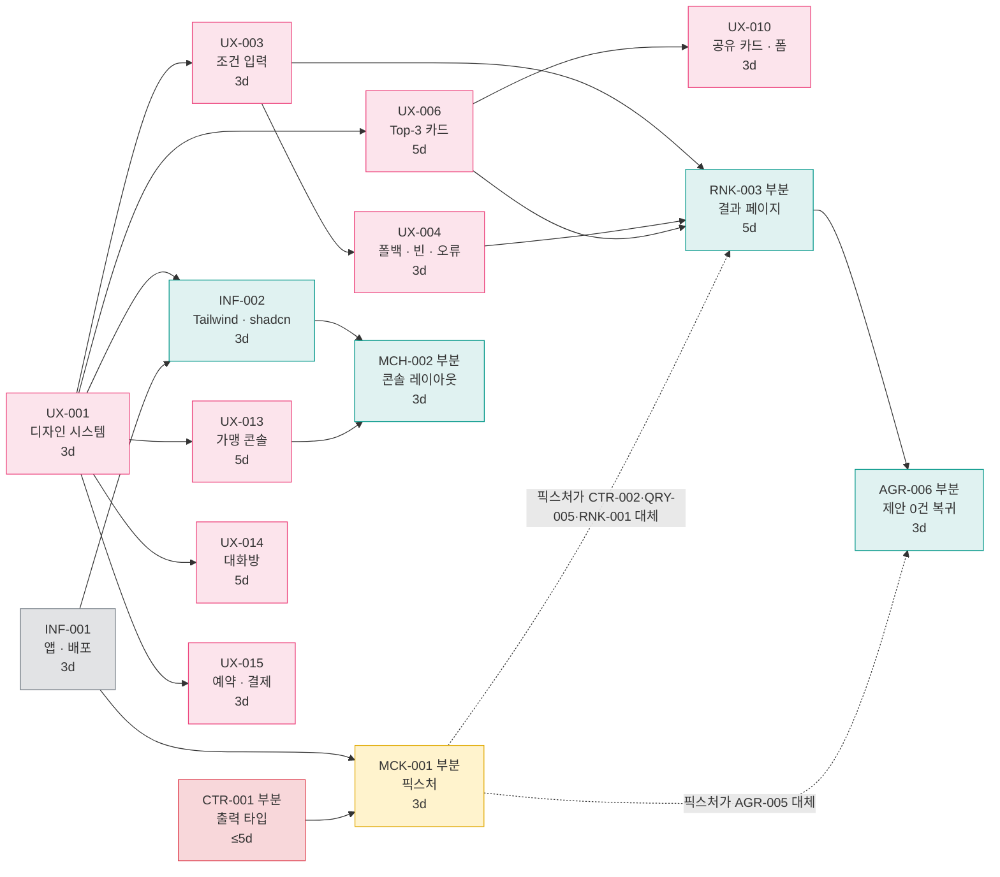

# [프로토타입] UI/UX 선행 프로토타입 — 태스크 선별안

**문서 ID:** PROTO-AIPLACE-UI-001

**개정 버전:** 1.0

**날짜:** 2026-08-26

**근거 문서:** TASK-AIPLACE-MVP-001 v3.2 (59건) · PLAN-AIPLACE-MVP-001 (기본안) · PLAN-AIPLACE-FAST-001 (압축안)

> 📝 **이 문서는 생성물이 아니다.** 생성기가 없으므로 직접 편집한다.
> **새 태스크를 만들지 않았다.** 확정된 59건 중 **15건을 골라 범위를 자른 것**이며, 나머지 44건은 손대지 않는다.

---

## 0. 이 문서가 정하는 것

기능 구현에 앞서 **화면을 먼저 눈으로 확인**하되, 그때 만든 코드가 버려지지 않고 **본 개발로 그대로 이어지게** 하는 범위를 정한다.

| 정한다 | 정하지 않는다 |
| --- | --- |
| 프로토타입에 넣을 태스크 15건과 그 근거 | 새 태스크 · 새 기능 (SRS에 없는 것은 만들지 않는다) |
| 각 태스크를 **어디까지 하고 어디서 멈추는지** | 기본안(72일)·압축안(63일)의 대체 — 두 계획은 그대로다 |
| 프로토타입 한정 DoD와 이슈 운영 규칙 | 태스크 리스트·실행 계획의 수정 (`tools/tasks_data.py` 불변) |

---

## 1. 왜 지금 프로토타입인가

**디자인은 W4에 끝나는데, 그 화면이 코드로 서는 것은 W7~W13이다.** 압축안(`[Plan]AI-Place-Mate-Fast-Track-Schedule.md` §2)의 날짜다.

| 산출물 | 태스크 | 압축안 완료 | 성격 |
| --- | --- | --- | --- |
| 디자인 8건 전량 | `UX-001` ~ `UX-015` | **2026-09-23** (W4) | 화면 정의 — 코드가 아니다 |
| 조건 입력 · Top-3 결과 화면 | `RNK-003` | **2026-10-20** (W7) | 첫 사용자 화면 |
| 가맹 콘솔 레이아웃 | `MCH-002` | 2026-10-02 (W5) | 인증 게이트에 종속 |
| 제안 0건 복귀 화면 | `AGR-006` | **2026-11-26** (W13) | 마지막 화면 |

이유는 **UI 태스크가 백엔드 사슬 뒤에 매달려 있기 때문**이다. 실행 계획 §2.1의 DAG 레벨을 보면 `RNK-003`은 **L7**, `AGR-006`은 **L14**에 있다. 둘 다 유형은 `UI`인데, 선행이 `CTR-002 · QRY-005 · RNK-001`(L4~L6) · `AGR-005`(L13)라서 화면이 데이터 경로 완성을 기다린다.

그런데 실행 계획 §1.1의 **네 가지 원칙 중 둘이 이미 이 대기를 풀라고 말하고 있다.**

- **원칙 3 — Mock으로 병행한다.** `MCK-001` 픽스처로 UI가 백엔드를 기다리지 않는다.
- **원칙 4 — 디자인이 앞선다.** `UX-001`은 착수 0일차다.

압축안 §6의 단축 수단 표에도 같은 지렛대가 있다 — **"선행 완화 — 계약에만 의존하게 하고 Mock을 확대한다."** 이 문서는 그 지렛대를 **UI 계층 전체에 적용**한 것이다.

**효과** — 착수 기준 14영업일에 Top-3 화면이, 17영업일에 전 화면이 선다. 압축안 대비 **첫 화면 약 4주 · 전 화면 약 9주** 앞당겨진다.

---

## 2. 선별 기준

네 관문을 **모두** 통과한 태스크만 넣었다. 하나라도 걸리면 뺐다.

| # | 기준 | 판정 질문 | 통과 못 하면 |
| --- | --- | --- | --- |
| **G1** | **눈에 보이는가** | 산출물을 렌더 결과로 판정할 수 있는가 | 시각 확인이라는 목적에 기여하지 않는다 |
| **G2** | **백엔드 없이 서는가** | 픽스처로 상태를 재현할 수 있는가 | 데이터 경로를 먼저 만들어야 하므로 프로토타입이 아니다 |
| **G3** | **버려지지 않는가** | 본 개발이 이 코드를 그대로 이어받는가 | 두 번 만들게 된다 — 프로토타입의 최대 실패 모드 |
| **G4** | **제약을 지키며 만들 수 있는가** | C-TEC-004 · D-08 · SRS §14.1 구조를 지키는가 | `TEC-001` 게이트가 붙는 순간 전부 되돌려야 한다 |

> **G3이 이 문서의 핵심이다.** 별도 목업 도구로 화면을 그리면 G1·G2는 쉽게 통과하지만 G3에서 전부 탈락한다. 그래서 프로토타입을 **실제 저장소 · 실제 디렉터리 구조 · 실제 컴포넌트 인벤토리** 위에서 만든다.

---

## 3. 선별 결과 — 59건 중 15건

| 웨이브 | Task ID | 이슈 | 유형 | 범위 | 왜 넣었나 | 원 공수 |
| --- | --- | --- | --- | --- | --- | --- |
| **W0** | [`INF-001`](../tasks/INF-001.md) | #1 | `Infra` | **부분** | 앱과 배포 경로가 없으면 아무것도 보이지 않는다 | 3d |
| **W0** | [`UX-001`](../tasks/UX-001.md) | #2 | `Design` | 전량 | 토큰·컴포넌트 인벤토리가 6건을 막고 있다 (직접 후행 6) | 3d |
| **W0** | [`CTR-001`](../tasks/CTR-001.md) | #15 | `Contract` | **부분** | 픽스처가 만족할 타입이 없으면 픽스처를 본 개발에서 다시 쓴다 (G3) | 5d |
| **W1** | [`INF-002`](../tasks/INF-002.md) | #3 | `UI` | **부분** | Tailwind 테마 + shadcn/ui 인벤토리 — 화면 코드의 바닥 | 3d |
| **W1** | [`UX-003`](../tasks/UX-003.md) | #6 | `Design` | 전량 | 조건 입력 · 로딩 스켈레톤 — 동선의 출발점 | 3d |
| **W1** | [`UX-006`](../tasks/UX-006.md) | #7 | `Design` | 전량 | **근거 4항목 카드** — 경쟁 목록 화면과 갈리는 유일한 지점 | 5d |
| **W1** | [`UX-013`](../tasks/UX-013.md) | #12 | `Design` | 전량 | 가맹 콘솔 — 화면 수가 곧 이탈률이라 눈으로 세어야 한다 | 5d |
| **W1** | [`UX-014`](../tasks/UX-014.md) | #13 | `Design` | 전량 | 대화방 카운트다운 · 제안 비교 | 5d |
| **W1** | [`UX-015`](../tasks/UX-015.md) | #11 | `Design` | 전량 | 예약·결제 — **재입력 필드 0개**를 화면으로 증명 | 3d |
| **W2** | [`UX-004`](../tasks/UX-004.md) | #21 | `Design` | 전량 | 폴백 · 빈 · 오류 상태 — **빈 화면 금지의 화면 근거** | 3d |
| **W2** | [`UX-010`](../tasks/UX-010.md) | #23 | `Design` | 전량 | 공유 카드 비주얼 · 방문 후 입력 폼 | 3d |
| **W2** | [`MCK-001`](../tasks/MCK-001.md) | #36 | `Data` | **부분** | 실패·경계 상태는 픽스처가 없으면 화면으로 만들 수 없다 | 3d |
| **W3** | [`RNK-003`](../tasks/RNK-003.md) | #47 | `UI` | **부분** | 결과 페이지 — 프로토타입의 본체 | 5d |
| **W3** | [`MCH-002`](../tasks/MCH-002.md) | #33 | `UI` | **부분** | 콘솔 전용 레이아웃 — 검색 화면과 다름을 눈으로 확인 | 3d |
| **W4** | [`AGR-006`](../tasks/AGR-006.md) | #59 | `UI` | **부분** | 제안 0건 복귀 — 원 계획에서 **가장 늦게(W13) 보이는 화면** | 3d |

**15건 = 디자인 8 (전량) + UI 4 (부분) + 바닥 3 (부분).** 원 태스크 기준 공수 상한 **55 person-day**이나, 7건이 부분 착수이므로 실제는 이보다 짧다.

### 화면 커버리지 — 무엇을 눈으로 확인하게 되는가

| # | 화면 | 정의 | 구현 | 상태 재현 |
| --- | --- | --- | --- | --- |
| 1 | 조건 입력 (필수 입력 0개) | `UX-003` | `RNK-003` | — |
| 2 | 로딩 스켈레톤 | `UX-003` | `RNK-003` | 픽스처 지연 주입 |
| 3 | Top-3 후보 카드 (근거 4항목 · 90일 경고 · 예상가 범위) | `UX-006` | `RNK-003` | 정상 / 근거 누락 / 후보 2건 / 0건 |
| 4 | 구조화 필터 폴백 | `UX-004` | `RNK-003` | 파싱 실패 픽스처 |
| 5 | 빈 · 오류 상태 | `UX-004` | `RNK-003` | 결과 0건 · 외부 실패 |
| 6 | 공유 카드 · 방문 후 입력 · 불일치 신고 | `UX-010` | `RNK-003` (폼) | — |
| 7 | 예약 · 결제 (재입력 0개) | `UX-015` | 화면 정의까지 | 승인 / 거절 픽스처 |
| 8 | 가맹 콘솔 (설정 ≤ 3화면) | `UX-013` | `MCH-002` | — |
| 9 | 대화방 카운트다운 · 제안 비교 | `UX-014` | 화면 정의까지 | 제안 0 / 1 / 5건 |
| 10 | 제안 0건 복귀 | `UX-004` · `UX-014` | `AGR-006` | `CLOSED_EMPTY` 픽스처 |

**10화면 중 7개가 코드로 서고, 3개(7·9의 구현·공유 카드 이미지)는 정의까지만 간다.** 사유는 §5에 있다.

---

## 4. 부분 착수 — 어디까지 하고 어디서 멈추는가

부분 착수 7건의 경계다. **왼쪽은 프로토타입에서 끝내고, 오른쪽은 손대지 않는다.**

| 태스크 | 프로토타입에서 하는 것 | 멈추는 지점 (본 개발에서 이어서) |
| --- | --- | --- |
| `INF-001` | `create-next-app` · **SRS §14.1 디렉터리 구조** · Vercel 연결 · 프리뷰 배포 1회 | `vercel.ts` Cron 5종 · 환경 변수 11종 · `check-env.mjs` 빌드 실패 |
| `CTR-001` | **Server Action 9종의 출력 타입** · 공통 `ActionResult<T>` · `ConditionSet` 초안 | 입력 Zod 스키마 · `assertActor` 인가 가드 · 계약 스냅샷 테스트 · 개인정보 필드 부재 검증 |
| `MCK-001` | 픽스처 4세트 (Top-3 · 파싱 · 대화방 · 결제) · **Mock 모드 스위치와 프로덕션 강제 비활성** | 계약 테스트 (`CTR-001`·`CTR-002` 확정 후) |
| `INF-002` | Tailwind 테마 등록 · shadcn/ui 초기화 · `next/font` · **D-08 ESLint 규칙** · 독립 웹 진입 | 네이버 지도 탭 임베드 (**DEP 미확보**) · `entry_point` 계측 |
| `RNK-003` | 결과 페이지 · Suspense 스켈레톤 · 후보 카드 · 폴백 · 빈·오류 상태 · 방문 후 입력 폼 | **RSC의 실제 DB 조회** · `top3_rendered` 계측 · p95 성능 검증 |
| `MCH-002` | `(merchant)` 라우트 그룹 · 전용 레이아웃 · 설정 화면 3개 구조 | **인증 게이트** (`MCH-001` Supabase Auth · MFA) · 미인증 차단 테스트 |
| `AGR-006` | `CLOSED_EMPTY` 복귀 화면 렌더 (픽스처 주입) | 실제 마감 판정 연결 (`AGR-005`) · 복귀 경로 계측 |

> ⚠️ **`CTR-001` 부분 착수는 의존 역전이다.** 원래 `CTR-001`은 `DAT-001`(Prisma 스키마)에 의존한다. 프로토타입에서는 스키마 없이 **SRS §6.1 서버 진입점 표를 근거로 출력 타입만** 먼저 쓴다. 대가와 완화는 §9에 있다.

---

## 5. 제외한 44건

### 5.1 유형 단위로 제외

| 유형 | 건수 | 사유 |
| --- | --- | --- |
| `Write` | 12 | 상태를 바꾸는 코드다. 화면이 아니라 데이터 경로다 (G1) |
| `Read` | 5 | 조회 로직. 프로토타입은 픽스처가 대신한다 (G2) |
| `NFR` | 9 | 보안·관측·비용·복구. 눈에 보이지 않는다 (G1) |
| `Test` | 6 | AC 검증은 기능이 있어야 성립한다 |
| `Infra` (`INF-001` 외) | 6 | Supabase 연결 · 제약 게이트 · AI SDK — 데이터·추론 경로 |
| `Data` (`MCK-001` 외) | 2 | 스키마·매칭기 |
| `Contract` (`CTR-001` 외) | 2 | Route Handler 계약 · 계측 이벤트 계약 |
| `UI` | 2 | 개별 판정 — 아래 |
| | **44** | |

### 5.2 넣을지 헷갈리는 8건 — 개별 판정

| 태스크 | 유형 | 판정 | 근거 |
| --- | --- | --- | --- |
| [`AGR-002`](../tasks/AGR-002.md) #14 | `UI` | **제외** | Realtime 구독은 배선이지 화면이 아니다. 카운트다운은 픽스처 `expiresAt`으로 재현되고, 실제 구독은 DB·RLS를 요구한다 (G2 탈락) |
| [`EVD-004`](../tasks/EVD-004.md) #38 | `UI` | **제외** (조건부) | `next/og` 이미지는 시각 산출물이지만, 핵심 AC가 **근거 4항목 누락 시 400 반환**이라 `EVD-001` 없이는 검증할 수 없다. 프로토타입에서는 `UX-010`의 정적 비주얼 규격으로 대신한다 |
| [`CTR-002`](../tasks/CTR-002.md) #24 | `Contract` | 제외 | Route Handler·웹훅·에러 코드 체계. 화면이 소비하지 않는다 |
| [`TEC-001`](../tasks/TEC-001.md) #10 | `Infra` | 제외 | 제약 게이트 자체는 화면이 아니다. 다만 **프로토타입 코드가 나중에 이 게이트를 통과해야 한다** — §9 R3 |
| [`INF-003`](../tasks/INF-003.md) #4 · [`DAT-001`](../tasks/DAT-001.md) #8 | `Infra`·`Data` | 제외 | 데이터 계층. 프로토타입이 DB를 읽지 않는 이유가 곧 이 둘을 뺀 이유다 |
| [`MCH-001`](../tasks/MCH-001.md) #26 | `Infra` | 제외 | Supabase Auth·MFA. `MCH-002`의 레이아웃은 인증 없이도 렌더된다 |
| [`ANA-002`](../tasks/ANA-002.md) #35 · `CTR-005` | `Write`·`Contract` | 제외 | 계측. 화면에 보이지 않으며, **계측 없는 지표는 판정에 쓰지 않는다**(실행 계획 §1.5)는 규칙과 충돌하지 않는다 |
| [`TST-010`](../tasks/TST-010.md) #51 | `Test` | 제외 | 픽스처는 지연이 없어 LCP·p95 측정이 무의미하다 — §9 R4 |

---

## 6. 순서와 소요

### 6.1 프로토타입 DAG

간선은 전부 태스크 리스트의 실재 의존이며, **잘라낸 간선만 점선**으로 표시했다.

### 6.2 웨이브

| 웨이브 | 영업일 | 착수 | 끝나면 확인되는 것 |
| --- | --- | --- | --- |
| **W0** | d1–d3 | `UX-001` · `INF-001` · `CTR-001`(부분) | 토큰·인벤토리 확정, 프리뷰 URL 발급 |
| **W1** | d4–d8 | `INF-002` · `UX-003` · `UX-006` · `UX-013` · `UX-014` · `UX-015` | 화면 정의 6건, 디자인 토큰이 실제로 렌더됨 |
| **W2** | d6–d11 | `UX-004` · `UX-010` · `MCK-001`(부분) | 실패·경계 상태 정의 + 픽스처로 재현 가능 |
| **W3** | d10–d14 | `RNK-003`(부분) · `MCH-002`(부분) | **조건 입력 → Top-3 → 폴백·빈·오류** 동선이 브라우저에서 돈다 |
| **W4** | d15–d17 | `AGR-006`(부분) | 10화면 전건 렌더 |

**임계 경로: `UX-001` → `UX-003` → `UX-004` → `RNK-003` → `AGR-006` = 17영업일.**

| 편성 | 완료 | 비고 |
| --- | --- | --- |
| 디자인 2 · 프론트 2 · 백엔드 1(부분) | **17일** | 임계 경로 하한 도달 |
| 디자인 2 · 프론트 1 · 백엔드 1(부분) | 20일 | `RNK-003` → `AGR-006` → `MCH-002`가 한 레인에 직렬 |
| 디자인 1 · 프론트 1 · 백엔드 1(부분) | 30일 | 디자인 30pd가 병목이 된다 |

---

## 7. 프로토타입 DoD

태스크 문서의 공통 DoD 6항 중 **프로토타입에서 성립하는 것만** 요구한다. 보류 항목은 **본 개발에서 반드시 채운다.**

| 공통 DoD | 프로토타입 | 사유 |
| --- | --- | --- |
| AC 전항 충족 (실패 시나리오 포함) | **부분** | 화면으로 판정 가능한 AC만. 서버 판정이 필요한 AC는 보류 |
| 단위·통합 테스트 | **부분** | 렌더 테스트만. 계약·성능 테스트는 보류 |
| 정적 분석 경고 0 (`tsc` · ESLint) | **필수** | 지금 어기면 본 개발에서 전부 되돌린다 |
| 인터페이스 명세 최신화 | 보류 | `CTR-001`·`DAT-001` 확정 시 |
| Vercel 프리뷰 배포 성공 | **필수** | 프로토타입의 전달 수단 그 자체다 |
| 계측 이벤트 적재 | 보류 | `ANA-002`·`CTR-005` 미포함 |

### 프로토타입 전용 판정 3항

- [ ] **10화면 전건이 프리뷰 URL에서 렌더된다** — §3의 커버리지 표 기준
- [ ] **빈 화면 노출 0건** — 파싱 실패 · 결과 0건 · 후보 2건 · 제안 0건 픽스처 전부에서 (SRS §6.3-6)
- [ ] **shadcn/ui 인벤토리 밖 자체 구현 0건** — ESLint가 차단한다 (D-08 · REQ-TEC-007)

---

## 8. 운영 규칙 — 이슈를 닫지 않는다

부분 착수이므로 **이슈가 닫히면 남은 범위가 사라진다.** Project #25는 이슈 단위로 돌고, 이슈가 닫히면 Status가 자동으로 `Done`이 된다(`[Ops]GitHub-Project-View-Setup.md` §자동화).

| 항목 | 규칙 |
| --- | --- |
| 브랜치 | 기존 규칙 그대로 — `feat/<이슈번호>-<task-id-소문자>` |
| PR 제목 | 앞에 `[proto]` 를 붙여 부분 착수임을 드러낸다 |
| PR 본문 | **`Closes #N` 을 쓰지 않는다.** `Refs #N` 으로 연결한다 |
| Project Status | `In progress` 유지. **`Done` 으로 옮기지 않는다** |
| 태스크 문서 | 완료한 체크박스만 체크. **미완 체크박스를 지우지 않는다** |
| 본 개발 재개 | 같은 이슈에서 이어서 진행하고, 남은 체크박스를 채운 PR에서 비로소 `Closes #N` |

---

## 9. 대가와 리스크

| # | 리스크 | 왜 생기는가 | 완화 |
| --- | --- | --- | --- |
| **R1** | **뷰 모델이 스키마와 어긋난다** | `CTR-001`을 `DAT-001` 없이 부분 선행 (§4) | `DAT-001` 확정 직후 `MCK-001`의 계약 테스트를 붙인다. **픽스처가 먼저 깨지게 하는 것**이 `MCK-001` Scenario 1의 원래 의도다 |
| **R2** | **Mock이 프로덕션에 샌다** | 프로토타입을 배포하므로 실물처럼 보인다 | `MCK-001` Scenario 3(프로덕션 강제 비활성)을 **프로토타입 단계에서 먼저** 구현한다. 프리뷰 배포만 쓰고 프로덕션 승격을 하지 않는다 |
| **R3** | **게이트가 붙는 순간 되돌린다** | `TEC-001` 미포함 (§5.2) | SRS §14.1 디렉터리 구조와 D-08을 처음부터 지킨다. `TEC-001` 착수 시 프로토타입 코드가 첫 검사 대상이다 |
| **R4** | **성능 목표를 검증했다고 오인한다** | 픽스처는 지연이 없다 | 프로토타입에서 REQ-NF-001a/001b/004를 **측정하지 않는다.** 스켈레톤은 형태만 확인하고, 실측은 `TST-010`이 한다 |
| **R5** | **화면이 확정된 것으로 굳는다** | 눈에 보이면 결정된 것처럼 읽힌다 | 프로토타입 URL에 "픽스처 기반 · 미확정" 표기를 둔다 |
| **R6** | **디자인 레인이 병목** | 디자인 30 person-day가 8건에 몰려 있다 | 디자인 2인 이상. 1인이면 17일이 30일이 된다 (§6.2) |

---

## 10. 착수 전 확인

### 10.1 문서 불일치 1건 — 착수 전에 정한다

`INF-002` 태스크 문서가 **존재하지 않는 태스크 `UX-002`** 를 두 곳에서 참조한다.

| 위치 | 문장 |
| --- | --- |
| `docs/tasks/INF-002.md` 실행 계획 | "`UX-002` 의 컴포넌트 인벤토리 목록만 추가" |
| `docs/tasks/INF-002.md` DoD | "shadcn/ui 컴포넌트 인벤토리(`UX-002`)와 실제 설치 목록이 일치하는가?" |

`UX-002`는 v3.2 축약에서 **`UX-001`에 흡수**됐다(`tools/tasks_data.py` `UX-001` 항목의 `# ← UX-002`). 컴포넌트 인벤토리는 `UX-001`의 산출물이다.

> **판단:** 프로토타입에서는 `UX-002`를 **`UX-001`로 읽는다.** 문서 수정이 필요하면 `tools/task_specs.py` 를 고치고 `python3 tools/gen_task_docs.py` 로 재생성한다 — 태스크 문서를 직접 편집하지 않는다.

### 10.2 외부 의존

| 의존 | 막는 것 | 미확보 시 |
| --- | --- | --- |
| **DEP-T1** Vercel 계정·프로젝트 | `INF-001` | 프리뷰 URL이 없다 — **프로토타입 성립 불가** |
| 네이버 지도 탭 노출 승인 | `INF-002` 임베드 절 | 독립 웹 경로만으로 진행 (ADR-005가 이미 허용) |
| **DEP-T2** Supabase | — | **프로토타입에는 필요 없다** (`INF-003`·`DAT-001` 제외) |
| **DEP-T3** Gemini API 키 | — | **필요 없다** (파싱 경로는 픽스처) |

---

## 11. 권고

1. **`UX-001` · `INF-001` 두 건을 동시에 착수한다.** 압축안의 L0와 같다 — 프로토타입도 여기서 시작한다.
2. **디자인 2인을 확보한다.** 1인이면 17일이 30일이 되고, 프로토타입의 이점 대부분이 사라진다 (§6.2).
3. **`CTR-001` 부분 착수를 먼저 승인받는다.** 유일한 의존 역전이며, 승인 없이 진행하면 R1이 관리되지 않는다.
4. **프리뷰 배포만 쓴다.** 프로덕션 승격을 하지 않는 것이 R2의 1차 방어다.
5. **17일 뒤 화면을 보고 나서** 압축안 W1로 진입한다. 프로토타입 15건은 그 시점에 **부분 완료 상태로 이어받는 것**이지 다시 하는 것이 아니다.

---

**PROTO-AIPLACE-UI-001 · v1.0 · 2026-08-26 · 선별 15건 / 제외 44건 · 임계 경로 17영업일 · 신규 태스크 0건**
